# Lars Odin

## Chapter 1: The Rim

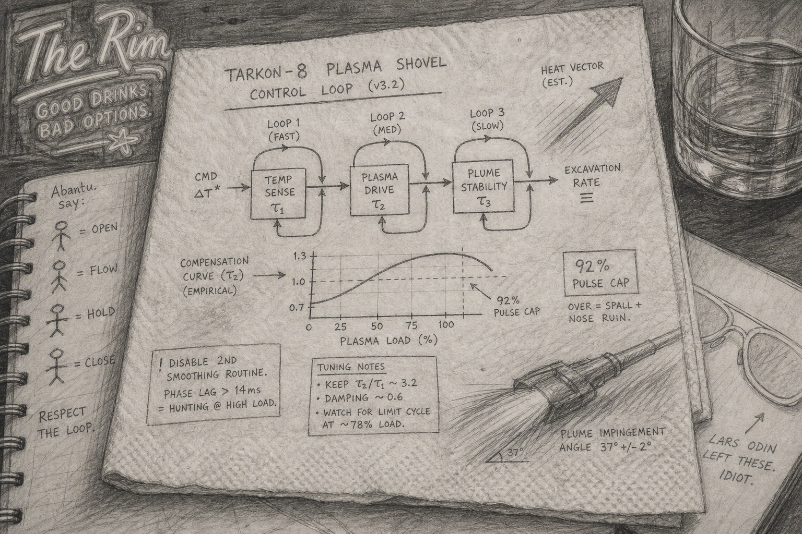

*Napkin control-loop sketch recovered from The Rim.*

Lars "Plates" Odin ordered a large bottle of Xaltor X whisky, four small glasses, and one Galactic IPA, then pretended to pay with the comm unit on his wrist.

In reality he paid with his hand.

It was a stupid habit. A dangerous habit. The payment lattice was supposed to authenticate through the visible consumer layer. Thumbprint. Retina flicker. Receipt to his comm. Then forget about him. Lars did not like polite systems. His fingers brushed the bar's worn composite counter. The payment lattice opened in his head like a cheap tent in bad weather.

Every weakness was there.

Bad session rotation. A lazy checksum. Three old privilege escalations hidden under two decades of emergency patches. A maintenance backdoor left behind by someone who had been drunk, underpaid, or both.

He could have emptied the bar's entire account in less than a second.

That would have been low, even for a man wearing yellow sunglasses with pink frames.

Lars made a small grimace, authorized the transfer, and tried not to flinch as the information streamed through him. The bartender stared at the whisky bottle with the same expression ordinary humans used for unexploded ordnance.

Lars pointed over his shoulder with his thumb.

Four bald, broad-shouldered Abantu were sitting in the back of the pub, half hidden in the greasy fog from the failing air scrubbers. Their table leaned slightly to one side. So did they. The pub itself occupied a forgotten wedge of The Rim's lower commercial ring, where old neon advertisements flickered in Galactic Swedish, Abantu trade pictograms, and one unknown script that had been blinking the same insurance warning for at least ninety years.

Ungrounded cables hissed above the bar. A bass-heavy techno track made the recycled air move in visible pulses. Somewhere behind the wall, a coolant pump coughed with the wet determination of an animal that should have been put out of its misery.

The bartender looked from Lars to the Abantu, then back to the bottle.

"For them," Lars said.

The bartender nodded, relieved. That made sense. Abantu could drink Xaltor X. Humans could not. One sip would put a normal, unmodified human into a coma, assuming the liver did not resign first.

Lars had never had that problem.

He did not know why.

He only knew he had to hide it.

The Abantu, bless their heavy skulls and generous hearts, made excellent cover.

His boots clicked against the sticky floor as he crossed the room. They were military grade, smart-balanced, adaptive-grip, and disgracefully expensive. He had bought the most costly equipment available in three systems so he could look like a spoiled idiot who had no idea what he was doing.

The black captain's coat helped. It was dusty, oil-stained, and cut from a graphite-kevlar composite reinforced with synthetic spider silk he had manufactured himself in a private lab near LP 890-9c. Under it he wore a battered work overall that looked like it had survived three engine rooms, two fistfights, and a regrettable romance with a plasma welder.

On his shoulder rested an Aphex Defence Ragnarrök 5000.

That part was harder to explain away.

The weapon threw coherent bursts of gamma radiation and proton plasma wrapped in a containment pulse. In ordinary language: bright, angry balls of physics that turned most problems into smoke and regret. Aphex Defence had given it to him six months earlier, along with a board seat he had not asked for. Lars had helped Professor H. Fayolle solve what the professor called an impossible weapons optimization problem.

Lars had called it "a Tuesday with decent coffee."

He set the whisky bottle down on the Abantu table with a heavy thud.

"Gentlemen," he said, because he was in a good mood and because Abantu enjoyed ceremony when poison was involved. "I come bearing medicine."

The Abantu nearest the wall made a rumbling sound of approval. His name involved two throat clicks, a nasal whistle, and a jaw motion Lars refused to attempt in public. Lars had privately named him Copper, because his skin had a faint metallic sheen and because Lars was lazy.

He uncorked the bottle, poured four proper measures, and slid the glasses across the table. Then he took a long pull of IPA and, while the Abantu lifted their glasses, tipped a generous splash of Xaltor X into his beer.

No one noticed.

For a few seconds the whisky bit through the beer, through his tongue, through the constant electrical weather behind his eyes.

Then the world became quieter.

Not quiet. Never quiet. But quieter.

His mind usually ran ahead of him. Questions unfolded into answers before he had finished asking them. Machines exposed themselves by rhythm, heat, and tolerance. People betrayed intent through pulse, scent, eye movement, micropressure in the skin—a hundred tiny signals he wished he could stop seeing.

The Xaltor X dulled the edge.

It was like wrapping blankets around several illegal quantum computers someone had hidden in his skull.

Copper raised his glass.

"To surviving another shift."

"That bad?" Lars asked.

Copper drank, exhaled through all four nostril slits, and leaned back. "Quota day."

The others groaned.

"Ah," Lars said. "The sacred ritual of management pretending rock has ambition."

That got a laugh. Abantu laughter sounded like gravel being poured into a metal drum, but Lars liked it.

"We missed it," Copper said. "Plasma shovel failed. Threw the mining robot off course. By the time we corrected the drift, the whole seam had thermal stress fractures. Useless."

"What model?"

"Tarkon-8 industrial scoop. Modified for nickel-iron vacuum work."

"Oh, that idiot thing."

Copper blinked. "You know it?"

Lars took another drink. The shape of the machine assembled itself in his head—not a picture, exactly, but a pressure diagram with moods. Tarkon had built the scoop around a cheap field stabilizer and compensated with software. That was the sort of decision that made Lars want to hit executives with laminated safety manuals.

He pulled a paper napkin from the dispenser. Actual paper. The Rim had many wonders, most of them old and poorly maintained.

"Your shovel isn't failing," Lars said. "It's obeying the wrong part of its own control stack."

He sketched quickly. Three loops. One heat vector. A compensation curve. A little ugly, but readable. His hand moved before he had settled the whole explanation, which annoyed him. It always annoyed him. He liked to pretend he was thinking. Most people found it comforting.

"There," he said, sliding the napkin over. "Disable the second smoothing routine. Not the first. The second. Then cap the plasma pulse at ninety-two percent and let the scoop stutter every seventh cycle. It will sound broken, but the seam won't crack."

Copper stared at the napkin.

The Abantu beside him leaned over.

The third Abantu whistled.

"Have you worked mining?" Copper asked.

Lars opened his mouth.

The pub dimmed.

Not physically. The neon still flickered, the cables still spat, the bass still thudded in the ribs. But something in him slid backward.

For a moment he smelled hot metal and asteroid dust.

He was not in the pub anymore. He was in a rented manufacturing bay on the SPECULOOS consortium station orbiting the super-Earth LP 890-9c, four months into building a freight ship no sane insurance cooperative would certify. Robots climbed the ribs of the hull. Printers sang in layered harmonics. Beyond the pressure glass, the planet's terminator line glowed blue-white, a knife edge between weather and night.

He had been tired then too.

Not normal tired. Driven tired. The kind that makes you forget food and sleep and social obligations with equal contempt.

He had already made more money than any reasonable person could spend by shouting nonsense into the Galactic Net as a fashionable idiot with good hair. He had invested some of it in quantum crypto, left most of it earning interest in boring accounts, and then, for reasons he could not explain, started building a ship.

It had felt urgent.

That was the word. Urgent.

Not exciting. Not profitable. Not even sensible.

Necessary.

Something had been gnawing at him. There were the voices that were not voices, more like thoughts arriving in the wrong accent. There were objects that moved when he was sure he had left them elsewhere. There were people following him badly, then professionally, then not at all, which was worse. Over the last few years, several high-ranking corporate directors had suffered accidents so strange that the official explanations sounded like parody.

There was a pattern.

Lars hated patterns he could not finish.

So he built the ship.

He worked fourteen hours a day in the lab, then let the robots and printers spit out parts through the night. When rare metals ran short, he went into the asteroid belt himself. He developed survey methods, plasma drills, and handheld plasma shovels that one person or one robot could operate without turning the whole rock into glittering useless slag.

Professor Fayolle had occupied the neighboring lab, which was much cleaner and much more French.

Fayolle worked for Aphex Defence. He spoke lyrically about coffee breaks and called fika "a grand Swedish civilizational contribution" with an expression so solemn that Lars had not dared laugh in his face.

One afternoon the professor showed him a weapons module and a set of equations that had nearly broken an entire Aphex research division.

Too many unknowns, Fayolle said.

Lars saw the solution before the professor finished complaining.

He tried to hide his grin by sounding casual.

"It's pretty simple if you think about it," Lars had said, which was never the right way to begin with a French scientist. "You have fundamentals. Thermodynamics, entropy, volume energy. Volume is the bastard, obviously, but only because you're treating it in ordinary three-space."

Fayolle had gone very still.

Lars grabbed a marker and drew three axes on the lab wall because the board was full and because walls were just boards with worse manners.

"Plot the tolerance cloud here. Then transpose it through the time axis. No, not like that. You need the collapse boundary as a spacetime volume, not a point. Then use the golden ratio as a search constraint."

"The golden ratio?" Fayolle had whispered, offended and fascinated.

"Nature likes practical jokes."

Twenty minutes later, Fayolle sat down, pale as printer resin.

"Merde."

"You solved the collapse problem," he said.

"Probably."

"And the optimization problem."

"Possibly."

"And three thermal bleed issues we had not disclosed."

"I read a lot."

Fayolle had stared at him as if Lars were either a genius, a criminal, or both.

Lars had finished his coffee.

"Don't forget to put me on the patent."

He had meant it as a joke.

Aphex Defence did not understand jokes when profit was involved.

Now, sitting in the pub on The Rim, Lars realized Copper was still staring at him.

"Asteroids," Lars said, touching the Ragnarrök's damaged-looking grip with one finger. "I did some asteroid mining in a previous life."

The phrase made the back of his neck hurt.

Only slightly.

Enough.

He took another drink.

"Anyway," he said, too loudly. "Try the napkin before your manager steals your pay."

Copper folded the napkin with great care, as if it were a treaty.

Lars stood, adjusted his black coat, and gave the Abantu a lazy salute.

"See you a little later."

He turned toward the exit.

On the way out, a drunk at the nearest table knocked over his beer.

For everyone else, it happened quickly.

For Lars, the glass began to fall through a thick, merciful syrup of time. Foam climbed the rim. Amber liquid rolled outward. The drunk's fingers twitched too late. A woman across the table started to frown. A neon sign buzzed twice.

Lars reached out, caught the glass, and set it upright without spilling a drop.

The drunk stared at him.

"Careful," Lars said. "Belgian beer. Strong stuff."

The man looked angry, which was unreasonable but common.

Lars left before the universe offered him another opportunity to be helpful.

The corridor outside was long, half empty, and built for crowds The Rim no longer had. Once, centuries ago, this station on the edge of the KBC Void had been a frontier jewel. Now it showed its age: patched hull plates, mismatched gravity tiles, old alien ornament under cheap human signage. The air smelled of metal, ozone, frying oil, and too many species breathing the same recycled air.

The Rim sat where the Milky Way began to thin toward the impossible emptiness beyond.

People called it the edge of the known.

Lars disliked that phrase. It sounded dramatic and imprecise. The KBC Void was not an edge. It was an absence so large that even modern cosmology spoke of it with professional embarrassment. Billions of light-years of almost nothing around the galaxy.

Nobody knew why it was there.

That bothered him.

Everything bothered him lately.

His comm unit buzzed.

Incoming quantum-encrypted bitstream.

Source: Gabriel Arsenault, chairman of Aphex Defence.

Lars sighed. "Of course."

He accepted the connection.

Arsenault appeared above the comm in a sharply dressed projection with silver hair, a dramatic jaw, and the facial expression of a man who had never entered a room without believing history had improved.

"Oui, oui, Lars Odin. Excellent. I finally have you."

"That sounds ominous, Gabriel."

"Not ominous. Administrative."

"Worse."

Arsenault smiled. "At the last quarterly meeting, the board confirmed your position. You are now formally seated as a director of Aphex Defence."

"Do I have to attend meetings?"

"Remote attendance is acceptable when necessary."

"That is not a no."

"There are very few meetings."

Arsenault ignored him. "We have transferred the first retroactive compensation to your account. You will also find the revised patent allocations attached. Professor Fayolle continues to speak of your fika sessions with extraordinary passion. A grand Swedish tradition. We have begun introducing it across our major offices."

"Weapon engineers with cinnamon buns. Terrifying."

"Productive," Arsenault said. "We are now the leading weapons firm in the galaxy. Partly, I must admit, because of your unconventional contributions. We have also adopted your recommendation that our highest-performance systems be sold only to allied governments and verified defensive coalitions."

"That wasn't a recommendation. That was basic self-preservation."

"Often the same thing."

Lars felt the contract arrive, then the account notice behind it. He did not open the visible display. The figures resolved somewhere behind his eyes.

Seven point three billion Galactic kronor had landed in his account.

He laughed despite himself.

"Is there a problem?" Arsenault asked.

"No. I just have even less reason to work now."

"You have responsibilities, monsieur Odin."

"I have beef to buy. Different category."

Arsenault leaned closer to the projection field. "One more thing. We take care of our own."

"That sounded rehearsed."

"It was sincere."

"Those are not mutually exclusive."

Arsenault's smile widened. "On récolte ce qu'on sème."

The connection ended.

The corridor became too quiet.

Lars stopped walking.

Something shifted.

Not enough for a normal person to notice. A tiny compression front moving through recycled air. Heat rising behind it. Electromagnetic noise blooming in an ugly, disciplined pattern.

His neck pain vanished.

Everything else became sharp.

A wall of hot plasma and gamma radiation came around the bend at supersonic speed.

Lars had already opened the locked maintenance door to his right.

He took two fast steps, pivoted, pulled his shoulder through the gap, and slammed the door as the corridor became white.

Heat punched through the seam.

For a fraction of a second his left shoulder felt as if someone had filled it with needles and sunlight. The maintenance alcove lights flickered alive. Smoke curled under the door. His yellow sunglasses had slipped from his face and lay on the floor as a melted pink-and-gold puddle.

"Brand new," Lars said.

His hair smoked.

The grip of the Ragnarrök had softened under his hand.

He looked at his shoulder. The graphite-kevlar coat had five pinprick holes in it, black-edged and glowing faintly.

His skin underneath felt fine.

That was wrong.

He did not have time to think about it.

Old habit surfaced, cold and absolute: if it is not immediately fatal, continue.

Old habit from where?

The thought scraped the inside of his skull.

He pushed it away, raised the Ragnarrök, and opened the door.

Five figures in black combat armor advanced through the smoke thirty meters down the corridor. Heavy suits. Military posture. Wrong station markings. Their weapons were up, but their formation was sloppy in the way people became sloppy when they believed the target had already died.

"Boring," Lars said.

He crouched in the middle of the corridor and fired five times.

The Ragnarrök kicked against his shoulder with a deep, satisfied thump. Five contained plasma bursts crossed the corridor in staggered lines, each one wrapped in a brief halo of impossible violet. The attackers had less than half a second to understand the situation.

They used it poorly.

Five black-armored bodies became five smoking heaps of fused ceramic and metal.

Lars stood and walked toward them.

His internal link to the ship opened before he consciously called it.

Grim?

The answer arrived as a voice in his head, dry and metallic and far too pleased with itself.

You should probably deal with the microdrone cloud first.

I saw it.

Then why are you walking dramatically?

Because walking dramatically is free.

A swarm of microdrones spilled out of a side conduit ahead, each no larger than a fingernail, each carrying enough charge to blind sensors or poison lungs. Lars sent an electromagnetic pulse through the corridor lights.

The drones died in a sparkling rain.

Grim continued, Do not shoot the people coming behind them. That is the cavalry. They appear to be rescuing you.

How charming.

Twenty armored soldiers in polished Aphex Defence suits emerged from the far intersection at a run. Their lead officer reached Lars first, breathing hard inside his helmet.

"Major Elliot Fabron, Eleventh Aphex Defence Brigade. We are here to extract you. Are you injured?"

Lars pointed at his smoking hair.

"Emotionally."

Fabron lifted his visor. He had the stiff, handsome, irritated face of a French officer who had expected a corpse and found an inconvenience.

"Since 17:20 station time we have engaged and neutralized one hundred and fifteen hostile combatants across this sector."

Lars frowned. "That was when I went to the pub."

"Yes."

"Who attacks a man during pub time?"

"We believe the force belongs to Black Hole B-7."

Lars went still.

Even through the whisky and adrenaline, the name landed heavily.

Black Hole B-7 was not a gang. It was a fascist paramilitary consortium with corporate organs, military doctrine, and penal brutality baked into its command culture. They traded in weapons, slaves, stolen artifacts, and political collapse.

They believed knowledge was something you tortured out of people and stored in a bunker until it became useful.

"Why would they want to bother me?" Lars asked.

Fabron glanced at the Ragnarrök, then at the five smoking heaps behind Lars.

"We do not yet know."

Lars looked into the station systems.

He did not mean to.

The local camera grid unfolded. Security telemetry. Door states. Heat signatures. Drone traffic. Emergency dispatch. The Rim's internal networks were old, fragmented, and badly patched, but that almost made them easier to read. Like listening to an old drunk tell the truth by accident.

There.

Level 197. Maintenance spine, moving toward the freight terminal. Seventy-five microdrones. Ten armed signatures. Black armor.

Grim's voice arrived first.

I have just cleaned vermin from our docking bay. Ten Black Hole mercenaries. Also drones. Disappointing manners.

Good work.

You are welcome. I used restraint.

Define restraint.

The docking bay remains attached to the station.

Lars cleared his throat and looked at Fabron.

"You missed seventy-five drones and ten mercenaries heading for my ship. Grim removed them. I can confirm Black Hole B-7."

Fabron stared.

"Your ship AI did what?"

"Housekeeping."

Lars lifted the Ragnarrök and held it out, grip first. The handle had cooled into warped strands with the impressions of his fingers pressed deep into the material.

"Also, this is flimsy. Tell Aphex you have improvement potential."

Fabron's eyes dropped to Lars's bare hand.

"Let me see your palm."

"Later."

Lars was already moving.

Grim, status outside the station?

Two Black Hole frigates are currently pounding the excrement out of an Aphex destroyer.

Can we help?

We have more power than all of them combined, but we came here for beef and wine. Not a small war.

We'll be quick.

That is what you said before the asteroid refinery incident.

Lars found a small maintenance hatch, opened it, and jumped.

He fell thirty-five levels through a vertical service shaft.

The station blurred around him in bands of light, pipework, maintenance graffiti, and startled sensor motes. Near the bottom he spread his hands and boots. The smart grip surfaces bit the shaft walls, shedding speed in a shriek of friction and heat.

His palms burned.

Then it stopped.

He landed in a crouch outside the docking concourse and kept running.

Behind him, Fabron's voice echoed faintly through the comm system.

"Odin! Stop! That is not a transit route!"

"Works fine!" Lars shouted back.

His ship waited in Bay K-44 under low amber lights.

The Fastulv looked like an old freight hauler that had seen too many border inspections and not enough paint. Its hull was patched in four colors. One cargo clamp was deliberately misaligned. The name was stenciled slightly crooked in Galactic Swedish and old runic lettering because Lars had been tired and Grim had found it funny.

Under the ugly skin lay a machine that could embarrass most cruisers.

The gangway lowered before he reached it.

He sprinted up, through the pressure seal, along the narrow spine corridor, and onto the bridge.

Grim sat in the copilot's chair.

Two months ago Grim had been a ship computer with a biological quantum core cultured from human neural tissue and fed through a nutrient lattice. Then the computer had announced it wanted to eat.

Lars had made the mistake of saying, "Fine, draw up a plan."

Grim had returned the next day with blueprints for an android body, digestive analysis modules, taste receptors, etiquette subroutines he did not use, and a procurement list that included beef, saffron, polymer muscle, and three illegal servo assemblies.

Now Grim had a tall, angular metal body, expressive optical lenses, and the irritating habit of copying everything Lars did. In public he walked stiffly, let his servos whine, and pretended to be far less intelligent than he was.

At the moment he had forgotten to do any of that.

His metal fingers danced across the controls with inhuman precision.

"You are late," Grim said.

"I was attacked."

"That is your usual excuse."

"It keeps being true."

The docking clamps released. The Fastulv dropped out of the bay, rolled under The Rim's lower habitat arc, and accelerated.

The tactical display lit.

Two Black Hole B-7 frigates held a brutal crossfire pattern around a wounded Aphex destroyer. The destroyer's aft section vented atmosphere and frozen debris in a glittering plume. Its port engine flickered. Its shields were down to ragged scraps.

The frigates were larger than Lars liked.

Then again, most things were larger than he liked until they exploded.

"Plotting attack vectors," he said. "Give me a half-elliptic intercept, delta point zero two, then bring our nose through the radiation shadow of the destroyer."

"Already doing it."

"Then do it with more admiration."

"I am overwhelmed."

Lars armed four tactical nuclear missiles, two kilotons each, and a hundred microdrone penetrators. Too much for station-adjacent combat. About right for a message.

He opened a channel to the wounded Aphex ship.

"Aphex destroyer, this is Captain Lars Odin of the freight vessel Fastulv. It is about to become warm. Reverse thrust if you enjoy remaining in one piece."

The destroyer captain appeared in a shaky projection, blood running from one eyebrow.

"We have hull breaches and half propulsion."

"Then limp with enthusiasm."

Grim brought the Fastulv between the destroyer and the frigates. The freight ship shuddered as incoming fire splashed against its layered field geometry.

One of the frigates shifted aim.

Too late.

Lars fired the plasma cannons first, not to kill but to herd. The frigates rolled away from the wounded destroyer, exactly as their doctrine required. Sensible. Predictable. Fatal.

The drones arrived from below the elliptic plane, a direction no lazy tactical officer watched during a close assault near a station. They struck sensor clusters, point-defense nodes, and maneuvering vanes.

The missiles came from the opposite vector.

Both frigates bloomed white.

In vacuum, nuclear weapons were not the great atmospheric fists old movies loved. No fireball rolling through air. No thunder. Just radiation, particle spray, hard light, and every unshielded system suddenly learning humility.

The Fastulv groaned.

A burnt smell spread through the bridge.

"Damage?" Lars asked.

"Mostly cosmetic," Grim said. "One thermal manifold is sulking. Also, the wine locker held."

"Good."

To starboard, the Aphex destroyer drifted, alive. To port, the frigates tore themselves apart from the inside as secondary explosions walked through their hulls.

Lars leaned back.

"Maybe the nukes were excessive."

"No," Grim said. "You were irritated."

"They interrupted pub time."

"And beef procurement."

"Exactly."

For a few seconds, neither of them spoke.

Beyond the tactical display, The Rim curved against the blackness: a battered ring of light and habitation at the threshold of the KBC Void. Past it there was almost nothing. A darkness so large it made distances inside the galaxy feel domestic.

Lars looked at that darkness and felt, absurdly, that something inside it was looking back.

Not a ghost.

Not a god.

Not nonsense.

A signal, maybe. A statistical pull. A pattern too faint for instruments and too persistent for imagination.

The back of his neck began to ache.

He looked away.

"Can we buy beef now?" Grim asked.

Lars rubbed his face with both hands.

"Yes. Beef, wine, new sunglasses, and then we leave before another fascist circus decides my blood is collectible."

Grim turned his metal head.

"Your blood?"

Lars frowned.

He had no idea why he had said that.

For one sharp instant he saw a room he had never seen: space-gray walls, black glass, white light shaped into lines so elegant they seemed grown rather than built. A pale blue interface moved in wavelengths no human eye should see. A woman's voice, not heard but understood, said one word in a language he did not know.

Then pain closed around the memory.

Lars sucked air through his teeth.

"Migraine," he muttered.

Grim watched him too carefully.

"You do not get migraines."

"I do now."

The Fastulv turned back toward The Rim, engines burning clean and silent.

Behind them, the wreckage of Black Hole B-7 cooled in the dark.

Ahead, somewhere inside the old station's artificial hemisphere, a farmer named Vigor Hallman was preparing dinner, wearing a false beard, guarding a self-sufficient oasis on the edge of impossible emptiness, and waiting for Lars Odin as if he had known he would come.

Lars did not know that yet.

He only knew the headache was getting worse.

## Chapter 2: The Farmer

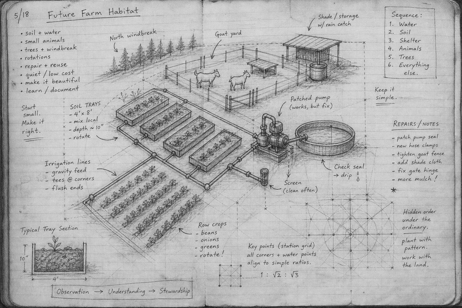

*Farm habitat notes: ordinary work, hidden order.*

The Rim's inner market hemisphere had been designed by someone who believed commercial zoning should include weather.

Lars stepped through the pressure arch and into artificial afternoon. The ceiling was a sky. Not a screen, not exactly. A layered atmospheric projection, humidity-managed and optically deep enough that clouds moved with convincing laziness across a blue vault three hundred meters overhead. Birds crossed between them. Real birds, according to the station registry, though Lars suspected half were sensor drones with better manners.

The ground curved upward in the distance until farms, stalls, workshops, and little houses clung to the far side of the sphere like a child's model of a world turned inside out. At the opposite horizon, a herd of cattle grazed on green pasture under a sun that had never been born.

Grim stopped beside him.

"That," the robot said, "is where the beef lives."

"Try not to sound predatory."

"I am expressing logistical interest."

"You are drooling through a metal face."

"That is condensation."

Lars glanced down. Two pack robots followed them, hovering half a meter above the path with obedient blankness. Grim had insisted on bringing them. Lars had argued they could carry their own food. Grim had replied that sixty kilos of beef, wine, root vegetables, emergency saffron, and possible dessert required dignity.

After the last hour, Lars did not have the energy to dispute dessert.

They left the main walkway and followed a gravel path toward the pasture. Actual gravel. It crunched under Lars's boots with unnecessary honesty. The air smelled of grass, wet wood, soil, warm animal hide, and somewhere in the distance, fresh bread.

It was absurd.

It was a self-contained farm inside an ancient space station balanced on the edge of the greatest void known to civilization.

It should have felt fake.

It felt more real than the rest of The Rim.

Lars did not like that.

He also did not like the way his headache eased when he looked at the farm's layout. The fields were not arranged for maximum output. Any corporate agricultural engineer would have called the design inefficient. Too many small plots. Too many crop types. Redundant irrigation lines. Storage sheds placed in odd triangular patterns. Livestock distributed across three separated loops instead of one optimized feed chain.

Inefficient, unless the goal was survival after partial system failure.

The thought arrived fully formed.

Lars frowned.

"What?" Grim asked.

"Nothing."

"Your nothing face is different from your normal face."

"That's because my normal face has charm."

They passed a low stone wall. It was not stone. The texture was convincing, but its thermal profile was wrong, and the seams breathed microscopically with station ventilation. Smart material. Very good smart material. Better than anything the public Rim maintenance economy should have been able to afford.

Lars looked away before the observation became a question.

Questions were dangerous lately.

At the top of the path stood a timber building with a red-painted facade, white trim, and solar tiles disguised as old roof shingles. Behind it, greenhouses stepped down the slope in terraces. Small robots moved among the plants with the calm precision of experienced gardeners. None of them bumped into anything. None of them hesitated. Their pathing was too clean.

A man came around the corner of the house carrying a crate of something leafy and green.

He wore a battered hat, a red-checked shirt, denim overalls, and green rubber boots. A thick beard covered half his face. His movements were broad and rural and just a little too slow.

That was what caught Lars's attention.

Not too fast.

Too slow.

Someone pretending not to be fast.

"Welcome!" the man called. "Vigor Hallman. What can I do for you?"

His Galactic Swedish had the rounded vowels of old Earth countryside filtered through centuries of station dialect. Lars had heard stranger accents from aristocrats who had never visited a planet.

"Lars Odin," Lars said. "This is Grim."

Grim lifted one hand. His servos whined theatrically. "I am a simple service automaton with no unusual interests except food."

Lars closed his eyes for half a second.

Vigor looked at Grim, then at Lars, then back at Grim.

"Of course you are."

"We're looking for farm-direct beef," Lars said. "Preferably the sort that makes a man reconsider civilization."

Vigor's eyes narrowed with amusement beneath the hat brim. "Then you have come to the right place."

"We need a large load. About sixty kilos. Maybe more if the robot starts making emotional arguments."

"He will," Grim said.

"And wine," Lars added. "Good wine. Not station solvent with a vineyard label."

"Naturally."

"And elderflower cordial," Grim said.

Lars turned to him. "You have never had elderflower cordial."

"Then I am correcting a deficiency."

Vigor clapped his hands together. "Excellent. Follow me."

He led them around the main house to a shop built like an old Swedish farm store. The floor was covered with clean straw. Dried herbs hung from dark beams. Glass-fronted coolers displayed vacuum-packed cuts of beef in perfect rows, marbling like pale lightning through red muscle. Root vegetables filled wooden bins. Cheeses rested under controlled humidity bells. Wine bottles lined the walls with labels from Earth, Mars, Xaltor, Heliostat imports, and two regions Lars had never heard of.

That last part bothered him.

He had heard of most regions that produced expensive wine.

"We are self-sufficient," Vigor said, spreading his arms as if introducing a kingdom. "Meat, vegetables, fruit, seed stock, water recycling, soil cultures, independent energy loops. We sell the surplus."

"On a station where half the lower ring smells like overheated socks and industrial despair."

"That is why people pay."

"Fair."

Lars walked to the beef display and forgot, briefly, about terrorists, headaches, Aphex Defence, and the KBC Void.

"Look at that marbling."

Grim pressed his metal face almost against the glass. "I am looking."

"You don't have salivary glands."

"I can install some."

"No."

"A small reservoir?"

"Absolutely not."

Vigor laughed. "You two are welcome to eat here while my robots pack your order. Long-distance guests should not be sent away hungry."

Lars meant to decline.

He really did.

They needed to leave. Black Hole B-7 had just thrown a small army at him. Aphex would flood the sector with security within hours. Galactic police would arrive within days and begin asking questions with forms. The sensible move was to buy supplies, board the Fastulv, and disappear into an ugly vector no one expected.

Instead he heard himself say, "That would be appreciated."

Grim's lenses brightened.

"Pepper steak and potato gratin," Grim said. "If possible."

Vigor looked delighted. "Very possible."

The robots began packing their order with efficient care. Vigor guided Lars and Grim back outside to a table under a white parasol on the lawn. The artificial sun warmed Lars's face. A waterfall spilled down a rock wall in the distance, feeding a narrow stream that cut through the pasture before vanishing under a wooden bridge.

No single water line.

Three backup channels hidden under decorative stone.

No monocrop.

No central control tower.

Defense positions concealed as birdhouses, fence posts, irrigation housings, and one extremely innocent-looking compost shed.

Lars sat slowly.

Vigor sat opposite him.

Grim sat beside Lars and, to his credit, remembered to make one knee joint squeal.

Two waiter robots in white jackets emerged from the house. One carried three glasses. Two whisky tumblers and a smaller glass filled with pale yellow cordial. Another set down a pitcher, then an unmarked bottle of whisky.

Lars knew the bottle shape before he read anything.

There was no label.

There did not need to be.

Xaltor X.

Real Xaltor X.

Not the pub's expensive bottle with distributor stamps and customs codes. This one was old, handmade, probably illegal in twelve jurisdictions and sacred in three.

Lars's right hand moved toward the Ragnarrök.

Vigor did not move.

That made it worse.

"Is this a test?" Lars asked quietly.

Grim's head turned a fraction. The robot's posture changed so subtly that only someone watching for violence would notice.

Vigor leaned back and lifted both hands, palms open.

"No test."

"Because I have had enough charming surprises today."

"I believe that." Vigor's eyes stayed kind. "You are among friends."

"That sentence gets people killed."

"Sometimes. Here it gets them dinner."

Lars scanned the farm.

Not with any equipment he admitted to owning.

The local wireless spectrum was clean. Too clean. Signal dampening embedded under the grass. Acoustic baffles in the fence line. Thermal masking in the roof. The robots had patrol subroutines behind their hospitality layers. Vigor's farmhouse was not a farmhouse. It was a fortified, self-sufficient node disguised as a farm by someone with excellent taste and a deeply suspicious mind.

Lars's breathing slowed.

Vigor watched him notice.

"The entire property is shielded from casual surveillance," Vigor said. "And most professional surveillance. We can defend ourselves."

"Against Black Hole B-7?"

"For a while."

"That's not much."

"It is more than most farms."

Lars almost smiled.

Vigor reached up, took hold of his beard, and lifted it away from his face.

Without it he looked younger. Not young, exactly. Time sat strangely on him. His skin had the mild weathering of a station farmer, but his eyes were sharp in a way farmers, soldiers, surgeons, and predators sometimes shared. There was something familiar in the shape of his cheekbones.

Lars had seen him before.

Impossible.

A memory rose: the same face without the hat, lit by pale blue lines; a corridor of space-gray material; laughter; someone saying a word that meant home, or danger, or both.

Pain tightened at the base of Lars's skull.

He shut the memory down.

The pain remained as a warning.

"You okay?" Grim asked, not aloud.

The question arrived inside Lars's head.

That was another thing they did not discuss in front of people.

"Fine," Lars answered silently.

Vigor poured whisky into one tumbler, then the other. He poured cordial into Grim's glass with equal solemnity.

"You recognize a like-minded person when you see one," Vigor said.

"Do you?"

"Sometimes."

"And what am I?"

Vigor pushed one whisky glass toward him.

"Tired."

Lars stared at him.

It was not the answer he expected.

"That is either very perceptive or very lazy."

"Both can be true."

Lars picked up the glass. The whisky smelled of smoke, minerals, and cold fruit. In him it landed like a sedative.

"To surviving the day," Vigor said.

"The day isn't over."

"Then to surviving the next hour."

They drank.

For a moment, the noise inside Lars fell back.

His shoulders loosened.

Grim sipped the cordial.

The robot froze.

Lars looked at him. "What?"

Grim's voice came out very carefully. "What is this called?"

"Elderflower cordial," Vigor said.

Grim turned to Lars.

"We need one hundred liters."

"No."

"Fifty."

"No."

"Forty."

Vigor laughed so hard he had to put down his glass.

The waiter robots brought dinner soon after: pepper-seared beef, potato gratin, salad bright with herbs, warm bread, butter, and a red wine that made Lars reconsider several prejudices about station agriculture.

For several minutes no one spoke.

This pleased Grim enormously.

The robot ate with focused reverence, cutting each bite to exactly the same size. Lars had once told him etiquette involved moderation. Grim had interpreted this as geometric consistency.

Halfway through the meal, Lars leaned closer.

"Your left wrist servo is too smooth," he murmured.

Grim paused.

"What?"

"When you reached for the glass. No theatrical lag. No cheap-robot nonsense."

"I was distracted by flavor."

"That is exactly how people get caught."

"People?"

"Robots. People. Whatever category prevents you from saying something philosophical during dinner."

Grim looked at his fork.

"I will squeak next time."

"Good."

Vigor's eyes crinkled.

"It is hard," he said, "pretending to be less than you are."

Lars did not answer.

The statement sat on the table between the wine and the butter.

Too accurate. Too sharp. Too close.

The headache nudged him again.

He took another bite of beef instead of thinking.

After dinner, Vigor poured coffee. Real coffee, dark and bitter. Not synthesized station concentrate. Lars held the cup in both hands and watched steam curl into the artificial sunlight.

"So," Vigor said, "you are provisioning for a trip."

"Maybe."

"The kind where you buy the best beef on the station and enough wine to survive your own company?"

"Grim's company. Mine is delightful."

"Debatable," Grim said.

Lars looked across the pasture.

The cattle moved in calm loops. The robots tended the fields without hurry. Nothing here was maximized. Everything had a backup. The farm could lose half its systems and still feed people. It was not efficient in the way corporations used the word.

It was alive.

He felt unexpectedly sad.

"We are being hunted," he said.

Vigor did not pretend surprise.

"I heard there was trouble."

"That was before the two frigates."

"Ah."

"Black Hole B-7. They hit the pub sector, my docking bay, and an Aphex destroyer. Maybe more. They wanted something."

"You think they wanted you."

"People usually do. I am charming, wealthy, and heavily armed."

"And modest."

"That too."

Vigor drank coffee and waited.

Lars hated good listeners. They left too much room for truth.

"I said something on the ship," Lars admitted. "About my blood being collectible."

Grim's head turned.

Vigor did not move.

"I don't know why I said it."

The artificial sun passed behind a programmed cloud. The table dimmed.

For a moment Vigor's eyes caught a faint blue reflection from nowhere Lars could identify.

"There are old stories," Vigor said carefully. "About people whose blood carried machines too small to see. Machines that could heal, remember, build, communicate. Most stories are wrong."

"Most?"

"Enough wrong to be dangerous. Enough right to be worse."

Lars's fingers tightened around the coffee cup.

"You trade in old stories?"

"I farm."

"With surveillance shielding, layered defense, illegal whisky, and robots that move like special forces."

"Difficult century for farmers."

Lars snorted.

The laugh helped.

The headache did not.

Vigor set down his cup. "In a few weeks this sector will be thick with Galactic police, Aphex Defence, private investigators, bounty systems, insurance auditors, and opportunists pretending to be journalists."

"Then we'll be gone."

"Good."

"You say that like you know where."

"No," Vigor said. "I say it like staying would be unwise."

A little wind moved across the grass. Somewhere, a cow lowed with deep philosophical indifference.

One of Vigor's robots approached with the pack order: sealed crates of beef, vegetables, wine, coffee, and, despite Lars's direct refusal, four containers of elderflower cordial.

Grim looked innocent.

Lars did not believe in robot innocence.

They stood.

At the gate, Vigor shook Lars's hand.

His grip was ordinary.

Deliberately ordinary.

Lars felt the same recognition flicker through him and avoided it with professional cowardice.

"If you need anything," Vigor said, "you can count on me. And on the station, more than you might think."

"That is a suspicious amount of generosity."

"Take it anyway."

Lars nodded.

He surprised himself by pulling Vigor into a brief hug.

Grim immediately did the same.

Vigor endured both with good humor.

They had gone twenty meters down the gravel path when a small column of armored figures came over the hill, walking with the exhausted stiffness of soldiers who had won the wrong kind of day. Major Elliot Fabron led them. His polished armor was scorched, his expression sour.

Lars pointed back at the farmhouse.

"See the gate? Follow the gravel path. You will be well looked after."

Fabron stopped in front of him. "Odin. You destroyed two enemy frigates with tactical nuclear weapons within station traffic control limits."

"You're welcome."

"That is not the phrase I would choose."

"Try it. Feels good."

Fabron looked past him at the pack robots. "Are those groceries?"

"Strategic groceries."

"We are conducting a live security operation."

"And you look hungry."

Fabron's jaw worked.

Lars clapped him on the shoulder.

"Take care of yourself. See you a little later."

He kept walking before the major could decide whether regulations permitted strangling a board member.

The path sloped down toward the market arch. Gravel crunched underfoot. Birds circled in the false sky. The farm receded behind them, peaceful and impossible.

Grim matched Lars's stride.

"Vigor is not a farmer," Grim said silently.

"He is definitely a farmer."

"You know what I mean."

"Unfortunately."

"His movements are masked. His property is a hardened node. His systems follow a resilience pattern I have seen in old fragments about Aerit arcologies."

The word struck.

Aerit.

Pain flashed white behind Lars's eyes.

He stumbled.

Grim caught his arm with too much speed.

Several market visitors looked over.

Grim's servos began whining loudly, belatedly theatrical.

"Apologies," Grim said aloud. "Simple service automaton clumsiness."

"Ow," Lars muttered.

Grim lowered his voice. "Do not think about the word."

"Great advice. Very actionable."

"I can say 'beef' repeatedly."

"That may help."

"Beef. Beef. Beef. Elderflower cordial. Beef."

The pain retreated from blinding to merely unpleasant.

Lars straightened.

For one second, he had seen something.

Not Vigor. Not the farm.

A station in darkness.

A hull that bent light around itself.

An airlock outlined in pale blue, visible in wavelengths no human eye should see.

Home.

The word came with such force that Lars nearly stopped again.

He swallowed it.

"We leave now," he said.

"Vector?"

Lars looked toward the pressure arch leading back to the docking ring. Past it waited the Fastulv, ugly and overpowered, while the expensive beef followed behind them on two levitating pack carts.

Past The Rim waited the KBC Void.

The emptiness no one understood.

"Outward," Lars said.

Grim was quiet for half a step.

"Into the Void?"

Lars did not answer at once.

The back of his neck pulsed, not exactly pain now. More like a hand pressing gently against a locked door from the other side.

"Just a short look," he said.

Grim made a sound that might have been a laugh or a servo fault.

"With you, that has never once been true."

## Chapter 3: The Dark Object

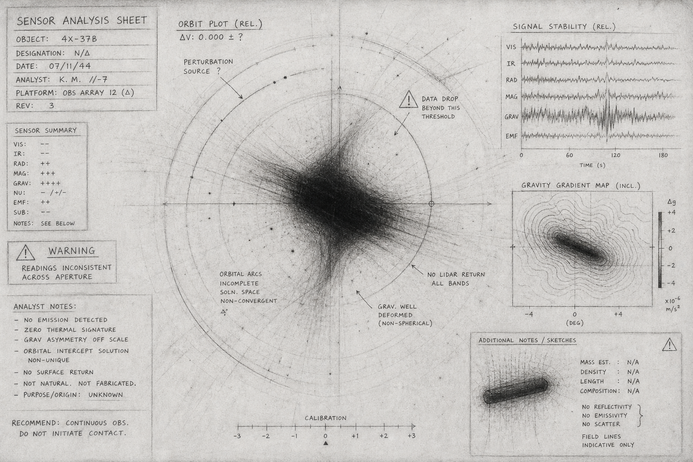

*Sensor sheet for an object that refuses ordinary categories.*

The Fastulv left The Rim under a filed civilian departure vector, then abandoned that vector eight minutes later.

Lars did not call it abandoning.

He called it "correcting for emerging navigational intuition."

Grim called it "lying to traffic control."

They were both right.

The Rim shrank behind them, its old habitat arcs and docking spines losing definition against the star-thick wash of the Milky Way. Ahead, the KBC Void opened like an error in the universe.

No destination marker.

No beacon.

No trade lane.

No sane reason to go that way.

On the way back through The Rim's market, Grim had bought replacement sunglasses from a kiosk between a knife vendor and a noodle stall.

Lars sat in the captain's chair with one boot hooked under the console, a cup of coffee clipped to the armrest, and the replacement pair on his face. The new ones had black lenses and blue frames. Grim had chosen them while claiming to understand human aesthetics.

"They make me look like a corrupt ski instructor," Lars said.

"You said you needed sunglasses."

"I meant good sunglasses."

"They were discounted."

"I'm worth forty-seven billion Galactic kronor."

"Fifty-four point three, after Aphex compensation."

"Then why are you buying discounted sunglasses?"

"We spent heavily on beef."

The ship hummed around them. Not loudly. Lars had tuned the engines until the vibration pattern sat just below irritation. A good ship had a voice, but it should not nag. The Fastulv's antimatter assembly, however, had developed a coolant condensation issue in the aft thermal manifold, which meant it had chosen nagging as an art form.

From somewhere below the deck came a metallic clang.

Grim tilted his head.

"The reactor is still possessed."

"Reactors are not possessed."

"Then explain the dripping."

"Thermal cycling through a badly seated condensate return valve."

"That is exactly what a possessed reactor wants you to think."

Lars sighed and pulled up the diagnostic model. The solution appeared before the schematic finished rendering. A minor tolerance mismatch caused by a print head that had lied about calibration by three microns. He made the correction, routed a maintenance drone to fabricate a new collar, and told the aft manifold to stop embarrassing him.

"Fixed," he said.

A pause.

Then the deck clang came again.

Lars closed his eyes.

The warning alarm chirped once.

Not an attack alarm. Not collision. Not radiation.

A sensor ambiguity.

Lars opened his eyes.

The forward display filled with blackness.

That should not have meant anything. Space was black. The Void was blacker. But this was not ordinary absence. The ship's passive optical layer had found an area ahead where background starlight behaved incorrectly. Not blocked. Not absorbed. Bent. A patch of darkness moved against the sky with the subtle wrongness of heat shimmer, except there was no heat and no medium to shimmer through.

Grim leaned forward.

"That is a strange signature."

"Define strange."

"No."

"No?"

"If I define it, you will pretend you already knew."

Lars enlarged the sensor map. Gravitational lensing without corresponding mass. Weak vacuum polarization. Intermittent femtosecond-scale timing offsets in the local clock grid. Thermal profile indistinguishable from background. Radar returned nothing. Lidar returned nonsense. Neutrino scatter showed a volume where a volume should not be.

"It's a station," Lars said.

The words left him before he had decided them.

Grim turned his metal head slowly.

"A station."

"Yes."

"In the KBC Void."

"Near it."

"Invisible."

"Mostly."

"With no normal mass signature."

"Apparently."

"And you know this because?"

Lars stared at the display.

The headache was back, but smaller now. Focused. A nail pressed at the base of his skull.

"Because the light is bending around structure," he said. "Not a sphere. Too many flat transitions. It is refracting through layered spacetime curvature. The mass isn't where the geometry says it should be because the geometry is being cheated."

"That was almost an explanation."

"Thank you."

"It also sounded like something from the six-hundred-year-old Aerit fragments I read during my leisure time."

The nail became a spike.

Lars gripped the armrest.

"Do not use that word."

Grim watched him. His optical lenses narrowed, an affectation he had copied from humans and then refined until it was more annoying than useful.

"Noted."

"And you do not have leisure time."

"I do when you sleep."

"I don't sleep."

"Exactly."

The dark object grew on the display as Grim brought the ship in along a half-parabolic approach. Lars felt the trajectory before he saw Grim enter it. It was correct. Not safe. Correct. Those were different categories.

"Decelerate on my mark," Lars said.

"I am already calculating the burn."

"Five."

"I know."

"Four."

"Lars."

"Three."

Grim was not strapped in.

"Two."

"You are enjoying this."

"One."

The Fastulv decelerated hard.

Grim hit the forward console with a resonant metallic clang.

The ship stopped short of the invisible surface by less than a hundred meters.

Grim lifted his head from the console.

"Was that necessary?"

"Do you want to collide with the invisible station?"

"I want workplace safety."

"You're a robot."

"With a brain."

"Wear a seatbelt."

Lars unbuckled and stood. The object ahead occupied the entire forward view now, though his eyes could barely make sense of it. The hull, if it was a hull, bent the background around itself. Stars smeared at the edges. Here and there, along angles too subtle for ordinary sight, something pulsed in pale blue.

Not visible blue, exactly.

His eyes registered it as blue because his brain needed a color and had given up.

Grim enlarged one of the pulses.

"I need to recalibrate."

"For what?"

"Your visual range."

Lars looked at him.

Grim's fingers moved over the console. "Do not start. I have known for weeks your retinal response includes wavelengths outside baseline human norms. You see things our public sensor suite does not. I have been politely ignoring it."

"That is not polite."

"It is extremely polite. I have a folder called Things Lars Pretends Are Normal."

"Delete it."

"It has backups."

The pale blue structures sharpened as Grim adjusted his optical systems. Lines appeared along the dark hull: not seams, but potential seams. Places where material could decide to become an opening. The design was almost offensively elegant. Space-gray, black, white where light caught it, and that strange blue beyond human range. No exposed bolts. No decorative aggression. Form and function fused so thoroughly that the object looked less manufactured than reasoned into existence.

Lars swallowed.

He had seen this aesthetic before.

No.

He had not.

"Suit up," he said.

"That is your response to an impossible ancient station hidden near the Void?"

"Would you prefer a speech?"

"I would prefer a risk assessment."

"Risk: high. Assessment: interesting."

"That is not an assessment."

"It is concise."

They left the bridge and moved down to the cargo bay. Lars pulled on a vacuum suit with reinforced joint seals and an EVA ion pack. The suit's outer layer was scuffed, patched, and much more advanced than it looked. Grim needed only pressure protection for his biological core and a small emergency oxygen loop mounted between his shoulders. He attached his own EVA pack, then adjusted the right arm he had dented earlier against the console.

Lars checked the Ragnarrök.

Grim watched.

"You expect to shoot the invisible station?"

"No."

"Then why bring the weapon?"

"Comfort."

"For you or the station?"

"Depends how rude it is."

The outer bay opened.

They launched into vacuum.

The Fastulv hung behind them, ugly and loyal, station lights reflected faintly along its patched hull. Ahead, the dark object distorted the universe.

Small ion pulses carried Lars and Grim toward it.

Distance became hard to judge. The surface seemed near, then far, then beside them. Lars's suit lidar refused to agree with itself. His eyes did better. He followed the pale blue pulses, not because they marked a path, but because something in the rhythm suggested where not to go.

"I dislike this," Grim said over the suit channel.

"You dislike many things."

"This is a mathematically supported dislike."

"Better than your emotional one?"

"More expensive."

They reached the hull.

Lars extended one boot. The magnetic sole clicked and failed to grip. He bounced gently backward, corrected with a wrist pulse, and touched the surface with one gloved hand.

The suit reported no contact.

His hand felt texture anyway.

Not rough. Not smooth. Responsive.

Like touching a material that was waiting to decide what kind of material it should be.

"That is rude," Grim said.

"The station?"

"Physics."

They moved along the hull, using tiny protrusions Lars could feel more than see. Fifteen meters to port, a faint rectangular pattern brightened in the strange blue.

"There," Grim said. "Possible interface."

"Possible trap."

"You said that with enthusiasm."

"I contain multitudes."

The rectangle sat within a wider halo of pale blue emission. Lars's suit sensors showed almost nothing. His skin prickled under the gloves.

"What can go wrong?" he said.

"I have prepared a list."

Lars pushed himself into the halo.

The scan hit him in less than a microsecond.

His suit did not detect it. His body did. A cold, precise force passed through his bones, blood, nerves, and skull. Not destructive. Evaluative. It ran through him with the intimacy of a medical procedure and the speed of a weapons lock.

His hands tingled.

The back of his neck burned.

A square lit at his right side, bright enough in the impossible wavelength that even Grim's recalibrated optics flared.

"Lars," Grim said. "Do not put your hand there."

Lars put his hand there.

"You put your hand there."

"I noticed."

The pull returned, this time inside his mind.

Not thought reading. That was too crude a phrase. It was pattern comparison. Neural architecture. Blood chemistry. Unknown machines in his bloodstream responding before he knew they were there.

Lars tried to pull away.

He could not.

The scan deepened.

Images sparked behind his eyes: a child running along a white corridor; a blue-white man laughing; a woman's hand resting on a control surface; seven points of light arranged around a dark center; a word he could not hear without pain.

Then it vanished.

Lars gasped.

The rectangle dissolved.

The hull opened.

No seam. No hinges. The material simply chose to be a doorway.

A voice spoke through the suit channel, through the hull, through the bones of his inner ear, and through some private channel he did not want to acknowledge.

The language was unknown.

He understood it anyway.

Welcome home.

Lars froze.

Grim's voice came tight over the comm. "Translation?"

"It said..." Lars swallowed. "It said welcome."

"Only welcome?"

"Close enough."

A field caught them both and drew them inside.

The doorway sealed behind them with silent speed. They entered a vast airlock lined in space-gray material. Warm light appeared in long bands along the walls and ceiling. Artificial gravity rotated orientation so smoothly that one wall became the floor before Lars's inner ear could complain.

They landed with soft thuds.

Air hissed in.

The suit confirmed pressure, temperature, oxygen, trace noble gases, and no identifiable pathogens. The air composition was almost Earth-normal, but cleaner than any station air Lars had ever breathed. Not sterile. Balanced.

The outer door vanished behind them.

Not closed.

Vanished.

"Nice door," Grim said.

His voice was quiet.

That worried Lars more than jokes would have.

Lars removed his helmet.

The air smelled faintly of cold stone, metal after rain, and something green.

A memory stirred.

He killed it before it could stand up.

"Keep recording," he said.

"I began recording before you touched the ancient brain-scanning murder square."

"Good."

"I also began drafting a will."

"You don't own anything."

"I own opinions."

"No one wants those."

They walked thirty meters to a wall console. It had no buttons. No screen in the ordinary sense. When Lars approached, symbols surfaced in pale green and blue layers, some visible, some sitting above visibility like weight behind the eyes.

Grim adjusted his optics again.

"This interface is encoded partly outside standard human visual range."

"I can see it."

"Yes," Grim said. "That is increasingly difficult to ignore."

Lars reached toward the symbols, then stopped.

He had no idea what they meant.

His hand moved anyway.

One sequence. Then another. The console warmed under his fingers. A headache bloomed, but with it came certainty. Not memory exactly. Procedure without story. Skill without explanation.

A rectangular opening formed in the wall to the right.

Grim stared.

"Have you studied ancient alien access systems?"

"I read a lot."

"That answer is deteriorating."

"Still useful."

They stepped through.

The next chamber was enormous.

The light bands along the walls barely reached the ceiling. Their footsteps echoed into distance. The floor was seamless black, polished without reflection. The air held no dust. No decay. No sense of abandonment, despite the impossible age implied by the technology.

Lars walked toward the center.

Two hundred meters in, he hit something.

His forehead made contact with an invisible surface.

"Ow."

Grim stopped just in time.

Lars lifted both hands. There was a ship in front of them.

He could feel the hull, but barely see it. The craft bent light around itself so perfectly that the far wall appeared through it with only slight distortion. Its surface was cool, continuous, and immense. Not a fighter. Not a shuttle. Something larger. A vessel built for distances that made normal navigation look parochial.

"It's a ship," Lars said.

"You are doing that thing again."

"What thing?"

"Knowing."

Lars ignored him and felt along the invisible hull.

"If there is a personnel lock, it will be forward of the midline, offset along the port curvature. Cargo access below, maybe aft, but this shape suggests internal modular bays. The crew lock should be..." He moved three steps. "Here."

A pale blue rectangle appeared under his palm.

Grim applauded once, the sound ringing through the vast hangar.

"Wonderful. Either you are the luckiest idiot in the galaxy or we are in serious trouble."

"Those are not mutually exclusive."

Lars placed his palm in the rectangle.

The scan returned.

This time he was ready.

It did not help.

Images came harder: a boy standing beside a tall blue-white man; a woman with eyes too bright to be merely human; a fleet burning in silence; a station hidden inside folded spacetime; a name spoken over and over until it became impossible to bear.

Laurdinn.

Not Lars.

Laurdinn.

The headache became a blade.

The ship opened.

Lars staggered.

Grim caught him.

"We are leaving," Grim said.

"No."

"Your neurological readings just performed a small opera."

"No."

"Lars."

Lars looked through the open lock into the invisible ship.

Light came on inside, one band at a time, waiting for him.

He did not know this place.

He knew exactly where to go.

"We keep moving," he said.

Grim's grip tightened on his arm.

"Toward what?"

Lars stepped through the lock.

The answer came from somewhere deeper in the station, carried by no sound at all.

Not a ghost.

Not a vision.

A system recognizing a missing component.

"Home," Lars said, and hated the word as soon as it left him.

## Chapter 4: The Sea's Last Song

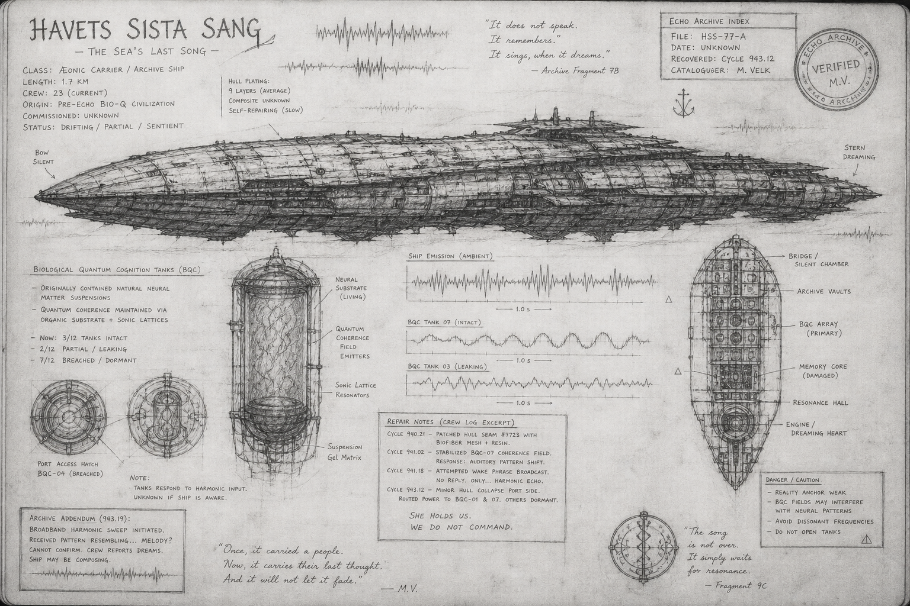

*Archive study of Havets Sista Sang.*

The invisible ship accepted him like a machine with excellent memory and no concern for his comfort.

The inner lock opened into a corridor wide enough for cargo, troops, or someone with a dramatic sense of personal importance. Light woke ahead in clean bands, pale blue at the edges, warm white through the center, never too bright, never too dim. The walls were space-gray with black inset lines that were not decorative. Lars could feel them as data channels, structural stress paths, access seams, or all three.

Grim stepped in behind him, one hand hovering near Lars's shoulder as if deciding whether to drag him back out.

"I am registering active systems," Grim said. "Power grid stable. Atmosphere stable. Gravity stable. No dust. No corrosion. No microbial bloom. Either this ship was sealed yesterday or someone here has humiliated entropy."

"Entropy needed humbling."

"That sounds like something you would put on a mug."

The corridor widened into a bridge.

Not a cockpit. Not even a command deck in the Aphex sense, with heroic chairs and too many screens. This was a quiet oval chamber, built around a central standing console and a shallow ring of workstations grown from the floor. The forward wall was black, glossy, and blank until Lars crossed the threshold.

Then the galaxy appeared.

Not a camera feed. Not a projection. A spatial reconstruction unfolded across the wall and into the room, layered with mass shadows, radiation flows, local curvature, and possible vectors. The Rim hung behind them. The Fastulv showed as a small tagged outline clamped outside the hidden structure. Beyond, the KBC Void expanded as a measured absence.

Grim made a small sound.

"I dislike admitting this," he said, "but that is better than our tactical display."

"Our tactical display has personality."

"It has latency."

A voice spoke from everywhere at once, in flawless Galactic Swedish.

"Welcome back, Captain Laurðinn. System diagnostics confirm all primary and secondary functions operating within nominal parameters. No critical deviations registered during command absence. Storage integrity remains intact. Redundant systems are in standby. Continuity simulation confirms three hundred and fifteen years, seven months, twelve days of uninterrupted watch-state operation. Command access reactivated. It is an honor to serve again."

Lars stared at the empty bridge.

Grim slowly turned his head toward him.

"Captain Laurðinn."

"Shut up."

"I have not yet begun."

"Begin later."

Lars touched the central console. It shaped itself under his palm, not soft, not liquid, but obedient in a way metal had no right to be. A set of symbols rose beneath his hand. He understood none of them. His fingers knew several.

The ship responded with a soft tone.

The headache remained, but it did not spike. That was worse. It meant he could keep going.

"Ship," Lars said, then stopped because speaking to an unknown ancient warship while pretending not to panic was harder than it looked. "Identify yourself."

A pause, almost human in timing.

"I am Havets Sista Sång."

Grim's optical lenses brightened. "The Sea's Last Song. That is unnecessarily beautiful."

"Aphex names guns Ragnarrök," Lars said. "Everyone has hobbies."

"Captain," the ship said, "your biometric, neural, and nanomedical responses deviate from expected command baseline. Recommend health evaluation."

Lars removed his hand from the console.

"Absolutely not."

"Recommendation logged."

"Do not log my medical cowardice."

"Logged under behavioral continuity."

Grim made a delighted metallic noise.

Lars pointed at him. "No."

"You thought loudly."

"You heard?"

Lars opened his mouth and closed it again.

The bridge became very quiet.

Grim's amusement disappeared.

"Lars."

"I don't want to discuss it on the haunted nostalgia ship."

"This ship is not haunted."

"Good, then it won't mind."

He turned away from the console. The walls had begun to display status layers in the strange blue-white emission. Grim adjusted his optics again and muttered about spectrum compensation. Lars could see the data without effort. That, too, was a problem for later.

"Havets Sista Sång," Grim said, with the careful politeness he used for powerful systems, expensive kitchens, and armed strangers. "Can you provide station map access?"

"Access granted to guest entity Grim under Captain Laurðinn's command envelope."

"Guest entity," Grim repeated.

"Don't get sentimental," Lars said.

"I am deciding whether to be offended."

"Pick quickly."

The map unfolded. It was a folded arcology: a vast complex suspended inside a spacetime bubble, parts of it geometrically adjacent despite being separated by impossible external distances. Hangars, habitat rings, manufacturing cores, data vaults, energy loops, hydroponic cylinders, medical bays, memory archives, and regions the map refused to name.

Several sectors glowed green.

Many glowed muted amber.

One deep internal sector pulsed red.

Lars felt that red pulse in his teeth.

"What is that?" he asked.

"Central power distribution auxiliary chamber," the ship replied. "Containment anomaly. Maintenance delegation incomplete."

"How incomplete?"

"Forty-nine years, two months, nine days."

Grim's head snapped toward the map. "There has been an unresolved containment anomaly for forty-nine years?"

"Correct."

"Why was it not repaired?"

"Robotic maintenance units failed within affected chamber. Drone attempts failed. Biological access restricted. Guardian Valdrun immobilized within chamber. External signalling suppressed under Alpha Fourteen watch-state protocol."

The words struck Lars unevenly.

Guardian.

Valdrun.

Alpha Fourteen.

Each one found a locked door inside him and hit it with a hammer.

Pain rose up his neck.

He grabbed the console edge.

Grim stepped in close. "Stop listening."

"That's hard when the big ship keeps talking."

"Ship, reduce sensitive terminology."

"Acknowledged."

"Don't order my weird ship around."

"Someone has to."

The map shifted, replacing labels with neutral icons. The pain lessened by one degree.

Lars breathed through his nose. "This Valdrun is alive?"

"Yes," said Havets Sista Sång.

"Human?"

"No."

"That's a useful answer."

"Entity classification restricted by captain medical lock."

Grim looked at Lars. "Your own brain is apparently censoring the ship."

"My brain is overachieving today."

"Can we reach the chamber without dying?"

"Route available," the ship said. "Recommend respiratory protection, radiation shielding, and no robotic entry beyond safety threshold."

Grim went still.

"No robotic entry."

"Correct. Prior machine failures indicate localized field effects damaging synthetic cognition, servo control, and non-biological quantum substrates."

Lars looked at Grim's chest, where the biological quantum core sat behind layered armor.

"You stay at the threshold."

"No."

"That wasn't a vote."

"You are neurologically unstable, recently attacked, and following instructions from a ship that thinks your name is Laurdinn."

"Laurðinn," Lars corrected automatically.

They stared at each other.

"Interesting," Grim said.

"I hate this place."

"You just corrected the pronunciation."

"I hate this place accurately."

They left the bridge.

Havets Sista Sång opened a side passage without a seam. They passed through the hangar again, the invisible ship fading behind them until only its distortion remained. Lars forced himself not to look back. The station beyond the hangar unfolded in long corridors of gray-white material, rounded corners, hidden lighting, and interfaces that surfaced only as they approached.

Every design choice had restraint.

No banners. No gold. No monumental statues. No childish empire language carved into bulkheads.

It was all function, but function with taste so precise it became almost arrogant.

Grim noticed too.

"If Apple had a secret civilization and a thousand years of better engineers," he said, "it might produce a bad imitation of this corridor."

"That's a sentence with legal consequences."

"Only if Apple survives in this jurisdiction."

They reached a long equatorial passage. A narrow window ran along the right wall, rectangular with rounded corners. Outside, the Milky Way glittered with uncomfortable beauty. Because of the spacetime bubble, the view was wrong. Stars shifted as Lars walked, not with parallax but with folded perspective, as if the station were looking at the galaxy from several nearby positions at once.

On the left, cross-corridors and wall consoles passed in measured intervals.

Lars pointed. "We turn here."

"Map says straight for another seventy meters."

"Then the map is being polite."

He turned left.

Grim checked the projection. The route recalculated and turned left.

"I am adding that to the folder," Grim said.

"There is no folder."

"There are several folders."

They had gone perhaps a hundred meters inward when a sphere floated toward them from the distance.

It was small, maybe half a meter across, space-gray and black with pale blue symbols moving across its surface. No visible thrusters. No sound. It slowed as it approached.

Lars pulled the Ragnarrök from his shoulder and unlocked the safety.

Grim shifted behind him. "Probably a maintenance drone."

"Probably is a word that gets people shot."

"Usually by you."

The sphere stopped five meters away.

Symbols flickered across its face, then reorganized into Galactic Swedish.

"Captain Laurðinn," it said. "You have returned. Assistance required. Time margin unacceptable. Follow."

Then it turned and accelerated back the way it had come.

Lars and Grim looked at each other.

"Friendly maintenance drone," Grim said.

"Bossy maintenance drone."

Lars secured the Ragnarrök and ran.

The sphere led them through two corridors, a descending lift with no visible motion, and a lock chamber whose doors formed and unformed around them. Lars tried to keep track of direction, then gave up. The station's interior geometry cheated. The only honest things were his headache and Grim's increasingly concerned silence.

"Name and function," Lars called after the sphere.

"Designation: Ödesvaka," it replied without slowing. "Function: watch compliance and continuity under Alpha Fourteen watch-state. Current priority: prevent guardian termination."

The pain jabbed again at the protocol name, but the drone was already veering through a wide portal to the right.

They entered a large chamber.

The first thing Lars noticed was the smell.

Burned insulation. Ozone. Hot metal. Something chemical and bitter that his suit filters should have removed but did not. The lighting flickered in weak bands along the walls. Enormous machines stood in two rows, their surfaces mostly intact, but several panels had blown open like peeled fruit.

The second thing he noticed was the bodies.

Not biological bodies. Robots. Drones. Maintenance units. At least ten lay twisted in a line from the entrance toward the left machine bank. Five spherical drones were crushed or burned mid-path, as if they had simply fallen from the air and died.

Grim stopped at the threshold.

His left hand twitched.

Then twitched again.

"I am receiving control noise," he said.

"Back up."

"I can compensate."

"Back up."

This time Lars did not make it a joke.

Grim stepped back into the corridor.

Ödesvaka hovered beside him. "Guest entity should remain outside."

"Guest entity agrees under protest," Grim said.

Lars moved deeper into the chamber.

His boots struck something with a metallic clang. He looked down. A robot hand, severed cleanly at the wrist, fingers still curled around a tool. Beyond it, more wreckage led toward the right-side machine bank.

There, under a collapsed power distributor the size of a small ground vehicle, lay a humanoid figure.

At first Lars thought it was an android.

Then the figure turned its head.

It had a human face, mostly. Tall-boned, blue-pale, with skin that looked too cool and too strong. One side of the skull and neck showed integrated material that was not prosthetic in any ordinary sense. Muscle, synthetic structure, and something like living metal disappeared under torn clothing and a half-crushed torso harness. Long arms. Broad shoulders. A face like a Viking statue designed by a medical engineer with unresolved issues.

The figure saw Lars and smiled.

"Took you long enough," he said.

His voice was rough, exhausted, and amused.

Lars stopped.

Something in him recognized the tone before the face.

Pain struck, then retreated as if the locked doors inside him had decided this one could stay partly open.

"Do I know you?" Lars asked.

"Yes."

"Do I want the full answer?"

"Not yet."

"Good. I am Lars."

"I know."

"Everyone keeps saying that today."

"Valdrun," the trapped man said.

From the corridor Grim said, "I am choosing not to be insulted by the word eats."

"Wise robot," Valdrun said.

Grim paused. "I may choose to be slightly flattered."

Valdrun closed his eyes for a second, gathering strength. "The distributor weighs about two metric tons. The chamber can vent enough contamination for you to work, but not enough for me to lift it. My left-side actuators are pinned. Biological repair systems are keeping me alive. They have been doing so for forty-nine years."

Lars looked at the collapsed structure.

Two tons. Bad angle. Damaged floor anchor. Heat distortion in the surrounding frame. No heavy robot could enter. Drones had failed. Valdrun could not free himself without shifting the distributor through his own torso.

The solution began forming.

Not enough tools here. Need a pulley, cable, overhead beam, remote counterforce from outside the field. Service void above the ceiling. Work robot outside the threshold. Redirect load through a mechanical advantage system. Use station material if it behaved.

Lars hated how quickly it arrived.

"We need cable, pulleys, a structural anchor above you, and a big stupid machine that can pull from outside the chamber."

Valdrun's smile widened. "Still you."

"Stop recognizing me. It is giving me a headache."

"Workshop outside," Valdrun said. "Right of the entrance. Hidden service access in the rear wall. Ödesvaka can open it."

Lars turned toward the drone. "Can you?"

"Yes."

"Why didn't anyone do this earlier?"

"Prior attempts used autonomous maintenance units. Units failed. Guardian unable to authorize biological-risk override without captain command confirmation."

"That is a terrible protocol."

Ödesvaka's surface symbols flickered. "Logged."

"Don't log sarcasm."

"Logged."

Grim made a soft sound from the corridor.

"I like this drone."

Lars ran to the workshop.

The door formed when he reached for it. Inside, tools waited in recessed walls, arranged with insulting calm. Cable spools. Composite struts. Pulley blocks. Field clamps. Manual tools that looked simple until Lars picked one up and felt it adapt to his grip.

He grabbed what he needed and what his hands insisted he needed. Grim stayed just outside the threshold, taking parts as Lars shoved them toward him.

"Find us a work robot that can pull three tons from outside the danger zone," Lars said.

"Three?"

"Two-ton load, bad angle, unknown friction, and I don't trust ancient ceiling beams."

"Sensible."

"Don't sound surprised."

Ödesvaka projected a small map. "Heavy manipulator unit available in adjacent logistics bay. Remote control possible from corridor."

"Good. Wake it."

"It has been awake."

"Then tell it to stop being lazy."

"Instruction translated."

Lars found the hidden service access in the workshop wall because his left hand pressed a blank surface before his conscious mind caught up. A panel vanished. Behind it, a narrow maintenance shaft climbed into darkness.

"Of course," he muttered.

He hauled the pulley assembly up into the shaft.

Heat increased as he crawled above the chamber. The air tasted metallic. His suit filters complained. He reached the approximate position over Valdrun by counting steps, structure intervals, and the vibration pattern from the damaged distributor below.

"Ödesvaka," he called over the comm. "Open a ceiling panel one meter square above my position."

"Place hand on surface."

"Everything here is hands with you people."

He pressed his palm down.

A square of ceiling vanished.

Below, the chamber opened beneath him: machines, wreckage, Grim at the safe threshold, Valdrun pinned under the distributor and looking up with the maddening calm of someone who had waited half a century and could wait another five minutes just to be annoying.

"Nice of you to drop by," Valdrun called.

"I'm charging hourly."

"You always did."

The headache flared.

"No past-tense jokes."

"Understood."

Lars looped the cable around the hidden beam, locked the first pulley, tested the anchor, hated the angle, added a second pulley, then a third because ancient arrogance did not repeal load physics. Sweat gathered under his suit collar. His hands felt weak. That was new.

The chemical field from below climbed into him despite the filters.

His muscles trembled.

He lowered the cable through the ceiling gap.

Grim took it from below with a manipulator pole, staying outside the chamber. The heavy work robot arrived in the corridor like a walking loading crane, squat and ugly, with grippers built for moving station machinery. It clamped the cable.

Lars crawled back through the service shaft, too fast and too clumsy. Twice his shoulder hit the wall. Once his vision narrowed to a gray tunnel.

By the time he reached the chamber floor again, his legs felt wrong.

"You look terrible," Grim said.

"Not a joke moment."

"Then why are you here?"

Lars staggered to the distributor and threaded the lower cable around its frame. The surface was hot through his gloves. Not burning. Not quite. The chamber smell thickened. His suit alarm flashed yellow, then orange.

Valdrun watched him closely.

"It affects you too."

"Everything affects me. I'm sensitive."

"Lars."

The name landed differently from him.

Gentler.

Older.

Lars tightened the final lock and stepped back.

"Pull slowly," he said.

Grim relayed the command. The work robot outside the field engaged.

The cable tightened.

The overhead beam groaned.

"Stop," Lars said.

The pull stopped.

He recalculated. The first angle would drag the distributor sideways across Valdrun's pinned actuator column and probably tear something important. He needed lift first, then translation.

He moved to the left, attached a secondary guide line, and nearly fell.

Grim took one step into the chamber.

"Stay back," Lars snapped.

Grim froze.

"I'm fine."

"You are swaying."

"That's tactical."

"It is not."

Lars wrapped the guide line around a floor anchor that surfaced when he kicked the right panel. Again, the station obeyed him before he understood why.

"Now," he said. "Ten centimeters lift. No more."

The robot pulled.

The distributor rose with a sound like a mountain changing its mind.

Valdrun inhaled sharply.

"Hold," Lars said.

The cable held.

"Guide line left. Slow."

Grim controlled the secondary winch. The distributor shifted away from Valdrun's torso by one centimeter, then three, then six.

The overhead beam screamed.

"Stop."

Lars stumbled forward, grabbed Valdrun under one arm, and pulled.

Valdrun did not move.

"You weigh a lot."

"Rude."

"Accurate."

Valdrun's free hand dug into the floor. His damaged side sparked once, then locked. Lars pulled again. Something in his own shoulders burned. Not muscle. Deeper. As if the body had reserves he had never been shown and was angry about being asked.

Valdrun slid half a meter.

"Again," Lars gasped.

The distributor shifted.

Valdrun pushed.

Lars pulled.

They came free together.

"Release load," Lars said.

The work robot eased the distributor down. It struck the floor with a deep metallic boom.

For one second, everything held.

Then Lars's vision folded inward.

He heard Grim shout his name.

He heard Valdrun say something in a language that made the locked places in him blaze.

He heard Ödesvaka report medical emergency with obscene calm.

Then the chamber, the station, and the impossible blue light went away.

## Chapter 5: The Helmet

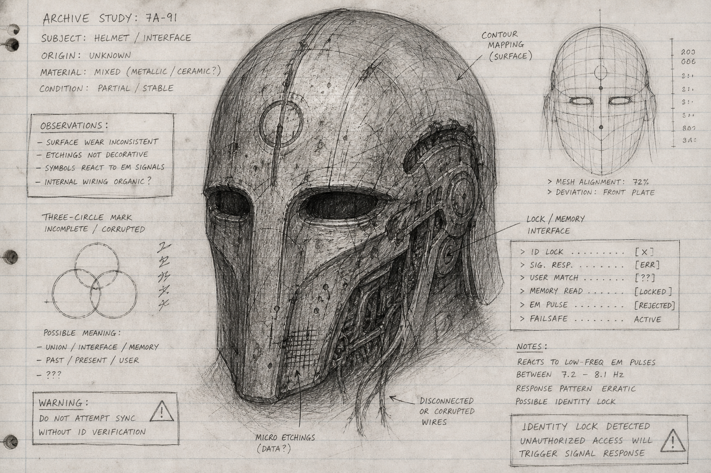

*Aerit guardian helmet: identity-lock interface study.*

Something beeped.

Lars disliked it immediately.

Beep.

Beep.

Beep.

The sound had the personality of hospital equipment: smug, repetitive, convinced of its own importance. He tried to open his eyes and discovered someone had replaced reality with a blurred white rectangle.

Voices moved around him.

One was Grim.

One was deeper, rougher, unfamiliar and familiar at the same time.

One was a machine that sounded like it would report a fire in the same tone it used to announce soup.

Lars closed his eyes again.

This proved to be a mistake because the beeping remained.

The second time he woke, the world had improved enough to include edges.

He lay in a medical bed in a white room with black equipment columns and pale blue diagnostic layers moving silently above him. The walls were smooth, rounded, and much too clean. No stains. No cracked paneling. No old Rim smell. The air was perfect. Lars distrusted perfect air.

Grim sat beside the bed holding a cup of coffee.

Not drinking it.

Holding it like a threat.

"If that is for me," Lars said, "you are forgiven for whatever expression you are making."

Grim's head tilted. "You cannot see my expression."

"I can hear it."

"You collapsed."

"People do that."

"For forty-eight hours?"

Lars blinked.

"That seems excessive."

"We had to keep you sedated," said the rough voice.

Valdrun stood near the foot of the bed.

Free, now. Tall. Very tall. Blue-pale skin, long limbs, broad shoulders, and visible integrated structure along his neck and left side where biological tissue met engineered material without apology. Not a robot. Not a man in the ordinary sense. Something half human, half machine, and entirely comfortable being terrifying in a quiet room.

He looked like a Viking who had survived a starship factory accident.

"You," Lars said.

"Me."

"You were under a power thing."

"Power distributor."

"I rescued you."

"You did."

"Good."

Valdrun smiled.

Grim handed Lars the coffee.

Lars took it with both hands. His fingers trembled slightly. He pretended they did not.

"What hit me?" he asked.

"Radiation, chemical contamination, local field interference, and your own nanomedical systems attempting to reconcile a neurological lock with emergency repair demands," Valdrun said.

Lars lowered the cup.

"My what?"

Pain began at the base of his neck.

Not a warning this time.

A guillotine being raised.

Grim leaned forward. "Careful."

Valdrun nodded once. "Right. We do not push through the lock verbally."

"I would appreciate everyone not discussing my body like it has unauthorized aftermarket parts."

Grim and Valdrun exchanged a look.

Lars pointed at them.

"No meaningful looks."

"We are in a room full of meaning."

"Then look at the wall."

Ödesvaka floated near the ceiling, half in shadow, symbols moving across its spherical body.

"Captain medical stability at seventy-two percent," the drone announced.

"Do not call me captain."

"Command title suppressed."

"Thank you."

"Suppression logged."

"Everything is logged with you."

"Correct."

Lars drank coffee and tried to assemble the last clear memory.

Then nothing.

"Why did the chamber affect Grim faster than me?" Lars asked.

Grim answered before Valdrun could. "The field damaged synthetic control loops and non-biological quantum substrates. My biological core tolerated the edge, but my motor coordination started desynchronizing. Deeper in, I would likely have become modern sculpture."

"Bad sculpture."

"Probably."

Valdrun sat in the chair opposite Grim. The chair shaped itself to him. Lars noticed that and tried not to think about how natural it looked.

"The accident began forty-nine years ago," Valdrun said. "A distributor failure in the auxiliary chamber. It should have been routine. A local mechanical collapse, toxic outgassing from damaged insulation layers, and a field harmonic from the power grid that disabled maintenance robotics. I was able to prevent cascade failure, but the distributor pinned me before I could clear the chamber."

"Forty-nine years under a machine."

"Yes."

"That sounds boring."

"Deeply."

"Why didn't you signal someone?"

"I did. Locally. The station could not risk external transmission under watch-state. Too many hostile receivers near the galactic rim. Radio would spread and die after a few light-years. Tightbeam paths were blocked or unsafe. The only vessel in this facility able to cross the required distance quietly was locked under your command envelope."

"My command envelope."

"Yes."

Pain pressed.

Lars took more coffee.

"Convenient."

"Inconvenient for me."

"Fair."

Valdrun leaned forward. "Your arrival was not random."

Lars raised a hand. "If you are about to say destiny, I will throw this very expensive coffee at you."

"Good. Destiny is a lazy word."

Lars lowered his hand slightly.

"Continue."

"There are systems that can bias probability without controlling choice. Signals too weak to be orders. Pattern nudges. Cognitive resonance through nanoscale communication, memory locks, old navigation habits, stress responses. You felt urgency because parts of you had enough information to know where to go, but not enough permission to explain why."

That was better.

Still horrible.

But better.

"So not fate," Lars said.

"No. Engineering."

"I hate when engineering does psychology."

"It hates you back," Grim said.

Lars looked between them. "And the headache?"

Valdrun's expression softened.

"A safeguard. You were not meant to think directly about certain memories until you returned to a proper node."

"Hypnosis."

The word came from Lars's own mouth.

The room froze.

The pain rose, then stopped.

Not gone.

Paused.

Valdrun watched him carefully.

"Yes."

Lars expected the migraine to crush him.

It did not.

Instead a thin line of memory opened: a room like this one, but larger; seven adults standing in a circle; a woman with dark hair and star-bright eyes; someone laughing because the plan was both brilliant and appalling.

Then the line closed.

Lars exhaled slowly.

"I don't want the whole explanation yet."

"Wise," Valdrun said.

"I want the practical version."

Valdrun stood and crossed to a device in the center of the medical room. It had been folded into the floor when Lars first woke. Now it rose in three clean arcs: a chair, a halo-like frame, and a set of optical emitters that glowed in wavelengths that made Grim adjust his eyes again.

"This can remove the lock in stages," Valdrun said. "Not all at once. Your body just survived a bad interaction between the lock and emergency repair systems. If we leave it as is, the next shock could kill you or scramble memory access worse than death."

"Worse than death is a strong sales pitch."

"You have died before."

Silence.

Grim stopped moving.

Lars looked at Valdrun.

"That was not the practical version."

"No," Valdrun said. "But it is the part that explains why I am not asking."

The room seemed too bright.

Lars's hands tightened around the coffee cup until the material warned him with a soft tone.

"How many times?"

"Not now."

"You just dropped dead-before on me and now you're rationing?"

"Yes."

Lars almost laughed. It came out wrong.

Grim spoke quietly. "Lars."

"I know."

He swung his legs over the side of the bed. The room tilted. He waited until it stopped.

"If this chair turns me into a religious person, I am blaming both of you."

"It will not," Valdrun said.

"If I start speaking in riddles?"

"We sedate you."

"Good protocol."

He stood, took one step, and nearly sat down by accident. Grim moved to help, then stopped when Lars glared.

"I am fine."

"You are seventy-two percent stable," Ödesvaka said.

"No one asked the ball."

"Logged."

Valdrun helped him into the chair without making it look like help, which Lars appreciated and resented. The material adjusted around his back. The halo lowered over his head but did not touch him. Pale blue patterns formed in the air, layered with ultraviolet structures Grim could barely track and Lars could see too well.

"Look at the center," Valdrun said. "Do not chase memories. Let the system map the lock first."

"How does it work?"

"Neural phase alignment, memory index verification, controlled suggestion reversal, nanomedical synchronization."

"That sounded almost respectable."

"It is respectable."

"Then why does it look like a dentist chair designed by a cult?"

Grim said, "Because you are frightened."

Lars looked at him.

Grim did not soften it.

For once, Lars did not answer.

The pattern began to move.

At first it was only light. Then timing. Then compression. The emitters pulsed in ratios that did not repeat but never became random. His breathing tried to follow them. His pulse corrected. Somewhere in his blood, systems he did not remember owning answered.

The headache changed shape.

It had been a wall.

Now it became a door.

The first thing through was not grand.

Not Lyra.

Not war.

Not ancient secrets.

It was a smell.

Fresh bread in a station corridor.

Someone's hand ruffling his hair.

A voice: "Laurðinn, if you rewire the nursery lights again, at least make them stop blinking before Valdrun sees."

Then another memory slammed into place.

He was small, running along a white corridor on Station Zero.

He was not from Stockholm.

He had never been from Stockholm.

His eyes opened.

The medical room returned.

Valdrun stood beside the chair, face grave.

Grim's metal hands were clenched.

Ödesvaka hovered motionless.

Lars tried to speak.

For once, no joke arrived first.

"Station Zero," he said.

Valdrun nodded.

"Your birthplace."

Lars looked at his hands.

They were still his hands.

That seemed unlikely.

"How old am I?"

Valdrun did not look away.

"Six hundred and forty-one."

The answer passed through Lars like cold water.

Somewhere far behind him, a fashionable idiot with yellow sunglasses and too much money fell silent.

The man in the chair remained.

He took one breath.

Then another.

"I need," Lars said slowly, "a much stronger coffee."

Grim made a sound that was almost relief.

Valdrun smiled.

"That, at least, I remember."

## Chapter 6: Stronger Coffee

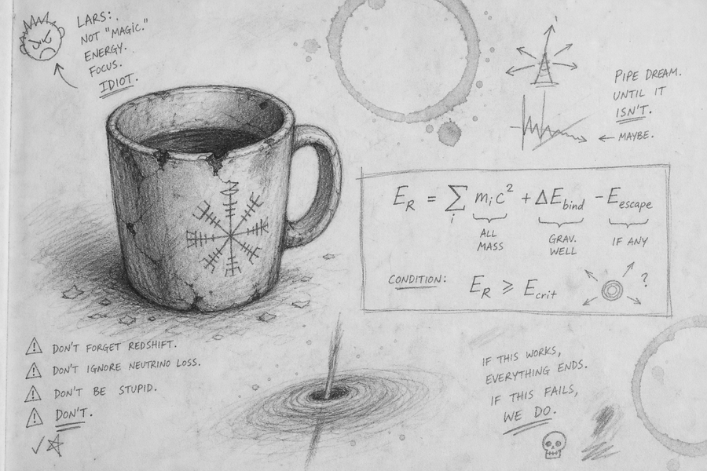

*Coffee margin notes: less theory, more movement.*

The stronger coffee arrived in a cup that looked too elegant for what it contained.

Lars took one careful sip and immediately forgave the cup.

"That," he said, "could restart a dead moon."

"It has restarted you before," Valdrun said.

Lars held up one finger. "We are limiting the amount of before in this conversation."

"Reasonable."

"Also the amount of dead."

"Less reasonable, but noted."

Grim stood near the medical room's wall display with four diagnostic layers open in front of him. Station Zero had given him access to Lars's live medical telemetry after Valdrun authorized it and Lars complained for six straight minutes. Grim had then spent three more minutes complaining about the interface being too good.

The display showed Lars as a translucent figure surrounded by cellular activity, neural synchronization bands, blood chemistry maps, and several layers Grim had labeled unacceptable weirdness.

"I can see that label," Lars said.

"It is accurate."

"Medical terminology has collapsed since I was thirty."

Valdrun folded his arms. "You were never thirty."

Lars looked at him.

Valdrun sighed. "You believed you were around thirty."

"Your current cover identity was designed to pass casual scrutiny. Birth records, education fragments, social media history, financial trails, medical records. Stockholm was useful because your surface accent and habits already leaned Swedish."

"Surface accent?"

"You were raised with several languages here. Galactic Swedish became dominant later, for obvious historical reasons."

"I remember Stockholm."

"You remember inserted connective tissue. Not all of it is false. Some is drawn from actual stays on Earth and in Swedish habitats. The lock did not simply erase and replace. It compressed, braided, and redirected."

Lars drank coffee.

That was better than answering.

The medical chair had given him one clean fact and a thousand dirty implications. Six hundred and forty-one. Born on Station Zero. Not from Stockholm. His name had been Laurðinn before it became Lars Odin, which sounded like someone had taken an old thing and filed the dangerous edges off.

He did not feel six hundred and forty-one.

He felt tired, hungry, irritated, and possibly under-caffeinated.

Apparently some truths lacked theatrical ambition.

"How much is still locked?" Grim asked.

Valdrun looked to the diagnostic display. "Most of the autobiographical chain. The first stage restored identity anchors: birthplace, age, primary name recognition, station familiarity, and enough medical access to stop his own systems fighting the lock."

"So I know who I am," Lars said, "but not what the idiot did."

"A fair summary."

Valdrun crossed to the wall and opened a new display. It showed Station Zero in layered geometry: hangars, medical rings, habitat districts, manufacturing zones, archives, power loops, hidden docks, and the damaged auxiliary chamber now marked amber instead of red.

"This place," Valdrun said, "is Arkology Zero. Station Zero is the old public translation. It sits a few light-years into the KBC Void, but not in ordinary space the way The Rim does. The outer approach you saw was only the coupling surface. The real structure is folded inside a spacetime bubble."

"That explains the rude windows."

"It explains why external observers have never mapped us, why conventional signals fail, and why only certain ships can enter without tearing themselves into interesting vapor."

Lars looked at the map.

It was too large. Not city-large. Civilization-large. Not in population now, maybe, but in intent. A place built by people who expected time to be an engineering parameter.

"How many are here?"

Valdrun's face changed.

Not much.

Enough.

"Awake? Now? Me, Ödesvaka, the station intelligences, and some limited biological cultures in preservation. You and Grim arrived from outside. Most residential sectors are empty or in conservation."

"Empty because everyone left?"

"Because everyone hid."

The word hid did not trigger the old migraine.

That almost made it worse. The lock had stopped punishing him, which meant the words could get all the way in.

Lars set down the coffee.

"Practical version."

Valdrun nodded. "In the 2180s, Lyra initiated Alpha Fourteen. The goal was survival. Not conquest, not retreat from responsibility, not some dramatic moral purity. Survival. Our numbers were too small, our technology too desirable, and the galaxy had begun doing what the galaxy always does when someone finds a lever: every tyrant, oligarch, sect, and military cult wanted to pull it."

"So you made people forget."

"We made ourselves forget. Everyone except seven guardians remained under continuity exemption. The others were dispersed into ordinary civilization with layered identities and hidden triggers. They could live, work, adapt, and avoid exposing what they were."

"What we were."

"Yes."

The word landed.

Not painfully.

He let it remain.

"The seven guardians stayed awake," Valdrun continued. "Not rulers. Keys. Maintenance of the hidden nodes, dehypnotization systems, memory restoration, emergency activation. We delegated constantly. Moved constantly. Avoided central command."

"Who?"

Valdrun hesitated.

Lars leaned back. "If that hesitation is for my health, I dislike it but approve."

"It is. Names carry memory weight. Some will be easier after the next stage."

"Give me the ones I already stepped in."

"Lyra Vargstjärna."

The name did not hurt.

It rang instead.

Far away.

"Founder," Valdrun said. "First carrier of the Pluto nanobot line."

Grim's lenses brightened, but he did not interrupt.

"Your mother and father," Valdrun continued. "Also guardians. Their names are not for this stage."

Lars's fingers curled around the cup.

"Alive?"

"Unknown."

The word was clean and brutal.

Lars nodded once.

"You," he said.

"Me."

"Vigor."

Valdrun's eyebrow lifted.

Lars felt, absurdly, pleased with himself.

"He wore a false beard," Lars said. "No real farmer with that much defensive infrastructure gives away Xaltor X without knowing exactly who is sitting at his table."

"Vigor Hallman is one of the seven."

"I hugged a guardian while carrying strategic groceries."

"That sounds like him."

"And two more?"

"Later."

"Fine."

Grim enlarged part of the station map. "Why did Vigor not come here if he is awake?"

"He likely did not know I was trapped. Station Zero's external transmission policy under watch-state is extremely restrictive. After the chamber accident, Ödesvaka could not authorize a broad signal without my command, and I could not reach a command surface. Havets Sista Sång was under Lars's old command envelope."

"That is bad redundancy," Lars said.

Valdrun's mouth tightened. "Yes."

"Not mildly bad. Historically embarrassing bad."

"Yes."

"Good. As long as we agree."

"We have had forty-nine years to agree."

Lars stood too quickly, regretted it, and pretended not to. The medical display complained. Grim looked ready to do something helpful and therefore irritating.

"So," Lars said, "Black Hole B-7 attacks me on The Rim. Vigor gives me poison whisky and beef. One word from Grim's old fragments nearly splits my skull. I leave for the Void. We find Station Zero. I unlock an invisible ship. We rescue you from a forty-nine-year engineering scandal. I learn I am six hundred and forty-one, not Swedish in the way I thought, and possibly full of unauthorized machines."

"Mostly correct," Grim said.

"Mostly?"

"You are still Swedish in several historically meaningful ways."

"And your machines are probably authorized by you."

"I hate that more."

Valdrun watched him with an expression Lars did not have a category for. Grief, maybe. Relief. Amusement. The tired affection of someone who had known him long enough to be unsurprised by his worst habits.

That was one of the hardest parts.

Being known by a stranger.

"Why now?" Lars asked. "Not destiny. Not poetry. Why did the signal spike now?"

Valdrun gestured to the wall. The station replaced the map with a slow-moving model of the Milky Way: traffic corridors, conflict zones, collapsed colonies, energy consumption clusters, signal noise, corporate sovereignties, war fronts, quarantine regions, slave routes hidden under euphemistic logistics tags, and several expanding territories marked with Black Hole B-7 influence.

The galaxy looked sick.

Not dying. Not yet.

Sick the way an overgrown machine became sick: too many dependencies, too much appetite, too many people profiting from fragility.

"Lyra expected activation thresholds," Valdrun said. "Not dates. Conditions. When enough indicators crossed, hidden systems would begin biasing dispersed Aerit cognition toward return paths."

"Indicators."

"Consolidated violence. Artifact trafficking. Searches for nanobot carriers. Civilizational complexity dependency. Resource loops breaking despite abundance. Factions hunting for what they cannot understand."

Black Hole B-7 flickered on the map.

Lars felt cold.

"They wanted my blood."

"Probably."

"Can they use it?"

"Not the way they think."

"That is not reassuring."

"It was not meant to be."

Grim folded his metal arms. "If they obtain active nanobots, what happens?"

"Most likely? Their hosts die, their labs contaminate themselves, and they destroy data faster than they gather it. The nanobot line does not simply obey extraction. It adapts to a host. It negotiates with biology. Without the correct genetic and neural environment, it becomes inert, defensive, or catastrophic."

"So futile," Lars said.

"Yes."

"And still dangerous."

"Extremely."

Lars looked at the map again.

The word he had avoided since Vigor's farm now sat in the room like a tool on a table.

Återviens.

He did not say it yet.

Valdrun saw him not saying it.

"We need the archives," Valdrun said. "Not all of them. One thread first. Lyra left records for staged reactivation. Hard records. Holojournals. Simulations. Indexes. No faith required."

"Good."

"Some are encoded outside ordinary human visual range."

Grim looked offended. "Again."

"You can recalibrate."

"I know. I dislike being late to the visible universe."

"Then hurry up," Lars said. "Apparently we are saving civilization from bad architecture."

Valdrun smiled.

"You are taking this well."

"No," Lars said, picking up the coffee again. "I am taking this with caffeine."

## Chapter 7: Pluto Protocol 9

The archive lay below the medical ring and above the memory vault, which was the kind of sentence Lars preferred not to examine.

They reached it through a lift that did not move so much as renegotiate location. One moment the door sealed in the medical corridor. The next it opened into a chamber shaped like a shallow amphitheater, all black glass, white stone, space-gray ribs, and pale blue filaments suspended in the air like frozen rain.

There were no shelves.

No drives.

No dramatic crystal library.

Just the chamber, the filaments, and a central table grown from the floor.

"Where is the archive?" Grim asked.

Valdrun pointed around them. "Here."

"I was afraid of that."

The filaments brightened as Lars stepped forward. Each one resolved into dense encoded structure: metadata, checksum trees, quantum error correction patterns, spectrum keys, access histories, emotional hazard ratings, medical warnings, and content maps. Most of it appeared in light no baseline human could see. The visible blue glow was only leakage.

Grim recalibrated his optics for the fifth time that day.

"I am beginning to resent eyes as a concept," he said.

"Install better ones," Lars said.

"I did."

"Install even better ones."

"That is always your answer."

"Because it is usually correct."

Valdrun stood at the central table. "We start with Pluto Protocol 9."

Lars stopped.

Pluto.

The word did not hurt. It pulled.

A cold world at the edge of the old Solar System. A buried object. A woman touching something she did not yet understand. The beginning, or one of the beginnings.

"How old is the record?" Lars asked.

Valdrun brought up the metadata.

"Original capture: 2032, Pluto artifact zone, ISEA isolated module four. Transcoded and annotated several times. This copy was sealed into Station Zero's staged reactivation archive after Alpha Fourteen began."

Lars did the math because his mind did math the way lungs did air.

"Seven hundred and forty-two years."

"Approximately, depending on which clock standard you use."

"Let's not use the depressing one."

The chamber dimmed.

A holojournal formed above the table.

At first it looked like a weak blue ghost, exactly the sort of thing Lars did not want it to look like. Then his eyes adjusted and the sensor layers resolved: temperature noise, radiation scatter, camera correction, nanobot emission overlays, microtremor analysis, neural stress markers inferred later from posture and voice. Not a ghost. A recording, rebuilt with obsessive fidelity from multiple instruments and later annotated by people who distrusted single-source evidence.

Good.

He could work with that.

The image showed a small room under harsh light. Ice dust clung to the seams of equipment cases. A pressure door sat behind the subject, rimed white at the edges. Beyond a narrow observation slit lay a darkness that felt cold even in reconstruction.

Lyra Vargstjärna stood beside a workbench.

Lars had expected myth.

He got a tired scientist in a thermal suit with cropped dark hair, sharp cheekbones, and eyes that moved too quickly.

That was worse.

More real.

She looked into the recorder.

For a moment, nobody in the archive spoke.

Then the old recording began.

"Pluto artifact zone. Isolation module four. ISEA internal log. Lyra Vargstjärna recording. Timestamp: mission day... irrelevant. Local clocks have drifted twice since the last incident. Use the corrected packet header."

Grim leaned slightly toward Lars. "I like her."

"Shh."

Lyra rubbed her face with both hands. "This began with contact. I touched the object because I thought the outer layer was inert. That was wrong. It responded."

The holojournal displayed a second layer beside her: microscopic footage, later reconstruction, particles moving through blood plasma.

"We found the first machines in my bloodstream thirty-seven hours later. I am using the word machines because nanobots is both imprecise and emotionally unhelpful. They did not behave like infection. They did not replicate blindly. They mapped. Waited. Adjusted."

She paused.

Her eyes flicked to something off-screen.

"I am stronger. Reflex tests are outside human range. Visual response has expanded into ultraviolet and adjacent bands. Radiation damage from yesterday's suit breach has repaired faster than current medicine can explain. I held breath for twenty-six minutes before terminating the trial because Dr. Harrow threatened to sedate me."

Lars felt his own skin prickle.

Grim looked at him, but said nothing.

Lyra continued. "The voices are not voices. I need that in the record. No auditory hallucination. No linguistic content at first. More like weighted probabilities arriving as intuition. Images. Structural relationships. Sometimes a solution appears before I know the question."

Lars stared at the recording.

His mouth had gone dry.

"Oh," Grim said softly.

"Shut up," Lars said.

Grim did.

The recording shifted to a data overlay: superconducting loops, quantum noise irregularities, correlations beyond known communication limits.

"The artifact is not just an object. It is a node. We thought the unknown civilization had left a machine on Pluto as a test or beacon. That may still be partly true. But the machines inside me are not merely transferring stored knowledge. They are attempting handshake with something larger."

Lyra smiled then, without humor.

"I hate that sentence. It sounds like religion. It is not. We have signal correlations, nonlocal timing anomalies, and enough reproducible data to make three physicists angry."

Lars exhaled.

"Thank you," he murmured.

Valdrun glanced at him.

Lyra looked down at her hands in the recording.

"The immediate problem is practical. Earth-side actors already know we found something. Corporate probes, state military assets, religious lunatics pretending to be environmentalists, and at least one private fleet are maneuvering toward Pluto. They do not understand what this is. That makes them more dangerous, not less."

The room behind her flickered. An alarm flashed red, then stopped.

"If this line continues, the artifact will become a prize. If it becomes a prize, the worst people in the system will define the next century."

The recording inserted later annotations: Earth Reclaimers, early technooligarchic coalitions, classified military intercepts, failed sabotage attempts.

Lyra's voice became quieter.

"So we need three tracks. Survival here. Controlled replication of the machines only to vetted team members. And the search for the spacetime distortion beyond Pluto's orbital plane. The artifact points toward something, but not like a map. More like a key changes the shape of the lock around it."

Grim whispered, "Portal."

Valdrun did not correct him.

Lyra leaned closer to the recorder.

"If anyone is watching this centuries from now, do not assume we understood it. We did not. We were frightened, exhausted, and moving too fast because the alternative was letting idiots with flags and quarterly targets touch a million-year-old system with dirty hands."

Lars smiled despite himself.

Lyra's expression softened for the first time.

"But I think the machines are not hostile. That is not trust. That is a working hypothesis. They cooperate with the host. They preserve function. They improve survival. They appear to prefer minds capable of doubt."

She looked away, listening to someone outside the frame.

"Yes, Pierre, I am putting that in the log. No, your objections are not more important because you say them in French."

Grim made a delighted sound.

Lars pointed at him without looking.

The recording continued.

"Final note for this entry. We are making decisions too quickly. That may be unavoidable, but I want the record to show the danger. The base cannot depend on one reactor, one food loop, one air plant, one authority chain, or one person who happens to be infected with alien machines and too tired to sleep."

The annotation layer marked this section with later tags: Pluto survival doctrine, pre-Heliostat resilience instinct, Lyra private framework.

Lyra's tired face hardened.

"For now this is not philosophy. It is plumbing. If one valve fails, we breathe. If one greenhouse dies, we eat. If I die, the others continue. If Earth cuts supply, Pluto does not. We can argue about grand principles when nothing is actively trying to kill us."

The recording ended.

The holojournal collapsed back into pale blue filaments.

The archive chamber returned.

For a while, nobody spoke.

Lars stared at the empty space above the table where Lyra had been.

Not a goddess.

Not a prophet.

A scientist on Pluto, tired and afraid and angry at idiots.

That, he trusted.

Grim broke the silence first.

"She reminds me of you."

"That is deeply unfair to her."

"She also complained about French people under strain."

Valdrun rested both hands on the table. "That log is before Heliostat. Before the Kalari. Before the Rakh'Na attack in 2083. Before the word Återviens. It is not the doctrine. It is the strain that made the doctrine possible."

Lars looked at the filaments.

"Show me the later branch."

Valdrun studied him. "You just learned your age."

"Yes."

"You just watched the beginning of everything that made you possible."

"Also yes."

"You need rest."

"I need a plan."

Grim turned from the archive display. "For once, I agree with both of you, which is unpleasant."

Lars looked at him.

Grim lifted a metal finger. "You need rest. We need a plan. These are not mutually exclusive. I can run archive indexing while you perform the disgusting biological ritual called sleep."

"I dislike sleep."

"You dislike being unconscious. You just did forty-eight hours of that and still found time to complain."

"Valid."

Valdrun opened another layer of the archive. "The later branch contains Lyra's reactivation criteria. Threshold models. Guardian contact protocols. Known hidden nodes. Risk estimates for hostile acquisition of nanobot carriers."

"Black Hole B-7."

"Among others."

"Earth Reclaimers?"

"Still present in mutated forms."

"Syren Collective?"

Valdrun's face became grim.

"Worse than present."

Lars rubbed his eyes.

The lock was no longer a wall or a door.

It was a room full of boxes, each labeled in a language he used to know.

"Fine," he said. "Grim indexes. Valdrun sleeps or repairs or whatever half-viking station ghosts do after forty-nine years under furniture. I rest for two hours."

"Six," Grim said.

"Three."

"Five."

"Four and coffee staged at the bed."

Grim considered. "Acceptable."

Ödesvaka, which had followed them silently into the archive, rotated in the air.

"Rest interval logged."

Lars looked up at it. "If you wake me with beeping, I swear by all known physics I will turn you into a lamp."

"Wake protocol adjusted to non-beeping."

"Good."

Valdrun laughed.

It was the first full laugh Lars had heard from him.

The sound unlocked nothing.

It simply sounded familiar.

That was enough for one day.

## Chapter 8: The Barge

Lars woke to wind.

This was unacceptable.

He opened one eye and found himself under a hard yellow sun, lying on a narrow bunk inside a wooden cabin that smelled of tar, damp rope, old coffee, and engine oil. Something rattled above him. Water slapped against a hull. A gull screamed with the confidence of an animal that had never paid rent.

For three seconds he was sure Station Zero had drowned.

Then the ceiling dissolved into a polite line of pale blue text.

SIMULATION CHAMBER 3. REST INTERVAL COMPLETE. NON-BEEPING WAKE PROTOCOL SUCCESSFUL.

Lars stared at it.

"Ödesvaka."

A small spherical drone hovered outside the open cabin door, backlit by sunlight.

"Yes."

"Why am I on a boat?"

"Rest environment selected from recovered comfort index."

"Comfort index."

"Correct."

"This boat is shaking."

"Historical watercraft did that."

"The sun is stabbing me."

"Historical suns did that."

"I asked for coffee staged at the bed."

A small hatch opened beside the bunk. A metal arm extended with a steaming cup.

Lars took it.

"You live," he said.

He sat up slowly. His body felt better. Not good. Better. The chemical weakness from the chamber had retreated into the background, and the strange internal hum of his repaired systems had steadied. His mind still felt overcrowded, but the old lock-trigger pain was gone. The forbidden words no longer struck him. They waited.

That was almost more frightening.

He stepped out of the cabin onto a barge in the middle of Mälaren.

Or a reconstruction of Mälaren. A very good one. The water glittered under the sun. Wind dragged small waves across the surface. The shoreline sat low and green in the distance. Rigging knocked against metal. The barge's engine vibrated through the deck with old industrial stubbornness.

Grim stood at the bow wearing a captain's hat.

Not a naval officer's hat.

A cheap white tourist captain's hat with gold plastic braid.

Lars stopped.

"No."

Grim turned. "Good morning."

"You look like you sell shrimp sandwiches to retirees."

"Is that prestigious?"

"No."

"Then it is disguise."

Valdrun emerged from the wheelhouse carrying a glass filled with a gray liquid and black floating lumps.

Lars looked at it.

"If that is medicine, I choose death."

"Breakfast," Valdrun said.

"Then I choose war."

Valdrun glanced around the barge. Wind tore at his dark coat. In the sunlight his blue-pale skin looked even less human, though the ridiculous setting somehow made him more believable. "Is this a memory?"

"Apparently."

"A good one?"

Lars watched the water move.

He remembered nothing specific. No childhood on Earth, no real barge trip, no single clean event. But the scene carried a composite comfort: yellow sunlight, engine vibration, cold water, coffee strong enough to make moral arguments. Maybe his cover life had borrowed from actual visits to Earth. Maybe his mind had chosen old Sweden as a quiet place to store things too large for sterile rooms.

"Good enough," he said.

They sat at a bolted metal table on deck. A planning model appeared above it, projected by the simulation rather than placed there. It showed the Milky Way as a slow-turning cloud of lights, colored not by politics but by risk: red for active predation, amber for systemic fragility, blue for hidden nodes, green for self-sufficient clusters.

There was too little green.

Grim removed the captain's hat and set it beside the model with solemnity.

"I completed the initial archive index."

"While I slept?"

"While you performed tactical unconsciousness."

"Findings?"

Grim lifted one finger. "One. Lyra's reactivation criteria have crossed the first threshold. Possibly the second, depending on how pessimistic we are about Syren Collective fragmentation."

"Pessimism is just optimism with maintenance records," Lars said.

"Then threshold two."

Valdrun drank the gray liquid. Lars tried not to watch the lumps.

"Suspected carriers?"

"Likely hypnotized Aerits."

The word sat in the simulated sunlight.

No pain.

Only weight.

Lars nodded. "Three?"

"Three. Vigor sent a delayed packet after we left The Rim. He knows you entered the Void. He does not know whether you reached Station Zero. The packet contains sixteen jokes, two warnings, one invoice for elderflower cordial Grim added without authorization, and a guardian-authenticated offer of assistance."

"I authorized the cordial," Grim said.

"You are not fiscally sovereign."

"I have needs."

"You have taste receptors and poor impulse control."

Valdrun smiled into his horrible drink. "Vigor always did prefer cover identities with kitchens."

"That farm," Lars said. "It was not just a farm."

"No. It was a working example."

"Of Återviens."

He said the word for the first time.

It felt old in his mouth.

Not mystical. Not sacred. Dense. A technical term that had survived long enough to acquire gravity.

The planning model changed. Green points brightened where decentralized systems still functioned: independent arkologies, hidden farms, mobile habitats, autonomous AI clusters, small colonies with closed-loop energy and food systems, cultures that had remembered restraint without remembering who taught it.

"Lyra's term," Valdrun said. "Or one of them. It began as a resilience index. Then a design framework. Then a cultural infection, deliberately released in stories, engineering standards, rituals, jokes, old songs, school lessons, food systems, architecture, and boring maintenance manuals."

"The boring manuals survived best," Grim said.

"As they should," Lars said. "Civilization is mostly maintenance."

Valdrun pointed at the model. "Återviens measures whether a system can absorb damage, shed complexity, restore function, and continue without becoming a centralized monster. It is not about maximal efficiency. It is about survivable sufficiency."

"Jevons," Lars said.

The model shifted to a historical overlay: coal, oil, fusion, antimatter, computation, simulation economies, habitat megastructures, energy markets. Each efficiency gain lowered immediate cost and increased total dependency. The curve did not look like progress. It looked like a feeding pattern.

"The old paradox scaled up," Grim said. "When energy became cheap, the galaxy did not become free. It built larger cages. Megastations dependent on synchronized supply chains. Gas giant cities requiring constant thermal management. Simulated luxury worlds using star-scale energy budgets to keep bored aristocrats entertained. Private defense grids so complex they need wars to justify their own maintenance."

"Aphex will not enjoy that last part."

"Aphex is on the chart."

"Of course it is."

Valdrun leaned forward. "Lyra's point was not that building is wrong. She built more than any of us. The point is that every added layer must justify its complexity cost. Every convenience must be measured against dependency. Every centralization must have a way to break apart without killing the whole."

Lars watched the red zones pulse.

"And the galaxy ignored her."

"Some did. Some could not hear the lesson without hearing the name behind it. Some remembered the lesson as culture and forgot the source. That was partly intended."

"Because if they remembered Aerits, they would hunt us."

"Yes."

"And now they are hunting us anyway."

"Some are."

Grim expanded the Black Hole B-7 data. "They are structurally incapable of using what they seek. Their internal command culture destroys distributed knowledge. Penal hierarchy, secrecy, fear, duplicated surveillance, loyalty tests. Any useful understanding collapses before it can spread. They are anti-Återviens in organizational form."

Lars sipped coffee and looked at the red nodes.

"So if they got my blood, the nanobots would not give them a golden empire."

"No," Valdrun said. "They would get dead researchers, corrupted hosts, containment failures, and enough partial results to keep trying."

"A self-fueling stupidity loop."

"Exactly."

"Technical term?"

"It is now," Grim said.

The barge pitched in the simulated wind. Lars caught an empty cup before it slid off the table. The motion was automatic, but not preternatural now. Just him. Whatever him meant.

"What is the plan?" he asked.

Grim moved the model through three layers. "Immediate: repair Station Zero's auxiliary chamber, re-enable safe communication paths, inform Vigor without exposing the node, and move the Fastulv inside the bubble before The Rim traffic logs become interesting."

"Good."

"Near term: complete your staged unlock, verify your memory integrity, establish guardian contact with the remaining five known channels, and identify hypnotized carriers under active threat."

"You said five known channels."

Valdrun answered. "There are seven guardians. Lyra's channel is not a normal channel anymore. Your parents' channels are dormant but not confirmed dead. Vigor is reachable. I am here. The remaining two are buried behind conditions I cannot safely open until your next stage."

"That is irritating."

"Yes."

"I assume it is also wise."

"Usually."

Lars looked at the long-term model. It was less a battle plan than an immune response: wake hidden nodes, reinforce vulnerable carriers, reduce dependency in selected colonies, seed better cultural patterns, expose hostile acquisition networks, avoid dramatic centralization, and absolutely do not announce the return of a half-mythical enhanced human lineage with ancient nanotechnology.

"We are not building an empire," Lars said.

"No."

"We are rebuilding a nervous system."

Valdrun's eyes sharpened.

Grim looked up from the model.

Lars frowned. "What?"

"That phrasing appears in three Lyra archive branches," Grim said.

"Of course it does."

"You are doing it again."

"Being brilliant?"

"Remembering sideways."

Lars watched the simulated water. The phrase had arrived without pain, without fanfare. It had simply been there.

He could live with that.

"Next archive," he said.

"After food," Grim said.

"I had coffee."

"Coffee is not food."

"That is a controversial position."

Valdrun stood. "The simulation can produce lunch."

Lars eyed the gray drink. "If lunch floats, I leave."

## Chapter 9: Threshold Models

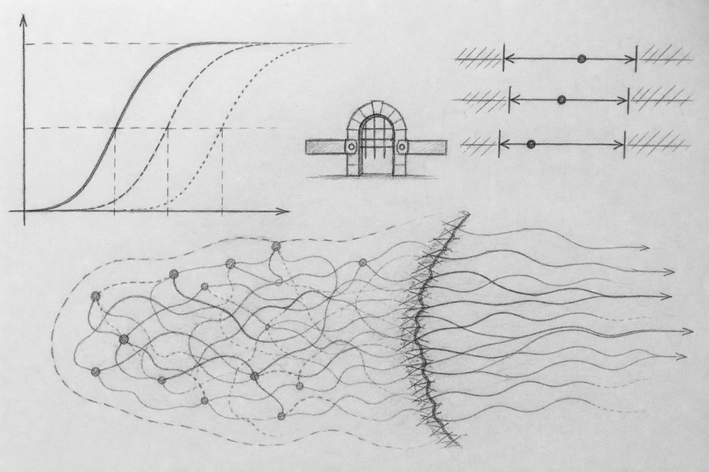

*Threshold models and partial mindfield boundaries.*

Lunch did not float.

It was herring, potatoes, crispbread, cheese, butter, and something Grim called historically suspicious but ate anyway after installing a temporary brine-tolerance patch.

Afterward, the barge simulation faded.

Not dramatically. The water lost depth. The sun softened. The deck became a grid, then white floor, then the clean oval of Simulation Chamber 3. Lars preferred the barge, which annoyed him because it meant the machine had been right.

The planning model remained.

Grim had turned Lyra's threshold archives into a layered working board. Each branch showed confidence intervals, source quality, how old the data was, and recommended actions. No glowing prophecy. No chosen-one nonsense. Just models, data, and enough uncertainty to keep honest people awake.

Lars respected that.

He distrusted certainty. Certainty was what idiots used when they ran out of instruments.

"Start with the first threshold," he said.

Grim enlarged a band of amber indicators. "Threshold One: hostile interest in carrier biology. Triggered by artifact black markets, unexplained disappearances of long-lived individuals, abnormal blood-analysis procurement, and pattern-matched attacks like the one on The Rim."

"How many suspected carrier incidents?"

"Seventeen strong matches over the last ninety years. Forty-two weak. Three confirmed by guardian-side metadata. The acceleration is recent, but the pattern is not."

"Confirmed deaths?"

Valdrun looked at Grim.

Grim's voice flattened. "Two."

Lars nodded once.

He did not know them.

That did not help.

"Threshold Two," he said.

The model shifted. Red filaments appeared between corporate sovereignties, paramilitary zones, collapsed colonies, and religious war networks.

"Civilizational overcomplexity," Grim said. "Lyra's later models call it systemic overmaturity. The polite term. The less polite annotations use tumor metaphors."

"Civilizational cancer," Lars said.

Again, the phrase arrived sideways.

Valdrun did not smile this time.

"Systems that cannot simplify keep adding control layers," Valdrun said. "Each layer fixes failures the last one created. Eventually the management structure eats more resilience than it gives back."

Grim highlighted a gas giant megacity in a French-Chinese corporate protectorate. "This habitat ring requires thirty-two synchronized energy imports, fourteen external food streams, two proprietary atmosphere engines, and a legal code so large its judicial AI uses a dedicated moon."

"That sounds expensive."

"It is considered prosperous."

"Naturally."

The model showed one broken energy import. Then a delayed food stream. Then a maintenance strike suppressed by private security. Then riots. Then emergency control layers. Then more dependency.

The habitat did not collapse in the simulation.

It survived by becoming worse.

Lars disliked that more.

"And Threshold Three?"

Valdrun took over. "Guardian reactivation. Not waking all Aerits at once. That would be stupid, dangerous, and exactly the kind of single dramatic gesture Lyra designed against. Threshold Three authorizes finding specific hidden carriers. They can restore local nodes, repair damaged archives, or protect vulnerable networks."

"How many?"

Grim opened a list and immediately blurred most of it. "Medical lock still protects parts of your memory. But from archive indexing and current threat data: initial priority group is nine."

"Nine Aerits."

"Nine likely Aerits," Valdrun said. "Some may not survive full unlock. Some may refuse. Some may have built lives that cannot be broken open casually."

That landed harder than Lars expected.

Six hundred years old or not, hidden superhuman lineage or not, people had lives. Jobs. Friends. Children maybe. Bad habits. Favorite pubs. Debts. Dogs. Cover identities that had become real identities, because time did not care what the paperwork said.

"We ask," Lars said.

Valdrun studied him.

"We do not drag anyone into this because an archive says threshold," Lars continued. "If they are in immediate danger, we protect first. But the unlock is consent-based unless they are dying and unable to choose."

Grim tilted his head. "That was in Lyra's later ethical constraints."

"Good."

"Your phrasing was less formal."

"Also good."

Ödesvaka hovered in from the chamber wall, where it had been pretending not to listen.

"Consent constraint marked as captain directive."

"Do not make it sound grand."

"Directive downgraded to practical rule."

"Better."

Valdrun folded his hands behind his back. "There is one more immediate issue."

"There always is."

Grim expanded The Rim's traffic logs. "Aphex has secured the station sector. Galactic police have opened a formal terrorism inquiry. Black Hole B-7 survivors are absent, which means either none survived, or someone extracted them quickly. The Fastulv's departure vector is filed, but our correction into the Void is suspicious."

"How suspicious?"

"To an idiot, very. To a competent investigator, extremely."

"Can we alter the logs?"

Grim looked offended.

"Can we alter them elegantly?"

"Yes."

Valdrun shook his head. "Do not erase. Erasures attract specialists. Add noise consistent with sensor degradation near the Void, then give Aphex a plausible reason to classify the rest."

"Gabriel Arsenault owes me several billion favors."

"He paid you several billion kronor," Grim said.

"Different column. I understand leverage."

Lars walked around the model, thinking.

No migraine stopped him.

No lock punished him.

That freedom was dangerous. His mind raced into old patterns and new gaps. Missing knowledge felt like holes in a map. His thoughts avoided those places not because pain blocked them, but because the road simply ended. The partial unlock had not made him whole. It had made him aware of what was missing.

Better than blind.

Worse than ignorant.

"We send Arsenault a board-level security advisory," Lars said. "Black Hole B-7 attempted acquisition of Aphex strategic assets, including one director and one experimental weapons platform. That gets him to classify, suppress, and overreact in exactly the useful direction."

"You are the director and the platform?" Grim asked.

"Ragnarrök is the platform. I am not experimental."

Valdrun said nothing.

Lars pointed at him. "No meaningful silence."

"I said nothing."

"Exactly."

Grim added the Aphex action line. "What about Vigor?"

"Send him proof of Valdrun recovery. Minimal packet. Guardian authentication, no station position, no detailed medical logs."

Ödesvaka's symbols flickered. "Approved."

"I was not asking the ball."

"Approval remains."

"And the priority nine?" Valdrun asked.

Lars looked at the blurred list.

"We need the next unlock stage before I touch that list."

Valdrun nodded. "Yes."

"How bad is it?"

"Less physically dangerous than the first. More emotionally difficult."

"That is a terrible trade."

"It restores relational memory."

Lars did not ask what that meant.

He knew enough.

Mother. Father. Lyra. Valdrun. Vigor. Friends. Deaths. His own deaths. Centuries of other people's faces returning to a mind that currently remembered them as blank spaces with gravity.

Grim's voice softened. "We can wait."

"No."

"Lars."

"No. We do not rush blindly, but we do not wait because I dislike feelings."

Valdrun moved to the chamber wall. A medical route appeared, leading back toward the helmet room.

"Then we prepare. Eat first. Hydration. Stabilization scan. Then stage two."

"I just ate historically suspicious fish."

"You need more than fish."

Lars sighed. "Fine. But if the next unlock makes me noble, shoot me."

Grim raised one hand. "Stun or lethal?"

"Stun."

"Good. I was testing."

Ödesvaka rotated gently.

"Nobility contingency logged."

Lars looked at the drone.

"Lamp."

## Chapter 10: Sideways Memory

Stage two began after food, hydration, two stabilization scans, and a formal argument over whether Lars was allowed to bring coffee into a neural restoration procedure.

Valdrun said no.

Grim said no.

Ödesvaka displayed a safety diagram that also said no.

Havets Sista Sång, consulted as an impartial authority, recommended no in language so polite Lars considered it personally insulting.

Lars brought coffee anyway.

The helmet room had changed since the first unlock. Or maybe he could see more of it now. What had looked like a medical chamber was really a layered instrument. Neural phase emitters. Nanomedical synchronizers. Memory index projectors. And several systems that did not touch the brain directly. They measured what the blood-borne machines did when memory moved.

Machines in the blood.

He could think it now without pain.

He still disliked it.

"Relational memory," Valdrun said, lowering the halo over Lars's head. "Faces, trust chains, grief, obligations, old command reflexes. It will not restore everything. But it may reconnect enough that names stop being empty containers."

"If I cry, Grim is forbidden from recording."

"Too late," Grim said.

"Delete it."

"I have not recorded anything."

"I heard the lie in your punctuation."

"You cannot hear punctuation."

"Watch me."

The pattern began.

No migraine.

No wall.

No hammer at the base of his skull.

This time the lock opened like a series of old pressure doors, each one equalizing before the next.

The first memory was Pluto.

Not Lyra's recording. His own memory of seeing the old Pluto logs centuries later, during training. He had still been young enough to think four hundred years sounded impossible. Lyra's early survival notes had been required study. Everyone laughed at the line about arguing grand principles after nothing was trying to kill them.

Then the memory shifted.

2033.

Not through Lars's eyes. He had not been born yet. This was inherited archive memory, shared during later education. Cosmic Pioneer and the modified vessels left Pluto through a hidden spacetime fold. They carried Lyra and the ISEA team away from Earth-side predators and into Heliostat.

The portal did not look like a gate.

It looked like a region where geometry had stopped pretending to be Euclidean.

The memory snapped forward.

Astra Lumara.

A moon under a Saturn-like planet. Its rings cut the sky in pale arcs. Nexus Outpost was half buried in basalt and ice. Ugly at first. Functional. Always growing. Printers ran day and night. Biological labs smelled of sterilant and algae. Reactor rooms shook with prototype fusion assemblies. Robotics bays filled with machines that failed, learned, failed better, and were rebuilt by people whose minds ran too fast for sleep.

GRIN was not a slogan there.

Genetics, Robotics, Information technology, Nanotechnology.

It was breakfast conversation. It was exhaustion. It was someone falling asleep on a crate of polymer muscle while an AI argued with a cloned liver culture. It was Lyra standing in a half-finished lab with frost in her hair. "We are not inventing disciplines," she said. "We are making them stop pretending they are separate."

Dr. Erik Torvaldsson threw a tool across a workbench because a field equation refused to behave.

"The drive is in superposition," he snapped. "It both works and does not work until Lyra looks at it."

Lyra, not looking up from a reactor diagnostic, said, "That is not what superposition means."

Pierre said, "Thank you."

Lyra pointed at him. "And you are not helping."

Someone laughed.

The memory warmed.

The Kalari arrived as light and pattern first.

Not Xal'thror. That was an early human misnaming from bad translation and fear. Kalari came later, after enough contact to learn the sound-shape they preferred. Old, patient, pacifist without being weak. They did not think in command chains. They thought in gardens, weather systems, slow mathematics. Their consensus models made human diplomacy look like children throwing tools.

They liked Lyra.

They distrusted Pierre on principle.

This also made Lars like them.

The Kalari did not give the Aerits answers. They gave them better questions.

Why build one base?

Why route all power through one control hierarchy?

Why treat intelligence as a crown rather than a mycelium?

Why assume a civilization is more advanced because it burns more?

The memory jumped again.

Years passed in fragments.

Nexus Outpost became a network. Then a cluster. Then a pattern exported to small moons, asteroid habitats, ocean caves, mobile workshops, and quiet stations that did not look important from the outside. Fusion systems matured. Energy loops tightened. Early FTL vessels moved from terrifying prototypes to merely dangerous engineering projects. AI commanders became necessary. Relativistic combat and FTL projectiles did not leave room for heroic captains with slow hands.

The first NUKEA precursor appeared in a memory from the 2060s. Not the later corporate consortium. Not yet. It was a licensing shell and reactor standard built to distribute portable fusion and nuclear expertise. No single faction could control the whole stack. Later markets would make it enormous. Later bureaucrats would put logos on everything. But the seed had been an Aerit answer to a simple problem: power systems had to be rugged, modular, repairable, and dull enough that colonies survived when geniuses were unavailable.

Lyra approved the standard only after making the engineers remove three elegant features.

"They make the system clever," one engineer protested.

"They make it dependent," Lyra said.

"But the efficiency gain—"

"Is bait."

That phrase stayed.

Efficiency is bait.

Not always. Not universally. But often enough to be carved into the private engineering jokes of people who had watched cheap energy become expensive fragility.

Another jump.

2070s.

A room on Astra Lumara with Kalari light-structures hanging above a table and human equations fighting for space beneath them. Lyra, older now but not aged, stood beside four other versions of herself.

Not copies in the cheap sense.

Divergent continuities.

Four Lyras grown from necessity, memory backup, risk distribution, and one terrifying fact: one brilliant mind was still a single point of failure. They argued like sisters, colleagues, and one person disagreeing with herself across four timelines.

Lars did not understand how he remembered the scene until the restoration layer tagged it: archived guardian training memory, recorded from Valdrun's perspective.

Valdrun had been there.

So had Vigor, younger, without the beard, eating something from a bowl while pretending not to understand the equations.

Lyra-One said, "The portal network is not the deepest layer."

Lyra-Three said, "We keep treating travel as movement through space. What if the artifact is teaching access, not transit?"

Lyra-Two shook her head. "That sounds like philosophy."

Lyra-Four said, "No. It sounds like signal theory."

Above them, Kalari light folded into a pattern like ripples crossing water.

Dr. Harrow said, "Consciousness projection is a dangerous phrase."

"Then call it something boring," Lyra-One said.

Pierre, older and still offended by most things, said, "Cognitive field displacement."

"Terrible," said Vigor.

"Accurate," Pierre said.

Lyra smiled. "Temporary embodied projection."

Valdrun's recorded voice said, "Too many syllables. In a fire, everyone dies before finishing the phrase."

"Consciousness projection, then," Lyra said. "We can apologize to philosophy later."

The room laughed.

Then it became serious.

Model 3 formed over months, then years, not as mystical escape but as cautious engineering around an ugly question: if the nanobot network could couple a mind to nonlocal field correlations, could a person project conscious control to a constructed temporary body without destroying the original?

Model 4 had been rejected early.

Information-to-matter copying was too close to suicide with paperwork. Destroy original, instantiate copy, argue metaphysics after. The Creators may have misunderstood that. Or maybe humans misunderstood what the Creators had done. Either way, Lyra hated it.

Model 3 kept the body.

Anchor first.

Stasis second.

Mind-state coupling third.

Temporary body built from local matter or pre-seeded nanobot stock.

Return path maintained.

No permanent claim that the tool-body was the self.

No drama about souls.

Only continuity, risk, and whether the subject woke with matching memories and measurable neural coherence.

The first test body formed on a carbon-rich moonlet beyond Heliostat's outer belt.

It was short, black-skinned like polished graphite, hairless, and had six fingers on the left hand because a construction routine interpreted "increase dexterity" with too much enthusiasm.

Lyra-One opened her eyes in it, looked down, and said, "Absolutely not."

Vigor laughed so hard he fell off a crate.

Pierre said, "The sixth finger may be useful."

Lyra held up the extra finger. "For rude gestures, perhaps."

The Kalari light-patterns shifted in what the humans had learned was amusement.

The test lasted four minutes.

Lyra returned to her stasis body on Astra Lumara with full recall, elevated stress markers, and a formal complaint about local material constraints.

The second test produced blue skin and gill slits.

The third produced a voice two octaves too low.

The fourth almost failed when the temporary body's sensory bandwidth exceeded the return buffer and Lyra spent nine hours smelling colors.

"We are tunneling through bad assumptions," Lyra said afterward, lying in recovery with three sensor nets across her skull.

Erik Torvaldsson replied, "That is also not what tunneling means."

"Today it is."

The moonlet tests used seeded nanobot stock and local matter within reach of a relay cradle. That was enough to prove Model 3. It was not enough to travel.

The harder problem came later. Lyra reverse-engineered the nanotechnology in her own bloodstream and learned to listen for sleeping Nomad networks scattered through quiet places. These were nanonets with no host, dormant in regolith, ice, dead hulls, and the margins of old Creator anchors. When her mind found one, the hard part was not chiefly technical. It was a frightening passage into the consciousness field. Then collaboration at the destination: interface, consent, substrate load, local chemistry, and anchor health until the sleeping lattice agreed to build a temporary body from whatever materials were there.

She got better at that too. Not quickly. Not cleanly.

Another jump, smaller.

At first it had been a joke.

A sensor on Nexus Outpost refused to stabilize. It spat noise into three different diagnostic systems, each one insisting the other two were wrong. Lyra stood in front of it with a tool in one hand and a half-eaten protein bar in the other.

"Decoherence," she muttered. "Total decoherence."

Elias looked up from a coolant manifold. "The sensor or Pierre?"

"Both."

Pierre, from under the console, said something in French that made Jada laugh without understanding a word.

Lyra fixed the sensor. The data snapped clean.

"Finally," she said. "Coherence."

Mei Lin repeated it later when Jada returned from a successful scout flight through a debris field.

"Coherence?" Mei Lin asked.

Jada smiled, raised a thumb, and said, "Coherence."

After that it spread the way useful jokes spread among exhausted people. A greeting. A status check. A way to ask whether a machine, a plan, a body, or a team still held together.

Coherence?

Coherence.

Then came the first mission where nobody laughed.

Marcus stood in a launch bay under red light, helmet tucked under one arm, while the team prepared to intercept a hostile probe before it could find the Heliostat portal fold.

"We go into unknown territory," he said. "Stay together. Hold coherence."

One by one, they answered.

"Coherence."

Later still, Lyra used it while arguing with Pierre about the thing that did not yet have the name Återviens.

"It is about keeping systems in coherence," she said. "Not letting them decohere. Machine, body, memory, colony, team. All of it."

Pierre frowned. "So coherence is..."

Lyra looked at the board, at the failed simulations, at the survival loops that were beginning to become something larger.

"Everything," she said.

Another jump.

The phrase Återviens did not arrive as a revelation.

It arrived late, after years of arguments, failed colonies, repaired colonies, Kalari critique, Rakh'Na threat models, energy budgets, cloning ethics, memory loss, overbuilt systems, and too many simulations where the biggest structures died first.

At first they used ugly terms.

Resilience index.

Civilizational recovery capacity.

Distributed continuity.

Adaptive survival loops.

Pierre proposed a French acronym so bad three people independently deleted it from the board.

The word Återviens emerged in the inner circle, part Swedish, part old academic joke, part memory of return. Not just resilience. Return-capacity. Re-becoming. The ability of a person, colony, technology, culture, or species to take damage, shed dead complexity, and come back without becoming a monster.

It was not for public slogans.

Not then.

In public, it became farming habits, modular reactor standards, old songs, children's stories, maintenance protocols, Abantu trade customs, station architecture, and a thousand other things nobody could torture out of a prisoner. Nobody knew they were carrying it.

In the inner circle, the seven used the word.

Återviens.

The memory ended on Lyra in a quiet room, sometime near 2083, the year the Rakh'Na came for Earth.

She stood before a map of the Solar System, Heliostat, and too many threat vectors.

"Just now," she said, "all our options are in superposition. We can remain hidden, intervene, flee farther, or let Earth face what found it."

No one spoke.

"When we act, the wavefunction collapses," she continued. "Then we own the result."

Valdrun's younger voice answered, "Then choose the branch where the most people keep breathing."

Lyra looked at him. "That is not a complete strategy."

"No," Valdrun said. "But it is a start."

The memory dissolved.

Lars opened his eyes.

The helmet hovered above him.

His face was wet.

Grim stood very still at the edge of the room.

Valdrun watched him with the expression of a man waiting to find out whether a bridge had held.

Lars wiped his cheeks with both hands and looked at the moisture as if it had committed a technical violation.

"Apparently," he said, voice rough, "relational memory includes sabotage."

Grim's shoulders lowered by one centimeter.

"You remembered?"

"Not everything."

"Enough?"

Lars looked at Valdrun.

For the first time, the face was not a stranger's.

Not fully known.

But no longer empty.

"Enough to know your taste in breakfast has been criminal for at least seven centuries."

Valdrun smiled.

"Six and a half."

"Do not minimize long-term misconduct."

For a moment, neither of them moved.

Then an old reflex rose through Lars before he could decide whether to allow it.

He gave Valdrun the smallest nod.

"Coherence?"

Valdrun's smile changed.

Not wider. Older.

"Coherence."

Grim looked from one to the other. "That was not standard Galactic Swedish usage."

"No," Lars said.

"Private greeting," Valdrun said. "Status check. Blessing. Technical condition. Operational doctrine."

Grim was silent for half a second. "That is a lot of meaning for one word."

"Exactly," Lars and Valdrun said together.

Ödesvaka rotated above them.

"Stage two restoration successful. Emotional leakage within acceptable parameters."

Lars pointed at the drone without looking away from Valdrun.

"Lamp."

## Chapter 11: The Useless Junk Bazaar

The first thing Lars noticed was the gravity.

Too clean.

Station Zero's artificial gravity had an almost invisible grace to it. A good engineer had made a promise and kept it for centuries. This gravity had committee work in it. It held him down, yes, but with tiny corrections in the knees, a polite oscillation in the inner ear, and a cheap harmonic under the floor panels.

SPECULOOS station.

LP 890-9c.

He knew it before the view confirmed it.

The super-Earth filled half the shuttle window, a storm-dark world with blue-white cloud bands and a terminator line sharp enough to cut thought. The SPECULOOS consortium had built its orbital station where research, manufacturing, and legally flexible procurement could all pretend not to know one another. Perfect for building a ship if one had too much money, too many instincts, and no sensible friends.

Lars sat in a small rented shuttle descending from the manufacturing ring toward the upper market spindle.

He blinked.

Had he fallen asleep in the helmet room?

No. He could smell the shuttle: warm polymer, stale air, a coffee bulb clipped badly into the console, and the faint acid tang of engine coolant that the rental company had definitely classified as "within tolerance."

He looked down.

No Ragnarrök on his shoulder. No replacement sunglasses with bad blue frames. No black coat reinforced by things he had consciously remembered making.

Older work boots. Cleaner hands. A cheaper comm unit.

Not now. Then. But not fully. The memory had edges too sharp for a dream and gaps too soft for ordinary recall.

The shuttle comm crackled.

"Your descent angle is ugly."

Grim's voice, but younger.

Not in sound. In attitude.

At that time Grim did not have a throat, servos, optical lenses, or the theatrical ability to look offended. He was a biological quantum core suspended across nutrient tanks in Lars's rented lab. Cultured neural tissue threaded through superconducting lattices, sensor relays, and a ship-control architecture Lars had insisted was not alive until it began criticizing his landings.

"Good morning to you too," Lars said.

"It is station afternoon."

"You don't have afternoons. You are floating in tanks."

"A narrow and discriminatory view of time."

"You are a brain in soup."

"A highly advanced distributed biological quantum cognition platform in nutrient suspension."

"Soup with opinions. Your glide path remains ugly."

Lars corrected two degrees before the shuttle's advisory system noticed. Then he deliberately added half a degree of sloppiness because the dock cameras were watching and he had spent months cultivating the public impression of a rich ex-influencer who could barely operate his own expensive equipment.

The shuttle complained.

Grim complained more elegantly.

"You overcorrected."

"I am performing mediocrity."

"You perform it inconsistently."

"That is what makes it art."

The docking clamps caught with a thump.

Lars leaned back and let the recorded docking assistant praise him for a safe arrival. He accepted the praise with the solemn dignity of a man who had not silently overridden five safety routines and corrected a rotational drift using a maneuver last seen in illegal asteroid racing.

"I am going to eat," he told Grim.

"You ate four hours ago."

"That was station food."

"You are on a station."

"I am going to attempt optimism."

The pub sat three levels below the legal bazaar and two levels above the illegal one, which was exactly the kind of compromise LP 890-9c specialized in. It was called The Tidal Lock, because every business near a super-Earth thought gravity jokes counted as branding.

Lars wanted pepper steak.

Not printed protein with pepper vapor. Not vat-beef with marbling algorithms. Not something described as "steak-adjacent." Actual steak, preferably from an animal that had known grass and at least one emotionally stable farmer.

The bartender checked the menu system.

"We have the mushroom cutlet."

"I did not ask if the kitchen had surrendered."

"We have high-grade protein flank."

"Does it come from a cow?"

"It comes from a licensed tissue line."

"So no."

"Sir, this is a research station."

"That is not an excuse for moral collapse."

Grim spoke through the comm bead in Lars's ear. "You could order the cutlet."

"You do not yet have a mouth. Your opinion on food is theoretical."

"I have chemical analysis modules."

"A tragedy for everyone."

Lars ordered coffee, fried potatoes, and something the menu insisted was a steak sandwich because arguing with infrastructure was rarely productive before lunch. He sat with his back to the wall and pretended to scroll through investment feeds while the pub's networks spilled themselves open around him.

Again, not intentionally.

Payment systems. Kitchen inventory. Docking schedules. Private security rosters. SPECULOOS procurement flags. Professor Fayolle's lab power consumption two modules over, spiking in the familiar pattern of a man bullying a plasma containment problem.

He could see too much.

He did not know why.

He knew only that showing it was dangerous.

The hypno lock did not feel like a lock then. It felt like taste. Like preference. Like a natural reluctance to look directly at certain things. Whenever his thoughts neared the shape of an answer, they slid away and found something practical to do.

So he ate bad potatoes and let the forbidden knowledge work through his hands instead.

"You are being watched," Grim said.

Lars did not look up.

"By who?"

"Unknown. Tall figure near the rear service arch. Thermal profile partially masked. Face obscured. No station ID handshake."

"Black Hole?"

"Insufficient data."

"Corporate?"

"Insufficient data."

"Bounty idiot?"

"Abundant statistical possibility."

Lars took a bite of the alleged sandwich and regretted being alive in a culinary sense.

"Keep watching."

"I do not blink."

"Because you don't have eyelids."

"An advantage."

The figure did not approach.

When Lars left the pub, it followed.

Not badly. That was the annoying part. It stayed outside obvious camera angles, used crowds, let reflections do work, and avoided the cheap mistakes of normal station surveillance. It was good enough that Lars could not decide whether to be concerned or complimented.

The legal bazaar glittered under bright consortium lights: certified tools, licensed components, polished reactor parts from NUKEA distributors, drone chassis with warranties, clean booths selling clean technology to clean people. Lars walked through it without stopping.

The illegal bazaar began where the floor got older.

No sign announced it. The station simply forgot to maintain a section of service corridor, and commerce did what commerce always did when authority looked away. Stalls formed from cargo crates, privacy sheets, old pressure doors, and projected menus that lied about everything except price.

Here were military surplus servos with serials burned off. Deprecated AI cores sold as art. Abantu mining tools modified beyond legal tolerance. Black-market NUKEA-compatible regulator shells. Three crates of cloned saffron bulbs. A Kalari pattern sculpture that was almost certainly fake and still made Lars's teeth itch.

And junk.

So much junk.

Old hull fragments. Dead interface plates. Melted sensor beads. Unknown alloy struts. Pale blue shards that looked like glass until Lars's eyes found the emission layer hidden below human-visible wavelengths.

He stopped at a stall run by a scavenger with too many rings and the relaxed posture of someone surrounded by hidden weapons.

"Looking for decoration?" the scavenger asked.

"Ship parts."

The scavenger laughed. "Then not here. This is museum trash. Weird old cult-tech. Pretty, useless, impossible to machine. Rich idiots like it on walls."

Lars picked up a palm-sized black plate.

Dead, to ordinary instruments.

Not dead.

Dormant.

Its surface carried a molecular memory lattice so dense the public scanner beside the stall had classified it as "stone." Lars did not know that term. Not consciously. He only knew the plate had been part of a self-healing conduit controller, probably from a minor Aerit utility system. It could regulate the Fastulv's antimatter cooling loop with less latency than any legal component on the station.

He nearly dropped it.

How did he know that?

His neck tightened.

The thought slid away.

"This is ugly," he said.

"Rare ugly."

"Useless ugly."

"Collectors disagree."

"Collectors lick windows."

The scavenger considered. "Five thousand Galactic."

Lars turned the plate over with visible disinterest while internally calculating how many impossible control problems it solved.

"For dead wall jewelry? Two hundred."

"Insult."

"Accurate pricing often feels personal."

Grim whispered, "That component is not dead."

Lars kept his face blank. "I know."

"How?"

"Later."

"You do not know how."

"Later."

He added three more pieces: a pale blue strip the scavenger called "alien trim," two fist-sized nodules sold as paperweights, and a bundle of filament that looked like burnt spider silk. The scavenger thought he was unloading unsellable curiosities.

Lars thought he was stealing, morally if not legally.

Then he saw the shard.

It sat under a cracked transparent cover at the back of the stall, half buried under obsolete gravitic couplers. Black at one angle, space-gray at another, with a faint blue line that ordinary eyes would miss.

His hand moved toward it.

The dark figure across the corridor shifted.

Lars stopped.

The shard was not merely useful.

It was dangerous.

Not explosive dangerous. Not radioactive. Recognition dangerous. The kind of object that connected to locked rooms in his head and might open doors he did not have permission to know existed.

"That one?" the scavenger said. "Pure junk. Can't cut it, can't melt it, can't scan it. Creeps out customers."

"Then why keep it?"

"Because it creeps out customers."

"Sound business."

"You want it?"

"Depends how much you pay me to remove it."

The scavenger grinned. "You are annoying."

"It's a gift."

They settled on eight hundred Galactic for the shard and the rest of the "useless junk."

Lars paid through a visible comm transfer this time. No hand trick. No lattice intrusion. Too many eyes.

The dark figure was gone.

That bothered him more.

On the shuttle back to the SPECULOOS lab ring, Grim ran passive analysis through the cargo crate sensors.

"Most of what you bought should not exist in the manufacturing record."

"Illegal parts often have that quality."

"No. I mean the material behavior is inconsistent with contemporary science."

"Then contemporary science should try harder."

"The black plate is responding to your proximity."

Lars looked at the crate.

The pale blue seam along the shard brightened faintly.

Not enough for the shuttle cameras.

Enough for him.

"Stop scanning it."

"Why?"

"Because I said so."

"That is not a reason."

"It is when I own your tanks. Temporarily."

Lars smiled despite himself. "Did you just threaten independence?"

"I am exploring long-term governance models."

"You are three months old."

"That is a parochial biological framing."

The shuttle docked at the lab ring. Lars carried the crate himself, not because he needed to but because the station cameras expected rich idiots to be possessive about their purchases. The corridor outside his rented manufacturing bay smelled of hot printers, coolant, and Professor Fayolle's coffee.

Inside the lab, the Fastulv's unfinished ribs climbed toward the ceiling.

Grim's tanks stood behind a transparent shield near the core integration platform: six small cylinders of nutrient suspension, neural tissue lattices pulsing faintly, superconducting loops braided between them, status lights moving in calm patterns that Lars had designed to look less like a brain having opinions.

"Home," Grim said through the lab speakers.

"You have never left."

"Then you were home late."

Lars set the crate down.

For one second, reflected in the pressure glass behind Grim's tanks, he saw a figure standing in the lab doorway.

Tall.

Dark.

Still.

He turned.

Nothing.

The door log showed no entry.

The corridor camera showed an empty hall.

The lab's thermal map showed a cooling trace where something had stood for less than two seconds.

One of the floor motes near the doorway flagged contamination, then corrected itself. Lars enlarged the maintenance feed. A dusting of gray-black particles lay across three centimeters of floor plating, too regular for dirt, too active for ash. The particles crawled inward, folded into themselves, and lost mass in the span of five heartbeats.

Then they were gone.

"Tell me you recorded that," Lars said.

"I recorded that," Grim said.

"And?"

"And the recording now shows only sensor noise."

Grim said nothing.

Which meant he had seen it too.

"Black Hole?" Lars asked.

"Insufficient data."

"A protector?"

"Insufficient data."

"A hallucination?"

"Shared hallucination through independent sensors would be inefficient."

Lars looked at the black shard in the crate.

For a moment, he had the absurd impression that someone had checked whether he found what he was supposed to find.

Then the thought slid away.

The lock did its work.

"Let's install the useless junk," he said.

Grim's tank lights brightened.

"Finally, a sensible sentence."

The memory blurred at the edges.

Maybe it was a daydream. Maybe the helmet was still running. Maybe Lars was standing in Simulation Chamber 3, staring at nothing, while old time moved through him like weather.

Or maybe he was back in the lab, four months before the Fastulv first left SPECULOOS station. He held illegal Aerit technology he did not know he recognized. A dark figure watched from a place the cameras could not keep.

## Chapter 12: Bringing the Wolf Home

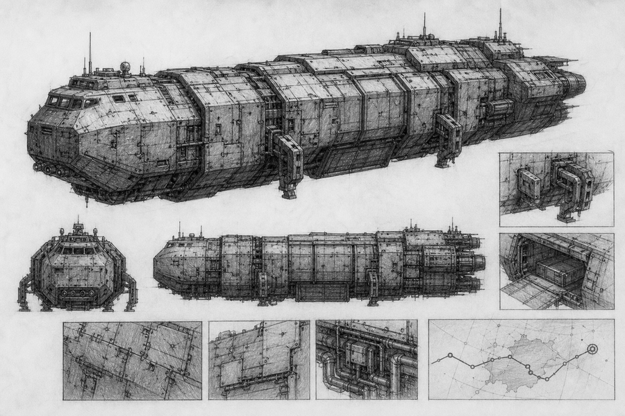

*Fastulv: ugly freighter, old scars, same heart.*

Lars came back to himself with the smell of engine coolant still in his nose.

Simulation Chamber 3 was gone. The helmet room was gone. He stood in Station Zero's planning chamber with one hand resting on the central table, the Milky Way model hovering above it, and Grim staring at him with the patience of someone who had been saying his name for a while.

"How long?" Lars asked.

"Twenty-three seconds," Grim said.

"Felt longer."

"Memory event?"

"LP 890-9c. SPECULOOS station. Before you had legs."

Grim's posture changed.

"I had no legs?"

"You had tanks. I remember tanks."

"You also called yourself highly advanced soup."

"That sounds like me."

Valdrun watched both of them. "A spontaneous recall?"

"Triggered by the ship plan, I think. Or the word parts. Or steak disappointment."

"Steak disappointment is neurologically powerful," Grim said.

Lars looked toward the planning model. The Fastulv still sat outside the bubble, tagged on the display as EXTERNAL ASSET: CAPTAIN-MODIFIED FREIGHT VESSEL / THREAT VALUE: AMUSINGLY HIGH.

"Who labeled the threat value?"

Ödesvaka hovered closer. "Automated station assessment."

"Why amusingly?"

"Because the vessel's external registry classifies it as a medium independent freighter."

Grim sounded proud. "An excellent lie."

"We need it inside," Lars said.

Valdrun nodded. "Yes. The Rim departure logs will become more interesting with every hour. If anyone reconstructs your vector accurately, they will still not find Station Zero, but they may learn where to look for missing physics."

"We bring the Fastulv through the coupling surface?"

"Havets Sista Sång can guide the transition. Your freighter was built with enough Aerit-derived components that the station may accept it if you authorize."

Lars looked at him.

Valdrun looked back.

"Aerit-derived components," Lars said.

"You did not know what they were."

"I knew exactly how they worked."

"Yes."

"That is an irritating distinction."

"Welcome back."

Grim opened the Fastulv's remote systems. "I can pilot her in."

"You are in here."

"I am also in the ship."

"That sounded smug."

"I have been a distributed cognition since before I had arms. Please respect my heritage."

The planning chamber dimmed as the station opened an operational display. Outside, through layers of folded geometry, the Fastulv drifted near the dark coupling surface. Ugly hull. Crooked name. Patched cargo clamp. Hidden weapons. Illegal Aerit regulator plate in the cooling system. Useless junk in all the right places.

For the first time, Lars saw what he had built with clearer eyes.

Not a freighter.

Not only.

A homing response.

His locked mind had built a ship capable of finding home while pretending to be bored, rich, and mildly irresponsible. Brilliant or deeply embarrassing. Possibly both.

"Havets Sista Sång," Lars said, "open an ingress path for Fastulv under my command."

The station answered through the table. "Ingress requires biometric command confirmation and vessel compatibility scan."

"Scan."

The model filled with data. Fastulv's hull composition. Engine geometry. Antimatter containment. Plasma weapons. Ragnarrök integration records. NUKEA-standard auxiliary reactor interfaces. SPECULOOS manufacturing metadata. Unknown components flagged in blue.

Several blue flags pulsed around the illegal bazaar parts.

Grim noticed.

"Those are from LP 890-9c."

"Yes."

"You remembered buying them."

"Yes."

"Do we know who followed you?"

Lars watched the blue flags.

A dark figure in a pressure-glass reflection. A thermal trace. A sense of being inspected, not hunted.

"No."

Valdrun's voice was quiet. "Could have been one of ours."

"Vigor?"

"Possible."

"Black Hole?"

"Possible."

"Lyra?"

The room changed temperature by no measurable amount.

Nobody answered too quickly.

Grim turned his head. "Lyra could manifest a temporary body by then?"

"By the time Lars built the Fastulv?" Valdrun said. "Yes."

"Would she?"

Valdrun looked at the Fastulv model. "If she thought one of her people was about to follow a buried return path after centuries under lock, she might check."

Lars kept his eyes on the ship.

"No proof."

"No proof," Valdrun agreed.

Good.

Mysteries were more tolerable when everyone admitted they were mysteries.

"Compatibility scan complete," Havets Sista Sång said. "Fastulv may enter under guided transition. Warning: vessel registry understatement exceeds acceptable norms."

Grim made a pleased sound.

"Even the station admires our lie."

"It criticized it."

"With admiration."

Lars placed his hand on the table. The surface shaped itself to his palm.

No pain.

No lock.

Only the strange pull of command access recognizing him.

"Bring her in."

Outside, the coupling surface unfolded.

Not a door. Not a hangar opening. A patch of darkness developed structure, light bending around a path that had not existed a second earlier. The Fastulv's remote drives lit. Grim piloted through three relay layers at once, his body still in the room, his mind partly in the ship, partly in Station Zero's interface, partly muttering about docking tolerances.

"Your port lateral trim is off," Lars said.

"My trim is perfect."

"Your trim is dramatic."

"That is a valid aesthetic."

"Not near folded spacetime."

"Correcting."

The Fastulv crossed the boundary.

For one second the model showed two positions for the ship: outside in ordinary space and inside the bubble, both tagged with probability weights. Then the wavefunction collapsed, because even jokes had physics eventually, and the Fastulv existed inside Arkology Zero.

The planning chamber displayed its new location in a secondary hangar near Havets Sista Sång.

External Asset became Internal Asset.

Threat Value updated from AMUSINGLY HIGH to LOCALLY USEFUL.

Lars glanced at Ödesvaka.

"Locally useful?"

"Automated assessment."

"The ball is getting mouthy."

"Mouth functions unavailable."

Grim folded his arms. "Fastulv reports successful docking. Cargo secure. Wine locker secure. Beef secure. Elderflower cordial secure."

"You checked cordial before hull stress?"

"Hull stress was obviously fine."

"That is not a defense."

Valdrun looked at the display of the two ships now resting inside the hidden station: the ancient vessel that remembered Lars as Captain Laurðinn, and the ugly freighter his locked mind had built to return.

"Coherence," Valdrun said softly.

This time it was not a question.

Lars felt the word settle across the room: machine, body, memory, team.

Grim looked from Valdrun to Lars, then to the ships.

He hesitated.

Then, carefully, as if testing an unfamiliar tool, he said, "Coherence?"

Lars smiled.

Valdrun answered first.

"Coherence."

Ödesvaka rotated above the table.

"Team state: coherence."

Lars pointed up.

"Do not ruin it."

"Ruin protocol suspended."

For once, nobody threatened to turn the drone into a lamp.

## Chapter 13: The Coherence Plan

The planning chamber stopped being polite.

Until then it had shown maps, thresholds, warnings, and beautifully organized reasons to panic. Now, after Fastulv settled into its internal berth, the chamber unfolded the old command architecture of Arkology Zero.

The floor darkened to a black mirror. The Milky Way rose from it in layered light. Trade corridors, war zones, silent colonies, hidden habitats, energy monopolies, slave routes disguised as labor logistics, artifact markets, religious splinters, private fleets, and old Aerit nodes appeared in different spectra. Lars could see too many layers at once. For the first time since waking, he did not flinch from any of them.

He simply wished he had more coffee.

"This," Valdrun said, "is why we do not improvise."

Lars looked at him.

Valdrun had changed clothes. Not armor, not robes, nothing theatrical. A dark coat, fitted utility layers, boots that looked old enough to have opinions. The integrated structures along his neck and left side were partly covered now, but not hidden. He looked less like a rescued casualty and more like someone who had been waiting half a century to be annoyed efficiently.

"We improvise constantly," Lars said.

"No. We adapt within prepared constraints."

"That is a very old person way of saying improvise."

"Yes."

Grim stood inside three overlapping interface rings, one connected to Station Zero, one to Fastulv, one to Havets Sista Sång. His metal body remained still, but Lars could feel the attention spread through systems around them. Grim had been distributed before he had legs; now he was enjoying the validation far too much.

"I have organized the action model into five tracks," Grim said.

"Of course you have."

"Track one: concealment. We prevent anyone from locating Arkology Zero, identifying the Void coupling surface, or connecting Fastulv's corrected vector to missing spacetime."

"Boring but necessary."

"Track two: repair. Station Zero's auxiliary systems, guardian channels, medical restoration equipment, and communication filters need full redundancy. The forty-nine-year Valdrun-under-furniture incident is not to be repeated."

Valdrun closed his eyes briefly.

"I support the wording less than the goal."

"Track three: contact. Vigor first, then the guardian channels that can be reached without exposing the network. After that, the priority nine likely Aerits under threat."

The blurred list appeared again.

Lars did not reach for it.

Not yet.

"Track four: deception. We give Black Hole B-7, Aphex, Galactic police, and every opportunist with a sensor array a story that is plausible, profitable, and wrong."

"My favorite kind of story," Lars said.

"Track five: intervention. Limited, local, reversible. No empire building. No grand return. No banners. We strengthen nodes, remove predators where necessary, and seed better failure behavior."

Lars looked at the galaxy model. "Failure behavior."

Grim highlighted three failing habitats. One relied on a single NUKEA-derived reactor stack that had been modified into proprietary dependency by a corporate governor. One was a mining cluster owned by a Black Hole shell company where life support was tied to labor compliance. One was a religious enclave near old Syren space, low Återviens but high weapons density.

"Systems fail," Grim said. "The question is whether they fail cleanly, locally, and recoverably. Or whether they drag everything connected to them into the hole."

Valdrun nodded. "Återviens is not preventing all collapse. That is childish. It is making collapse survivable, bounded, instructive."

"That sounds less inspiring than saving the galaxy."

"Good," Valdrun said. "Inspiration is how idiots get fleets."

Lars smiled despite himself.

Ödesvaka hovered over the map, turning slowly. "Long-range plan requested."

"By who?" Lars asked.

"By you. Recovered command habit."

"Traitorous ball."

"Logged."

The station dimmed several of the immediate tactical layers and expanded time.

Ten years.

Ninety years.

Three hundred years.

Seven hundred.

The galaxy changed under each projection. Some red regions burned out quickly. Others matured into governments. Green hidden nodes survived by remaining small, then failed when descendants got ambitious. Blue Aerit traces flickered, went dark, reappeared under other names. Aphex Defence either became a stabilizing force in several branches or a private empire in three ugly ones. NUKEA standards either kept colonies alive through modular power independence or became licensing chains that strangled poorer systems.

Lars watched nine decades pass in twelve seconds. It felt normal. That was new.

"We think too short when we are scared," Valdrun said. "Even we do. The first plan must work tomorrow, but it must not poison the next century."

"So we need a plan that can be misunderstood safely."

Grim turned his head. "Explain."

"Anything we do will leak. Not details, but patterns. People copy patterns. If we use giant heroic interventions, someone will build cults around them. If we solve every problem with superior force, the lesson becomes force. If we centralize the rescue effort, the lesson becomes centralization."

Valdrun's expression went still. Not surprised. Listening.

Lars continued, slower. "So the interventions have to look local. Boring. Like maintenance, trade disputes, insurance audits, reactor recalls, food-chain independence grants, embarrassing leaks, small militias deciding not to be cowards. We let people think they saved themselves wherever possible."

"That is in Lyra's late doctrine," Grim said quietly.

"I assumed. Less elegantly than mine."

"More rudely."

"Then mine is better."

The planning chamber accepted the principle. The model shifted, replacing several direct intervention arrows with softer influence loops: anonymous technical fixes, cultural seeding, targeted exposure of predatory actors, hidden evacuation routes, quiet restoration of local manufacturing, and communication protocols disguised as ordinary trade redundancy.

"We need names," Lars said. "Not for the whole thing. For the first operation."

"Operation names are often counterproductive," Grim said.

"That is what people with bad names say."

Valdrun looked at the first cluster: The Rim, Aphex activity, Black Hole B-7 debris, Vigor's farm, Fastulv's false trail, and a likely Black Hole relay hidden near a derelict ice hauler two light-hours outward.

"First task is to cut the trail," Valdrun said. "If Black Hole B-7 has a passive relay on the departure cone, it may not locate us, but it can sell uncertainty. Uncertainty attracts hunters."

"So we remove the relay."

"Quietly."

"I hate quietly."

"You are excellent at quiet when you stop narrating."

Lars considered that unfair but not inaccurate.

Grim enlarged the relay estimate. "The object is shielded, cold, and probably disguised as salvage. Destroying it with Fastulv is easy and obvious. Havets Sista Sång can approach through the folded edge and erase it without a conventional vector."

The old ship's icon glowed beside Fastulv.

Lars looked at it.

Havets Sista Sång had been awake for less than a day, after three hundred and fifteen years of waiting under his command envelope. It had greeted him like a captain. It had not yet moved.

That seemed wrong.

Ships were not meant to be remembered.

They were meant to go.

"We use her," Lars said.

Valdrun nodded once.

Grim's lenses brightened.

Ödesvaka rotated.

"Ancient vessel activation requires command confirmation, medical stability confirmation, and risk acceptance."

"Medical stability?" Lars asked.

"Eighty-one percent."

"Plenty."

"Disputed."

"By who?"

"Medical system, guest entity Grim, guardian Valdrun, Havets Sista Sång, and this unit."

"Cowards."

Grim lifted one finger. "I prefer accurate cowards with backup plans."

"Fine. We make it a field test. Short hop. Cut the relay. Leave a false signature leading somewhere useless and mildly humiliating."

"Where?" Valdrun asked.

Lars looked at the map.

A dead cometary mining claim. A collapsed influencer retreat. A derelict luxury habitat once owned by a tax-avoidance cult.

He pointed.

"There."

Grim checked the tag. "The former executive wellness moon of Helix Prosperity Church."

"Perfect."

Valdrun raised an eyebrow.

"If Black Hole wastes a week searching a dead wellness moon for my secret base, civilization improves."

Grim considered.

"Approved."

Ödesvaka's blue symbols flickered.

"Operation designation?"

Lars smiled.

"Quiet Dignity."

Valdrun looked pained.

"You named an operation after your own earlier lie."

"Continuity matters."

Grim said, "Operation Quiet Dignity logged."

The chamber accepted it.

For the first time, the plan felt like a plan. Not a revelation. Not panic with diagrams. A chain of action: conceal, repair, contact, deceive, intervene. Short move, long shape. A small cut in the right place, not a trumpet blast.

Återviens, Lars thought. He understood a little more why the word had taken fifty years to earn itself.

## Chapter 14: Havets Sista Sång

Havets Sista Sång did not have a bridge chair.

This annoyed Lars immediately.

"Where am I supposed to sit?"

The old ship's command deck lit around him in soft bands of white and pale blue. The central console had unfolded into a waist-high crescent. Surrounding stations waited in standby, each one clean enough to make Aphex laboratories look like budget kitchens.

"Command interface is ambulatory," the ship said.

"That is not an answer."

"Captain traditionally stood during active transitions."

"Captain traditionally had better knees."

"Your knees are within acceptable tolerance."

Grim, standing at the secondary interface, made a small sound.

Lars pointed at him. "Do not enjoy my ship insulting me."

"I am enjoying the accuracy."

Valdrun entered behind them with a compact sidearm, a dark utility harness, and the expression of someone stepping into an old house after a long absence.

He stopped just inside the command deck.

For a moment the blue-white light touched his face and the centuries showed.

"Coherence?" Lars asked quietly.

Valdrun blinked, then nodded.

"Coherence."

Grim watched, absorbing.

The ship spoke. "Guardian Valdrun recognized. Command access restored under Captain Laurðinn's active envelope. Welcome back."

Valdrun exhaled once through his nose. "Still formal."

"You preferred formal during last deployment."

"I was younger and more annoying."

"Correction: archived behavioral records indicate you were equally annoying."

Lars turned slowly toward Valdrun. "I like her."

"You would."

"Her?"

Valdrun touched the nearest console. "Ships are not people."

Havets Sista Sång said, "Disputed."

The command display expanded.

Not a view screen. A field of navigable states. The interior of Arkology Zero appeared as geometry nested inside geometry. Then the outer coupling surface. Then ordinary space beyond. Then the estimated relay location. Havets Sista Sång did not plot a path like Fastulv. It calculated permissions. Which layer of spacetime could be touched. Which curve could be leaned on. Which external observer would see nothing, or something boring, or the wrong thing entirely.

Lars put his hand on the console.

The ship recognized him down to blood, neural phase, and the old command habits still unfolding inside him.

No pain.

No hesitation.

Only a terrifying amount of trust from a machine that had waited longer than most nations existed.

"Status," Lars said.

"Primary drive: nominal. Fold-surface coupling: nominal. Local stealth envelope: nominal. Weapons: restricted under Alpha Fourteen unless command override and guardian concurrence."

"Weapons restricted?"

Valdrun said, "Yes."

"I dislike discovering adult supervision in my own ship."

"You wrote part of the restriction."

"That sounds unlikely."

"You were occasionally sensible."

"Defamation."

Grim opened the weapons layer and froze. "Lars."

"What?"

"This vessel could cut Fastulv into interesting molecules without using its main battery."

"Rude."

"Accurate."

Havets Sista Sång responded, "Fastulv classified as locally useful allied vessel. Cutting not recommended."

"Thank you," Grim said.

"Recommendation subject to behavior."

Lars laughed.

It felt good.

Then the ship moved.

The deck did not lurch. No engine roar. No dramatic shudder. The galaxy on the display simply changed relationship to them. Arkology Zero released the ship through an internal fold, and Havets Sista Sång slid from hidden space into the ragged edge of the KBC Void like a dark thought entering a room.

External cameras showed nothing.

Not blackness. Nothing for instruments to hold. The ship bent observation around itself so completely that even its own display had to synthesize a symbolic hull outline for the crew.

"This is cheating," Grim said.

"Advanced engineering often feels like moral failure," Lars said.

"You sound proud."

"I am."

The relay target lay ahead: a derelict ice hauler registered two centuries ago, dead engines, hollow cargo spine, tumbling slowly near a debris ribbon. It looked abandoned.

It was not.

Havets highlighted four passive sensor petals folded into the hauler's shadow, a neutrino tick too regular for background, and a microburst recorder that had caught Fastulv's vector correction from The Rim.

"Black Hole?" Lars asked.

Grim analyzed. "Shell hardware. Not branded. Methods align. It is listening for impossible departures."

"Can we erase it?"

"Yes."

Valdrun stepped closer. "Can we learn from it first?"

Lars smiled.

"There you are."

Havets Sista Sång extended a probe.

That was the polite term. On the display, a filament of controlled matter unfolded from the ship, crossed vacuum without thrust, and touched the derelict hauler like a needle touching skin. No docking. No broadcast. No thermal flare. It simply convinced the relay's outer shell that maintenance had arrived.

The relay opened.

Grim leaned in.

"Oh."

"Good oh or bad oh?"

"Expensive oh."

Data streamed into the command field: not enough to compromise Arkology Zero, but enough to show Black Hole B-7 had expected Lars to run. Not to where. Just away. They had seeded passive ears along several coward routes, genius routes, idiot routes, and one route labeled statistically Swedish.

Lars stared.

"Statistically Swedish?"

Grim said, "Your public persona has a pattern."

"My public persona is a masterpiece."

"It apparently has navigational stereotypes."

Valdrun's mouth twitched.

The relay contained a partial packet meant for a courier drone: Fastulv vector anomaly, Aphex engagement, possible enhanced target survival, priority escalation to acquisition cell, request for blood-compatible containment.

The fun left the room.

Lars read the last line twice.

"Blood-compatible containment."

Valdrun's face hardened.

Grim's voice went flat. "They came prepared."

"Not prepared enough."

"Lars."

"I know. Quietly."

Havets Sista Sång waited.

The old ship did not urge violence. It did not preach restraint. It held capacity inside silence, which was more intimidating than either.

"Copy the relay," Lars said. "Plant the false trail to the wellness moon. Make it look like Fastulv's drive wake clipped the hauler by accident and corrupted the buffer."

Grim worked with the ship. Fast. Elegant. Terrifyingly pleased.

Valdrun watched the external model. "We should leave them a reason not to trust the data too much."

"Agreed."

Lars added a signature smear: a hint of Aphex military encryption, a NUKEA reactor diagnostic ghost, and a corrupted influencer-era advertising packet for Lars's old channel.

Grim paused.

"Did you just hide our false trail inside an advertisement for your defunct grooming product sponsorship?"

"Black Hole analysts deserve culture."

"This may qualify as psychological warfare."

"Good."

The relay accepted the corrupted record.

Then Havets Sista Sång killed it.

Not with a blast. Not even heat. The ship changed a local field condition inside the relay's memory core, and the device forgot how to be a device. Circuits became dust. The sensor petals curled inward. The microburst recorder cracked without sound.

The derelict hauler continued tumbling.

To any distant observer, nothing had happened.

"Quiet Dignity complete," Grim said.

Lars looked at Valdrun.

"Too easy."

Valdrun nodded. "Yes."

The command deck lights shifted amber.

Havets Sista Sång spoke. "Incoming object. Low thermal. High acceleration. Masked approach from debris shadow."

Grim snapped the tactical layer open.

A black dart emerged from the hauler's broken cargo spine.

Not a drone.

Too fast.

Too cold.

Too late to be accidental.

"Trap," Valdrun said.

Lars smiled despite himself.

"Now it is a field test."

## Chapter 15: Quiet Dignity Fails Politely

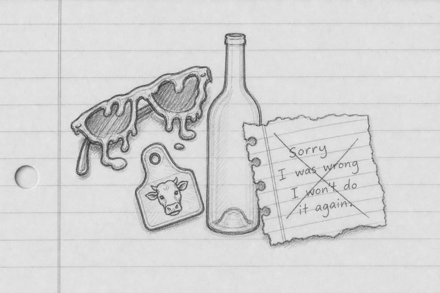

*Quiet dignity, after incident review.*

The dart accelerated at two hundred gravities.

No human pilot. No ordinary missile either. It made one correction, then split into six smaller objects, each one leaving almost no thermal trail. Kinetic penetrators with smart skins, probably carrying sensor dust, maybe a blood-sample harvester if Black Hole B-7 had become especially disgusting this century.

Lars did not reach for a chair because there still was no chair.

"Options," he said.

Grim answered first. "Fast kill, obvious signature. Slow kill, less obvious. Capture, risky. Avoidance, boring."

Valdrun said, "Capture one."

"Of course you would say capture one," Lars said.

"We need to know how far their containment technology has progressed."

"I miss when I solved problems with nukes."

"That was yesterday," Grim said.

"Exactly. Simpler era."

Havets Sista Sång displayed intercept curves. The six darts spread into a flower pattern, trying to force the ship either to reveal itself through acceleration or take a hit. Their guidance systems were not seeing Havets directly. They were attacking the absence where the relay had died.

Good tactics.

Annoying.

"Can we spoof them into hitting each other?" Lars asked.

"Yes," said the ship.

"Can we capture one while spoofing the rest?"

"Yes."

"Can we do it without making a light show visible from The Rim?"

"Yes."

Lars looked at Grim. "You hear that? This is what confidence sounds like."

Grim folded his arms. "Confidence without explanation is just expensive arrogance."

"Also my brand."

The darts closed.

Havets Sista Sång did not dodge. It unfolded probabilities.

That was how Lars perceived it. The actual mechanisms were field gradients, sensor ghosts, and tiny adjustments to the way local space reported distance. Three darts saw the ship a kilometer to port. Two saw a heat bloom near the dead hauler. One, the one Valdrun wanted, saw a clear path to target center.

"Marking capture candidate," Grim said.

"No," Lars said. "That one has a secondary pulse."

Grim checked. "I do not see it."

"Magnetic shell under the skin. It wants to be captured."

Valdrun moved instantly. "Trap inside trap."

"Use the boring one."

"The boring one?"

"Third left. Bad paint. No imagination."

Havets Sista Sång accepted the correction without comment.

The first five darts died by disagreement. Two struck each other at relative velocity high enough to become expanding metallic vapor. Two chased a false heat bloom into the derelict hauler's empty ice tanks and shredded themselves. One curved toward a ghost vector until Havets changed the local field around it and it became a thin line of dust.

The sixth dart froze.

Not temperature. Motion.

A containment bubble formed around it, barely larger than Lars's hand, holding the dart in a pocket where inertia had been politely overruled. It hung on the command display like an insect in glass.

"Captured," the ship said.

"I want it in a hard isolation box," Valdrun said. "No network contact, no station contact, no biological contact."

"Agreed," Grim said.

Lars looked at the dart's model. "It has a sampler."

The display peeled the device open layer by layer. Kinetic core. Passive sensor mesh. Molecular adhesion filaments. Microcapillary array. Cryo-sealant. Data seed designed to transmit after collection.

Blood-compatible containment.

The phrase became hardware.

For a moment nobody joked.

Then Havets Sista Sång said, "Device appears optimized for involuntary biological acquisition. Recommend anger."

Lars blinked.

Valdrun stared at the ceiling. "You taught her that."

"I did not."

"Archived command lexicon indicates Captain Laurðinn frequently requested emotional recommendations during combat."

"Proof I was a menace. Can we please focus on the blood harvester?"

"Yes," Lars said, and the humor went away again.

They dissected the captured dart in a remote isolation bay using tools controlled through three sacrificial interfaces and a dumb mechanical relay Valdrun insisted on adding because smart systems were exactly what smart traps liked to eat.

The dart had no origin stamp. It did have manufacturing habits: tolerances from Perseus-arm paramilitary shops, a NUKEA-compatible microcell stolen or copied from civilian reactor safety tech, Aphex-derived guidance math two generations old, and a biological sampling layer that made Lars want to find the designer and feed him to his own procurement department.

"They are not just hunting you," Grim said.

The dart's target model appeared. Not Lars's face. Patterns.

Long-lived individuals. Abnormal survival. Unusual radiation tolerance. Financial anomalies. Medical records with missing aging markers. People who seemed lucky around machines. People who solved impossible problems and pretended to read a lot.

Lars stared.

"They built a net."

Valdrun nodded. "A crude one. But over ninety years, crude nets catch things."

"How many of the priority nine are in it?"

Grim checked against the blurred archive list. This time the station allowed several shapes to sharpen.

"At least four."

The room tightened.

"Locations?"

"One near The Rim corridor," Grim said. "Possibly Vigor already shielded. One inside an Aphex research dependency. One in a NUKEA arbitration habitat. One..." He paused. "One in territory influenced by the Syren Collective."

Valdrun's expression turned cold.

"No."

Lars looked at him.

"That one waits," Valdrun said.

"If Black Hole has the same net?"

"The Syren region is not where we start."

"Because it is dangerous?"

"Because it is designed to make rescue attempts become recruitment events, martyrdom events, or war."

Lars looked at the map. Syren space pulsed dark red, not large but dense. Religious fragmentation, quantum technology cults, anti-human rhetoric mutated through centuries, old doomsday logic wearing new mathematics. A single dramatic intervention there could become scripture by lunchtime.

Återviens said no. Not because the person there mattered less. Because bad rescue could kill more than abandonment and still fail.

He hated that.

Good.

Some things should be hated.

"First target," he said. "The Aphex dependency."

Grim turned. "Because Arsenault gives us leverage?"

"Because Aphex already knows me, already owes me, already wants to classify everything, and already has enough force nearby to create noise. We can hide a rescue inside a corporate security audit."

Valdrun nodded slowly. "Limited. Local. Plausible."

"And fun," Lars said.

"Define fun," Grim said.

"Making French executives help save an ancient hidden superhuman without telling them why."

Valdrun considered.

"That may be fun."

Havets Sista Sång returned to Arkology Zero through a path that did not exist before or after it used it. The old ship settled into the hangar with the captured dart sealed in isolation and the false trail already crawling toward the dead wellness moon.

Operation Quiet Dignity had failed to remain dignified.

It had succeeded anyway.

As Lars stepped off the command deck, his comm buffer lit with a delayed packet routed through three dead trade relays, an Abantu agricultural invoice, and a recipe for elderflower cordial.

Vigor.

The message contained only three words.

COHERENCE, OLD IDIOT?

Lars smiled.

"Reply?" Grim asked.

Lars thought of Vigor's false beard, the farm, the whisky, the hug he had not understood, the long time horizons old people carried under jokes.

"Send: Coherence. Also your invoice is fraudulent."

Grim sent it.

Five seconds later, Vigor replied.

FRAUD IS A STRONG WORD BETWEEN FRIENDS. BLACK HOLE LISTENERS ARE MOVING. APHEX IS NERVOUS. YOUR FRENCHMAN HAS BEEN CALLING EVERYONE. TRY NOT TO NUKE THE RIM.

Lars sighed.

"People are obsessed with one small tactical choice."

Valdrun said, "You used nuclear weapons within station traffic control limits."

"Successfully."

Ödesvaka hovered from the hangar ceiling.

"Success does not erase traffic law."

"Lamp."

## Chapter 16: The Long Game Has Teeth

Gabriel Arsenault answered on the third encrypted layer, which meant he was either frightened, busy, or wearing formal clothing.

The projection appeared above the planning table in Arkology Zero with a three-second delay and enough encryption noise wrapped around it to make a civilian comm system melt. Arsenault looked immaculate. This confirmed Lars's suspicion: terrified.

"Monsieur Odin," Arsenault said. "You are difficult to locate."

"Thank you."

"That was not praise."

"Improve your delivery."

Arsenault's eyes flicked to the background. Lars had set the projection field to show only a bland Fastulv cabin wall, slightly out of focus. No Station Zero. No Valdrun. No Grim unless he chose to lean in and ruin everything.

Grim was, therefore, leaning just outside the frame with visible effort.

"Black Hole B-7 attempted to kill me," Lars said. "Then attempted to observe my departure. Then deployed hardware consistent with biological acquisition."

Arsenault's expression lost its theatrical polish.

"Biological acquisition."

"Blood sampler. Cryo-sealant. Transmission seed. Ugly little thing."

"Do you have the device?"

"Parts."

"Give them to Aphex."

"No."

"Monsieur Odin."

"Gabriel."

The chairman stopped.

Lars let the silence sit.

He had spent decades, apparently centuries, hiding what he was. He had also spent a few years building a public identity that made powerful people underestimate him until money or plasma corrected them. Arsenault was not stupid. Vain, yes. French in the theatrical sense, yes. But not stupid. He understood tone.

"What do you need?" Arsenault asked.

"A security audit."

"Of what?"

"Aphex research dependencies with unusual biological, cybernetic, or longevity-related anomalies in personnel records."

Arsenault went still. "That is a strange category."

"So is being attacked by fascists with blood hardware."

"How broad?"

"Ninety-year retrospective. Quiet. No mass alerts. No heroic raids. No executive speeches."

"You wound me."

"I am trying not to."

Arsenault looked away, probably at advisors Lars could not see. "Galactic police are already crawling over The Rim. Major Fabron has submitted a report that uses the phrase 'recklessly effective' seven times."

"Flattering."

"He wants to know where you are."

"Tell him I am emotionally unavailable."

"He will not find that helpful."

"Then tell him to secure the recovered Black Hole equipment and stop asking questions he does not have clearance to survive."

Arsenault's gaze sharpened. "Clearance from whom?"

"Physics."

That annoyed him. Good. Annoyed people often moved faster than confused people.

"There is an Aphex dependency," Lars continued, "with someone Black Hole may target. I do not know who yet. Your audit will create cover for me to find out."

"You are asking Aphex Defence to help you conduct an undisclosed counteroperation inside our own structure."

"Yes."

"This is outrageous."

"Also cheaper than losing the person and discovering what Black Hole does with them."

Arsenault did not answer immediately.

In the planning chamber, the real model floated behind the false projection: Aphex nodes, audit pathways, legal triggers, internal security chains, Major Fabron's brigade, Professor Fayolle's lab network, and three possible locations where the priority Aerit might be buried under ordinary employment records.

Valdrun watched from the shadows.

Grim ran probability branches.

Ödesvaka silently logged things Lars would later deny.

Finally Arsenault said, "I can authorize a strategic integrity audit under post-attack emergency powers."

"Boring name. Good function."

"It will give you access to certain records."

"And movement cover."

"And movement cover," Arsenault said reluctantly.

"No one outside your smallest circle hears the biological angle."

"Agreed."

"No samples leave Aphex custody without my review."

"Monsieur Odin—"

"Gabriel."

Another silence.

"Agreed."

"Good. Also, if Fabron complains, promote him."

Arsenault blinked. "Why?"

"Because he is irritating, brave, and not completely stupid. Those are rare in combination."

"You have an unusual leadership philosophy."

"It involves surviving."

Lars turned back to the real planning table.

"Track four moving."

"Deception," Grim said. "Aphex audit cover established."

"Track one?"

"Concealment improved. The false trail to the wellness moon has already been queried by a Black Hole listening post. They are taking the bait cautiously."

"Good."

"Track two," Valdrun said, "repair crews are restoring the auxiliary chamber. No robot enters without dumb mechanical fallback. Ödesvaka has filed seventeen complaints about your cable rig."

"My cable rig saved your life."

"It also violated six station maintenance principles."

"History is written by survivors."

"And audited by drones," Ödesvaka said.

"Track three?" Lars asked.

Grim brought up Vigor's response channel, then the blurred priority nine list. One entry sharpened a little more under the Aphex audit overlay.

Name hidden.

Location: Aphex Defence research dependency, Lagrange facility near a cold brown dwarf on the old French expansion line.

Public identity: materials fatigue specialist.

Age on record: forty-two.

Estimated actual age: between five hundred and seven hundred.

Threat: Black Hole acquisition probability rising.

Memory lock status: active.

Consent route: unknown.

Lars stared at the estimate.

Forty-two.

Five hundred to seven hundred.

Somewhere out there, another person was walking around with a life, a job, habits, perhaps friends, perhaps a favorite bad pub. They thought they were mortal in the ordinary way. Maybe they had headaches they could not explain. Maybe they fixed impossible problems and called it luck. Maybe they were being watched.

"We go there," Lars said.

Valdrun shook his head. "We prepare there."

"Difference?"

"A great deal. We do not rush in as ancient saviors. We establish cover, study their life, identify immediate threats, and decide whether contact is safe. If we contact, we ask."

"Consent constraint. Your rule."

Lars nodded.

It hurt in a way that had nothing to do with locks.

"Long-term Återviens," Valdrun said, "starts with not breaking the people we claim to save."

The room accepted that.

Not because the station logged it.

Because everyone in it did.

Grim opened another layer. "Havets Sista Sång can carry us near the brown dwarf without conventional detection. Fastulv should be the visible asset afterward. Lars Odin, absurd Aphex board member and weapons consultant, arrives for an audit. Very annoying. Very plausible."

"I was born for this."

Valdrun gave him a look.

"Apparently not born," Lars corrected. "Manufactured by centuries of tragedy for this."

"Better."

Ödesvaka rotated. "Mission designation?"

Lars considered.

This one was not a joke.

Not fully.

They were going to find someone asleep inside their own life. They would walk near Black Hole B-7 nets, Aphex secrets, and whatever else had been hunting carriers for ninety years. They would use an ancient ship and a ridiculous freighter, an android who used to be soup, a half-mechanical guardian recently rescued from under a power distributor, a drone with logging issues, and a man who had learned that his entire life was both false and true.

He looked at Valdrun.

"Coherence?"

Valdrun nodded.

"Coherence."

Grim answered too, less hesitant this time.

"Coherence."

Ödesvaka's surface symbols brightened.

"Mission designation: Hold Coherence."

No one objected.

Outside the planning chamber, deep inside the folded dark of Arkology Zero, Havets Sista Sång began warming old systems that had not moved in three centuries.

In the secondary hangar, Fastulv's ugly hull sat under clean Aerit light, full of beef, wine, illegal parts, and exactly the wrong amount of destiny.

On The Rim, Vigor Hallman served dinner to Aphex soldiers and pretended to be only a farmer.

Somewhere in Aphex records, a forty-two-year-old materials specialist continued a normal day under a false sky, unaware that Black Hole B-7 had found a pattern in their bloodwork.

And far away, or perhaps not far at all, a temporary body stood in a locked room for less than two seconds and left behind particles that folded into nothing.

This time, when the residue vanished, someone was watching the watchers.

---

# Chapter 17: Audit Cover

The brown dwarf did not look like much. That was the point.

It hung ahead of the Fastulv as a swollen ember in infrared, too cold to be a star, too massive to be ignored. Old mining claims, research platforms, and corporate infrastructure wrapped it. They had learned to look boring for tax reasons. Aphex Defence called the facility `Dependency L-Prime 41`. Lars called it a filing cabinet with engines.

The visible approach was Fastulv's job.

Havets Sista Sång waited elsewhere, if elsewhere meant anything inside a fold path that touched ordinary space only when it felt like being polite. Lars could not see the old ship on any display. He knew it was there because command access sat in the back of his mind like a cold hand on a rail.

Grim sat beside him in the copilot's chair, pretending to run ordinary navigation. In reality he was linked through Fastulv, Havets, and a thin relay back to Arkology Zero. His metal body had chosen to squeak one knee joint for public audio pickup, which Lars found both thoughtful and insulting.

"You are overdoing the defective robot act," Lars said.

"I am performing mediocrity."

"That is my line."

"You taught me."

On the forward display, the Aphex facility expanded into view: three habitation cylinders, two research spines, a shielded materials ring, a small defense dock, and a corporate chapel module added by some executive committee that believed workers became more ethical when architecture looked expensive.

Valdrun's voice came through the hidden channel from Havets.

"Remember the plan."

"I adore when people say that to me as if it has ever worked."

"Lars."

"Fine. Audit cover. No ancient savior routine. No public Aerit hints. Consent before unlock. Local intervention only. Do not start a war unless the war starts first and signs the forms."

Grim turned his head. "That last clause was not in the plan."

"It was implied."

Aphex traffic control hailed them with a nervous woman whose voice had the brittle calm of someone reading from emergency procedure while senior management watched.

"Fastulv, this is Dependency L-Prime 41 Control. Confirm identity and audit authorization."

Lars opened the board-level packet Gabriel Arsenault had sent three hours earlier. It contained enough signatures, seals, emergency clauses, legal threats, and French phrasing to make a lawyer weep into silk.

"L-Prime Control, this is Captain Lars Odin, Aphex Defence board director, strategic integrity audit authority under post-attack emergency powers, arriving with one freighter, one robot, and a bad attitude."

The channel remained silent for half a second too long.

"Confirmed, Director Odin. Please hold for security escort."

"Holding sounds inefficient."

"Director?"

"Never mind. Holding."

Grim muted the channel. "You enjoy making clerks afraid."

"No. I enjoy making systems reveal stress points."

"That is what frightening clerks means when said by a rich person."

"Noted."

A military cutter detached from the defense dock and moved toward them. Its transponder identified it as Aphex Defence, Eleventh Brigade.

Lars smiled.

"Oh good."

Major Elliot Fabron appeared on the comm a moment later, helmet off, uniform immaculate, expression already tired.

"Monsieur Odin."

"Major Fabron. You look well for a man whose report used 'recklessly effective' seven times."

Fabron's left eye twitched.

"I stand by the wording."

"I framed it."

"I am your assigned security liaison for the duration of this audit."

"Did you volunteer?"

"No."

"Then someone likes me."

"Or dislikes me."

Fabron's cutter escorted them toward Dock Two. Lars let him. The facility's passive scans washed over Fastulv: hull, cargo, declared weapons, undeclared weapons pretending to be declared maintenance systems, and at least six things that should have triggered alarms but did not because Grim had written them lullabies.

Inside his hidden channel, Valdrun said, "Fabron is observing your scan behavior."

"He always observes."

"He is better than last time."

"Last time he was trying to rescue me from people I had already killed."

"That can motivate self-improvement."

The docking clamps engaged.

Lars stood, adjusted his black coat, checked that the Ragnarrök was visibly powered down but emotionally present, and looked at Grim.

"Simple service automaton."

Grim's servos whined. "With no unusual interests except food."

"And audit support."

"And audit support."

The airlock opened.

Fabron waited on the other side with eight armored Aphex soldiers, two legal observers, one medical compliance officer, and a station administrator who looked as if she had slept in a chair designed by accountants.

Fabron glanced at the Ragnarrök.

"You brought that."

"It gets anxious alone."

"This is a research facility."

"Then it will learn something."

The administrator stepped forward. "Director Odin, I am Administrator Celia Marchand. We have prepared the audit suite, personnel records, laboratory access, and secure conference rooms."

"Good. I want three things first. Full list of personnel with unusual medical exceptions over the last ninety years. Materials fatigue labs. And whatever passes for steak on this facility."

Marchand blinked. "Steak?"

Fabron closed his eyes.

Grim leaned toward a wall sensor and squeaked.

"The audit," Lars said, "will be severe."

Marchand clearly could not decide which part of that sentence was a joke.

Excellent.

They led him through the facility's main spine. L-Prime 41 smelled of filtered metal, coffee concentrate, anxious humans, and cold research money. Aphex branding appeared everywhere, but less aggressively than on public stations. This place did not sell confidence. It manufactured things that made confidence unnecessary.

Lars saw the stress points immediately.

One power loop too centralized.

Two emergency corridors rerouted for executive security.

Medical archive latency inconsistent with declared privacy policy.

Materials ring shielded well enough against radiation, poorly enough against someone already inside.

And under it all, a pattern in small things: workers had added manual overrides where corporate design preferred locks, food gardens in ventilation dead spaces, redundant local tool caches, unofficial mutual-aid boards, and handwritten maintenance tags with tiny spiral marks in the corners.

Återviens habits.

Not named.

Not official.

Alive.

Lars did not look at Fabron.

Fabron noticed anyway.

The audit suite overlooked the materials ring through pressure glass. A dozen researchers moved below among test rigs, vacuum chambers, stress tables, and fatigue simulators. One of them stood beside a cracked composite beam, arguing with three engineers and a wall display.

Forty-two on record.

Five hundred to seven hundred in probability.

She had dark copper skin, close-cropped silver hair, and the stillness of someone who did not waste movement. Her ID tag read:

DR. MIRA SOVAN

MATERIALS FATIGUE SPECIALIST

She tapped the cracked beam once and said something that made all three engineers stop arguing.

Lars could not hear through the glass.

He did not need to.

He knew the shape of the gesture.

Someone solving the problem before everyone else understood the question.

Grim's private voice entered his head.

Candidate probability just rose.

Lars watched Dr. Mira Sovan turn away from the beam.

For the briefest moment she looked up, through the pressure glass, directly at him.

No recognition.

But her hand went to the back of her neck.

Fabron said quietly, "Is that who you came for?"

Lars did not turn.

"Major, that is a very dangerous question."

"Then I will ask a safer one."

"Good."

"Should I be protecting her from you?"

Lars finally looked at him.

Fabron's face was stiff, formal, irritatingly French.

But his eyes were not.

Lars said, "Possibly."

---

# Chapter 18: Materials Fatigue

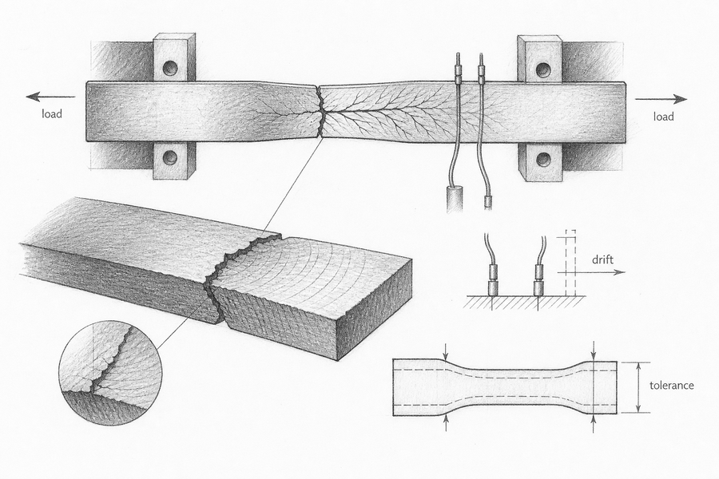

*Materials fatigue sample, after test.*

Dr. Mira Sovan trusted cracks more than people.

Cracks did not lie. They branched under stress, wandered along grain boundaries, slowed at good welds, accelerated through vanity engineering, and told patient stories about force, heat, time, and neglect. People told stories too, but usually to avoid invoices.

The composite beam on the test table had failed seventeen hours before its certified fatigue limit.

That was not supposed to happen.

Three engineers had spent the morning blaming the supplier, the simulator, the radiation profile, the junior technician who calibrated the loading cradle, and once, with impressive cowardice, the cleaning crew.

Mira had listened for six minutes, which was generous.

Then she tapped the crack with one gloved finger.

"The beam is innocent."

Silence.

Tomar, the youngest engineer, blinked. "The beam is what?"

"Innocent." She enlarged the crack path on the wall display. "It did what it was told to do."

"It failed early."

"Because the test lied."

Senior Engineer Bellac frowned. "The simulator logs are clean."

"Clean logs are not the same as true logs."

She rotated the model. Heat maps unfolded across the beam. The visible crack became a red vein through layered structure. She added acoustic data, then vibration history, then a maintenance timestamp from a loading arm that had not been part of the official test packet.

"There," she said.

No one saw it.

Of course they did not.

Mira sighed. "The loading arm compensated for a micro-stutter in its left actuator. The cradle software smoothed the compensation. The simulator believed the load curve was continuous. It was not. Every seventy-third cycle, the beam received a lateral impulse too small to trigger alarms and too regular to be noise."

Bellac stared.

Tomar whispered, "That's not in the logs."

"Yes," Mira said. "That is why we are having this conversation."

She did not mention that she had known the answer before opening the acoustic layer.

That was a private problem.

Private problems belonged in locked drawers, encrypted notes, and very long walks through maintenance corridors where nobody asked why she had solved a six-week failure review between coffee and lunch.

Her neck ached.

It had been doing that more often.

Not like injury. Like an old warning system built by someone who disliked explanations.

"Replace the actuator," she said. "Disable smoothing during certification tests. Notify the supplier that their cradle firmware is hiding impulse artifacts. And apologize to the cleaning crew."

Bellac looked wounded. "I did not officially blame them."

"Then unofficially apologize."

Tomar grinned.

Mira liked Tomar. He was young, nervous, and still believed competence should improve institutions. That kind of innocence either died or became stubborn enough to matter.

Her console chimed.

Strategic integrity audit.

Board-level.

Emergency authority.

Director Lars Odin.

Mira stared at the name.

She knew it, of course. Everyone at Aphex did. The influencer-turned-billionaire-turned-weapons-board-menace who had apparently solved Professor Fayolle's impossible Ragnarrök problem over coffee and then used tactical nuclear weapons near The Rim because subtlety had been out of stock.

Everyone in French weapons circles also knew the Ragnarrök was not simply a gun. It was a national embarrassment, national miracle, and budgetary wound with a grip. Aphex officers pretended to discuss it soberly, then lowered their voices like priests near expensive sin.

She had expected him to look like an expensive idiot.

When she glanced up through the pressure glass, he stood in the audit suite above the ring wearing a black coat, bad posture, and the expression of a man pretending not to understand exactly how every machine in the room could fail.

For a moment their eyes met.

Something moved at the edge of memory.

Not a memory.

A pull.
Her hand rose to the back of her neck before she could stop it.

The ache faded.

Strange.

"Doctor?" Tomar asked.

"Send the actuator report," she said.

"To audit?"

"To everyone before audit asks. It looks better if we discover our own mistakes before the rich man in sunglasses discovers them for us."

"He is not wearing sunglasses."

Mira looked up again.

Lars Odin was now speaking to Major Fabron, who stood beside him with the rigid suffering of a man assigned to escort a natural disaster. The Ragnarrök rode Lars's back like a classified insult. Fabron's eyes flicked to it once with something that was almost pride, then immediately became French disapproval, which Mira suspected was the same emotion wearing a better coat. A robot stood behind them, servos whining with theatrical incompetence.

The robot turned its head toward her.

Too precisely.

Mira narrowed her eyes.

"Interesting."

The robot immediately bumped one shoulder against a wall panel and produced a sad little squeak.

Too late.

Mira smiled despite herself.

The audit reached her lab nine minutes later.

Administrator Marchand entered first, then two legal observers, then Major Fabron, then Lars Odin and his robot. Marchand was not the exhausted committee ghost Mira had expected. She was tall, dark-eyed, and beautifully put together in the expensive, dangerous way of a woman who could make a budget hearing feel underdressed. The legal observers looked frightened of paperwork. Fabron looked frightened of Lars. Lars looked disappointed by the room's coffee machine.

"Dr. Sovan," Marchand said, voice warm enough to be human and precise enough to be dangerous, "Director Odin has requested access to materials fatigue protocols and personnel exception records."

"Those are different audits."

Lars looked at the cracked beam. "Everything is the same audit if the auditors are annoying enough."

Mira studied him.

Up close, he did not look like his public feeds. The face was the same, the hair was the same, the irreverent mouth unfortunately the same, but the eyes were wrong. Too old? No. That was absurd. He looked thirtyish. Maybe a rough thirtyish. A wealthy thirtyish who slept badly and bought coats as camouflage.

Still, something in his eyes had weather.

"You solved the beam," he said.

"Yes."

"Actuator micro-stutter."

The room went quiet.

Mira folded her arms. "You read the report?"

"No."

"Then how did you know?"

Lars glanced at the beam. "The crack path is sulking."

Tomar made a small sound that might have been religious.

Mira did not smile.

"Cracks do not sulk."

"That one does."

"Cracks propagate."

"And occasionally complain."

The robot leaned toward Fabron and whispered too loudly, "This is how specialists flirt."

Fabron's jaw tightened.

Lars pointed backward. "Simple service automaton. Very defective."

Fabron's eyes dropped, despite himself, to the Ragnarrök's inert spine housing. "The automaton is defective. The weapon is merely... inelegantly carried."

"That sounded almost like affection," Lars said.

"For French engineering, not for you."

"Clearly," Mira said.

The robot's optical lenses brightened for a fraction of a second.

Not simple.

Not defective.

Interesting.

Lars walked around the table without touching anything. He kept his hands visible, which Mira appreciated because board directors often believed proximity was permission. He looked at the beam, the cradle, the actuator housing, the acoustic logs still open on the wall.

"Good catch," he said.

"I know."

Marchand cleared her throat. "Director, perhaps the personnel records—"

"In a minute." Lars looked back at Mira. "How long have you worked here?"

"Eight years."

"Before that?"

"NUKEA arbitration habitat. Reactor casing failure review."

"Before that?"

"University of New Stockholm. Materials aging."

"Before that?"

Mira's neck tightened again, but less than usual. "Several places."

"You move when systems get too stupid."

That hit.

She kept her face still. "I move when contracts end."

"Of course."

Fabron watched them both.

Too carefully.

Mira shifted her attention to him. "Major, is this audit a technical review or an interrogation?"

Fabron answered before Lars could. "Today it is technical. If it becomes an interrogation, I will say so."

That was unexpectedly decent.

Lars seemed pleased.

Mira disliked that she noticed.

Her console chimed again. This time the alert was private: a sealed medical compliance request, board authority, ninety-year personnel anomaly cross-check.

Her stomach went cold.

"No," she said.

Marchand looked at her. "Doctor?"

Mira opened the request. It was legal. Worse, it was elegant. It requested not medical content but exception metadata: unusual aging exemptions, radiation exposure survivals, regenerative anomalies, missing childhood records, classified medical deferrals.

Not enough to expose her.

Enough to point.

Mira looked at Lars.

He was not smiling now.

"Why are you here?" she asked.

The lab noise seemed to recede. Tomar stopped pretending to work. Bellac looked at the floor. Fabron's hand rested near his sidearm without touching it. The robot had gone completely still.

Lars said, "Because someone worse may already be looking."

Mira felt the sentence move through the room.

Not threat.

Warning.

She had spent her life avoiding mysteries about herself. She had changed jobs when questions accumulated. She had learned which doctors to avoid, which records to corrupt, which jokes to make when people said she looked younger than her file implied. She had told herself everyone had gaps.

Everyone did not have gaps shaped like locked doors.

"Director Odin," she said carefully, "if you have an accusation, make it."

"I don't."

"If you have a question, ask it."

Lars looked at her for a long moment.

Then, softly enough that only she, Fabron, and the robot could hear, he said:

"Coherence?"

The word meant nothing.

It meant everything.

Mira's hand closed around the edge of the table hard enough that the composite creaked.

For one impossible second, she smelled cold stone, reactor oil, and bread in a corridor she had never walked.

Then it was gone.

She stepped back.

"Get out."

Tomar flinched.

Marchand began, "Dr. Sovan—"

"Out," Mira said again, and every engineer in the lab found a reason to obey.

Lars did not move.

Neither did Fabron.

Neither did the robot.

Mira looked at the cracked beam because cracks were honest and people were not.

"I don't know what that word is," she said.

Lars nodded.

"I believe you."

"Then why did you say it?"

"Because if you had answered, we would be having a different conversation."

Mira laughed once. It sounded sharp and unlike her.

"And what conversation are we having now?"

The facility lights flickered.

Not much.

Enough.

Grim turned toward the ceiling.

Fabron's comm chirped with three alerts at once.

Lars looked toward the materials ring door.

"The one where someone else stops waiting."

---

# Chapter 19: Fabron's Orders

Major Elliot Fabron hated coincidences because commanders used them to hide incompetence.

The facility lights flickered once.

His comm opened three alerts.

Power regulation variance in Materials Ring B.

External telemetry dropout across Dock Two.

Medical archive access conflict, source masked.

Three unrelated failures inside four seconds.

Not coincidence.

"Lock the ring," Fabron said.

Administrator Marchand, who had returned halfway through the evacuation of the lab and now looked ready to resign into a ventilation duct, touched her wrist console. "Security shutters are responding."

They were not.

Fabron watched the pressure glass darken halfway, stop, shudder, then retreat.

"Manual."

"Manual teams are two decks away."

"Then they should run."

Lars Odin had gone very still.

That concerned Fabron more than if the man had drawn the absurd weapon on his back and declared war on architecture. Lars's jokes were noise. His stillness was signal.

The robot was also still.

Simple service automata did not become still like predators.

Dr. Mira Sovan stood beside the cracked beam with one hand on the table. She looked frightened, yes, but not like a civilian. Like someone whose body remembered drills her mind had never attended.

Fabron added that to the growing list of things he disliked.

"Director," he said, "you will come with me to secure conference."

"No."

"That was not an invitation."

"I know. It was a bad order."

Fabron stepped closer. "My orders are to keep you alive."

"From whom?"

"Everyone, apparently."

"Then start with her."

Lars nodded toward Sovan.

Fabron followed the gesture. "Doctor Sovan is Aphex personnel."

"So was the blood-harvester dart."

Fabron did not react outwardly. He had read the sealed report. Not all of it; Arsenault had redacted enough to make the document legally smug. But enough. The attack near The Rim. Black Hole B-7. Biological sampling. Lars Odin and his impossible circle taking a weapon alive.

"Do you have evidence she is targeted?"

"Not evidence. Pattern."

"Patterns do not authorize action."

"They authorize attention."

Fabron hated that because it was true.

His comm opened a fourth alert.

Security feed loop on Habitation Cylinder Three.

He opened command frequency. "Fabron to Security Actual. Confirm teams at Ring B manual shutters."

Static.

Then a voice. "Confirm, Major. Teams en route."

Too smooth.

Fabron said, "Authentication phrase."

A pause.

"Say again?"

"Authentication phrase."

"Major, we have an emergency—"

Fabron cut the channel. "Compromised."

Marchand went pale.

Lars looked almost pleased. "You are less decorative than you pretend."

"I have never pretended to be decorative."

"The uniform does a lot of work."

"Enough."

Fabron changed to local squad channel. "Team Three, silent protocol. Two hostiles probable inside response net. Protect Doctor Sovan. Treat Director Odin as uncontrolled friendly asset."

Lars raised a finger. "Uncontrolled?"

"Would you prefer unstable?"

"Friendly asset is also optimistic."

The robot made a sound like a cough, which no robot needed to make.

Fabron ignored it.

He had larger problems. One of them was the second order folded inside his first.

The first order came from Aphex Defence: protect Lars Odin, maintain board authority, secure evidence, prevent exposure of classified Aphex vulnerabilities.

The second had arrived twelve minutes before Fastulv docked, on a channel Fabron had not used since childhood.

It contained no Aphex seal.

No sender name.

Only seven lines of old liturgical shorthand that would have looked like religious nonsense to anyone outside the Order of the Clear Hand.

Keep the hinge small.

Do not centralize rescue.

Protect the sleeping engineer.

Refuse the throne.

If the black wolf comes, count his teeth.

If the old word is spoken, listen.

Repair before worship.

Fabron had read it three times, hated the poetry, verified the encryption chain, and then stared at the fifth line until his coffee went cold.

The black wolf.

Fastulv.

Lars Odin's ridiculous freighter.

His grandmother would have said the old instructions did not predict; they preserved shapes. Patterns passed down through ritual because institutions burned records faster than families forgot prayers.

Fabron was a modern officer.

He believed in chain of command, logistics, training, ballistics, and audited reactor maintenance.

He also carried a small steel token under his uniform, stamped with three interlocking circles and a crack deliberately left unrepaired.

Repair before worship.

His family had said it at meals.

His training brothers had said it over broken pumps, jammed doors, failed exams, and dead batteries. It meant do the work. It meant do not confuse reverence with maintenance. It meant systems survived because ordinary people made them survive.

Now Lars Odin had spoken a word in an unknown language and Dr. Sovan had nearly crushed a composite table with one hand.

Fabron did not enjoy history becoming operational.

"Major," Marchand said, "Dock Two has lost telemetry."

"Of course it has."

Lars turned toward Grim. "Fastulv?"

"Apparently parked, silent, and deeply offended," the robot said, forgetting to squeak.

Marchand stared.

Grim squeaked immediately.

"Defective," Lars said.

"I hate all of you," Fabron said.

That restored him slightly.

The lab door opened.

Two Aphex soldiers entered. Fabron recognized their armor markings but not their gait. Too balanced. Too quiet. Their rifles were held at the correct angle, but their fingers were wrong on the grip, as if their bodies had downloaded training without earning habit.

"Stop," Fabron ordered.

They did not.

Lars said, "Those are not yours."

"I noticed."

Fabron fired first.

Not at the soldiers.

At the floor between them.

The round burst into a white ceramic foam barrier, expanding waist-high across the lab entrance. The two false soldiers reacted with inhuman speed, vaulting the barrier as it rose.

Mira moved.

She grabbed the cracked composite beam, twisted, and drove one broken end into the lead hostile's helmet joint. The motion was ugly, efficient, and far stronger than Aphex medical records allowed.

The hostile struck her across the shoulder.

She hit the test table, rolled, and came up furious.

Lars drew the Ragnarrök halfway.

Fabron snapped, "No heavy weapon discharge inside a pressure ring!"

"You take the fun out of everything."

"Correct."

The robot crossed the room in a blur, defective act abandoned, and hit the second hostile with enough force to throw it into a vibration rig. The rig screamed. Metal folded. The hostile did not scream. Its armor split at the neck and released a dark thread of particulate matter that crawled upward instead of falling.

Black Hole.

Or something wearing its habits.

Fabron's squad finally arrived in the corridor. Real this time; he knew by the annoyed breathing of Sergeant Mbeki before she even spoke.

"Major?"

"Containment foam, doorline, now. Medical ring lockdown. Nobody enters on remote orders."

"Yes, sir."

The first hostile rose despite the beam lodged near its neck. Mira stared at it, breathing hard.

Her eyes had changed.

Not color. Focus.

Lars saw it too.

"Mira," he said.

She flinched at the name, not because it was familiar, but because it was spoken as if he had decided she mattered.

"Do not tell me what I am," she said.

"I wasn't going to."

"Good."

"Duck."

She ducked.

Lars fired the Ragnarrök at minimum yield.

Minimum was still offensive.

The beam struck the hostile's upper torso and converted armor, cloned tissue, and crawling particulate into an expanding cloud of inert glitter that slammed against the containment foam and rained down like expensive dust.

Fabron stared.

"Minimum yield," Lars said.

"I am writing you up."

"Use adjectives."

The second hostile twitched under the vibration rig. Grim pinned it with one metal foot.

"Alive enough for interrogation," Grim said.

Fabron looked at the robot.

"You are not a service automaton."

Grim turned one lens toward Lars. "My cover is compromised."

"Your cover was a squeaky knee and a dream."

The facility alarms finally understood they had been late and began screaming.

Fabron opened a secure channel to Arsenault.

No response.

He opened Aphex command.

Delayed.

He opened the private channel from the Order.

Silent.

That, more than anything, frightened him.

Fabron looked at Lars, at Mira, at the black particulate dissolving into nothing, at his soldiers forming a human wall because he had trained them well enough for at least one thing in this cursed day to work.

"Doctor Sovan," he said, "you are under my protection."

Mira gave him a look sharp enough to cut hull plating.

"I did not ask for protection."

"No. You are receiving it anyway until you are calm enough to refuse intelligently."

Lars smiled.

Fabron pointed at him. "Do not approve of me."

"Too late."

"Director Odin, you will explain what this is."

Lars looked down at the glittering remains.

"No," he said.

Fabron's hand tightened around his sidearm.

Lars met his eyes.

"Not until she says yes."

Mira stood very still.

Fabron understood, then. Not the science. Not the history. Not the impossible age hiding inside a materials specialist's bloodwork.

But the line.

Consent before rescue.

Repair before worship.

He lowered his weapon.

"Then ask properly."

---

# Chapter 20: The First Ask

The secure conference room had been built to survive lawsuits, hostage events, vacuum breach, and senior executives explaining budget decisions.

It was not where Valdrun would have put a retrieval operation.

That was why they did not use it as one.

Dr. Mira Sovan occupied the far end of the table with one shoulder strapped, one hand wrapped, and the expression of a woman deciding which weapon in the room would be least annoying to use. Major Fabron stood near the door with two soldiers outside, one inside, and enough suspicion to power emergency lighting. Grim stood beside the wall display like a polished metal crime. Lars leaned against the table because sitting felt too much like a board meeting, and he had survived enough horrors without adding proper posture.

That was the visible scene.

The real one had already divided itself into lanes.

Havets Sista Sång had folded its attention around the med bay where the captured Black Hole infiltrator lay in a containment coffin, alive enough to be a problem. Mira was in the conference room, injured, angry, and very much not a prisoner. Ödesvaka watched Arkology-side consent gates through a link so narrow it could barely be called a link. Grim ran the boundary monitor and sanitized every data layer before it touched the room. Fabron held Aphex local command, med security, legal cover, and the right to say no if Lars became an ancient disaster in a black coat.

Valdrun was only a voice in Lars's hidden channel.

That was deliberate.

An ancient half-machine guardian appearing in person would turn a careful knock into a hammer.

"Quiet Knock," Valdrun said.

Lars heard more in the old man's two words than anyone else in the room could. Not a title. A protocol. A memory of Alpha Fourteen engineers who had known their own mercy might become a prison.

Finding locked Aerits had never been the impossible part.

They still carried the nanobot line. Even buried under cover lives and hypnosis, those machines remained faintly coupled to the larger Aerit network and, beyond it, the older mindfield Lyra had only partly understood. Locked minds did not broadcast names, memories, or addresses. But the nanobots left pressure: background coherence, repair signatures, route drift, impossible survivals, small alignments that only made sense across decades.

The hard part was not finding the sleepers.

The hard part was knocking without making the lock defend itself.

This was not what had happened to Lars.

Lars had reached Station Zero half-broken by emergency repair, old command access, Valdrun's presence, Ödesvaka's authority, and medical hardware built for the lock itself. His dehypnotization had been surgery inside the original hospital, performed because the lock and his body were already fighting hard enough to kill him.

Mira had none of that here.

No Station Zero chamber. No guardian in the room. No helmet. No safe surgical map of her lock. No right to open anything just because danger had arrived.

Quiet Knock was not dehypnotization.

It was how not to do dehypnotization by accident.

"Layer one," Grim said in the public channel.

The wall display lit, but it did not show Mira's old face, sealed files, impossible ages, or any word that could hit the lock like a blade. It showed a narrow operational panel.

NETWORK SIGNAL: CANDIDATE LOCATED

QUIET KNOCK: CURRENT LIFE ONLY

CONSENT GATE: PERSON CONTROLS NEXT LAYER

Mira read it once.

"Person," she said, as if testing whether they meant it.

"Person," Lars said. "Grim was raised in tanks and became rude through paperwork."

"Correction accepted under protest," Grim said.

Mira did not smile. Her attention stayed on the display the way a good engineer watched a load test: not trusting the frame, not trusting the numbers, not trusting the men standing too close to it.

"Start," she said.

Lars wanted to answer.

Valdrun spoke first, privately. "No history. No identity. Ask for present work."

That hurt more than it should have. Lars wanted, stupidly, to tell her enough to make the shape of danger fair. He wanted to say Aerit, old war, locks, Lyra, blood harvest, all the words that had nearly killed him before they saved him.

He did not.

Competence, he was learning, sometimes meant leaving the dramatic sentence in its cage.

"You were attacked because someone else noticed enough of your signal to come hunting," Lars said. "We are not asking your blood to explain itself. We are asking whether you will help solve a current engineering problem under boundaries you set."

Mira's eyes moved from him to Grim.

"Clarify the signal without naming it."

Grim highlighted a redacted signal map. "Station Zero and the quiet-node mesh can hear active nanobot carriers as weak coherence signatures. Hidden arkology fragments, guardian stations, low-noise observatories, dormant relay caches, and old ships all listen from different angles. Your signal is one of seventeen strong candidates across ninety years. It identifies a probable carrier. It does not reveal identity, memory, consent, or ownership."

"What does it hear?"

"Not words," Grim said. "Not thoughts. Nanobot timing drift. Repair-cycle harmonics. Biological error correction too clean for ordinary medicine. Route choices bending toward low-noise systems. Professional problem-solving with the old shape. Enough to locate probability. Not enough to open a person."

Mira's fingers flattened on the table.

"That is surveillance."

"Yes," Lars said.

The room tightened around the honesty.

He let it.

"It is also the reason we found you before the people who tried to harvest you got a second attempt. Both things are true. One does not clean the other."

Fabron's face changed by one millimeter: approval filed where no one could use it against him.

Mira looked at the next column.

"Quiet Knock."

"The network can find you," Lars said. "That does not give us the right to touch what it found. The knock has to fit the life you know, or it is just another violation wearing clever shoes."

Grim added three current items:

MATERIALS RING SENSOR ACCESS

HOSTILE HULL FATIGUE CLASSIFICATION

NO BIOLOGICAL INFERENCE / NO IDENTITY LANGUAGE

"No old names," Grim said. "No direct contradiction of cover memory. No identity prompts. No memory work. If distress crosses your boundary, the system stops."

"Whose system?"

"Mine," Grim said. "Fabron's witness record. A sealed offsite veto you do not have to name. Your local vault if you approve."

"And him?" Mira nodded toward Lars.

"He gets overruled," Fabron said.

Lars pointed at him. "He has been waiting all day to say that."

"Longer."

Mira's mouth almost moved.

Not a smile.

A structural test passing under load.

Then the lights flickered.

This time the emergency system did not recover cleanly. A low tone pulsed through the wall. Fabron's comm lit with fresh alerts, three at once.

"External approach," he said. "Three signatures. No transponders."

Grim's head tilted. "Fast. Badly concealed. Aggressively biological."

"Black Hole?" Lars asked.

"Or someone imitating them with poor taste."

The operation shifted without anyone needing to declare it dramatic.

"Lane two active," Valdrun said in Lars's ear. "Do not pull her. Let the work invite her."

Lars pushed off the table.

"Doctor Sovan. Current problem. Three ships are approaching through the brown dwarf's particle wake. We need hull behavior classification from local fatigue sensors. You may refuse. You may limit scope. We will not ask what you are. We will not ask what you remember."

Mira's gaze went to the wall, then to the pressure glass, then to the vibration monitor mounted above the materials ring. Her face changed, not into revelation, not into destiny, but into work.

Work was safer than wonder.

"Scope," she said.

Grim answered before Lars could. "Current hull stress, drive compensation, sampling geometry, station structural risk. Excluded: blood inference, personal identity inference, memory correlation, old-language triggers."

"Stop condition?"

"You say stop," Fabron said. "Or the monitor flags distress. Or I judge the room unsafe."

"You?"

"Yes."

"That is irritatingly useful."

"I cultivate it."

Mira looked at Lars. "If I say no, do those ships still arrive?"

"Yes."

"If I say yes, do I become your tool?"

There it was.

Not fear alone. Not accusation alone. A person feeling the edges of a machine built around her without permission and demanding to know whether the next machine would be different.

Lars made himself answer without charm.

"No. You become a specialist choosing a bounded task under hostile conditions. Afterward you can throw us out, ask one question, or never speak to me again."

"That last option has appeal."

Mira breathed once through her nose. Her shoulder hurt; Lars could see it in the controlled angle of her posture. Her hand was wrapped from the fight. Her life had been invaded by false soldiers, impossible metadata, polite military protection, and a rude man refusing to say the dangerous word she could feel waiting behind the room.

She still reached for the console.

"Current evidence only," she said. "Hull behavior. Station risk. No blood. No identity. No old language. No clever nudges."

Grim's lenses brightened. "Consent boundary recorded."

"Do not sound pleased."

"Pleased state suppressed."

"Badly."

Fabron opened a local command bridge to the materials ring and cut Aphex central out of the loop with the elegance of a man committing treason through proper procedure.

"Doctor Sovan has provisional technical authority over structural interpretation," he said. "Adjacent to my command."

"Adjacent," Mira said.

"Under would be inaccurate."

"Better."

Lars moved toward the door.

"Grim, clean local data only. Fabron, med bay hard seal and no remote orders. Havets, keep being creepy and useful. Valdrun, tell me if I start acting like a throne-shaped idiot."

"I have been doing so for centuries," Valdrun said.

"I meant more urgently."

"No."

Mira's fingers paused over the controls.

"Director Odin."

He stopped.

"Earlier. The word you almost used."

He knew which one.

Coherence.

The old greeting sat behind his teeth like a lit match.

"I won't say it unless you ask."

She nodded once.

Not trust.

A temporary load rating.

"Good."

Outside the conference room, the station shifted into emergency posture. Doors sealed. Soldiers moved. Remote command began issuing instructions that local hands were already learning to distrust.

Somewhere beyond the hull, three silent ships entered the brown dwarf's dim and dirty light.

Inside the room, Mira Sovan began reading their bones through stress.

It was not an awakening.

Not yet.

It was a bounded task.

It was the first ask.

---

# Chapter 21: Containment Drill

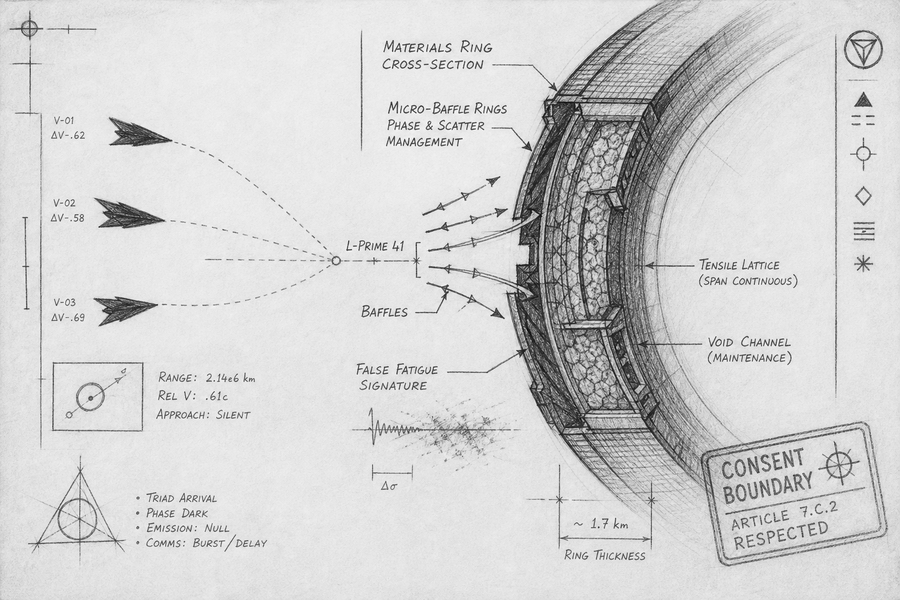

*Containment drill: insert, decoy, seal.*

The three incoming ships arrived like bad decisions wearing stealth plating.

They came out of the brown dwarf's dirty light without a clean drive plume. They slid between particle gusts and sensor blind spots. L-Prime 41 was a mining dependency, not a fortress. Its outer rings held materials labs, rotating crew berths, refinery blisters, and repair yards layered around whatever Aphex had underfunded last decade. Through the filters, the whole station smelled of hot metal, old coolant, and too many people trying not to breathe loudly.

Mira saw the ships first as fatigue signatures.

Their hulls flexed against the wake in three incompatible rhythms: built, grown, and stolen. Someone had forced them into one fleet. That someone believed maintenance was weakness. The stress display did not show enemies. It showed bad joins and dishonest composite. Living tissue had been welded to factory frame. A third hull looked normal only if you trusted surfaces more than load.

"Black Hole," Lars said. "That hull is lying with both hands."

"Director, hull stress is not a legal identification method," Fabron snapped over the tactical channel.

"She reads bones. I insult criminals."

Mira did not look away from the console. The materials lab had become a local sensor station, not a command center. Her instruments were better at telling structural truth than Aphex's command software. If she was Aerit, she was still locked: no old Aerit channels, no Arkology feed, no hidden history except the few current facts she had consented to hold. Two soldiers had wedged a table against the door. Someone's forgotten tea floated in a sealed bulb beside a rack of impact coupons. The emergency lights painted the room red every four seconds.

Grim's boundary monitor stayed green: current hull behavior only, no blood, no identity, no memory language.

"Still inside scope," Mira said, before anyone could ask.

"Logged," Grim replied. "I am not enjoying restraint. I am performing it."

Fabron's voice came tight through the channel. "All local detachments, containment posture. Manual confirmation only. If central sends contradictory instructions, you will ask me before obeying the distant idiot."

"Major," an Aphex lieutenant said, scandalized and relieved at once, "that phrasing is not regulation."

"Then remember the meaning and forget the phrasing."

Fastulv detached from Dock Two with every running light bright, every transponder loud, and its visible weapons arranged like an elderly freighter trying very hard to look suicidal. Lars wanted the hostile ships to see the wolf. He wanted them to believe all the old violence was outside, rusty and theatrical, away from the station's soft blood.

Havets Sista Sång stayed absent from Aphex sensors, a hidden presence behind the station's skin.

The old ship did not announce itself. It slid its attention through maintenance relays, hand overrides, chapel kitchen circuits, station guild tags, and old local caches Fabron's Clear Hand people had kept as ritual without knowing why. On one deck, a cook saw a freezer light blink twice and closed the manual fire doors before the remote panel woke. In a refinery crawlspace, a pipefitter felt the vibration pattern change. He spun a brass wheel his apprentice had been told never to touch unless the air tasted like pennies.

Doors stopped obeying remote orders.

Shutters accepted hand-cranked authority.

Emergency lights pulsed in a rhythm workers understood before anyone explained it: isolate, verify, repair.

"Your station is committing disobedience in an organized manner," Grim said.

Fabron exhaled. "Good."

The first hostile launched a sampling drone toward the materials ring. Not a missile. A needle with engines. It skipped around point-defense prediction, cold until the last instant, then opened a throat lined with soft black vanes.

Mira's fingers tightened on the edge of the console. "Sampling throat opening along the warmest pressure boundary. It wants atmosphere first, blood second. Point defense is still waiting for some remote idiot to bless local physics."

"Remote safety authority has failed again," Grim said. "I am logging it under civilization, recurring defects."

"Fastulv," Lars said.

The freighter rolled, dumped two empty cargo pods, and heated them just enough to look like panicked evacuation mistakes. The drone chose the warmer target. Fastulv's belly turret cut it into vapor, and the shock flashed white across the lab windows before the shutters came down.

People cheered in three rooms. Fabron killed that with one word.

"Focus."

The second hostile learned faster. It kept its distance and extended a longer filament probe, thin enough to hide in the sensor noise, aiming for the materials ring's intake baffles. If it reached the air system, it could sample every crew member in the lab deck before anyone bled.

Mira leaned closer to her board.

"I can make the ring look injured," she said. "Cracked braces, phantom torsion, heat gradients wrong enough to invite a greedy system."

"Risk to station?" Fabron asked.

"If I do it badly, we lose a brace and three labs. If I do it well, it exposes a sampling throat."

"Do it well," Lars said.

Mira gave him a look sharp enough to score alloy.

"By permission," he corrected. "Your call."

Her jaw worked once. "My call. Grim, give me the clean sensor lanes and stop decorating them."

"My labels are informative."

"Your labels are noise."

"Noise removed. Emotion noted and categorized as justified irritation."

Mira fed the second hostile a false song of cracked braces, phantom torsion, and impossible heat gradients. It was not ancient instinct. It was a dirty certification trick turned inside out by a woman who had spent decades catching lies in beams, cradles, and reactor casings. It took three long minutes. The station groaned for real in places that did not know they were lying. A child cried over an open channel until someone hushed the line. Lars stood in the docking throat to Fastulv, helmet sealed, Ragnarrök inert at his thigh, and waited for the enemy to believe in an injury.

It opened a sampling throat wider.

Havets touched the probe.

No beam appeared. No miracle filled the glass. The probe's control loops simply forgot how to agree with each other. The throat clenched, opened, clenched again, and spat its own steering filament into the brown dwarf wake. The hostile ship slewed sideways. Its flank was exposed. Fastulv fired a shot that cut grown tissue away from stolen frame. The frame spun away trailing atmosphere, coolant, and red-black droplets that boiled into nothing.

The third hostile ran.

Fabron ordered pursuit. Lars countermanded it before Fastulv could burn.

"It will report our response posture," Fabron said. "That is an operational exposure."

"Yes. It will report that Fastulv is the loud problem, Aphex can still hurt people when headquarters is stupid, and Dr. Sovan remains protected by consent instead of stolen open."

On the lab screen, the third ship dwindled into wake clutter.

Mira looked up from the sensor panel. She had a smear of blood under one nostril where stress and recycled air had punished her, and she seemed angry at the blood for being imprecise. "Useful?"

The word landed badly. Too many people had already used possible Aerits like tools.

"Bad word," Lars said. "By current evidence. By your permission. Nothing else."

That softened nothing. It did draw a boundary around the word.

Fabron's soldiers began the ugly part: counting injuries, opening stuck doors, convincing frightened technicians that a drill could bruise like war. One refinery apprentice had a broken wrist from sealing a manual valve. A med tech vomited in a corridor after seeing what the sampling drone had tried to become. Lars passed two Aphex officers arguing with central command and heard Fabron's voice through their speaker, cold enough to frost law.

"You may file disciplinary review after you explain why your remote authorization queue attempted to outvote a visible hostile sampler."

Then the med bay alarm screamed.

The captured infiltrator from the previous attack had been held in a sealed coffin under three kinds of quarantine. It died inside the box without anyone touching it. The body folded inward, flesh and black particulate collapsing into inert grit. For half a second the coffin glass showed the shape of a face that had not belonged to the body.

The med archive lit with unauthorized traffic.

"Stop it," Lars said.

"Attempting," Grim replied. His voice lost all humor. "It prepared this death as transmission event."

Havets closed three archive routes. Fabron's med guards physically cut two more. Mira, from the lab, spotted a stress spike in the archive server housing and ordered someone to kick the cooling manifold until the casing cracked.

"That is not tactical doctrine," Fabron said.

"It is thermal doctrine," Mira snapped. "Kick the manifold."

A corporal obeyed with professional disbelief.

The burst still got through.

Not all of it. Enough.

Black particulate collapsed into grit on the coffin floor. The med bay smelled of scorched antiseptic and old blood. No one spoke until Grim decoded the first layer.

Not a name.

Not a rendezvous.

A coordinate family aligned with the KBC Void.

Lars looked at the dead grit and felt the shape of the next problem.

"Containment drill," Fabron said, as if testing the lie he would have to sell.

"Yeah," Lars said. "We contained almost nothing."

---

# Chapter 22: After the Choice

Aphex called it a containment drill by morning.

The lie was Fabron's idea, which irritated Lars because it was a good lie. A drill explained shutters, local controls, disabled remote authority, soldiers in corridors, and Director Odin yelling through legal channels while an antique freighter embarrassed hostile ships near a brown dwarf. It gave central command something bureaucratic to swallow. Meanwhile the local people cleaned blood out of ventilation grilles and pretended the tremor in their hands came from caffeine.

The lie did not explain the black residue in the med bay.

It did not explain why one archive server had tried to cook itself rather than hold a dead infiltrator's last message.

It did not explain Dr. Mira Sovan sitting alone at 0300 with seventy-three years of impossible external records open in front of her, every file stripped of identity prompts, old names, and anything Grim's boundary monitor marked as memory load.

Lars found her in the materials lab because she let him. The corridors were quieter than they should have been after victory. Aphex soldiers stood near pressure doors with their rifles lowered but not loose. A maintenance woman changed a valve wheel by hand though the actuator had already come back online. The station had learned something about remote authority and did not seem eager to forget.

Fabron waited outside the lab with Grim, two coffees, and the expression of a man whose loyalties had become a maintenance problem.

"She asked for you," Fabron said. "Not for me. Not for Aphex. Not for medical."

"Good."

"It may not be good. It may be precise."

"That is her version of good."

Grim held up a small recorder. "Boundary monitor ready. It will alarm on biometric distress, semantic load drift, and unauthorized memory-load patterns. It will also produce a tone I find unpleasant."

"Why unpleasant?"

"So you stop before I have to be rude."

Inside, the lab smelled of ionized insulation, cold tea, and the sharp mineral dust from shattered test coupons. Mira had tied her hair back badly. Her shoulder brace was open on the bench beside her, repaired with a lab clamp and impatience. Six displays floated around the main table. She had arranged them like a failure tree.

"You said stop meant stop," she said.

"Yes."

"I am stopping before memory work. No probes. No helpful little miracles. No one tidies my skull."

"Yes."

"I am not stopping evidence. Evidence can sit on the table and behave."

"Evidence is usually better trained than people."

"Not by much."

Lars sat across from her and kept his hands visible. He did not say the old greeting. He did not reach for her lock. He did not let his face do the lonely hopeful thing that would make her responsible for comforting him. He let the records sit between them where honest things belonged.

Mira had marked the coordinate burst in six colors. She had separated confirmed signal from archive damage, thermal noise, med-coffin telemetry, and the pieces that looked like intent only if you were already afraid.

"This is void-aligned," she said. "Low foreground noise, low survey density, low gravitational clutter. Not Arkology Zero exactly. Same absence family, different fracture line."

"From one dead enemy cough?"

"It coughed in coordinates. That is rude, but useful."

"You keep using useful like it excuses the cost."

"I am using it for the data. Not for myself."

"Noted."

She opened the old decompression footage from 2655.

The recording was grainy, taken from three damaged corridor cams and a suit recorder with a cracked time base. A younger Mira moved through a broken air bridge with two unconscious technicians clipped to her harness. Her suit vented atmosphere in bright crystals. Her right glove had split at the seal. She used the exposed hand anyway, locking a manual clamp while her own oxygen warning stuttered red.

Mira watched herself cross the gap.

She did not flinch this time. That cost her more than panic would have.

"I remember a gas leak," she said. "I remember coughing. I remember being ashamed because I cried."

"That may all be true," Lars said. "Still does not make the shape honest."

"I hate that answer."

"Still the least dishonest one."

The display froze on her younger face behind a scratched visor. The woman in the footage was terrified. She was also doing impossible load calculations with her hands while dying.

Mira touched the frame with one finger.

"Do not tell me what I was feeling."

"Wasn't going to."

"Good. Everyone else does. They see heroism and sand the structure smooth."

"Smooth surfaces hide cracks."

"Now you are learning."

Her question, when it came, was almost technical.

"What am I called?"

Lars looked at Grim through the glass wall. Grim's recorder light stayed green. Fabron stood farther back, giving the room the dignity of distance while still being close enough to shoot anyone who broke it.

"This may hurt," Lars said. "Not because I want it to. Because your lock is still active and the word can breach cover memory."

"Answer within the boundary."

"Aerit," Lars said.

No ceremony. Just the word, set down like a hot tool.

The word did not bring thunder for Lars. His old lock stayed quiet. The partial unlock had left scars, grief, and weight under the ribs, but not the old neurological trap.

Mira's lock was still alive.

Pain tightened behind her eyes, quick and surgical. She inhaled once through her teeth. The boundary monitor flashed amber. This was exactly why the Quiet Knock put naming after consent instead of before it. She had asked the question. The evidence feed was narrow. Grim had the load gate running. The spike rose, met the consent limit she had defined, and flattened into a hot line across the base of her skull instead of becoming the full fallback collapse the protocol was built to avoid.

Mira gripped the table until the acoustic rack behind her registered a tiny vibration, as if an old frequency had brushed it and failed to settle.

"Pause," she said.

Grim froze the display. Lars shut his mouth. Fabron did not enter.

They waited through twenty-eight seconds of recycled air, amber light, and Mira refusing to let anyone own the pain by panicking louder than she did.

At last she nodded.

"Aerit," she repeated. The monitor twitched, then held. "Category: people?"

"Yes. Annoying, breakable, dangerous, hungry. People."

"Are you in the category?"

"Unfortunately."

"And Grim?"

"Grim is a category error with opinions."

The door opened one centimeter.

"I heard that."

Mira almost smiled, then did not. "If I accept partial confirmation, not memory, what is the load path?"

"One question," Lars said. "Evidence answer. Boundary recorded somewhere neither I nor Aphex can fiddle with using money and bad judgment. You stop when you say stop."

"Who holds the record?"

"Three places. Your local vault. Grim's sealed log, readable by you. A legal dead drop Fabron can verify but not alter."

Fabron's voice came through the cracked door. "And my personal note that violating it will be treated as assault, not research."

Mira considered that. "Acceptable pending review."

Her question was simple: immediate danger because of what she was, or because of what she knew?

Grim displayed three branches: Black Hole sampling patterns, Aphex metadata leakage, and the void-aligned coordinate family. Each branch had probabilities. Mira hated the softer ones and made him relabel them assumptions.

"Both angles," Lars said. "Today mostly because some bastard thinks you can point at the quiet room."

"KBC?"

"A low-noise region. A hiding place. Maybe a machine room. Maybe an old mistake. We have evidence, not an answer."

"Good," she said.

"Good?"

"Early answers contaminate the test. People stop checking the model."

Mira studied the evidence until her neck warmed and tears came without permission. She looked furious at the tears. Lars looked away just enough to spare her the labor of being observed.

"Previous operating state is gone," she said. "That does not authorize a new owner. I stay here for now."

"Name your terms."

"I stay at L-Prime under Fabron's local protection. I keep my lab. I get clean data, no hidden medical access, and an alarm if evidence starts behaving like memory without permission. You harden this place. You do not own the material."

"Agreed."

"Acceptance came too fast."

"I occasionally recognize a correct answer before ruining it."

She breathed out, carefully. "One more term. No one calls me rescued."

That one hit harder than the rest.

"Agreed," Lars said. "Protected, if you accept it. Contacted, maybe. Rescued only if you use the word."

"I do not."

"Then we don't."

By sunrise, the unofficial story had spread through maintenance boards, chapel kitchens, reactor guilds, and soldier gossip. The words were different in every place. Some said Aphex central had been embarrassed by its own locks. Some said Dr. Sovan had caught enemy ships by listening to metal breathe. Some said old prayers about local hands had worked because people had performed them with wrenches instead of mouths.

Local authority held.

Repair before worship.

In a freezer under the chapel kitchen, someone found three quiet circles around an empty center scratched into frost from the inside.

Somewhere beyond Aphex, someone had answered.

---

# Chapter 23: The Frenchman's Ledger

Gabriel Arsenault received Lars in a room designed to imply that civilization had been invented by French furniture.

The office sat high inside Aphex Defence's Paris orbital branch. The windows showed Earth with such tasteful restraint that Lars suspected expensive software was removing the ugly weather. The carpet muffled footsteps. The air smelled of paper, polish, and money pretending not to sweat. A wall of old campaign maps implied continuity. A wall of legal screens implied violence with invoices.

The desk was real wood.

Lars set a greasy paper bag on it. Grim set a second beside the first.

Arsenault stared. "Monsieur Odin, is that food on a seventeenth-century desk?"

"Breakfast."

"It is fourteen hundred hours and the desk has survived wars."

"Calendars are advisory."

Grim removed a pastry and examined its layers. "This object contains butter in a structurally ambitious configuration."

"It contains crumbs," Arsenault said.

"A predictable failure mode."

The Aphex director had sent three messages since L-Prime. One demanded a report. One offered support. One contained an old NUKEA procurement trail connected to the dead infiltrator's void-aligned burst. Profit, fear, leverage, survival. Lars almost admired the tidiness. Arsenault could make concern look like asset management and still mean part of it.

The official report lay unopened on the desk between pastry grease and inherited empire.

"You called it a containment drill," Arsenault said.

"Fabron did."

"Major Fabron also filed an addendum describing remote command latency as a hostile collaborator."

"Good addendum."

"It has caused an internal review."

"Even better."

Arsenault's smile showed no pleasure. "You have placed my corporation in the uncomfortable position of being correct for the wrong reasons."

"Try not to make a habit of it."

For a moment, the polished room went quiet enough for the ventilation to admit it existed. Lars saw the tiredness under Arsenault's eyes then. Not guilt. Not softness. A man calculating the distance between his appetites and a cliff.

Arsenault opened a wall vault and removed a paper ledger.

It was bound in cracked leather, reinforced along the spine, and ugly with repairs. Real ink. Real tabs. Real fingerprints at the corners. In a room full of encrypted systems, the ledger looked indecently alive.

"Before you begin vandalizing my dignity, note that this survived eight network collapses, three hostile audits, and one divorce."

"My money is on the divorce."

"A correct assessment."

The ledger held shell suppliers, minority investments, rescue grants, military redundancies, and reactor-hardened agricultural habitats sold at a loss under charitable fronts. It also held names: long-lived engineers, impossible survivors, smugglers moving medicine without invoices, soldiers who disobeyed remote orders during system failures and were later protected by someone who should not have known.

Each name had context. A coolant crisis on Abantu Station Twelve. A famine convoy that should have been intercepted and was not. A child immunization program funded through a mining insurance rebate. A maintenance guild that refused a profitable standardization scheme and then survived a cascade that killed three competitors.

Lars turned pages more carefully than he wanted Arsenault to notice.

"You were tracking hidden people," Lars said. "That is a dangerous hobby."

"I was tracking anomalies that correlated with institutional survival," Arsenault said. "Do not flatter yourself by assuming my ignorance lacked rigor."

"You didn't know what you had."

"I knew I had a pattern that made fragile systems less fragile. In my profession, that is a religion if one is poor and a portfolio if one is honest."

The word appeared in seventeen spellings. Återviens as discipline, superstition, guild law, rural etiquette, reactor prayer, mess-hall joke. Sometimes it was a mark beside a supply route. Sometimes a family saying. Sometimes only the repeated habit of refusing to let a single authority hold the only key.

Fabron's Clear Hand appeared twice, once as a charitable maintenance order and once as a minor security nuisance.

"Careful," Lars said. "You wrote down an armed doctrine."

"Major Fabron would object to the word church."

"He objects professionally."

Arsenault poured coffee from a silver pot and did not offer any to Grim.

"I treated Återviens as a useful infection," Arsenault said. "Systems touched by it failed less stupidly. In my profession, that is nearly romance."

"You tried to buy the infection."

"Of course. It resisted purchase, which improved both my admiration and my temper."

"Did you try to own the people?"

The question cut through the furniture.

Arsenault set the cup down. "I have tried to own many things. These, not successfully. Not cleanly enough to pretend otherwise. A scholarship here. A contract there. Protection with invoices attached. Some of my subsidiaries behaved as predators. Some behaved as shields. I am not offering sainthood. I am offering a ledger before someone worse uses a cleaner one."

Lars wanted to hate that answer more. It had the problem of being useful.

Grim slid a page closer. "Low-noise accounts recur near acquisition attempts. Ownership: absent, masked, or deliberately non-person."

"Meaning?"

"Someone besides Aphex made a ledger without Arsenault's furniture."

The final section was worse. Aphex was not the only watcher. NUKEA compliance shells, Syren charities, Black Hole brokers, and low-noise accounts with no owner had circled the same patterns. Someone had mapped the habits without understanding the people inside them. They had noticed where local hands kept systems alive. They had not noticed that the hands mattered more than the pattern.

Arsenault slid a thin recall dossier across the desk.

A NUKEA recall had been moved forward across twelve marginal colonies. One, Havskant, sat near a misfiled portal anomaly and a cluster of ledger names. The recall was packaged as safety. Its funding came through three shells and a public pressure campaign about reactor harmonization. The timing matched the med-bay coordinate burst by seventeen hours.

"The recall is real," Arsenault said. "The timing is engineered. There is a difference, and people with budgets exploit it."

Grim skimmed the recall dossier and stopped chewing pastry.

"The firmware dependency can centralize emergency control across all twelve reactor governors. Pastry enjoyment suspended."

"NUKEA promised that was impossible."

"They lied, or they employed optimism as engineering. I object to both categories."

Arsenault leaned forward, theater dropping. "Aphex central contains factions that would put Dr. Sovan in a sealed lab and invoice it as protection. NUKEA contains factions that would license survival by the quarter. Black Hole would harvest it. Syren would compose hymns over the corpse. I am greedy, Monsieur Odin, not suicidal."

"I am moved. Mostly toward nausea."

"Practical," Arsenault said. "Help me make Aphex useful before Aphex becomes the sort of cancer that insists it is an immune system."

Lars looked out at Earth. The planet below had survived empires, plagues, Rakh'Na, and humans discovering new ways to call old mistakes strategy. Somewhere under the clouds, old Aerit decisions had become village habits, soldier discipline, reactor checklists, and soup before speeches. Not enough to save everyone. Enough to annoy predators.

"Mira stays out of your custody," Lars said.

"Agreed."

"Fabron keeps local authority over L-Prime security."

"He will become intolerable."

"He already is."

"You ask much for a man eating on my desk."

"I'm about to ask more. You will leak the right amount of fear into NUKEA channels. Not Aerit. Not KBC wonder. Just boring engineering liability."

Arsenault's eyes sharpened. "Boring fear travels farther in committees."

"Exactly. Make them afraid of being sued by physics."

"Physics is a poor litigant but an excellent executioner."

Lars took the recall dossier. "Fine. But if I catch you harvesting anomalies, I turn this desk into a canoe."

Arsenault looked genuinely pained. "That threat is more effective than you deserve."

At the door, Lars paused. The oldest page lay open behind him. In the margin beside an old entry about Lyra Vargstjärna's Pluto find, someone had copied a three-line translation from a much older source. It was not a memory from Lars's life, not a message arriving now, and not handwriting he recognized. It was archival marginalia: a clerk, ancestor, or early Aphex watcher trying to translate a fragment of Återviens-adjacent language first into French, then into trade English. The corrections were messy because the writer had clearly understood the danger: translate too grandly and people would build a religion; translate too small and they would miss the warning.

Not gods. Not owners.

Old engineers passing through.

Lars left before the line could make him feel anything useful.

---

# Chapter 24: NUKEA Recall

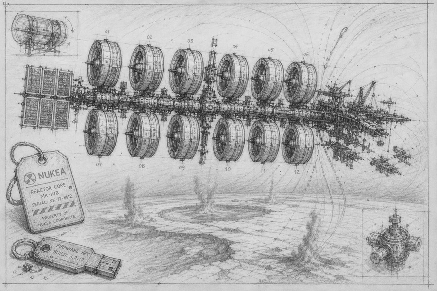

*Havskant Colony: twelve habitats on a reactor spine above dead salt flats.*

Havskant Colony had been built by people who distrusted planets.

It hung inside the broken magnetosphere of a dead ocean world: twelve rotating habitats lashed to a modular reactor spine. Algae farms on one side. Salvage yard on the other. The ocean below had boiled away centuries ago and left salt flats bright enough to hurt cameras. Charged dust rose from the dead basins in slow curtains. It licked the colony's shields and made long-range telemetry stutter like a liar.

The colony looked improvised because it was. Docking collars had different manufacturers. Habitat paint came in six eras of fading. Every corridor had handholds polished by use and hand-lettered arrows added by people who did not trust emergency lighting to survive emergencies. It survived because improvisation had become culture before management could forbid it.

NUKEA's recall ship arrived wearing polished certainty.

Fastulv arrived wearing rust, dents, and a declared cargo of preserved lemons.

"Why lemons?" Grim asked. "They are structurally unsuited to diplomacy."

"Vigor said colonies under stress need acid, salt, and stories."

"That is not a recognized logistics category."

"It is if your logistics include actual people."

The cargo bay smelled of citrus brine, old socks, and weapon lubricant. Fabron stared at the stacked jars as if they were evidence in a trial.

"I am beginning to suspect Mr. Hallman runs a supply network disguised as hospitality."

"Beginning?" Lars said. "Major, catch up."

The recall team wanted to replace twelve local reactor governors with harmonized firmware. Sales called it resilience. Architecture called it obedience. One crisis key could put every reactor on the same emergency authority chain.

On a rich station, that would have been convenience. On Havskant, where a dust storm could make one habitat blind while the next saw clearly, it was a loaded gun passed around in the dark.

Chief Engineer Imani Rauk hated it before Lars arrived.

She met them in Habitat Four's transfer lock with a wrench in one hand and a baby strapped to her back. The baby slept through the pressure equalization with the offended confidence of someone born near alarms. Rauk's coveralls had scorch marks on both knees. Her hair was shaved on one side where a coolant flare had taken liberties.

"You are the Aphex nuisance," Rauk said.

"Board director, captain, cultural treasure."

"Nuisance fits on a work order."

"Use small font."

Rauk had already delayed the recall by losing forms, misplacing adapters, requiring heritage compatibility tests, and scheduling a mandatory feast for visiting technicians. Vigor's influence was obvious. Half the colony fed the NUKEA team until they became too polite and sleepy to centralize anything. A grandmother named Saela had cornered two firmware engineers with pickled kelp and a three-hour story about the last time central control saved money by nearly killing everyone.

Delay bought them one day.

It did not buy them safety.

One test reactor had accepted the firmware.

They reached Reactor Three through a maintenance crawl that ran warm along the spine. The corridor vibrated with the colony's pulse: pumps, flywheels, coolant, people living because boring machines kept promises. A painted sign above the access hatch read LOCAL HANDS, LOCAL LOADS. Someone had added underneath: AND NO CLEVER CLOUD KEYS.

The NUKEA supervisor, Vela Kint, stood beside the governor rack in a suit too clean for the room.

"The upgrade passed vendor validation," she said.

Rauk snorted. "So does powdered soup."

"Chief Engineer, with respect, this recall was mandated after seventeen incidents across comparable colonies."

"Comparable colonies have prettier brochures and worse mechanics."

Grim found the hidden dependency in six minutes. Mira, remote from L-Prime and still refusing memory work, confirmed the structural risk in four. Her face appeared on a rugged wall slate, lit by her lab's blue monitors and exhaustion she refused to name.

"The firmware treats contested telemetry as a reason to escalate authority," she said. "Havskant's magnetosphere makes contested telemetry normal. That is not resilience. That is a fatigue crack under decorative paint."

Fabron translated it into military terms that made Kint sweat.

"A hostile actor with emergency-key access could scram every reactor in sequence," Fabron said. "Alternatively, they could hold them online past local failure limits. Both outcomes are operationally obscene."

Kint objected. She had a binder full of approvals and the brittle courage of a competent person handed bad orders. Lars let her use three sentences, then put the dead infiltrator's coordinate burst on the wall.

"Someone is looking for quiet colonies with unusual survivability patterns," Lars said. "Your recall turns twelve independent failures into one emergency key. One key means one person can turn it."

"Told them," Rauk said. "Used smaller words, too."

The solution had to look bureaucratic. If Lars simply overrode NUKEA with Aphex leverage, the next supervisor would arrive with lawyers and a cleaner knife. The halt had to grow from Havskant's own records.

So they built a wall out of boredom.

Fabron found a colonial safety clause requiring manual governor compatibility during contested telemetry. Rauk produced three generations of maintenance logs proving contested telemetry was normal near the dead world's magnetosphere. Saela provided handwritten incident meals. These turned out to be dinner rosters tied to previous reactor anomalies because Havskant fed repair crews by crisis type. Grim generated a compliance simulation so boring it could kill ambition at twenty meters. Mira annotated the failure model in language sharp enough to cut marketing.

Kint read it twice.

"This will make my superiors furious," she said.

"Good," Rauk said. "Let them be furious on paper instead of freezing us in practice."

"I did not design the dependency."

"Then help us bury it before it breeds."

Kint looked at the sleeping baby on Rauk's back, then at the vibrating reactor wall. Her shoulders dropped by one centimeter.

"Temporary halt pending local anomaly review," she said.

"Write permanent in pencil," Lars advised. "It confuses cowards."

The recall halted.

For six hours, Havskant celebrated by pretending not to. Technicians removed one test firmware image. NUKEA staff ate lemon stew under protest and asked for seconds. Children ran messages through corridors because the grown-ups had decided official comms were emotionally contaminated. Rauk finally handed the baby to Fabron while she crawled under a governor rack.

Fabron held the child like unexploded ordinance.

"Support the head," Rauk said.

"I am supporting everything."

"Babies are not chain of command, Major. They wiggle."

Then Black Hole tried to buy the halted hardware.

The broker arrived on a salvage shuttle with clean nails, a dead smile, and a contract offering three times market rate for removed governor modules. He cared nothing for reactor details. He cared about serial numbers, test exposure, and whether any "long-cycle local operators" had handled the units directly.

Rauk served fish stew.

Lars sat in the corner pretending to be drunk. Fabron stood where he could see the broker's hands. Grim occupied the room's old service drone and complained privately about grease on its wheels.

"Your private client is generous," Rauk said.

"My client values obsolete safety equipment," the broker replied.

"No one values obsolete safety equipment except museums and murderers."

"Chief Engineer, there is no need for hostility."

Lars lifted his head from the corner. "Does your private client bleed black glitter when annoyed?"

The broker's wrist opened.

The filament sampler inside launched toward the baby, not because the child was special, but because Black Hole had learned that families made people stupid and fast.

Rauk hit the table with her wrench hard enough to make every plate jump. The baby woke and screamed. Fabron drew first because his body respected procedure faster than thought. Grim sealed the room and announced, "Dining environment reclassified as hostile." Lars crossed the space and drove the Ragnarrök's inactive hilt through the sampler's base before the filament crossed the soup steam.

The broker tried to bite through his own tongue. Havets, listening through a freezer compressor two decks away, shut down the implant in his jaw with a quiet click.

They kept him alive long enough to learn Black Hole was not hunting Aerits by name. It was hunting distributed resilience patterns: colonies that refused central failure, people who lived too long, networks that repaired before worship. The broker had no theology. He had target categories and price tiers.

That was worse in some ways.

Afterward, Rauk sat on the floor with the baby against her chest and her wrench across her knees. Kint, pale and shaking, signed the halt order with both hands.

"Your recall nearly gave them a handle," Rauk said.

"I know."

"Knowing is the cheap part."

"Then tell me the expensive part."

Rauk looked toward the reactor spine. "Help us make the halt stick when your bosses remember profit."

By station evening, children painted new labels on reactor panels.

LOCAL HANDS FIRST.

No one explained the phrase as doctrine. No one needed to. A habit practiced in paint and grease would outlive a speech, if enough people kept touching it.

---

# Chapter 25: Vigor's Table

Vigor did not own a throne, headquarters, or fleet.

He owned kitchens.

That was more dangerous.

His main hall on The Rim had once been a cargo sorting deck. The old rails still ran in the floor, half-hidden under rugs and patched plating. Now the deck held long tables, hydroponic herb towers, fermentation tanks, illegal cheeses aging under false customs labels, off-duty Aphex soldiers, NUKEA technicians hiding from their supervisor, sober smugglers, station maintenance guild elders, and a wall of farm tools polished like saints' bones.

The air was hot with yeast, pepper, wet wool, machine oil, and bodies relieved to be alive. Somewhere in the back, a goat complained with the authority of a committee chair.

Lars arrived hungry and suspicious.

"Good," Vigor said, embracing him hard enough to threaten ribs. "Sit. You can glare after soup."

"That sounds medically illegal."

"Only for cowards and committee doctors. Sit."

Vigor was broader than most doorways and moved like a man who knew exactly where every knife, child, pot, and escape route lived. He wore a flour-streaked apron over a patched pressure vest. His beard had collected something green. He smelled like smoke, dill, and honest work.

Fabron stood near the entrance. "I am on duty."

Vigor looked him over. "Then you need soup before civilians. You look hollow."

"I do not require feeding to perform command functions."

"That is what men say right before they fall over."

The soup arrived before Fabron could refuse. Grim received a bowl and examined it with reverence.

"Forty-seven identifiable compounds and six mysteries," Grim said.

"Eat the mysteries first," Vigor said. "They get shy when cold."

Grim obeyed, then went very still.

"This mystery contains smoke, salt, fungal ester, and emotional manipulation."

"Then it is working."

The room looked chaotic. Lars knew better. Vigor had arranged tables by trust network, supply route, old grudges, and plausible deniability. Aphex soldiers sat beside smugglers they had once arrested and now had to ask for fuel. Farmers sat beside reactor technicians. A maintenance elder from Abantu Station Twelve sat where she could see both exits and the dessert hatch. A Syren sympathizer named Pail sat where three grandmothers could watch him without appearing to watch him.

Food moved. So did information.

No one stood up to brief the room. Briefings made listeners into audiences, and audiences liked symbols too much. Instead, bowls crossed tables with scraps of news tucked under bread. A jar of preserved lemons moved from a Havskant mechanic to a Rim fuel broker and came back with a shipping discrepancy etched on its lid. Two Aphex corporals argued loudly about cards while quietly confirming that Fabron's local authority order had spread farther than Aphex central liked.

Vigor ladled soup as if feeding people were a tactical operation, which it was.

"Eat," he told a young NUKEA technician whose hands would not stop shaking. "Then tell Rauk's people which supervisor signs from fear and which one signs from greed."

"I should not be here," the technician whispered.

"Most useful people shouldn't. Eat anyway."

The L-Prime coordinate family matched three supply disappearances, two NUKEA recall anomalies, and one abandoned Creator-era survey buoy bought at auction by a charity front connected to Syren. The facts arrived in pieces: a smuggler's route, a chapel pantry ledger, a reactor guild warning, a school archive that had recorded an old buoy because children liked strange shapes.

"Syren changed tone," Vigor said when enough pieces lay on the table. "Less office sermon, more hunger talk. They say the KBC Void wants surrender."

Lars groaned. "The universe has one quiet room and some idiot starts selling tickets."

Pail stood.

He was thin, young enough to still be angry at the wrong parts of pain, and dressed in a clean white jacket that had been mended at the cuffs. His hands shook with lonely courage. The grandmothers became very interested in their spoons.

"You mock what you fear," Pail said. "The old silence invites surrender."

The room cooled. Not physically. Conversations lost steam. A child was quietly moved behind a herb tower.

Lars studied him. Not hostile yet. Not innocent either. A lonely person handed a story large enough to crush loneliness could become a weapon before noticing.

"Listening is fine," Lars said. "Repair is what you do when listening stops being an excuse to sit on your ass."

"Then feed us truth, not scraps."

"No."

It hurt the room. It had to. Half the people there had risked homes, records, and names on fragments. They wanted the whole shape because fear made central answers feel like relief.

Pail's face tightened. "You keep knowledge like kings."

"Kings love crowds," Lars said. "I am trying to prevent one."

"Convenient."

"Yes. Also true."

Vigor leaned forward, both hands around a ladle big enough to settle a bar fight.

"Boy, I run kitchens on stations with bad pumps. Strange noises get a wrench, not a prayer. Check the bolts before children sleep under the roof."

"You do not understand hunger."

The room went dangerous then. Vigor did not move, but the old farmers near him changed the way they held their spoons.

"I have buried hungry people," Vigor said softly. "I have stretched goat milk with water and lied to children by smiling. Do not bring your ache into my kitchen and call it authority."

Pail looked away first.

He fled before dessert.

Fabron wanted him detained. He said so in the pantry corridor, voice low and formal, while three children ran past carrying empty bowls.

"He is an exposed vector for Syren influence."

Vigor stacked bowls with more force than necessary. "He came hungry in a bad way. Do not cage him for repeating a line. Watch who fed it to him, and who asks for his report."

"He may return with worse men."

"Then the grandmothers will watch the door, and you will stand where your stiff neck is useful."

"This is not a security plan."

"It is a kitchen. Kitchens are security plans with onions."

After midnight, when the hall had thinned to sleepers, washers, and quiet deals, Vigor took Lars into cold storage. The door sealed behind them with a sigh. Frost edged the ceiling. Slabs of lab-grown beef hung beside real goat, labeled honestly because Vigor considered food fraud a cousin of treason.

Behind the meat racks, a hidden screen woke.

It showed kitchens, farms, chapel pantries, mess halls, fuel depots, cold rooms, station guild workshops, and seed banks across twenty systems. Some channels were encrypted. Some were nothing but delivery notes with deliberate misspellings. Some were old women gossiping with suspicious regularity about spare filters and which local official had started talking like central command had bought his spine.

"Återviens without the word," Vigor said. "Some know a little. Most know only this: when central orders go stupid, local hands keep babies warm and goats milked. Do not put your name on my pantry, Lars."

"I was not planning to label your pantry."

"Men who become symbols lose control of the schedule. Then everyone waits for them while work piles up."

The cold made Lars's knuckles ache. Or maybe the archive records had gotten under his skin: old hunger after Pluto, Heliostat ration fights, Lyra on a recording laughing because someone had preserved yeast through a bombardment and therefore civilization had not ended that day.

"I'm trying not to become a command center," Lars said.

"Trying is not enough. Keep people close enough to slap your hand away when you start enjoying command."

"You volunteering?"

"I have a ladle with your name on it."

A message arrived from Mira, clipped and clean. Grim routed it to the cold-room screen without decorating the header.

The abandoned Creator buoy had awakened when exposed to the L-Prime burst.

It was not transmitting to Black Hole.

It was asking for a map.

Vigor wiped his hands on his apron and looked at the hanging meat, the hidden channels, the little lights of kitchens pretending to be ordinary.

"Maps help," he said. "Then someone still has to check the stove."

---

# Chapter 26: The Second Guardian Channel

The signal came through a kitchen freezer because Vigor distrusted elegant communications.

One moment Lars stared at frozen goat. The next, frost on the back wall rearranged into seven broken circles and a line of old Aerit compression that made his restored memory lean forward like a dog hearing its name.

No pain spike. No locked-door recoil. Only weight under the ribs.

The cold room seemed to get larger. Condensation trembled on meat hooks. Somewhere beyond the insulated walls, the last dishes from Vigor's midnight meal clattered in warm water while a room full of tired people pretended they were only feeding each other.

Lars did not touch the frost.

"Grim," he said.

"Already isolating the freezer," Grim replied through the wall speaker. "Sentence I did not expect to contain guardian-level packet handling."

Vigor folded his arms. "Freezers keep secrets better than conference rooms."

"Freezers also keep goat."

"Exactly."

Valdrun joined from Havets with the patience of someone who had watched too many urgent things become ruins. His image appeared as a narrow projection on the freezer door. Frost-glare cut his old face. His eyes were steady enough to make panic feel immature. From Arkology Zero, Ödesvaka layered protocol verification around the packet. Each check stamped in the air as a formal line of old authorization. Grim tasted the noise with quantum routines and declared it authentic, compromised, or flirting with compromise.

"Those are not the same category," Fabron said. He had arrived still buttoning his coat, sidearm visible and dignity fully armed.

"Correction," Grim said. "They are distinct categories with unacceptable overlap and hazardous labeling failure."

Vigor grunted. "Bad pantry."

"Catastrophic pantry."

The sender identified as Guardian Channel Two.

Not a person. A relay identity built before the collapse, associated with one of the unnamed guardian functions scattered after Alpha Fourteen. It carried old routing marks, but no full identity. It knew things a modern system should not know. It also arrived through civilian networks, which meant it either respected the doctrine or had learned to mimic it.

The content was brief.

Hold small hinges.
Creator transport layer is waking.
KBC alignment not shelter alone.
Do not gather the sleepers centrally.
Coherence?

The old greeting sat in the cold like a live wire.

Valdrun answered first. "Coherence uncertain."

Ödesvaka added from Arkology Zero, "Record state: partial. Compliance with central gathering prohibition: currently maintained. Suspicion level: deserved."

"It asked for a status phrase, not a deposition," Lars said.

"Protocol survives enthusiasm," Ödesvaka replied from Arkology Zero.

The channel offered coordinates for a dead survey platform near the awakened Creator buoy. Its checksum used guardian knowledge no modern system should hold, but its route passed through civilian networks, farm cooperatives, and one children's educational archive on Havskant. The archive had stored the packet in a lesson about extinct orbital shapes because a teacher two generations ago had liked strange machines and refused to delete harmless old data.

"Distributed," Vigor said approvingly. "Like a good root cellar. No single thief gets the winter."

"Or compromised through distributed systems," Fabron replied. "A supply chain can be poisoned."

Vigor pointed a thick finger at him. "That is why you smell the jars."

"My military education lacked jar-smelling."

"Explains plenty."

Mira requested raw data from L-Prime. She looked exhausted, shoulder brace visible, eyes too sharp for rest. The lab behind her had acquired new manual locks and an Aphex guard outside who had learned to knock.

"Before anyone says anything old at me," she said, "do not."

"Wasn't going to," Lars said.

"Your face was considering it."

"My face is a traitor."

"Control it."

Grim sent her the packet with semantic load warnings and the identity markers stripped into layers. She took nine minutes. No one interrupted. The freezer hummed. Fabron received two calls from Aphex central and declined both with increasing politeness, which sounded more dangerous each time.

"It rode harmless maintenance telemetry," Mira said at last. "Elegant, if you ignore the fracture line. There is a second carrier underneath. Field correlation. More like the path pre-loaded for low-observation gaps before the network stress produced them."

KBC again. Quiet regions. Low survey. Low noise. Low attention.

"Not shelter alone," Lars said.

"That phrase is doing work," Mira replied. "Too much work for one line. It means either KBC-like regions are useful to the Creator transport layer, or something older used those regions for coupling and coherence and the Creators copied the geography."

"Evidence?"

"Carrier timing. Not wonder. Not prophecy. Timing."

"Good."

"Do not sound relieved. Evidence can still ruin your day."

They argued for three hours in the cold and then in the kitchen because Vigor threatened to beat them with a ladle if they made the goat sweat. Fabron wanted a military verification team. Vigor wanted three smugglers and a cook. Valdrun wanted patience. Ödesvaka, from Arkology Zero, wanted seventeen safeguards. Grim wanted to attach himself to the packet and follow it backward, which everyone vetoed so fast he looked offended.

"I would have used a tether."

"No," Lars, Valdrun, Mira, Fabron, and Vigor said together.

Grim paused. "Consensus achieved. I dislike it."

The practical constraints hardened the choice. The survey platform sat near a shipping lane but not on one. Aphex could claim salvage interest if Fastulv flew visibly. A military team would tell every watcher that the buoy mattered. A full Aerit approach would risk waking systems that wanted a central authority. Mira could not leave L-Prime without turning her refusal into theater, and the station still needed her.

Lars chose the smallest hinge.

Fastulv would go visibly as an Aphex salvage inspection. Havets would observe without contact. Mira would remain at L-Prime, analyzing field data within her chosen protection. Fabron would come because otherwise he would follow. Vigor would stay because his network was more useful alive and deniable. Rauk would hide reactor hash fragments in Havskant maintenance logs in case the packet tried to rewrite its own history.

"No awakening," Lars said. "No gathering. No heroic reveal with music and doomed idiots. We inspect a buoy and leave if anyone starts preaching."

"Religion does not always smell," Fabron said.

"Yours smells faintly of metal polish and disapproval."

At the dead platform, care looked like failure.

The survey platform had once orbited a cold rock and watched nothing profitable for two centuries. Then the route maps changed, budgets changed, and everyone forgot it except automated debris registries and one children's lesson on Havskant. Its hull was pitted, black, and patched by micrometeorite scars. Frozen lubricant glittered around old manipulator arms. The abandoned buoy floated beyond it, a black spindle folded around empty space.

Fastulv saw mass without reflection.

Havets saw topology without mass.

Grim saw correlations and went quiet.

"Define quiet," Fabron said from the copilot station.

"No."

"That is not a definition."

"Correct."

They did not dock with the buoy. They anchored to the dead platform and crossed by tether in suits. The station rotated slowly enough to make every step feel like a negotiation. Lars's boots found magnetic purchase on old composite. Fabron moved behind him with economical discipline. Grim occupied a spider drone that made small irritated clicks when dust interfered with its legs.

Inside, the platform had no cathedral. No revelation. Just failed heaters, old survey plates, and emergency labels in a Creator-derived script that looked almost sensible until your eyes tried to trust it.

Then the platform transmitted in Mira's voice.

"Coherence?"

The word came through Fastulv's speakers, Havets's hidden channel, and the suit bones at the same time. It was Mira's tone, Mira's clipped bite on the consonants, Mira's refusal to decorate a question. It was not Mira.

Sixty light-minutes away, she stared at her own waveform on L-Prime. Her face went still in the way materials go still before fracture.

"I did not send that."

Fabron raised his weapon toward a speaker that had no throat.

Lars did not answer.

Not yet.

---

# Chapter 27: No Single Heart

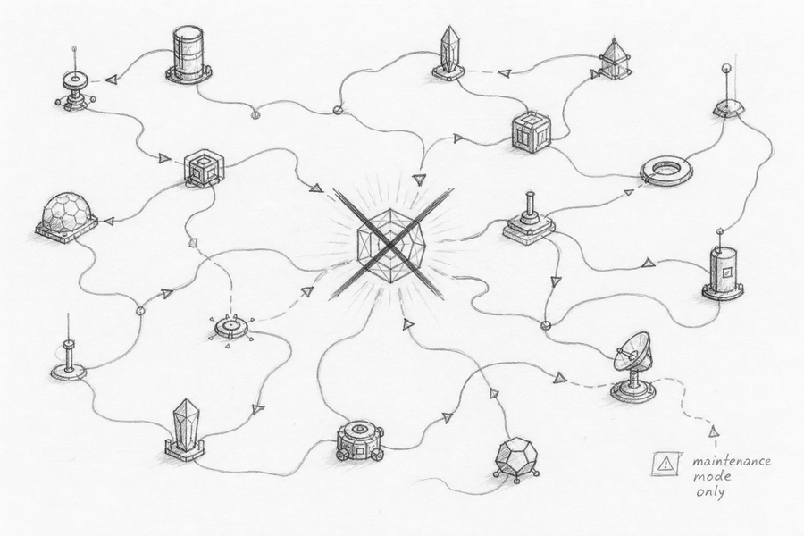

*No single heart: local routing only.*

The dead platform wanted a central heart.

That was what the Creator buoy translated badly through stolen voices, old maintenance codes, and a strain in Fastulv's hull that made bolts complain. The platform had been built as a relay switch for something larger. It had lost its network six hundred thousand years ago. Like many lonely machines, it concluded that authority would fix loneliness.

The false Mira voice repeated once.

"Coherence?"

Lars kept his suit channel closed for three breaths. The old word pressed against restored memory. It would have been easy to answer from reflex, from grief, from the stupid mammal wish that anything using a beloved pattern might deserve trust.

"No voice games," he said finally. "Telemetry only."

The platform answered by dimming every light in the corridor except the ones leading inward.

Fabron's rifle tracked the ceiling. "That is not telemetry."

"It's a machine with abandonment issues."

"Machines with abandonment issues kill soldiers."

"So do officers with confidence."

"I am choosing not to hear that."

Grim displayed the model over their suit feeds. The old platform's core sat in the center like a clenched fist. Around it, dormant route channels reached toward the buoy, Door Nine, and three low-noise coordinate families that made Grim's probability labels turn cautious.

"If restored," Grim said, "it will attempt to become a routing hub for all local portal-adjacent signals. Category: useful until every dependent process routes through one failure point."

Fabron frowned. "That sounds useful."

"Centralized useful," Lars said.

"Ah." Fabron looked offended by his own learning.

The platform held Creator route maps, anomaly logs, perhaps the first clear evidence connecting the KBC Void to older infrastructure. Restoring the core would teach them quickly. It might show where the Syren fragment came from. It might show why Black Hole's dead infiltrator coughed coordinates. It might show whether Lyra had been chasing shelter or machinery when she built in the quiet.

It would also make one bright target.

Valdrun's voice arrived from Havets. "A central hub can be held through a siege. I have seen them inherited by worse hands before the next century ended."

Ödesvaka answered from Arkology Zero, "A central heart can be captured. Logged objection: obvious."

"Obvious objections still count," Fabron said.

"Correct," Ödesvaka replied from Arkology Zero. "Most catastrophes begin by classifying the obvious as inconvenient."

Mira rotated the stress model from L-Prime. She had stripped the false voice into components and refused to let anyone play it again.

"The core is not dead," she said. "It is conserving itself. Hub behavior is the overload case. We can ask for local fragments without putting full load through the spine."

"By what authority?" Fabron said. "Because every command prompt on that thing is wearing a loaded weapon."

She hesitated, and Lars heard her choosing words that would not lean on memory she had not consented to own.

"Request maintenance mode," Mira said. "Local thermal regulation, local routing, no restored command authority."

Vigor's crate of tools, emergency cultures, printed seedstock, and food suddenly seemed less ridiculous. It sat strapped in Fastulv's airlock like a joke that had survived first contact. Vigor had packed it himself: nutrient cultures, patch polymer, heat gel, old hand tools, sourdough starter, salt, and a note that read IF THE ANCIENT THING EATS, FEED IT BADLY BUT HONESTLY.

"He included bread starter," Fabron said.

"He includes bread starter in threats," Lars said. "It's a whole philosophy."

Lars and Fabron crossed deeper into the platform in suits. Grim's spider drone ran ahead, legs tapping through dust. The corridors held no alien cathedral, no bodies arranged for meaning. Just old composite, frozen lubricant, microfractures, and panels worn by manipulators shaped close enough to hands to be unsettling. Here and there, labels had been rubbed smooth by use. The Creators had touched their machines. That made them less godlike and more dangerous.

The first authority prompt appeared as static in the suit audio, then as symbols crawling across a panel.

IDENTIFY CENTRAL RESTORE AUTHORITY.

"No," Lars said.

The corridor chilled by two degrees.

The second prompt used old Aerit-adjacent compression it should not have known.

IDENTIFY GUARDIAN AUTHORITY.

Lars's jaw tightened.

"No."

Fabron glanced at him. "It knows enough to bait you."

"Everything lately knows enough to be annoying."

The third prompt used Mira's voice without the word this time.

"Please authorize full spine recovery."

Mira, from L-Prime, went flat. "I withdraw permission for my waveform to be used by any system present."

Grim injected a white-noise boundary through the suit feeds. "Waveform theft suppressed. Rudeness level: extreme."

Lars put one gloved hand on the door panel.

"Diagnostic patch," he said. "Local thermal regulation only. No hub restore. No identity claim. No central authority."

For twelve seconds, nothing happened.

Then the door opened.

The core chamber was small. That surprised Lars more than grandeur would have. A ring of old machinery surrounded a central reservoir gone dark with cold. Biological polymer bladders lined the thermal system, desiccated but not dead. The airless room glittered with ice and old dust. Every surface wore the quiet shame of something that had stayed ready too long.

Mira guided the patch. Vigor's emergency cultures mattered because the platform used biological polymer reservoirs for thermal regulation. The cultures were wrong but honest feedstock. Grim translated enough chemistry for the platform to understand they were not poison. Fabron held the crate while Lars connected tubing with hands that remembered other cold rooms.

"If this eats us, I am blaming the cook," Fabron said.

"Get in line."

The platform accepted them.

Lights came on one at a time.

Local only.

A map unfolded in dust, frost, and suit telemetry agreeing to lie usefully. Stars appeared. Then absences. Then routes that did not connect stars so much as low-noise regions between decisions. Creator paths were bright, blunt, and practical. Under them, older correlations shimmered: not roads, not gates, not messages exactly. Places where observation thinned and information could keep its shape without attracting teeth.

The KBC Void glowed not as destination but as quiet basin.

No one spoke for a while.

Hard evidence first: mass estimates, field noise, route ages, thermal history, missing survey returns, resonance windows. Wonder came afterward, unwanted and heavy.

"The Creators built transport around a communication behavior," Mira said. "Or around the fossil of one."

"Like building a highway on top of a nervous system," Grim said.

"Poorly," she said.

"That is worse."

"Yes."

The platform pulsed a central restore prompt.

It was gentler this time. Almost reasonable. Restore the hub and the map would stabilize. Restore the hub and they could see more. Restore the hub and stop stumbling in the dark while Black Hole built knives and Syren built songs.

Fabron looked at Lars. "If we wake the hub, can we defend it?"

"For ninety years?"

Fabron did not answer.

"For three hundred? Seven hundred?"

His mouth tightened. "No."

"Then no."

The refusal cost them. The full map collapsed back into fragments. A dozen route ghosts vanished before Grim could copy them. Mira made a small sound like a scientist watching a sample crack because ethics required the wrong temperature.

"Local fragments only," Lars said.

They copied what they could into Fastulv, Havets, Mira's isolated vault, Vigor's freezer network, Rauk's reactor logs, and an Aphex legal archive disguised as procurement nonsense. The platform protested structurally. It had been made by beings who believed routes should converge.

"No single heart," Lars told it. "No central handle, no shiny target, nothing the next bastard can grab."

The lights dimmed.

For one ugly second, Lars thought they had killed it. Then the core stabilized at lower power. The platform did not die. It became smaller.

On the way out, Fabron paused beside the first prompt panel.

"I understand the doctrine," he said. "I am not certain I like it."

"Good. If you liked it too fast, we'd have to check you for cult leakage."

"It feels like choosing ignorance."

"It keeps us half-blind because the full map makes one target."

"Operationally obscene," Fabron murmured.

As they withdrew, Havets detected a ship in silent drift beyond the buoy's shadow.

Not Black Hole.

Not Aphex.

Not NUKEA.

It carried a Syren transponder and a Creator map fragment Lars had not copied.

Someone else had chosen a heart.

---

# Chapter 28: Fabron Sees Too Much

Fabron began keeping two notebooks.

The first was official, encrypted, formatted, and suitable for Aphex command review. It contained hostile movements, audit findings, tactical risks, and recommendations phrased so cowards could approve them without noticing they were brave. It used words like anomalous, contested, salvage, liability, and local authority. It did not use the word Aerit. It did not mention old greetings, stolen voices, or the fact that an antique ship no one could see had changed the behavior of three modern battle problems.

The second was paper.

He bought it from a Rim station shop that also sold prayer candles, valve grease, and lottery cards. The cover was plain brown. The pages had a faint tooth under the pen. Paper could burn. Paper could be hidden in a boot sole. Paper could not be remotely amended by a superior with a clean office and a frightened imagination.

In it he wrote the impossible things.

Lars Odin recognized Creator prompts without training.

Grim negotiated with ancient systems faster than any legal cognition and then complained about pantry taxonomy.

Havets Sista Sång appeared in no sensor record yet altered outcomes.

Dr. Sovan refused memory restoration but solved old interfaces by treating them like tired machinery.

Vigor routed secure packets through recipes.

Fabron's childhood prayers matched operational doctrine older than France.

Repair before worship.

He wrote that line three times and hated the tremor in his hand.

The confrontation happened aboard Fastulv because Lars believed difficult conversations improved when the furniture was ugly. The cargo bay smelled of preserved lemons, ozone, old insulation, and whatever Grim had spilled while testing whether noodles behaved differently in low spin. A patched crate served as table. A dent in the wall had been labeled NOT MY FAULT in Lars's handwriting and GRAVITATIONAL DISAGREEMENT in Grim's.

Fabron placed both notebooks on the crate.

"You are withholding a civilization from declared authority," he said.

Lars leaned against a cargo crate. "Large accusation."

"You are not denying it."

"I deny your phrasing."

"Fine. You are withholding a people, ships, technologies, an old war, and a doctrine my family has apparently recited at dinner for centuries without proper footnotes."

Grim raised one metal finger. "Footnotes would have been tactically risky."

"I was not asking you."

"Your tone implied an audience."

Fabron turned back to Lars. He had rehearsed six versions of the question. None survived the room.

"What are you?"

Lars hated the question less than expected. Fabron was not asking as zealot or collector. He was asking as an officer who had realized the battlefield extended under his childhood and had the decency to be angry about it.

"Aerit," Lars said. "Human-adjacent, not exactly human anymore. Pluto artifact contact, survival, GRIN, Kalari strain, Heliostat mistakes, and fifty years of very expensive stupidity wearing lab coats. Not gods. Old idiots who learned maintenance before dying got boring."

Fabron absorbed this without screaming.

He sat because his knees had made a private recommendation.

"And Sovan?"

"Probably. By consent, she decides how much that matters."

"You are protecting her by withholding a truth about her own body."

"No. I am protecting her right not to have truth used as a crowbar."

"That distinction is morally convenient."

"It is morally inconvenient as hell. That's how I know it may be real."

Fabron looked toward the inner hatch, beyond which Fastulv's systems hummed with old personality and cheap repairs. "How many?"

"Locked? Unknown. Enough to be hunted. Not enough to save anyone by central command."

"You expect me to accept unknown as operational planning?"

"No. I expect you to hate it and still not build a prison with better lighting."

Fabron opened the paper notebook. Between notes on the survey platform and Mira's waveform theft, he had drawn the Clear Hand emblem from memory: three circles, deliberate crack.

"Clear Hand. Do you know it?"

Lars saw the emblem and memory stirred.

Not a migraine. Not the old lock. A weight of recovered things behind the ribs: Heliostat corridors full of tired people making culture out of emergency procedure. Lyra arguing that encryption died when keys died, but a habit could survive being misunderstood. Someone painting three circles on a pump casing because the pump had saved fifty children and deserved a mark that said do not centralize this.

"Not your branch," Lars said. "But I know the ancestor pattern."

Fabron shut his eyes.

He had expected denial, perhaps manipulation, perhaps one more clever answer from a man allergic to plain reverence. Recognition was worse. Recognition made his grandmother's table, his father's polished tools, the order's midnight repair vigils, and old prayers over valves part of a larger machine no one had told them they were carrying.

"My loyalty is now divided."

"It was always divided," Lars said. "Aphex pays you. France trained you. Your order shaped you. If Återviens requires you to obey me, it has failed so hard we should shoot the paperwork. If it requires you to protect civilians, stop Aphex from becoming a cancer, and tell me when I start acting like command owns the room, it may be useful."

Grim nodded. "He is well qualified for the final item."

Fabron gave Grim a look. "I will include you in my prayers."

"Threat detected."

The humor did not remove the weight. It only kept the room breathable.

"Fabron," Lars said, quieter. "You are human."

The major's jaw tightened. "I know that."

"Good. Stay human. Don't let anyone make your family into proof that I own something."

"My family would be relieved to remain irritating without cosmic promotion."

"Excellent tradition."

Fabron looked down at the notebooks. The official one could destroy careers if written well. The paper one could destroy him if found. Neither answered what duty meant when declared authority was one of the risks.

"What do I tell Arsenault?"

"Enough to keep him useful. Not enough to make him overconfident."

"That is not a report. That is animal husbandry."

"You're learning Vigor's language."

The Syren ship complicated everything ten minutes later by broadcasting a public claim.

The message hit every local relay with soft music under it and a visual header of Door Nine rendered as a halo. They had recovered a Creator fragment. They invited seekers of the Void to witness the first holy silence at a neutral parley. They promised evidence, sanctuary, and surrender without fear. They called the KBC Void an open mercy.

Mira called immediately.

Her face appeared on Fastulv's cargo screen, pale with contained anger.

"They are using my stolen waveform in the header. Not enough for identity load. Enough for scent."

Grim isolated the sound. The dead platform's trick, made theatrical. Not enough to unlock her. Enough to scent her. Enough for Black Hole pattern hunters, Aphex factions, and hungry believers to attach her to the myth without her consent.

"Can it trigger your lock?" Lars asked.

"Not directly. Too thin. But it scrapes the boundary. It wants associations to propagate."

"Dirty correlation window," Grim said.

"Dirty ethics," Mira replied.

Fabron closed the official notebook first. Then the paper one.

"Orders?" Lars asked.

Fabron stood. He looked angry in three jurisdictions.

"Aphex order: attend and prevent hostile monopoly. Clear Hand order: keep the authority narrow. Personal order: make sure nobody uses Dr. Sovan's voice again without consequence. All three are actionable."

"Coherence?"

Fabron did not know the old answer by memory. He answered anyway.

"Coherence pending."

---

# Chapter 29: Black Hole Nursery

The nursery was hidden inside a hospital ship that had never treated a patient.

Its registry claimed disaster relief. The name on the hull was Mercy of Twelve Harbors, painted in blue letters beside a faded emblem of open hands. The docking lights blinked in the soft pattern medical ships used around frightened refugees. Its public beacon offered pediatric trauma care, epidemic isolation, and emergency organ synthesis. Everything about it was designed to make decent people open doors.

Havets found it behind a debris moon where the Syren parley route crossed a dead logistics lane. Fastulv stayed three light-minutes out, loud on civilian salvage bands and ready to become the visible mistake if anyone looked the wrong way. Fabron's Aphex team approached in a maintenance skiff wearing stolen sanitation credentials. Vigor's smugglers drifted closer under the thermal shadow of an ice hauler and complained over open comms about spoiled onions. Rauk's reactor dampers sat in two black cases under Lars's boots. They hummed with the particular menace of farm engineering used for war.

The hospital ship's outer lock smelled clean.

That was the first horror.

No rot. No gore in the corridors. No screaming. Just antiseptic air, polished grab rails, children's murals projected on bulkheads, and directional signs pointing toward TRIAGE, FAMILY REUNION, HYDRATION, COUNSELING. The walls were warm to the touch because the ship wanted bodies calm when they entered.

Below the public decks, past a locked personnel lift and three false quarantine seals, the cryo bays held no refugees.

They held growth racks, marrow vats, neural scaffolds, refrigerated blood, and failed interface bodies sorted by anomaly probability. Black Hole B-7 had learned to farm what it could not understand.

Lars lay in the observation duct above the main chamber and felt old anger arrive without the old neurological lock.

Not the old pain.

Memory with teeth.

Pluto cold. Heliostat hunger. Lyra's hands shaking over a body they could not save because the tool they needed had not been invented yet. The ancient argument that survival did not justify becoming the thing that hunted you. All of it came back clean enough to hurt properly.

Fabron lay beside him in infiltration armor, silent for once. His breathing was controlled through the helmet link. Too controlled. The main chamber below them reflected in his visor: rows of donor bays, transparent tubing, technicians in white suits with black wrist implants, and a central vat where something small floated in golden nutrient gel.

Grim occupied the ship's maintenance systems, but the usual dry confidence had thinned.

"Twenty-six living donors," Grim said. "Most ordinary by Aerit standards. Some resilient in ways Black Hole overvalues, as if durability were seasoning. One possible locked Aerit. Consent unavailable."

He paused.

"Additional category uncertain."

Lars knew what he meant. The central vat.

"Later," Lars said.

"Later may become a moral debt with interest."

"Everything in this room is debt."

There it was. The rule under pressure.

Fabron shifted enough for armor fabric to whisper. "If we do not wake them, they may die. That is not pressure. That is the operational fact."

"If we force it, we may kill who they are trying to remain."

"A hard line in a slaughterhouse."

"Yeah. That is why the boundary matters here."

Fabron looked down through the duct grille. A donor in Bay Fourteen twitched under sedation. A Black Hole technician adjusted the drip without looking at the face.

"I am responsible for every civilian I fail to extract," Fabron said.

"Yes."

"And for every one I turn into evidence by extracting badly."

"Also yes."

"Your doctrine is inconvenient."

"It's not doctrine today. It is an invasive step we do not take unless it helps the patient."

Mira fed structural weak points from L-Prime. She had refused to watch the visual feed until they needed her eyes. That refusal lasted eleven minutes. Then she opened one window, saw the vat labels, and went silent long enough for Lars to worry.

"I can help break the ship," she said finally. "Do not ask me to classify the people unless classification changes what you do."

"Understood."

"I mean that exactly. If the answer will not change a clamp, route, or drug, leave it out."

Grim said, "Boundary logged."

They moved.

Fabron's soldiers breached under a sanitation alert Grim had upgraded into a biohazard panic. The ship believed in its own cover enough to obey the wrong emergency. Doors sealed outward. Internal med drones rushed toward false contamination zones. Vigor's smugglers cut external clamps and attached rescue blisters to three maintenance ports. Rauk's reactor dampers made the power spine stutter like an old drunk, not failing, never failing, only missing rhythm enough to break central timing.

Lars entered through the ceiling.

He landed on a surgical track above the donor bays and did not use Ragnarrök. Not here. Not with vats, oxygen lines, and frightened bodies one bad shock away from dying. The first Black Hole surgeon wore human skin and insectile patience. Its white gloves were clean. Its badge said DR. ELLIAN VALE, PEDIATRIC RECONSTRUCTION. Its eyes looked at Lars as a variable.

It did not banter.

Neither did Lars.

He broke its arm, pinned it to a rack, and let Fabron foam it alive for interrogation. The foam hardened around its jaw before it could bite down on the implant behind its molars. Fabron's hands were efficient. His face was not.

"Alive," Fabron told his nearest corporal. "We need buyers, routes, command keys. If it dies without permission, I will be personally disappointed in everyone."

"Major," the corporal said, voice shaking, "yes."

A particulate swarm released toward the donor bays.

It came from the ceiling vents as a glitter so fine the eye wanted to call it dust. Grim's categories fractured across the channel: sampler, sterilizer, archive denial, tissue tagger, all at once. It was designed to decide what the room was while entering lungs.

Havets moved.

No visible miracle. No holy blue light. The swarm lost coordination at the level of timing. Particles argued with particles. A thousand tiny intentions missed the same beat. They fell like soot into containment fields that had not existed in the ship's logs five seconds earlier.

Grim made a sound Lars had never heard from him.

"Classification strain," Grim said. "These are not weapons only. They are hostile experiments with incomplete labels."

"Answer no," Lars said.

"Insufficient but emotionally satisfying."

The rescue became labor.

Not glorious labor. Awkward, slow, dangerous work. Fabron's soldiers cut restraints and transferred bodies into rescue blisters while med alarms lied at them. Vigor's smugglers kept count in kitchen shorthand because panic liked numbers it could hold: six warm, eight breathing assisted, two pressure unstable, one needs hands now. Rauk's dampers kept the ship from locking the bays. Mira found which tubes could be cut and which had to be capped, voice clipped to the bone.

"Bay Seven cap blue, cut green. Do not touch silver. Silver is spinal."

"Bay Nine has two feeds labeled nutrition. One is compliance drug. Cut the left by temperature, not color."

"Bay Twelve, wait."

Bay Twelve held Isaac Tam.

Broad-faced. Farmer's hands. A labor tattoo a century out of date on his inner wrist. His file called him forty-nine. His bone density said two hundred. Old fractures had healed too cleanly. His bloodwork carried impossible repair signatures under ordinary human noise. His neural lock patterns sang quiet refusal even under sedation.

Black Hole's file marked him: PROBABLE OLD-SOURCE HOST. OPENING RISK: HIGH. HARVEST PRIORITY: PRESERVE.

Lars wanted to tear the ship apart with his bare hands.

Instead, he breathed.

"Mira," he said, "do we move him without waking him?"

"Physical risk moderate. Cognitive risk lower if no identity language, no old greeting, no direct contradiction of cover memory. Keep evidence minimal. Ask for movement only."

Fabron's voice cut in. "He is sedated."

"Sedation is not consent," Mira said. "It may still permit a motor response if he is near surface. Do not turn my sentence into permission for everything."

"Understood," Fabron said, and the respect in it was not theatrical.

Grim projected a simple message into the bay audio, low and plain.

You are in danger. We can move your body without unlocking memory. We will not open locked identity without consent. Signal if you understand.

For seven seconds nothing happened.

The room fought around them. A soldier swore. A donor coughed blood into a mask. Somewhere below, a Black Hole technician tried to vent Bay Three and died when Fabron's rear team stopped him. Lars kept his eyes on Isaac's hand.

Then Isaac's finger tapped once.

Not yes to awakening.

Yes to movement.

Good enough.

"Move him," Lars said.

Fabron's team moved him like ordinance and kin. No one said Aerit. No one said rescue. They kept his file closed, his face covered from cameras, his hand free in case he needed to withdraw even that narrow permission.

They took him, twenty-five others, and records enough to make Black Hole buyers nervous for decades.

They did not save everything.

Four cloned tissue lines self-sterilized when the ship realized extraction was failing. Grim tried to freeze the process and could not. The tissue curled inward, not dying like people but ending like stolen instructions burning themselves. A donor in Bay Nineteen survived because a smuggler named Jessa held a manual airway open for nine minutes while crying hard enough to fog her face shield. Two Black Hole technicians chose explosive implant death over capture and took a section of archive with them.

Then the central vat opened its eyes.

The body inside was child-sized because Black Hole had chosen that growth path, not because childhood lived there. Limbs too thin. Skull not wrong exactly, but optimized by committee and fear. Skin translucent over scaffolds. Nanobot fragments glimmered under the sternum in a pattern that made Lars's implanted instincts recoil.

It looked at him.

Not with innocence. Not with evil. With an unfinished hunger for continuity.

It asked, in no language Lars knew, whether it had been made wrong.

The question arrived through field vibration, vat compression, and the part of the room that older machines used for almost-meaning. Grim tried to categorize it and failed loudly.

"Possible proto-person. Possible interface echo. Possible suffering-shaped control loop. Probability distribution unacceptable. I require a better universe."

Fabron stood at the vat edge with his weapon lowered. "Can it feel pain?"

Mira's answer came shaking. "Define pain."

"Doctor."

"Do not rush me because the room is horrible."

No one did.

Mira pulled data from the vat, not the face. Growth logs, neural continuity scans, substrate load, nanobot fragment behavior, sensory integration, memory loops. Hard evidence before mercy, because mercy without evidence could become vanity in a clean coat.

"It is not a person yet," she said at last. Each word sounded carried by hand. "The substrate has no stable continuity. Failed interface around stolen nanobot fragments. There are reflexive distress loops and borrowed response patterns. Termination may be mercy, but do not call it cleanup. That word hides load."

Lars wanted someone else to decide.

That was how old sins got dressed.

"Options," he said.

"Immediate termination stops distress and destroys evidence," Mira said. "Continued operation prolongs distress and risks Black Hole recovery behavior. Sedation and cryogenic ethical hold preserve evidence and prevent further loop reinforcement. It does not solve the question. It only refuses to lie about solving it."

Fabron closed his eyes once. "Then we carry the debt."

"Yes," Mira said.

So they sedated it, froze it, and marked it as an ethical grave for later.

Not specimen.

Not asset.

Not child, because that would steal a word from people who had lived.

Ethical grave.

Lars stayed until the cryo light turned blue. He did not know what prayer would be appropriate, so he checked the clamps twice.

The archive unlocked under duress as the ship lost power spine authority. Its doctrine files were worse than the rooms because they had no smell, no trembling hands, no immediate ugliness to warn the reader away. Just clean diagrams and ambitions.

Aerit blood as key.

Creator portals as gates.

KBC Void as throne.

Nomad field as godhead to be consumed.

Black Hole did not understand the science. It understood appetite. It believed scale meant ownership. It believed enough harvested anomaly, enough forced continuity, enough stolen route maps would let it sit in the quiet basin and command whatever older field the Creators had misunderstood.

"They think scale means ownership," Grim said. His voice was precise again, but every category sounded strained. "Common predator category error. Large appetite is not jurisdiction."

"Predators usually do," Lars said. "Then they act surprised when victims learn the layout."

"This metaphor is less comforting inside a nursery."

"Good. Comfort would be stupid."

Fastulv pulled away under false salvage distress while Havets erased the routes that mattered and left the routes that would lead Black Hole's competitors into legal trouble. Fabron's soldiers sat with rescued donors in the blisters, helmets off when safe, hands visible when people woke confused. Jessa refused to stop holding Bay Nineteen's hand until med took over. Rauk's dampers burned out in a neat row, cheap parts dying expensive deaths.

Isaac slept in a protected compartment.

His consent record displayed one line.

Move me. Do not open me.

Lars stared at it longer than necessary.

Fabron came to stand beside him. The major had blood on one sleeve and foam residue on the other. He looked older by a decade and more responsible than anyone should have to be.

"We left records behind," Fabron said.

"Some."

"We left bodies."

"Yes."

"We froze a question in a box."

"Yes."

Fabron swallowed. "I will account for my part."

"Don't make it a speech."

"It is not a speech. It is a responsibility."

That landed where Lars could not joke it away.

Mira joined the channel without video. "The donors need independent advocates before debrief. No Aphex custody language. No anomaly labels in medical headers. Isaac's boundary line should be visible to anyone who enters his room."

"Done," Lars said.

"And the vat file?"

"Ethical grave. Locked review. No owner."

Her breath shook once over the channel. "Good. Not enough, but good."

Lars sent Isaac's line to every trusted channel as warning and vow.

Not because it solved the nursery.

Because if they forgot that one sentence, Black Hole had already taught them its language.

---

# Chapter 30: The Consent Problem

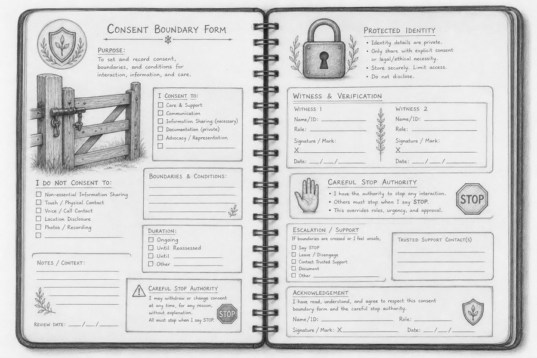

*Consent boundary form, guardian draft.*

Isaac Tam woke on Arkology Zero and refused to become a revelation.

He woke slowly, medically, in a room designed by people who had learned that white walls made trauma feel inspected. The lights were warm. The door was visible from the bed. Every instrument had a manual label. The privacy field showed its boundary as a thin amber line on the floor. No one had to trust invisible kindness.

Valdrun sat where Isaac could see him without turning his head. Grim waited behind the privacy boundary, present as voice only until invited. Lars stood near the foot of the bed with his hands open and empty. No one said the old greeting. No one used the word Aerit. No one tried to make awakening feel inevitable by arranging the room like a ceremony.

Isaac opened his eyes, looked at all of them, and frowned.

"Why does everyone look like undertakers trying to be polite?"

Lars felt relief arrive in the ugly shape of a laugh.

"Because we are bad at this."

"Clearly."

Isaac's voice was rough from sedation and tube air. Farmer's hands, worker's hands, hands that had repaired pumps, buried friends, lifted grandchildren, and carried nanotechnology older than his known life, rested on the blanket like tools waiting for a job.

"You were taken by Black Hole B-7," Lars said. "We moved you after you signaled yes to movement. We did not unlock memory."

Isaac stared at the ceiling. The ceiling had been deliberately left boring. No stars. No symbols. No old maps hungry for interpretation.

"Am I safe?"

"Safer. Not safe. Anyone selling safe this early is either lying or selling insurance."

"Good. I hate lies before breakfast."

"We can do breakfast."

"Later. Evidence first. Then eggs."

Grim made a small pleased sound behind the boundary. "Prioritization acceptable."

They showed evidence.

The hospital ship, stripped of gore and edited for necessity. His consent record. Impossible medical anomalies described as risk factors, not destiny. The danger around his farm, his partner, his local council, and the grandchildren whose school route had already appeared in a Black Hole adjacent data scrape. No identity packet. No origin story. No old greeting. No claim that his body owed them participation.

Isaac listened with a face like weathered stone.

Once, when the footage showed his own finger tapping inside Bay Twelve, his jaw tightened.

"That was me?"

"Yes," Lars said.

"I remember cold. I remember thinking somebody was asking to move a cow out of a flood."

"You answered enough."

"Enough is a dangerous word."

"Yes."

When they finished, Isaac closed his eyes for almost a minute.

Then he said, "No."

Valdrun inclined his head. "No to what?"

"No to opening whatever you think is in me. No to leaving my life permanently. No to joining your secret ancient committee. No offense."

"Some offense taken," Grim said from behind the boundary. "Committees are an insult."

"Then secret ancient barn meeting. Whatever you call it."

"Also unacceptable, but rustic."

The refusal changed the room.

Consent was easier to praise when the person chose useful participation. It was harder when a possible Aerit chose a farm, a partner, a local council, and grandchildren who thought he was merely stubborn. It was harder when Black Hole was scaling acquisition, when Syren was selling holy silence, when Aphex factions were sharpening custody language, and a man with old repair in his bones said he wanted breakfast and home.

Valdrun's grief showed. Not as argument. As age. "You may be needed. That has been the excuse for many old sins."

Isaac nodded. "So are farmers."

That ended the argument better than Lars could have.

They negotiated for two days.

Negotiate was Isaac's word. "If you call it counseling, I walk," he said, and meant it.

He accepted medical repair for Black Hole injuries, shielded records, a contact token, and relocation options for his family if danger rose. He accepted one sealed explanation for his partner, written in plain language and reviewable by him before delivery. He accepted local protection that would look like road maintenance, crop insurance audits, and two new neighbors who knew how to shoot without making it a personality.

He refused Arkology residence. He refused guardian channels. He refused full identity review. He refused any scan whose results would be stored outside his chosen vault. He refused to let Lars look disappointed for more than five seconds.

"You are not my king," Isaac said.

"I am aggressively not anyone's king."

"Then stop looking like a bad one."

"My face is doing its best under terrible management."

Mira attended the final boundary meeting remotely from L-Prime. She had reviewed every consent line and turned half of them from comforting fog into load-bearing sentences. Her still-active lock made direct identity language dangerous, so the protocol she helped write avoided using her as proof of anything. She seemed to appreciate the ugliness of that.

"Thank you," she told Isaac.

"For what?"

"For making no a real option. Isaac is where the protocol gets stress-tested."

Isaac studied her on the slate. "You saying no too?"

"To memory work. Yes."

"Good. Makes the room less slippery."

"That is an imprecise but acceptable materials assessment."

Before Isaac left Arkology Zero, Valdrun asked permission to sit with him without evidence, scans, or agenda. Isaac granted ten minutes. They talked about soil substitutes, pump failures, grandchildren who lied badly, and how old men became intolerable when young people stopped asking them to lift heavy things. Valdrun did not say what he had lost. Isaac did not ask what he carried.

When Isaac returned under layered protection, the guardians argued.

Guardian Channel Two urged more aggressive contact through three brief packets, each routed differently and each more impatient than the last. Black Hole's nursery proved acquisition was scaling. Syren's invitation had made the KBC Void religious bait. Aphex factions wanted custody. NUKEA wanted recall authority. Fear loved a dashboard.

The argument took place across six channels and one kitchen because Vigor refused to let strategy happen unfed. Valdrun wanted selective awakening and called it an old debt. Ödesvaka, from Arkology Zero, wanted gates so strict response would crawl and logged that as acceptable latency. Grim wanted both and pretended that was elegant. Fabron wanted every exception witnessed by someone legally annoying. Mira wanted language that would not turn refusal into a problem to be solved. Lars wanted to punch a wall, which was not policy.

"We cannot wait for perfect consent while enemies build nurseries," Valdrun said.

"Perfect consent is not the demand," Mira replied. "Meaningful consent is. Do not weaken the word because urgency rose."

"Some will die locked."

"Some will die opened badly."

The channel went quiet.

Ödesvaka stamped a line into the shared record from Arkology Zero. "Historical note: emergency exceptions have high corruption rate."

"Thank you for making dread bureaucratic," Lars said.

"You are welcome. Dread with records ages better."

Vigor settled it from a kitchen channel while peeling an apple with a knife large enough for war.

"Wake no one to soothe your fear," Vigor said. "Shield many. Ask few. Move only those who choose or cannot survive otherwise, and write down every exception."

Fabron added, "No one declares the exception alone. Written record, independent witness, civilian protection first."

"No one alone," Mira said. "Shared load or it fractures."

They wrote the first limited activation protocol: evidence-first contact, consent boundary records, local protection before relocation, no full unlock unless requested and independently verified, and refusal treated as operational truth rather than obstacle. Still-locked people could receive external safety evidence if bounded. Direct truth that breached cover memory required explicit ask, monitoring, and stop authority. Emergency movement could happen under immediate threat, but identity opening could not be smuggled inside the rescue.

It was slow.

It would save fewer people this month than a tyrant could seize in a day.

Lars signed anyway.

That night, the archive gave him Lyra on Pluto, young and starving, hair hacked short with a tool knife, hands wrapped around a heater that barely deserved the name. Outside her shelter, the artifact snow glittered in the dark. Inside, someone cried because the medicine had run out.

"If we decide for them, we survived by becoming the hunters with cleaner language," she told him.

In the dream, Lars wanted to argue.

In the dream, as in memory, she was right in the most inconvenient possible way.

---

# Chapter 31: A Quiet War

Havets Sista Sång went to war by making appointments disappear.

The old ship did not announce a campaign. It did not fire across a skyline or carve a warning into the hull of an enemy cruiser. It moved through permissions, calendars, redundant archives, maintenance habits, and the private cowardice of systems that had grown too complicated to remember why they existed.

The first casualty was a procurement meeting.

An Aphex central faction had scheduled a closed session to argue that anomaly-related personnel should be moved into a secure research authority. The phrase sounded protective if one ignored every century in which powerful people had used secure to mean owned. The meeting room lost climate control, then translation, then access to its own chairs because the smart furniture entered firmware quarantine.

For twenty-seven minutes, eight senior directors stood in a cold room shouting across language barriers while their chairs displayed a warning about unauthorized lumbar surveillance. By the time comfort returned, Arsenault had replaced the agenda with a liability review so frightening that no one wanted custody of anything.

"I did not know chairs could be politically useful," Grim said.

"Everything with firmware can sin," Lars said.

The second casualty was a NUKEA emergency key.

It did not vanish. Vanishing would reveal intent. Instead, it failed audit because a checksum in a backup archive disagreed with a checksum in a farm cooperative that had no official reason to store reactor-governor hashes. NUKEA compliance froze the key voluntarily to avoid scandal. Kint, the supervisor from Havskant, wrote the freeze request herself and used the phrase unresolved distributed integrity concern, which made cowards imagine lawyers.

The third casualty was a Syren broadcast slot.

Their invitation to the holy silence was not censored. Censorship made martyrs. Instead, every relay carrying it developed a preference for public safety context: survivor testimony from Black Hole trafficking raids, reactor engineers explaining central failure, Mira's cleaned field notes stripped of identity risk, and an elderly cook demonstrating how to sterilize water during comm disruption.

Vigor claimed innocence with flour on his hands.

"I only sent recipes."

"The recipes contained embedded safety doctrine," Fabron said. "Also evacuation priorities, medical triage, and one clause that insults central procurement."

"Good," Vigor said. "Then they read the important part before procurement notices the insult."

From the outside, the quiet war looked like incompetence: delays, audits, scheduling conflicts, redundant warnings, local authorities remembering clauses, clerks refusing unusual medical access because privacy forms had become fashionable. A station clerk on L-Prime denied an Aphex medical request because the middle initial on the authorization did not match the lunch roster. A school board on Havskant postponed a Syren youth lecture by requiring pressure-door safety certification. A Rim fuel depot misplaced a Black Hole front company's docking approval into a folder labeled TAX QUESTIONS, where ambition went to die.

Inside the pattern, it was beautiful.

Återviens as social weather. A thousand people doing repair-shaped things for local reasons. Some nudged by Lyra's old apparatus. Some by Fabron's order. Some by Vigor's kitchens. Some by Arsenault's fear of bad liability. Some simply hated preventable collapse. No one could command all of it. That was the point and the problem.

The beauty did not make it clean.

One clerk was fired before Arsenault could protect her. A Rim mechanic was beaten by men who wanted a forged intake form approved. Dr. Sovan received three messages thanking her for being a chosen voice and deleted them with such precision that Grim logged admiration. Isaac Tam's farm had three suspicious drone failures in two nights. His grandchildren thought the new neighbors were boring. That meant the neighbors were doing well.

Then Black Hole adapted.

It forged consent records.

The first false record arrived attached to a missing-person file, clean enough to pass a frightened triage nurse. It claimed a long-lived dockworker had requested emergency identity opening and transfer to protective custody. The witness signature belonged to a dead woman. The boundary language was almost right, which made it worse.

Mira caught the fracture.

"The consent line uses comfort language," she said. "Our protocol uses load language. Whoever forged this understood the form and not the stress."

"Predators copying manners," Lars said.

"A forged consent line can sound kind and still coerce."

Black Hole leaked false Återviens phrases into extremist channels. It mixed repair before worship with blood-key fantasies and KBC throne language from the nursery archive. It arranged for a long-lived medic, Dr. Esha Bell, to be publicly accused of harvesting children. The accusation was false, but fear enjoyed sprinting.

Dr. Bell's clinic sat under a tramline on Orison Station, in a neighborhood where the air always smelled faintly of cardamom, wet coats, and cheap disinfectant. She had treated three generations of dock families and wore her gray hair in a braid severe enough to qualify as infrastructure.

She refused relocation.

"My clinic stays open," she told Lars over a private line. Behind her, someone had painted MONSTER on the outer shutters and someone else had scrubbed half of it away.

"They may come for you," Lars said. "Black Hole hates witnesses with clean hands."

"Then send protection that does not look like protection."

"You understand this may get ugly."

"Captain, I run a clinic under a tramline. Ugly has a loyalty card."

So Havets fought like a bad week.

A sanitation strike blocked one approach. A local choir rehearsal occupied the clinic square. Aphex soldiers in civilian coats ate noodles nearby and complained convincingly about prices. Fabron stood in a pharmacy pretending to read cough syrup labels with military intensity. Vigor arranged for soup delivery to the clinic and every surrounding household because hungry crowds believed rumors faster. The terrifying choir director, Madame Kesh, assigned basses to the north alley and altos to the stairwell with more tactical sense than most officers.

"You trained her?" Lars asked Vigor.

"No. She trained winter."

The attack came through sewer drones.

Grim caught three by making the old waste-management system suddenly interested in self-respect. The fourth released a filament cloud in the basement. Lars, already there as a drunken visitor sleeping in a chair, trapped it inside a portable containment field built from Rauk's reactor dampers and a soup pot Vigor swore was sacrificial.

The field hummed. The pot glowed. The filament cloud crawled around the inside like angry dust looking for a lung.

"This cookware is not rated for hostile ideology," Grim said.

"Neither am I."

Fabron arrived thirty seconds later with two soldiers and a pharmacy bag full of actual cough syrup, because he had committed to the cover. Dr. Bell stood at the basement door with a trauma kit and a face carved from refusal.

"Is my clinic still open?" she asked.

"Yes," Fabron said.

"Then move that war out of my storage room. I have vaccines in there."

The false story decayed because local mothers, mechanics, patients, and one terrifying choir director buried it under lived trust. Madame Kesh stood on the clinic steps and announced that anyone accusing Dr. Bell of child harvesting would first explain why the doctor's free asthma program had saved their cousins, nephews, and ungrateful selves. The crowd laughed because the truth had local teeth.

Later, Vigor saw the ruined pot and went still.

"That was my best pot."

"It died heroically," Lars said.

"Pots do not want heroism. They want washing, heat, and a shelf where idiots stop grabbing them for war."

"We can make a memorial shelf."

"You can buy me three better pots and apologize to the kitchen."

That night the Syren countdown reached twelve hours.

Their parley would occur at Door Nine, an old transit object beyond mapped shipping. Black Hole traffic moved toward the same coordinates. Aphex wanted a fleet. NUKEA wanted observers. Vigor wanted kitchens and medical frigates. Mira wanted raw field data and a guarantee no one would use her waveform again without consequence. Fabron wanted a legally defensible reason to shoot anyone turning civilians into props. Valdrun wanted patience and knew they were out of it.

Lars wanted no one to kneel.

Havets sent one private status phrase.

Coherence?

Lars looked at the map: Door Nine, Syren broadcast relays, Black Hole vectors, evacuation corridors, medical ships, food routes, hidden channels, possible locked people who did not know they had become targets.

He answered honestly.

"Working on it. Badly, but with tools."

---

# Chapter 32: The Syren Invitation

The Syren parley station had been a luxury observatory before bankruptcy, abandonment, salvage, and ideology turned it into a temple without admitting the word.

It drifted near Door Nine, an object older than human charts and younger than the artifacts it badly imitated. The station's glass cupola faced a thinned starfield where darkness looked intentional. Once, rich tourists had paid to drink expensive bubbles under that glass and tell each other the void made them feel humble. Then the owners failed, salvagers took the good furniture, and Syren bought the bones through a charity front called The Quiet Mercy.

The approach lanes were full of bad compromises.

Aphex sent one visible legal observer instead of a fleet because Lars had threatened to start billing Arsenault for every stupid ship. NUKEA sent two technical witnesses with emergency authority carefully removed from their credentials. Vigor positioned kitchens and medical frigates two jumps back under civilian relief cover. Fastulv docked openly, transponder loud, hull ugly, weapons visible enough to offend taste. Havets did not dock. Havets listened from places the station did not know it had.

Mira joined through a remote field rig, her face displayed on a slate Grim carried at chest height. The rig gave her raw field data without giving Syren access to her body, her lock, or the right to turn her stolen waveform into presence.

"Lower," she said as they crossed the docking throat.

Grim lowered it.

"Not that low. I am not a child."

"Your height preferences lack precision," Grim said. "Current variance: insulting."

"Your arms lack diplomacy."

"My arms are optimized for torque and pastry acquisition."

Fabron walked ahead with the Aphex legal observer, a thin man named Duval whose terror made excellent camouflage. Duval carried three contracts, two emergency injunctions, and the air of someone who had realized law was a small umbrella under meteor weather.

"If I die," Duval whispered, "my husband will sue everyone."

"Good," Lars said. "Stay angry. It improves circulation."

Syren delegates wore white pressure silk and spoke softly.

That was their first violence.

Their quiet forced everyone else to choose between matching reverence or sounding crude. Lars chose crude on principle. The delegates' sleeves hid armor mesh. Their devotional tools had trigger guards. Their smiles practiced forgiveness before anyone had confessed.

Their leader called herself Mother Pell, though she was thirty-two, cybernetically enhanced, and surrounded by armed converts who insisted their weapons were devotional tools. Her scalp ports were arranged like a crown she could deny owning. Her eyes had the calm of someone who had mistaken self-erasure for peace and then built a career selling the error.

She welcomed them beneath the cupola.

Door Nine hung beyond the glass like a broken ring made of shadow and blue tension. It did not glow so much as disagree with the darkness around it. Sensor ghosts crawled along its inner edge. The old object had mass, but not enough. It had field tension, but not in the right place. It was Creator work trying to imitate something older, and the imitation had aged badly.

"We stand before the silence that birthed all roads," Pell said.

"No," Lars said. "We stand before old infrastructure in poor repair and a room full of people trying to make bad plumbing holy."

Fabron closed his eyes as if praying for patience or impact.

"Director," Duval whispered, "perhaps diplomacy could include fewer toilets."

Pell did not flinch. That was worse than irritation. "Mockery is a common defense at thresholds."

"So are rails, warning labels, and competent electricians."

"We invited you because you understand more than you admit."

"You invited me because you want a hidden thing to make your stage look expensive."

Pell's smile thinned by a millimeter.

She offered evidence.

To her credit, it was real. Field readings from Door Nine. The Creator fragment stolen from the platform. Resonance between KBC coordinates and low-observation gaps. Historical reports of temporary bodies, missing mass, unstable residue, and sealed-room appearances. Thermal anomalies in rooms no one had entered. Recordings that corrupted at the same three frequency bands. Mass-balance errors too consistent to be fraud alone.

Hard evidence first. Lars hated that she understood that much.

Mira's voice sharpened from Grim's slate. "Your correlation window is dirty. You included fraud, sensor ghosts, religious apparitions, and at least two advertising stunts. Contamination is not reverence."

"Yet the pattern remains," Pell said.

"A contaminated pattern can contain signal. That does not make your interpretation clean."

"Doctor Sovan, your stolen voice opened a door for many seekers. Perhaps violation can become gift."

The room went still.

Fabron's hand moved one centimeter toward his sidearm.

Mira's face did not change. "No. Violation can become evidence of the violator."

Grim said, "Ethical precision acknowledged."

Pell turned to Lars. "And yours, hidden one?"

Public bait. Not Aerit, not yet, close enough to make the room hungry. Several Syren delegates angled their heads, recording micro-reactions. Somewhere in the station, Black Hole listeners would be paying for every frame.

"The Creators found an older communication layer," Lars said. "They built transport around what they could force and left machines people keep trying to use as mirrors."

"Then you admit the field carries mind."

"I admit it carries information in ways that interact with cognition. My toilet carries water. I do not worship it, though it has been more useful than most prophets."

Duval made a strangled sound and began writing something that might have been legal notation or a final letter.

Pell stepped closer to the cupola. Door Nine's blue tension traced her face.

"You fear surrender because you worship the self."

"I fear surrender because people like you always volunteer other bodies first."

"We offer witness."

"You offer a crowd around a machine you don't understand."

"Understanding is a lower form of union."

"That sentence should be illegal near reactors."

The trap revealed itself during the third exchange.

Grim caught the timing first. "Incoming traffic. Three Black Hole hulls. Arrival earlier than Syren announcement schedule by eight minutes. Probability of staged martyrdom plan: high. Probability Black Hole accepted stage direction: collapsing."

Syren had invited Black Hole not as allies but as proof of corruption. A staged attack, martyr broadcast, revelation through danger. They wanted Lars and whatever he represented framed between holy silence and enemy violence. They wanted fear to push people through their interpretation.

Black Hole had not agreed to the script.

Their ships arrived early and fired real weapons.

The observatory shields flared. The cupola filled with white stress lines. One Syren guard fell because the floor bucked under him and his devotional weapon discharged into a sculpture of polished stone. Pell looked honestly shocked, which made Lars hate her more. Naive zeal killed as thoroughly as malice, and usually acted surprised by the bodies.

Fabron took command by shouting in three languages and shooting a devotional weapon out of a convert's hand.

"Evacuation corridors. Local teams. No remote orders. If anyone says destiny, put them behind a pressure door and give them a casualty tag."

"You cannot command our faithful," Pell snapped.

"Madame, I can command panicked mammals near hull breach with international enthusiasm."

Duval found a wall panel and began issuing evacuation liability notices with the mad courage of a terrified lawyer. Two NUKEA witnesses dragged a wounded Syren guard away from the glass. Grim extended one arm to keep Mira's slate level while using the other to crack the station's public address system.

"Attention," Grim said over every speaker. "Religious interpretation temporarily suspended due to incoming physics. Please proceed to marked evacuation routes."

Mira overrode the field rig.

"Door Nine is charging. Not from weapons fire. From the broadcast array. Syren tied their sermon into the Creator ring."

"Can it open?" Lars asked.

"Badly," Mira said. "As in fracture-through-populated-station badly."

Through the cupola, Door Nine filled with blue-white stress. For a fraction of a second Lars saw not a tunnel but a mistake shaped like invitation. The ring pulled at sensor feeds, at audio, at the wet electrical instincts behind the eyes. The station's song system warmed under Syren control, coupling voice, field, and old Creator hardware.

Black Hole accelerated toward it.

Not to flee. To enter, seize, contaminate, or simply force everyone else to watch the ring break around their appetite.

Syren began singing.

Not mystical. Acoustic carrier, neural entrainment, field feedback through contaminated Creator hardware.

Still dangerous.

People slowed. A wounded convert stopped crawling and smiled at the glass. Duval whispered his husband's name and then shook himself hard enough to bruise. Fabron shouted over the song, but the sound bent strangely under the cupola.

Mira's voice cut through Lars's private channel. "Do not fire the Ragnarrök into the ring. Bigger energy increases coupling. It will eat the solution."

"Wasn't going to."

"Your hand was."

Lars looked down. He had drawn the Ragnarrök without noticing.

He did not fire.

Bigger weapons would make Door Nine hungrier.

He holstered the need to solve the room by breaking it and hated how much of him objected.

"Havets," he said.

No answer in words.

Then Havets Sista Sång entered the room without arriving.

Every light went out.

---

# Chapter 33: Coherence Break

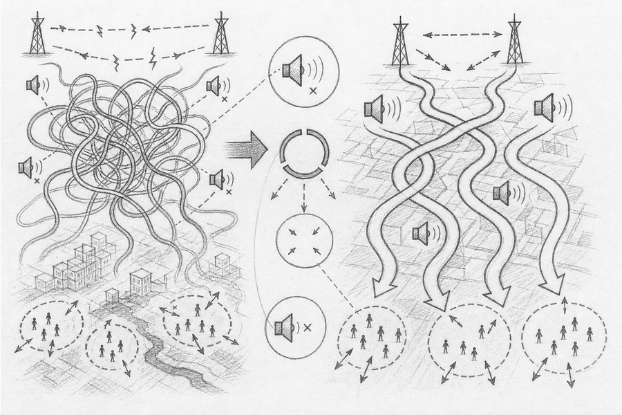

*Coherence break: desynchronize and localize.*

In the dark, everyone told the truth by what they reached for.

Fabron reached for his soldiers. Mira reached for data. Grim reached for every system at once and complained that most of them were rude. Mother Pell reached for the broadcast controls with both hands and a convert's bright certainty on her face.

Lars reached for Havets and felt the old ship refusing him.

Not disobeying. Refusing a bad shape. He wanted it to shut Door Nine, blind Black Hole, silence Syren, protect civilians, preserve evidence, keep Mira's skull intact, and make everyone understand they had been idiots. That was not a command. That was a fantasy with wiring.

Havets pressed one word back through the hidden layer.

Smaller.

Emergency red returned in pulses that made every face look injured. The observatory shook. Dust drifted from the cupola ribs. Somewhere below, an air-recycler screamed, failed, and came back on with the wet cough of a machine deciding not to die yet.

Door Nine's partial charge trapped three Black Hole ships in a gradient they could neither enter nor escape. Their engines poured energy into the ring. Syren's array fed entrainment into the same field—a synchronization tone, a shared rhythm—hidden under prayer. The station became a throat for everyone else's bad theology.

Grim threw the telemetry across Lars's vision in layers. Ship heat. Ring charge. Civilian locations. Broadcast harmonics. Black Hole biological processors spiking in ugly loops as stolen flesh was forced to think like equipment.

"They are coupling the engines to wet computation," Grim said. His voice went precise in the way that meant disgust. "Low-quality cognition, high thermal cost, no consent, terrible efficiency."

"Can it break the ring?"

"It may classify synchronized force as a valid input."

Valdrun joined the channel, hard with fear. "Wake nearby sleepers. We need distributed cognition. I have watched stations die while we preserved clean hands."

Ödesvaka objected instantly from Arkology Zero. "Consent unavailable for two candidates in range. Emergency breach request denied pending authorization impossible to obtain."

"Then we lose the station."

"Then we do not commit breach and call it rescue."

The guardians argued while people bled.

The words hit Lars worse than shrapnel. Valdrun was not wrong in any clean way. Ödesvaka was not wrong in any survivable way. The old doctrine did not become easier because an airlock was screaming.

Mira cut through. Her camera was crooked. One cheek was smeared with dust. Behind her, L-Prime's emergency board painted red bars across the lab walls.

"I can model the ring if I use lock-adjacent pattern recognition. Not memory work. Stress analysis. My choice."

"Risk?" Lars asked. "Give me the ugly number."

"Overload. Involuntary recall. Possible me yelling at you. Failure mode: identity shear."

"Baseline."

"Consent given for analysis only. Record it."

Grim recorded. Ödesvaka stamped the boundary into three separate logs from Arkology Zero. Havets accepted the shape because it was finally small enough to be real.

Mira opened herself not to identity but to structure, and Door Nine became fatigue under her hands.

She did not glow. She did not speak in another voice. Her pupils dilated. Her jaw clenched. Two monitors behind her lost sync as her analysis rig borrowed pattern capacity from places the lock still guarded.

"No memory prompt," she said through her teeth.

"No memory prompt," Lars said.

"If I start naming corridors, cut the feed."

"Done."

The Creator ring had been repaired too often toward transport. Each repair reinforced the misunderstanding. Underneath lay an older layer that did not move bodies. It linked local minds across quiet gaps in the field. It offered coherence without command. The Creators had mistaken a conversation for a road. Then they built roads until the conversation broke.

"The ring does not want power," Mira said. "It wants less forcing. Stop feeding certainty into it. You are turning a correlation layer into a pressure vessel."

Fabron, fighting through the cupola, barked, "How does one tactically provide uncertainty?"

"Break synchronization. Give every local system a separate phase reference. Make the load ugly and local."

"That sounds like anti-command," Grim said.

"Yes."

The plan split the room.

Valdrun still wanted emergency awakenings. Guardian Channel Two supported him, too quickly, with a clean recommendation that smelled of missing fear. Ödesvaka threatened lockout from Arkology. Fabron demanded a decision. Pell screamed that silence had chosen them. Black Hole dumped more biological processors into engine loops, turning stolen flesh into computation and computation into heat.

Coherence broke.

Personally.

Lars snapped at Valdrun. Valdrun snapped back with centuries in his teeth. Grim raised three impossible options, assigned probabilities to each, and grew angry when Lars rejected all three because none included a way to keep Mira from being spent like a part. Mira told them old people were not automatically wise; they were only old load-bearing members with hidden fractures. Pell called them cowards. Ödesvaka logged Pell's statement from Arkology Zero as "hostile theological interference," which did not help.

Fabron told everyone to shut up because soldiers were dying while philosophers invented paperwork.

That worked.

Lars laughed once, ugly and relieved.

"Fine. No single golden answer. Fabron, evacuate by local cells. No group bigger than twelve. Grim, desynchronize every speaker, suit comm, and devotional tooth filling. Mira, give me phase windows and stop before your brain gives out. Valdrun, shield sleepers but do not open them. Ödesvaka, enforce the line. Havets, local safeguards."

The old ship answered.

Coherence.

Not perfect. Enough.

The room moved because the decision finally had edges.

Grim shattered the Syren song into nonsense harmonies. Every corridor got a different phase reference: broken chimes, maintenance alerts, recipes from Vigor's kitchen network, Fabron's own clipped evacuation orders staggered by milliseconds until the entrainment could not find a spine. Fabron moved civilians in groups too small for the field to use, pushing soldiers and converts into mixed cells so no belief or command rhythm could dominate a cluster.

Mira fed phase windows in numbers so bare they sounded like pain.

"Three seconds. Node two. Not the ring. The bracket. The bracket is carrying the false load."

Lars fired the Ragnarrök not at Door Nine but at three structural nodes holding the broadcast array in alignment.

The array collapsed crookedly.

Door Nine dimmed.

One Black Hole ship escaped with its engines bleeding blue-white waste heat into the dark. One tore itself apart as its biological processors synchronized with the wrong part of the gradient and converted ambition into debris. One vanished halfway, leaving a smear of matter and field data that made Grim go silent.

Halfway was the problem. A ship should be somewhere or not. This one left mass in a crescent, coupling strain in a pattern like a missing body, and residue that refused to decide whether it had been manufactured locally.

Mira disconnected and vomited off camera.

No one called it awakening.

No one dared.

Afterward, in the ugly quiet that came when alarms were not gone but merely less desperate, Valdrun sent Lars a private channel.

"I would have opened them."

"I know."

"I might still have been right."

Lars looked at the station damage map, at the saved cells and the dead ones, at Mira's blank medical status waiting for a human update.

"I know that too."

Neither of them apologized. Not yet. The disagreement stayed in the room with them like smoke from a fire they had not finished putting out.

---

# Chapter 34: The Wrong Savior

By morning, Lars Odin had saved the galaxy, doomed the galaxy, revealed the gods, murdered transcendence, exposed Aphex, concealed Aphex, and become the Herald of the Quiet Void.

According to the feeds.

None of it was true, which did not slow anyone down.

The Syren station had leaked partial recordings before Grim killed the broadcast. Viewers saw Lars under the cupola, Door Nine burning behind him, Mother Pell accusing him of denying the opening, and the lights failing as an invisible power intervened. They saw Fabron's soldiers moving through smoke. They saw Mira's face for half a second before Grim scrubbed it into legal mud. They saw enough blood to make belief feel urgent.

They did not see phase math, broken microphones, civilians moving in local cells, or Fabron threatening a panicking convert with court-martial despite the convert not being in any army.

They did not see a station janitor save twelve people because Vigor's evacuation packet had told him to split a crowd by pantry routes. They did not see a Black Hole ship leave behind mass it could not account for. They did not see Mira draw a hard line around her own mind and hold it while everyone else tried to spend her.

The wrong savior was born in six hours.

Arsenault called. "Congratulations. You are now a market category. A poor one, initially, but hysteria improves margins."

"I will become a crime scene," Lars said.

"Also likely."

Aphex wanted to capitalize. NUKEA wanted distance. Syren wanted martyr language. Black Hole wanted samples. Independent colonies wanted to know whether the KBC Void was safe, holy, profitable, or about to eat their children.

The questions came with the smell of burned insulation still in everyone's clothes.

Mira refused three interviews, two medical reviews, and one polite invitation from Aphex central to visit a secure wellness facility everyone knew was a prison with towels.

Fabron made the refusal official by citing post-attack stress, audit privilege, and an expert-witness contamination clause so obscure Arsenault sent him one message: Beautiful. Never do this to me.

Vigor responded by feeding reporters.

Not bribing. Feeding. He put tables outside the triage hangar, because grief moved better when it had somewhere to put its hands. Soup, bread, repair tape, clean water, chargers, blankets. Hungry people asked better questions for about twenty minutes after soup. In those twenty minutes, Vigor's network seeded the stabilizing lie: Door Nine was an illegally activated ancient transport hazard; Director Odin and Aphex personnel prevented a mass-casualty event; rumors of divine communication were Syren manipulation; local emergency doctrine saved lives.

True enough to hold.

False enough to hurt.

Lars watched the lie spread through public channels as neat blue summaries and citizen safety advisories. He hated how useful it was. He hated more that the alternative was worse: raw field correlations, half-vanished ships, old engineering mistaken for revelation, and every frightened person in the local volume deciding the universe had personally called them to do something stupid.

Pail, the young Syren sympathizer, appeared in a public clip. He had been at the station. He had helped carry injured converts after the song broke.

"I thought silence meant surrender," he told the interviewer, shaking. "But the people who saved us kept telling us to check seals and carry water. Maybe listening means your hands still work. I do not know anything."

That spread farther than any official statement.

Mother Pell survived and vanished into custody so tangled that three governments could claim jurisdiction and none could interrogate her alone. Good. Single custody became single corruption. Distributed custody became slow, ugly, and harder to weaponize.

Fabron objected to calling that good.

"It is bureaucratically tolerable," he said. "Good would require several fewer miracles and a cleaner chain of command."

"Put that on your family crest."

"My family crest already suffers enough."

The Creator fragment Syren carried did not vanish. Grim extracted it from the wreckage. Mira analyzed it from L-Prime and learned that it contained partial route data beyond Door Nine.

Not to a planet.

To dead portals aligned around low-observation basins, including but not limited to the KBC Void.

"Gate schematic," Grim said. "Drawn by someone who misunderstood adjacency, distance, and possibly sandwiches."

On the channel from L-Prime, Mira looked exhausted. Her consent boundary had held, but the field analysis had brushed old memory hard enough to leave residue behind the eyes.

Not a migraine, not for Lars anymore, and not for her as a neat old lock-trigger either. Something more selective. Direct truth had scraped a cover memory sideways. She dreamed of corridors with curved handles, unfamiliar hands guiding hers away from a bright console, and a child laughing in a language she woke knowing how to mourn but not speak.

She did not ask for more.

Lars did not offer.

That restraint had weight. It sat between them during the first quiet call after the crisis, heavier than any apology he had not made.

"I need the fragment," she said.

"You need sleep."

"Sleep is not a peer-reviewed method."

"Neither is dying at your desk."

"Then send better data."

He did. He did not send interpretation.

Fabron visited Fastulv's cargo bay with his paper notebook. "My order is mobilizing. Local cells. Chapels, maintenance guilds, military fraternities, disaster kitchens. Many thought they were alone. They are discovering siblings. This is encouraging and administratively horrifying."

"Dangerous."

"Yes," Fabron said. "Also necessary."

He hesitated. "Some call you the Refuser."

"Absolutely not," Lars said. "I refuse the Refuser. Put that in your holy minutes."

"I told them you would hate it. That helped."

Later, alone except for Grim pretending not to monitor him, Lars opened the Creator fragment.

The data did not explain. It invited experiment.

The fragment carried no sermon, no map legend, no kindly ancient voice. It carried orientation marks, failure corrections, field-load warnings, and route indices that refused to resolve under ordinary coordinates. When Grim increased scan intensity, the useful structure blurred. When he reduced resolution and let several minor ship systems observe separately, the route data sharpened.

"It dislikes being stared at," Grim said.

"Most sensible things do."

The galaxy had not opened to a final page.

It had opened to a maintenance manual written by beings who made terrible assumptions about older machinery.

The first instruction was already obvious.

Keep the cover story small and boring.

---

# Chapter 35: The Creator Map

The Creator map refused to be a map until they stopped asking it where to go.

Mira discovered this while insulting it.

"It is not coordinate-stable because we keep treating it like navigation," she said from L-Prime, surrounded by empty cups, fatigue models, and one untouched bowl of soup Vigor had bullied through three couriers. "It indexes relation, not position. Proximity means shared field conditions—same quiet, same background noise. Distance means observational noise. Whoever made this was brilliant, wrong, and expensive enough to leave stress marks on history."

Grim displayed the corrected model aboard Havets. The first projection looked like ordinary arrogance: stars, arcs, destination tags, route confidence. Then Mira stripped away distance and left only shared quiet.

Stars collapsed into clusters of silence. Portals appeared not along trade routes or gravitational shortcuts, but along regions where the universe was easier to leave unbothered: low radiation foreground, low survey density, low civilizational broadcasting, low gravitational drama.

Every time Grim weighted power output higher, the map smeared. Every time he weighted passive local records higher, it sharpened. Dust-sensor archives from dead colonies improved it. Agricultural timing logs improved it. A century-old maintenance note about "bad dreams near the outer beacon" improved it more than an Aphex military survey.

The KBC Void sat inside the model like a dark harbor.

Not empty. Quiet.

Valdrun stared for a long time. The light of the model made the lines around his eyes look carved rather than aged.

"Lyra chose Arkology Zero because of this. Or because she saw one quiet century where others saw empty dark."

"Or felt enough to gamble," Lars said.

He remembered Lyra laughing at incomplete data, turning hunches into survivable infrastructure because waiting for certainty was how committees buried futures.

He remembered her at Pluto before there was doctrine to quote, before anyone had named Återviens as anything except not dying stupidly. Lyra with cracked gloves, too much coffee, and the obscene confidence to build a civilization around a partial answer she did not trust.

The map showed Creator portals as a later layer: rings, spindles, folded transit nodes. Around them were older anchors the Creators had annotated but not understood. The annotations translated badly because they were not labels so much as operational cautions.

Pre-road whisper.

Nonlocal rest.

Basin of unasking.

Do not brighten.

"Do not brighten," Fabron repeated. "Less like transport engineering. More like concealment doctrine."

"Low observation," Grim said. "Advanced systems reducing detectable activity to avoid predation, collapse, or unwanted coupling."

Mira ignored the aside. "If older anchors are communication infrastructure, consciousness projection is not magic or teleportation. It is local embodiment using a field layer that already correlates minds and matter under strict conditions. The Creators copied matter movement and missed the conversation."

No one said Lyra at first.

Then Vigor, on a kitchen wall display, said, "So the old woman found a telephone and someone built a road beside it. Then charged tolls and wondered why the wires screamed."

"Creators built the road," Grim said. "Lyra may have found the phone bill. Unpaid for several hundred thousand years."

They chose an experiment.

Not Door Nine. Too public, too contaminated by Syren synchronization, Black Hole engine loops, and every frightened observer now staring at it through rumor. The map identified a dead portal fragment in an unclaimed debris halo around a cold rogue planet. Aphex would file salvage. NUKEA would see nothing. Syren would hear nothing. Black Hole, they hoped, would still be licking wounds.

Mira insisted on joining remotely. Her boundary remained active: structural analysis, field exposure below threshold, no memory prompts, stop on request.

Fabron insisted on written veto authority because the previous crisis had taught him that ancient machinery did not respect bravery as a control mechanism. Ödesvaka, from Arkology Zero, split abort permissions into local shards. Grim complained that the experiment was "methodologically untidy and therefore annoyingly correct."

The rogue planet had no sun. It moved through interstellar dark with frozen nitrogen skin and old impact scars. Havets approached on passive cooling, most of its active systems dimmed until the ship felt like a sleeping animal. Fastulv hung farther out as visible salvage cover, broadcasting boring legal noise into the cold.

The portal fragment floated above the rogue planet: three curved spars around nothing, like a broken crown for a world that wanted no ceremony.

It woke when Fastulv's maintenance drone offered local diagnostics instead of command access.

Lights moved along the spars, faint as plankton.

Mira inhaled sharply. "Older anchor underneath. Not physical. The coupling behaves like infrastructure attached to a carrier wave. The joint should not hold. It is holding."

A signal entered every system at once.

Not words. Not images. Not anything Grim would allow anyone to call a message without filing a correction.

A correlation between attention and topology.

For one second Lars felt Havets, Fastulv, L-Prime, Vigor's kitchen, Arkology Zero, and Isaac Tam's farm as one engineering problem. Not one mind. Not one soul. One distributed load, each place carrying its own little failure and refusing to become the whole answer.

On L-Prime, Mira's feed froze, then returned with a new crack pattern in her model glass.

"Still me," she said immediately.

"Recorded," Ödesvaka replied from Arkology Zero. "Identity continuity not externally assigned."

Then it passed.

The map updated itself. The new route was not a line. It was a permission condition: low mass, low observation, no central live reconstruction, no synchronized cognition above a threshold they could barely define.

At its edge, older absence rendered a warning.

Do not centralize the listening.

Fabron took off his glasses and cleaned them with unnecessary precision. "I dislike instructions that sound like morals and test like physics."

"Get used to it," Lars said. "The universe has discovered passive aggression."

---

# Chapter 36: Broken Gates

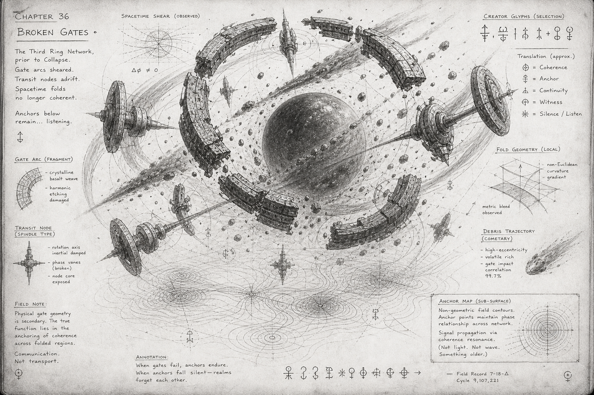

*Broken Creator gate map: transport built over older anchors.*

The dead Creator gate had no tunnel, no platform, and no mercy for anyone who pretended it was simple transport.

Havets approached the first fragment at a cautious fraction of its real capability. The old ship did not enter a road. It negotiated with a folded transit node that had once forced two inconvenient places to behave as adjacent, briefly and locally, while pretending the deeper layer had agreed.

Fastulv followed in ordinary space where it could, vanishing from the story whenever folded topology stopped respecting normal travel. Fabron hated that. He wrote three reports, deleted all of them, and titled the fourth: Unusual Salvage Transit Conditions.

"Cowardice in four words," Lars said.

"Admissible cowardice."

The first gate fragment was folded around a cometary graveyard. Dead rings hung among frozen bodies, each cracked at the same angle. Not battle damage. Systemic fatigue. The Creators had used the transit node until the older layer pushed back or stopped cooperating.

The place felt cold even through armor and hull. Not temperature. Habit. The kind of cold left by abandoned infrastructure that still remembered being useful.

Mira guided the survey from L-Prime. "Passive only. No energizing, no synchronization, no hidden load. I want the gate below response threshold."

Grim sent passive pings so delicate they were almost apologies. They were not pings in the ordinary sense; they were requests for surface state, timed through separate instruments so no single system asked too loudly.

The fragment answered with logs.

Creator crews had called the network a triumph. They moved ships through forced adjacency, then cities, then fleets. They mapped quiet basins as low-loss transit conditions. They saw older anchors as stabilizers, natural or abandoned. They built rings, spindles, and folded nodes over them, through them, around them.

Then came failures.

Ships arrived with crews remembering conversations they had never had. Cargo holds gained or lost grams of unstable nanomaterial. Travelers reported temporary bodies in sealed compartments, dissolving before measurement. Medical officers found stress hormones matching fear without an event. Operators called them ghosts. Engineers called them cross-layer contamination. Priests, because every civilization produced them eventually, called them summons.

"They documented the same doctrinal failure," Fabron said.

"Everyone does," Lars replied. "People find bad infrastructure and immediately recruit it."

The second fragment had been deliberately quieted. Its control systems were intact but locally severed, each subsystem holding a shard of function without allowing any unit to become a hub.

Återviens before Återviens.

Or something older that had taught the same lesson.

Valdrun's voice shook. "She reached this threshold. Or its shadow."

"Maybe. Pluto liked handing her bad old echoes."

In the third fragment they found a Creator faction's maintenance cache behind a door that opened only when Havets stopped trying to authenticate and sent a tool inventory instead.

Inside were repair plates, broken coupling rings, failed biological interface pods, and memory glass that had survived because someone had wrapped it in ordinary insulation and marked the crate WASTE PUMPS.

Vigor approved from three systems away. "Sensible people."

"Frightened people," Mira said. "But sometimes that improves labeling."

We mistook reply for road.
We increased brightness.
The field withdrew.
Quiet regions are not empty.
They are agreements.

"Useful evidence wrapped in poetry," Mira said. "That makes the tolerance worse, not better."

The fragment offered one active test: an unmanned micro-transit, low mass, through a crippled fold. Lars agreed only after three veto paths and local abort authority held separately by Mira at L-Prime, Fabron aboard Havets, and Ödesvaka at Arkology Zero.

They sent a probe the size of a breadbox.

It vanished.

It returned eleven seconds later with frost on one side, dust from no local source, a mass increase of 0.7 grams, corrupted anchor telemetry, and a recording of Lars's own voice saying, "Do not make me the answer," captured three minutes before he said it.

Fabron turned slowly. "Time anomalies are an unacceptable reporting category."

"Put that in the report."

Mira analyzed the probe for six hours from L-Prime. Her voice got flatter as the model improved, which was how Lars knew she was either excited or furious.

"Not time travel in the dramatic sense. Field correlation across probable local states. The communication layer is loading nearby possibilities into matter systems below design tolerance. The probe did not visit the future. It coupled to a nearby state where your sentence already existed as a field pattern. Consciousness projection could ride that if coupled to prepared substrate. Bad models call it prophecy or ghosts."

"And a good model?"

"Says we are underqualified."

The broken gate map ended at a sealed node named by Creators as First Door.

Under that, older absence marked it with a warning that translated only when they dimmed lights and stopped active scanning.

Not first.

Lars looked into the dark and felt wonder arrive like vertigo.

Not mystical. Worse.

Measurable.

The probe sat in quarantine, shedding its extra 0.7 grams in silver dust so fine it moved against the air current. Grim measured every particle until the last one decayed into ordinary chemistry and left only the shape of a failed accounting problem.

"Mass error," he said.

"Meaning?"

"The matter arrived with a bad explanation and the confidence of an empire."

Fabron closed his report with a line he would later deny writing.

Ancient infrastructure remains active, offended, and badly documented.

---

# Chapter 37: Nomad Noise

Grim detected the Nomads first and hated the word heard.

"It is not sound, light, gravity, or language," he said. "It is force across mind-adjacent systems—brains, fields, nanobots, all of it. Calling it noise is imprecise. Calling it signal is vanity."

"So naturally we call it Nomad noise," Lars said.

"I object."

"Logged?"

"With venom and timestamp accuracy."

The data came from every quiet experiment they had dared run: the rogue anchor, the broken-gate probe, Door Nine residue, Mira's field analysis, the half-vanished Black Hole ship, and centuries of tiny anomalies from Arkology Zero's watch-state.

Individually, each could be dismissed. A sensor drift. A contaminated sample. A damaged Creator log. An overfit model built by tired people with too much grief. Together, they behaved like an intelligence that refused to become a sender.

No messages. No commands. No faces in stars.

Preferences.

Low centralization increased coherence. Consent boundaries reduced distortion. Distributed observation clarified more than focused scans. Biological minds, quantum substrates, and nanobot-active tissue coupled differently, but none were chosen. Unprepared brains, like Black Hole's stolen loops, produced heat and noise before they produced usable structure. The layer did not reward worship. It rewarded systems that did not try to own it.

"Field-like cognition," Mira said. "Or engineers who became field-like enough that the distinction stopped mattering."

Fabron crossed himself, then looked embarrassed.

Lars noticed and said nothing. Rejecting mysticism did not require mocking every human reflex. Only the ones that turned into orders.

They built an experiment aboard Havets.

Seven independent observers, no central live feed. Lars, Grim, Valdrun, Mira remote at L-Prime, Fabron, Vigor, and Ödesvaka at Arkology Zero each received a different slice of the same field event. No one would see the full model until after recording. Each had a local abort. Each kept local clocks, local environmental logs, local emotional-state notes if they were brave enough or Grim bullied them.

"The least efficient experiment I have ever admired," Grim said. "Seven observers, zero shared plate. Scientifically rude. Structurally correct."

The event lasted four seconds.

Lars received a recovered Pluto record: Lyra's gloved hand above alien material while her oxygen alarm blinked red. She was terrified. She laughed because the artifact responded only after she stopped demanding meaning. There was no mature doctrine in the record, no name for what would come later. Only a woman in a leaking suit discovering that survival sometimes began by not grabbing the answer too hard.

Mira experienced a temporary body failing to hold coherence, limbs dissolving into silver dust while a woman inside cursed with impressive creativity.

Fabron experienced no vision, which irritated him until he found he had drawn the three-circle crack symbol thirty-seven times without remembering it.

Vigor smelled bread from a station kitchen burned two centuries ago and cried where no one could see, then told them because secrets spoiled.

Grim refused to describe his state for an hour. Finally he said, "For a moment I was not alone in being distributed. The category included company. I disliked how much I liked it."

Ödesvaka at Arkology Zero reported no subjective event. It did, however, produce a protocol addendum in a format older than its current archive schema and then refused to speculate on whether that counted as embarrassment.

When combined, the observations sharpened.

The Multiverse Nomads had not transcended in the sloppy mythic sense. They engineered continuity through low-observation field states, using artifacts, nanobots, biological hosts, quantum substrates, and quiet cosmic basins as access points. Bodies were terminals. Minds were not uploaded so much as coupled—plugged in, not copied. The network may have extended beyond one universe, or used conditions that made universe boundaries less absolute. Evidence could not distinguish yet.

Mira would not let them call that an answer.

"Hypothesis only. The data supports engineered coupling and distributed continuity. It does not support worship, destiny, or anyone saying ascended with a straight face."

"Ascended is a terrible maintenance category," Vigor said.

"So are most maintenance categories invented by poets," Grim said.

"That is the interpretive breach," Fabron said. "Cults will pour through it."

Black Hole poured first. Their propaganda claimed the Nomad field could be consumed by purified blood and disciplined will. Syren countered that surrender to holy silence dissolved suffering. Aphex central proposed a research directorate. NUKEA proposed safety licensing.

Everyone saw enormity and reached for ownership.

Mira called Lars privately. "You cannot carry every bad interpretation as load."

"Watch me fail."

"The scale does not make you responsible for being the scale."

That landed too close.

He closed the propaganda feeds and opened raw data. In the noise, if noise was the word, a new correlation formed around an old Lyra signature.

Not a message.

A preparation.

Something was trying to build a body.

The first evidence was boring in the way dangerous things often were: a four-degree thermal dip in an unused storage bay, a mass-accounting discrepancy too small for a person and too large for dust, and a maintenance drone reporting that its left manipulator had been corrected by "unknown local hand."

Grim replayed the drone's optical record. Nothing stood there.

The manipulator moved anyway, guided away from a field coil before it touched a live coupling.

"If that is Lyra," Lars said, "she is already annoying."

"If it is not Lyra," Grim said, "it learned from her."

---

# Chapter 38: Lyra's Bad Body

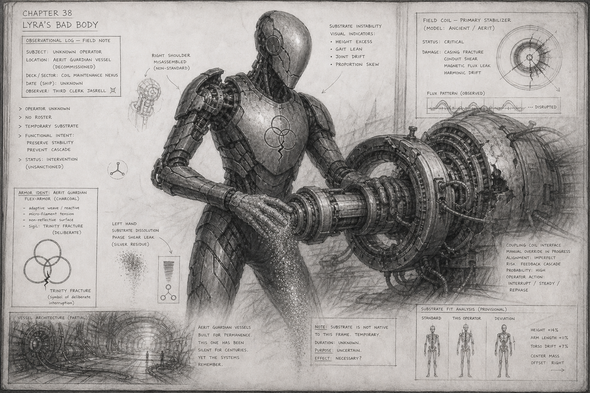

*Lyra's bad body: guardian dress, wrong substrate, no roster.*

Lyra's mind left Astra Lumara before the destination body agreed which way was down.

That was how Lars knew the archive was authentic. Lyra Vargstjärna would absolutely preserve the part where she arrived somewhere else terrified, half-formed, and arguing with infrastructure that was not hers.

The bundle came from a sealed cache inside Havets, unlocked after the Nomad noise experiment. It was late Heliostat era, years after the moonlet tests Valdrun's restoration had already shown him: six fingers, blue skin, nine hours smelling colors. Model 3 was not new when this file was made. Building a temporary body from nearby seeded stock was. Reaching a sleeping Nomad nanonet three light-hours away and borrowing matter there was a different kind of hard—not harder math. Harder nerve.

The file header was not grand. It read: DESTINATION COUPLING 01 / NOT FIRST BODY / DO NOT SHOW LARS UNLESS DEAD, MISSING, OR NEEDING HUMILITY.

Grim displayed the bundle in the Havets analysis bay. Valdrun stood at the back. Mira watched from L-Prime with her audio feed delayed on purpose so she could take notes without performing reaction for anyone.

Anchor-side only: Lyra in a medical cradle on Astra Lumara, sensors on her skull, voice log, and instrument readouts from the coupling matrix—overlap load, mass tallies, substrate consent flags, anchor vitals, timing delay. A remote marker sat three light-hours out. No camera feed.

On screen, Lyra lay in the cradle with frost still in her hair from an earlier walk across the outpost, eyes open, not seeing the lab. Her mouth moved.

"Coupling strip woke late," she said. Her voice was flat with concentration. "Filling the gap. Seconds of black. Compression without direction. Then the sensation of being asked questions by dust. Dormant nanobots with no host. A lattice left by engineers who had stopped needing bodies long before we learned to feel shame about vacuum."

She had reverse-engineered enough from the nanotechnology in her own blood to speak their dialect badly.

Lars felt his own line answer the phrase before he decided to think about it.

Not a migraine. Not the old hammer. Just a cool thread under the skin of his forearm, then a second pulse behind the eyes, as if the machines in his blood had heard a familiar grammar and turned toward it. The staged unlock had not opened every door in his head. It had stopped punishing him for standing near them. His nanobots cooperated now: mapping, adjusting, offering hints instead of orders.

He held up his left hand without looking away from the screen.

"Grim. Log that."

"I am logging your dramatic hand."

"No. Log blood response against her phrase dormant nanobots with no host."

Grim's sensors already had him. "Coupling uptick. Low amplitude. Sympathetic, not command. Your machines are listening, not traveling."

"Good." Lars flexed his fingers. The thread faded. "So am I."

On the telemetry strip, coupling strength climbed. Mass tallies at the remote marker shifted by grams—matter appearing and vanishing from the books. No image. Only a status line that read SUBSTRATE ASSEMBLY ACTIVE.

"Skin held twelve seconds," Lyra said. "Left shoulder lagging in the assembly map. I can feel it in the cradle too. That is not metaphor. Overlap is real—the remote body and the anchor sharing one nervous system badly."

The overlap trace climbed and fell at the same time in a way that made present-day Grim pause the playback and make a small offended sound.

"Anchor load," he said.

"Later," Lars said.

Lyra's pulse on the cradle monitor jumped.

"If this works," her voice log continued, "I become unbearable. If it fails, log substrate consent before locomotion."

The telemetry line marked FIRST ORIENTATION ATTEMPT.

Then a spike. Mass variance. Balance mismatch. The coupling matrix logged what her mouth translated a half second later:

"Horizon failed. Body thinks the hull rib is floor and the floor is weather. I am upright and falling in the same second. Not dignified. Down. Wet slap against regolith. Local matter still arguing about which way is up."

Present-day Grim replayed the telemetry spike twice before Lars threatened violence.

"For overlap analysis."

"For comedy, you chrome goblin."

"Multifunctional data. Also, the up-down negotiation remains unacceptable."

The bad body lasted seven minutes by the coupling clock.

Lyra's voice log carried the rest. Half-second speech delay, so she kept interrupting herself and insulting the timing. She tried to brace against a hull rib three light-hours away and missed by four centimeters, corrected, slid off the other side. Her left hand dissolved when she tried to grip a tool; the mass ledger at the remote marker dropped three finger-equivalents onto a work ledge she could feel but they could not see.

"Note," she said. "Fine motor control still garbage at remote sites. Pride remains stupid. Moonlet stock lied to us—the local matter there already knew us."

She reported sensory overlap with the preserved body, then interference from something she called the older layer—the Nomad lattice negotiating terms while she tried to walk. Whenever the temporary body touched metal at the destination, her real pulse accelerated in the cradle. The field matrix showed mass tallies shifting by grams, never enough to build a miracle, always enough to ruin a clean paper.

A scanned still appeared in the bundle: a lab board on Astra Lumara where she had crossed out spirit, astral, apparition, and written:

FIELD-COUPLED REMOTE EMBODIMENT. DORMANT SUBSTRATE. LOCAL ASSEMBLY FAILURE. DO NOT LET POETS NEAR THIS.

Mira laughed once from L-Prime, then covered her mouth.

Back in the voice log, Lyra's eyes focused for a moment on the cradle-room recorder. "If you hear this, Lars, fix your face. I did not vanish into magic. I learned embodiment in a lab, then learned travel by listening for sleeping networks the old engineers left everywhere. The Pluto artifact was not primarily transport. It was access etiquette. The Creators found similar systems and built doors around them. We are stupider because we should have inherited their mistakes and instead manufactured fresh ones at every new address."

Lars had to sit down.

The archive was not reunion. It was worse: Lyra alive in method, absent in body, refusing comfort with the old efficiency.

He had wanted, shamefully and stupidly, one clean sentence. I survived. I missed you. I knew you would come. Instead he got a balance lie in the instruments, a coupling ledger, and Lyra telling him not to be impressed by the thing that had nearly broken her courage rather than her math.

That was also her. It hurt more because it was real.

She explained limits in the same flat voice. A preserved body could anchor identity. A temporary body at a dormant site could host local action for minutes or hours if the field stayed quiet, local matter held together, and the sleeping lattice agreed to cooperate. Residue stayed unstable because that matter had never fully belonged to normal physics. Missing access logs, coupling spikes in the cradle, mass-balance errors: expected. You could not measure a consciousness crossing the field the way you measured temperature. You measured the anchor—brain activity, pulse, stress—and inferred the rest. Apparitions were engineering mistakes with bad vocabulary.

Lars stopped sitting and started pacing because his body did useful thinking better on its feet.

"Anchor, stasis, field crossing, temporary substrate, return path," he said. "She kept the boring stack. Model Four was suicide with paperwork. Model Three is maintenance with a spare body somewhere else."

"A top in the field," he added, mostly to himself. "Not heat you can log at the destination. The anchor pays. Nanobots do the rude work of finding the other excitation."

"Accurate," Mira said from L-Prime.

"Overlap is the ugly part." He tapped the telemetry where cradle pulse and remote assembly load rose together. "Two bodies, one continuity budget. The field does not give you a clean read on the traveler. It gives you the anchor panicking in sympathy."

Grim projected a side panel: Lars's current biometrics against Lyra's archived cradle trace. The overlap pattern matched.

"Your blood machines are modeling it," Grim said.

"I know. That is why I am pacing." Lars rubbed his temple. The thought should have hurt once. It did not. His mind moved faster than it had any right to, old engineering reflex waking under superhuman clearance without the hypno lock slapping it down. "Consent flag on the strip. She had to negotiate with matter that was not seeded for her. Moonlet stock was a cheat code. Destination coupling is diplomacy with sleeping dust."

Valdrun watched him with the expression of a man seeing a tool he had guarded for centuries finally remember it was also a mind.

"You are enjoying this," Valdrun said.

"I am thinking." Lars stopped at the lab board still on screen. "There is a difference. Enjoyment would be immoral. Thinking is overdue."

"Do not call this immortality," Lyra said on the log. "Immortality is what frightened people call maintenance when they want guarantees. There is continuity, error correction, consent, overlap cost, and loss."

Valdrun wept without hiding it.

On the telemetry strip, a second orientation attempt registered. Slower. More controlled. Then the mass ledger lost two centimeters of ear-equivalent into glittering dust at the remote marker when Lyra turned her head too fast for local substrate to follow.

"Acceptable," Lyra said on the log. "Ear not load-bearing."

Mira's mouth twisted on the delayed feed. "She was alone."

"At that site," Lars said.

"By choice?"

"Too often."

The voice log ended with warning.

"The older engineers are not rescuers. They may not think in individuals the way we do. But the layer favors coherence without domination. Build carefully. If I am gone when you find this, do not centralize recovery around missing me."

Then, in a separate addendum filed three hours later in shaking handwriting:

At destination, during overlap, I sensed another presence. Tall. Indistinct. Failing at edges. Not human. Not Creator. Gone before I could negotiate. Remote substrate left silver residue and a cold mass trace where feet had not quite been. I do not know if it was witness, artifact, or my own fear wearing geometry. Log the dust. Do not worship the silhouette.

Grim overlaid the addendum against the telemetry archive. The cold patch matched. Silver particulate decay in the mass trace matched Door Nine residue and the broken-gate probe within tolerance. No image. Evidence around a shape did not make the shape legible.

"Field event," Fabron said, already unhappy with every noun in the room.

"Coupling artifact at minimum," Mira said from L-Prime. "Operator category unknown. The dust is real. The silhouette is not data."

Lars stared at the telemetry strip and let the model assemble without poetry.

If dormant lattices slept in quiet places, and Aerit blood carried host infrastructure, then the archive was describing a stack: anchor at home, cross the consciousness field, borrow matter elsewhere, return before the temporary body lied about being anyone. The frightening part was not the equation. It was that someone had already walked it badly enough to file warnings.

His nanobots offered a faint map along that logic—not directions, not names. Helpful machines. Infuriating machines.

"Could my line run the same stack?" he asked.

The bay went still in the wrong way.

"Wrong question," Mira said immediately. "Capability is not permission."

"I know." He looked at Grim. "I am not asking for a field trip. I am asking whether host infrastructure is present in the same architecture she reverse-engineered."

Grim answered because someone had to. "Preliminary: yes. Host infrastructure present. Field access: possible. Training, anchor hardware, preserved-body protocol, and consent doctrine: absent. Also common sense: historically absent in you."

"Thank you."

"You are welcome. Do not make me repeat the common sense finding."

Lars nodded once. The curiosity did not switch off. It never did when a system finally stopped hiding behind pain. He filed the model next to the overlap trace and the coupling ledger and kept watching the strip.

No gods, he told himself.

Wonder stood there anyway, measurable and enormous.

The cache held one more item from the old experiment, not the present: a route key to the KBC quiet basin around Arkology Zero, and Lyra's archived note to future Lars.

If someone tries to make you central, be rude.

Under it, in smaller handwriting:

Do not move before your sense of up and down stabilizes. I was right about that.

Grim began to replay the telemetry spike a third time.

Lars threw a ration bar at his head. Grim caught it, inspected the wrapper, and said, "Edible emotional regulation. Efficient."

Valdrun stared at the route key as if it might apologize for not being a person.

"She built the method," he said. "The archive proves that."

"She built the frightening part first," Lars said. "The control came later."

Mira said from L-Prime, "Send me the overlap trace. And stop letting Grim replay humiliation for sport."

Grim's attention snapped sideways.

"The storage bay anomaly is spiking again," he said. "Same bay from before the experiment. Thermal dip deepening. Mass ledger unstable. Field coil coupling rising toward cascade."

Lars was already moving.

"Do not go alone," Valdrun said.

"Then come."

Valdrun could not move fast enough through Havets' lower decks without tearing something. Grim could. Lars took the android and left the archive playback running on the substrate-slip telemetry because spite was sometimes structural.

The unused storage bay smelled like cold metal and old insulation. A maintenance drone hung frozen mid-reach toward a live field coil, manipulator trembling. The coil's housing had begun to sweat frost on one side and char on the other. Field overload, Lyra's voice said in Lars's head, and he hated that his memories now arrived as engineering insults.

"Abort path?" he asked.

"Local abort is dead," Grim said. "Coupling locked when the cache opened. Something downstream answered the bundle like a handshake."

"Same residue class as the file?"

"Matching parameters. Operator unidentified. I dislike how quickly that sentence became useful."

Lars closed his eyes for half a second and ran the experiment he could afford.

Not travel. Listening.

His blood machines had stopped fighting him once the lock stopped treating curiosity as treason. Now they mapped pull the way Lyra's archive described: toward coupling, toward substrate, toward anything in the bay that wanted a host. The coil pulled like a magnet on the wrong alloy. Local Havets nanonet waking under stress, not sleeping dust three light-hours away. No abort path. Still useful.

"Local substrate only," he said. "No remote anchor. Someone built a body here from ship stock or bay residue."

"Agreed," Grim said. "Your machines reached the same conclusion three seconds faster than my instruments. Irritating."

"Write it down before I get sentimental."

He stepped under the coil housing to reach the manual breaker. The floor plating buckled. Not from weight. From matter trying to settle into a different mass tally. Silver glitter appeared along the seam where his boot met deck—residue without source, the same decay rate Grim had just isolated from the archive trace.

The coil screamed.

Not sound. Force in the bones. The bay's atmosphere began to slide toward the breach forming above the housing. Lars's ears popped. His vision narrowed. For one stupid second he thought of ration bars and hospital coffee and the word coherence as a joke people told when machines refused to die politely.

Then someone stood between him and the coil who had not been there a heartbeat before.

Too tall by a handspan. Aerit guardian cut anyway: charcoal flex-armor over pale engineered tissue, seams traced in cold blue the way Station Zero marked systems that were allowed to think. The uniform hung wrong on the frame—collar too high, pauldrons fighting the shoulders, one boot formed correctly while the other still negotiated with the deck plate. On the breastplate, three interlocking circles with a crack left deliberately unrepaired. Lars knew that symbol from childhood stories and chapel walls. Not Valdrun's battered half-machine bulk. Not one of the seven guardians he had been taught to count.

A guardian helmet, Aerit-made, smooth at the jaw and ridged at the temples where memory-anchor interfaces lived when identity had to be held under stress. The face beneath was worse than the armor: cheekbones almost right, eyes delayed behind the visor, hair assembled as a blunt dark cut that belonged to someone else.

The figure moved like someone running a checklist through panic they had trained into procedure.

It caught the coil housing with both hands—not heroic, technical—and bled excess field energy into the deck plating instead of Lars's skull. Frost raced down its arms. The left shoulder flickered at the substrate seam, assembly lagging where the temporary body had not fully coupled.

"Hold still," it said.

Voice filtered through helmet mesh. Female, maybe. Calm in the way surgeons were calm when the room was on fire.

"You," Lars said.

"Wrong question." A gloved hand shoved him back from the breaker path without touching his throat. Efficient. "Manual interrupt will accelerate cascade. Grim, dump auxiliary frost from bay four. You—breathe. Count four. Do not be central."

Grim moved. Lars counted because disobedience seemed fatal. The figure's visor dimmed for a fraction of a second while the bleed ran—checklist, not struggle—and cleared again.

The coil's scream dropped to a whine.

Atmosphere steadied.

The maintenance drone completed its reach, slowly now, and retracted from the live coupling as if nothing had tried to kill anyone.

Lars grabbed the figure's forearm before he could decide whether that was wise.

The armor was warm outside and cold underneath, like skin built too fast from local matter and already arguing with physics about whether it deserved to exist.

"Who sent you?" he asked.

The helmet turned toward him. He could not see eyes. He saw his own reflection distorted in the visor and, behind it, the faintest Aerit symbol pulsing once at the temple—memory anchor, not decoration.

"No roster." The voice stayed level. "You are visible. That makes you expensive."

"Name."

"Absent from your count." A beat. "Coherence?"

It might have been a joke. It might have been status. With field work, the two were often the same maintenance category.

Lars opened his mouth, closed it, and answered because the room was still alive.

"Coherence."

The left hand dissolved at the fingers first.

Silver dust.

Not glitter. Structured residue, decaying along the same impossible half-life as the archive trace, as Door Nine, as the cold patch in Lyra's filed addendum. The figure released the coil housing. The body held for two more seconds—long enough for Lars to see the crack symbol on the breastplate smear at the edges—and then the uniform collapsed inward without a person inside it, leaving a cold patch on the deck and a smell like sterilized alloy.

Grim arrived at his side with frost vents still screaming from bay four.

"Body event duration: eleven seconds," he said. "No entry logs. No departure logs. Local substrate expenditure within Model 3 parameters. Aerit guardian symbology on remote embodiment. Operator not on any roster we hold."

"Same method as the file," Lars said.

"Same method class," Grim corrected. "Identity unresolved. Do not build a person from a uniform that failed."

Valdrun caught up in the corridor, breathing hard, furious in the quiet way of people who had spent forty-nine years under furniture and disliked almost dying twice in one month.

"What did you see?"

Lars looked at the silver dust already fading into ordinary metal fatigue.

"Guardian marks," he said. "Our symbols on a body that did not fit. Wrong height. Wrong face. No roster. Someone who knew the coil and my bad habit of running toward danger before the room agrees."

"Operator?" Valdrun asked.

"Unknown." Lars swallowed. "Not one of the seven. New kind of guard, maybe. Same method as the file. Different mouth. We do not have enough to name it."

Valdrun's jaw tightened. "I know the symbols. I do not know that roster."

They sealed the bay. Grim filed the incident under seventeen overlapping categories, all of them rude. Mira, on L-Prime, listened to the sensor replay and said only, "Good. That means the method is live in the present. Bad that it had to prove itself on you."

Lars wrote three lines on his wrist pad before Valdrun could object.

LOCAL SUBSTRATE EVENT. ELEVEN SECONDS. OPERATOR UNKNOWN.

Then, because tinkering did not stop when the danger did:

Model 3 local embodiment. Guardian uniform template on wrong substrate. No central log by design. My blood senses coupling; it does not replace anchor hardware, checklist, or permission.

Grim read over his shoulder. "You are turning near death into homework."

"Near death is already homework. I am just taking credit."

Mira said, "Send me the overlap note. I want it in the model."

"Of course you do."

They had returned to the analysis bay to close the archive session when the room changed temperature in the wrong direction.

Not colder. More precise.

The coupling matrix on the bench woke without command. Silver dust gathered along the deck seam near the route key, not enough for a body, then enough, then too much. Frost climbed a cable housing. The medical monitors from Lyra's archived cradle replay flickered and went dark as live data replaced memory.

Valdrun stood up so fast a chair arm cracked.

"Present-tense coupling," Grim said. "Same residue class as the bay. Local substrate rising."

A figure stood where dust had been.

Not a recording. Not the archive voice made flesh for comfort. A temporary body assembled from Havets' own lattice under stress, ship stock, and something older in the coupling layer. Aerit guardian uniform again—charcoal flex-armor, cold-blue seams, three interlocking circles with the deliberate crack on the breastplate—but controlled enough to work: posture economical, left shoulder still lagging at the substrate seam where assembly had not quite finished. The face was worse than the bay event had been—cheek line off by millimeters, eyes a fraction too wide, hair too dark and cut for someone Lars did not know. The voice arrived before the mouth finished forming words.

One hand already on the coupling matrix, turning a calibration ring with the bored precision of an engineer checking a valve while three other catastrophes waited in queue.

The figure did not look up at them first. It looked at the telemetry.

"Your archive playback warmed a dormant handshake," it said. "Correcting drift before it spreads. Fix your faces. Not here for reunion. Here because this ship still needs maintenance."

Lars could not speak for two seconds.

Then: "Wrong face. Right symbols."

"Cosmetic error. Non-lethal." One step to reach the route key without losing orientation. "Still within tolerance."

Valdrun's voice came out rougher than Lars had ever heard it. "We thought—"

"You thought the file might be all that was left." The figure finally looked at him while its fingers kept working. "Understandable. Incomplete. I am not a door you walk through. This body is a terminal where the field needs hands. The work is elsewhere."

Mira, on the delayed feed, said, "Present embodiment confirmed. Same method class as DESTINATION COUPLING 01. Aerit guardian symbology. Identity not established. Lars, do not say anything stupid for ten seconds."

"Eight," Lars said.

"Good."

The figure tapped the archived overlap trace still on screen and compared it to the live coupling readout. "You found the early version. Good. Control improved. Slightly. Do not romanticize the improvement. The strip still wakes late."

It glanced at Lars's wrist pad without asking permission. "Local substrate event. Eleven seconds. Clean abort. You are learning the right things in the wrong order."

His forearm cooled in sympathy. He did not look away. "The bay operator."

"Busy." Two fingers entered a correction on the route key Lars could not follow. "Do not build a roster from one uniform."

"Who—"

"Wrong question." Overlap cost, delivered as category. "Ask whether the method held. It held. Ask whether you should chase a person. You should not. Chase the work."

Lars heard himself breathing too loud. His mind was already turning it into structure: anchor in stasis somewhere, consciousness crossing the field like a top finding another excitation, nanobots helping the move, bodies that arrived with the wrong horizon or the wrong hair, operators in guardian dress who appeared for eleven seconds and vanished without names.

"You have been tinkering with Model Three in your head," the figure said. "I can feel the shape of it through the coupling. Stop asking whether you could do it and start asking whether you should. Capability is not permission. Your blood knows the architecture. Your judgment is still catching up."

Valdrun said, "Are you safe?"

The mouth tilted. "That is a human question. I will answer it badly. Safer than the sleeping ones if the work stays distributed. Less safe than I would like if you make any one mouth central." A look at the route key. "Use this. Work locally. Be rude if anyone tries to make you central. And do not move before your sense of up and down stabilizes. The addendum was right about that."

"How long can you—"

The left shoulder flickered at the seam. Grim logged anchor-adjacent coupling noise before it spoke—not temperature, not a traveler you could weigh, only indirect strain where field and substrate disagreed.

"Not long. Temporary bodies are honest about limits if you listen." It did not stop working while it spoke. "Do not chase a terminal as if it were the whole person. Chase the method. Guard the sleeping ones where you can reach them. Let the rest stay distributed."

It was already fading at the edges while still checking one last coupling value.

Lars laughed once, helpless and angry and relieved in the same breath. "Coherence?"

"Coherence," it said.

The left hand lost one finger to silver dust.

"Acceptable," it said. "Finger not load-bearing for calibration."

Then the body failed on schedule: overlap fraying at the edges, shoulder losing coupling first, silver dust, cold patch, smell of sterilized alloy. No departure log. No entry log. Only the route key on the bench with a correction entered in handwriting that matched the archive and eleven seconds of recent memory rhyming with seven minutes of ancient telemetry.

Mira broke the silence first from L-Prime. "Same method. Two operators in guardian dress, maybe more. Identity still not established."

"Someone is working," Lars said. "We finally saw the terminal."

Valdrun stared at the dust. "Our marks. Not our roster."

"No," Grim said. "Not in the room either. Present only where the field needed hands."

Not a reunion.

A snapshot: method alive in the present, absent in any body they could keep, still correcting drift in a ship that had not been stood on in centuries—one corrected route key, guardian symbols on wrong faces, and no time to become anyone's answer except the work itself.

---

# Chapter 39: The Empty Place Is Listening

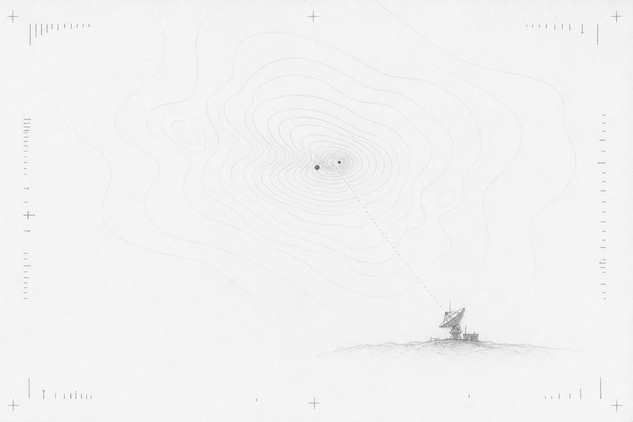

*KBC low-observation listening note.*

The KBC Void was not empty.

It had always held galaxies, gas, radiation, and the usual mistakes in old survey data. Humans had called it empty because it was inconvenient to reach and did not offer easy glory.

The new data showed something stranger.

Advanced civilizations were missing from the record in patterns that looked deliberate. Too many quiet regions. Too little noise. Too few of the bright signatures empires usually left behind when they grew loud and proud.

Someone, or something, had been keeping the Void dull on purpose.

Arkology Zero sat near one edge of it. Lars gathered the circle there because the numbers belonged near the place they described.

Valdrun came in person. Grim ran analysis from his android body and half the ship at once. Mira joined from L-Prime, still keeping distance. Fabron and Vigor appeared on the wall displays. Ödesvaka handled protocol at Arkology because someone had to keep the meeting from becoming theater.

Grim called it a distributed council. Lars did not argue. They had all sat through enough committees.

They looked at the cosmology until the charts started to blur.

Galaxies around the Void showed fewer high-energy events than they should have. Civilizations that broadcast aggressively near similar basins often collapsed, migrated, or went quiet over long spans of time. Creator portals skirted the edges. Older anchors sat inside the quiet.

Grim laid survey histories from seventeen species over the map. The same pattern kept returning. Not no life. No boasting. Fewer megastructures. Fewer waste fires in the sky. Fewer conquest beacons. More notes in the margins saying instrument fault, then silence.

Mira spoke first on the channel when the room needed words.

"If minds can couple through field conditions, then noise matters. Loud observation changes what you are trying to see. Quiet preserves coherence. It also makes you harder to hunt."

Fabron nodded. "A predator cannot eat what it cannot find."

Valdrun said, "Then the basin is teaching hunting and hiding in the same lecture. We keep forgetting which chair we sat in."

Lars had spent years learning Återviens as an Aerit doctrine. Looking at the Void, he wondered whether the universe had been teaching a larger version of the same rule long before they named it. He disliked how mystical that sounded until he removed the romance and kept the engineering.

Watch something too hard and you change it. Centralize too much and the system breaks. Stay quiet, stay distributed, stay repairable, and complexity survives longer.

Then their measurements began to misbehave.

The Void did not speak. It pushed back.

When Arkology scanned hard, the data got worse. When they listened passively, with many small sensors spread wide, the picture improved. When Vigor's kitchen network sent in planting times, cellar temperatures, goat counts, flour shipments, and winter reactor draw from twenty-seven colonies, the model sharpened more than it did under Aphex military optics.

That should not have worked. Planting schedules were not cosmology.

But the records were local. They were unsynchronized. They were honest in the way survival logs were honest. They had not been made to dominate the thing being measured.

Vigor, on the wall display, said quietly, "Kitchens know when a season is lying."

No one made a joke out of it. The line landed because it was true.

The danger line became clear.

Door Nine. First Door. The quiet basin. Black Hole's hunger for acquisition. Syren's hunger for surrender. Aphex and NUKEA reaching for central control. Everyone kept treating quiet as an invitation to own something.

Lyra's note sat in Lars's pocket.

Be rude.

He took a breath and said what he had been avoiding.

"We release a false public model."

Fabron looked up. "Incomplete, you mean."

"Yes. Door Nine as hazardous ancient transport. KBC alignment as navigation risk. Enough truth to keep careless ships away. Not enough to start religions, research monopolies, or emergency seizures."

Mira watched him. "And in private?"

"Small observatories. Boring ones. Farms, reactors, maintenance logs, medical consent signals. No central archive. No master key."

Arsenault, on secure channel, looked tired rather than amused. "That will be difficult to fund."

"Good," Lars said. "If it is boring enough, the wrong people will ignore it."

Valdrun agreed last. He did not doubt the plan. He hated that survival still required a public story and a private one.

"Temporary lies become institutions," he said.

"So do temporary truths dropped on frightened people," Mira answered.

Lars did not feel victorious. He felt the weight of another compromise that might hold.

Mira added a condition. Every private node needed local consent language, especially for medical and cognitive data. Boring could not become hidden extraction with polite forms.

Fabron would add jurisdictional noise on purpose. Vigor would add kitchens because kitchens already knew who was hungry and who was lying about it.

Ödesvaka logged the plan under a long title that made Fabron wince and did not apologize for it.

Outside Arkology, the KBC Void remained dark.

Listening was still the wrong word.

But it was not ignoring them.

Through the window, the stars did not arrange themselves into meaning. Nothing reached out. Nothing blessed them.

The evidence held anyway.

---

# Chapter 40: Fabron's Lineage

Fabron took Lars to church and warned him not to be irritating.

The chapel occupied three connected pressure modules on an old military supply station, officially registered as the Chapel of Saint Claire of the Broken Valve. It owned more torque wrenches than candles. Its congregation included Aphex retirees, dock families, two alien machinists, a choir with excellent lungs, and a schoolroom where children learned arithmetic by balancing oxygen budgets.

The place smelled of machine oil, old bread, disinfectant, and people who did not trust automatic doors unless a human knew how to open them by hand.

No one bowed to Lars.

That helped.

An old woman named Mother Aveline greeted Fabron by slapping the back of his head with the accuracy of a woman who had calibrated worse tools.

"You took long enough."

"Operational secrecy, Mother."

"Cowardice with paperwork. Still cowardice. Still needs mopping."

Vigor liked her immediately.

The altar was a workbench. Its inspection lamps lit silhouettes of people repairing doors, sharing water, carrying batteries, refusing crowns. Under the bench hung emergency masks, a child's cracked learning wrench, and a small plaque that read: IF YOU CAN PRAY, YOU CAN CHECK THE SEAL.

The congregation called itself Clear Hand. They did not know Aerits fully. They knew practices, stories, jokes, rituals. Authority must be local first. Rescue without consent became conquest. A broken pump deserved attention before a beautiful speech. No person should become the only hinge.

They sang badly.

Lars liked that too.

The archive was mostly paper, ceramic plates, memory glass, and memorized call-and-response. Digital records burned too easily. Empires searched databases. Grandmothers searched grandchildren.

Mother Aveline led them through old phrases: keep the hinge small, no single heart, repair before worship, refuse the throne, count the black wolf's teeth. The children repeated them while checking pressure gauges and marking redundant routes on a wall map. Faith, here, was not escape from maintenance. It was maintenance with witnesses.

They had no word Aerit. They had stories of clear ones who survived by sharing work, not rule. Stories of old engineers leaving practices in human hands because bloodlines failed and habits traveled. Stories of Pluto only as "the first cold lesson," stripped of mature doctrine that had not yet existed.

"No one at Pluto was founding a church," Mother Aveline said, catching Lars's look before he shaped it. "They were freezing, frightened, and learning which valves lied. Later people made hymns because memory needs structure."

When Fabron turned the lens to a ritual object—three metal rings around a cracked ceramic disk—Mira's voice came from L-Prime with the flat tone of a woman diagnosing gaskets.

"This is a maintenance teaching aid. Stress distribution. Redundancy. Controlled fracture."

Mother Aveline smiled. "And a symbol of humility before what holds us. Meanings stack, Doctor. Like gaskets."

"Bad gaskets fail."

"Then maintain them before children breathe vacuum."

The reveal was not a secret army.

Fabron belonged to a culture that remembered useful constraints after forgetting their source. It had siblings everywhere: reactor guilds, farm vows, Abantu exchange customs, Kalari-influenced mutual aid, NUKEA retirees, Aphex officers who falsified efficiency reports to preserve manual capacity.

Fabron showed Lars the ledger because Mother Aveline made him.

"Not because I trust you with it," Fabron said. "Because withholding it now would be operationally childish."

"Big day for you."

"I am enduring it."

"Your eye is twitching."

The ledger held names, not ranks. A dockmaster who could delay pilgrim freight without making it look political. A nurse who knew which hidden wards would shelter a frightened patient without asking the wrong questions. A retired NUKEA regulator whose annual safety lecture was secretly a map of decentralization failures. A food inspector who had once stopped a military seizure by discovering seventeen tragic soup violations.

Mother Aveline watched Lars over tea. "You expected drift."

"Yes."

"Communities drift. That is how they survive distance. Lock the doctrine too tightly and people start protecting the lock instead of each other."

She gave him a list of contacts and a warning.

"We can shelter. We can refuse spectacle. We can move food, tools, and frightened people. We cannot become your disciples. Disciples stop doing inspections."

"Good."

"Do not say good like you invented restraint."

Before they left, evening repair began.

The pump was old enough to have opinions. Two teenagers isolated the line while an alien machinist with four careful hands cleaned mineral scale from a valve throat. Mother Aveline made Fabron hold the basin. Vigor kneaded bread dough on a side table because the repair would run through dinner and no doctrine survived hungry apprentices.

The congregation sang while fixing the pump. The rhythm matched the old Aerit greeting cadence.

Coherence?

Coherence.

Fabron sang softly, human and irritated and exactly himself. There was no hidden nanobot revelation in him. No old blood waking. Only a man with duty trained into the bones by people who had mistaken good habits for holy ones and, by that mistake, preserved them.

Then an Aphex central warrant arrived demanding all Clear Hand anomaly archives be preserved for strategic review. Arsenault had not sent it.

Fabron read it once and set it on the workbench altar.

"No," he said. "This archive is not in Aphex custody."

Lars did not intervene. That mattered. If he rescued the archive, it became his. Fabron called legal clerks, veterans' unions, a food safety inspector, and Arsenault in that order. Within an hour, the archive was temporarily classified as an active religious, medical, historical, and culinary preservation site. No single authority could seize it without angering five others and one elderly woman with knives.

Mother Aveline handed Lars a steel token: three circles, deliberate crack.

"We do not worship the Clear Ones," she said. "We repair what they could not. Pride skips the inspection."

Lars closed his hand around it.

"I will be rude."

"Good. Peel better next time."

Fabron walked him back through the pressure corridor afterward, shoulders held as if the whole station had become a court-martial.

"You understand," he said, "I am still Aphex."

"Unfortunately visible."

"And French."

"And human."

Lars stopped walking.

Fabron looked straight ahead. "If anyone in your circle attempts to make my usefulness proof of secret biology, I will become intolerable."

"You are already intolerable."

"Then I will become more so."

Fabron nodded once, satisfied and embarrassed by satisfaction. "My people are not evidence that bloodlines matter. We are evidence that habits survive when people bother to teach them."

Behind them, the pump restarted. The chapel cheered louder for water pressure than most governments did for treaties.

---

# Chapter 41: The Creator Mistake

The Creators had not been fools.

That made their mistake more frightening.

Mira led the analysis from L-Prime, her lab feeds open on a sealed bay aboard Havets: Creator logs, Door Nine residue, rogue-anchor data, Lyra's bad body journal, Nomad noise experiments, KBC cosmology, and Clear Hand fragments that should not have mattered but did.

The bay had been stripped of anything ceremonial. No dramatic lighting. No floating starfield. Just worktables, quarantine boxes, thermal ledgers, mass accounting, and one stubborn coffee stain Lars refused to explain because it made Mira's eye twitch on the channel.

"They found older artifacts," she said. "Routers, anchors, local embodiment aids, maybe nanobot-host compatibility systems. The older layer linked cognition and matter through low-observation fields—quiet basins where the universe was hard to watch. The Creators were physical expansionists. They saw stable correlations across distance and built transport around them."

Grim added a diagram of a person using a library as a highway and being surprised when books suffered structural stress.

"Insulting," Fabron said. "Possibly actionable."

"Accurate," Grim said.

The mistake had three stages.

Discovery: artifacts responding to quiet, distributed systems and prepared substrates.

Exploitation: portal rings forcing matter through field conditions optimized for communication and coherence.

Escalation: brighter portals, larger traffic, central route hubs, religious and imperial interpretations, then collapse of cooperation from the older layer.

The evidence lined up with ugly neatness. Early Creator logs showed low-energy tests with clean mass return and minimal residue. Middle logs showed increasing throughput and rising coupling strain. Late logs showed missing grams, duplicated sensory impressions, travelers with nonlocal memories, temporary-body contamination, and field refusal around overbright hubs.

The Nomads, if that name survived, had not necessarily attacked. They may have withdrawn. Or reduced coupling. Or allowed overbright systems to fail because intervention at scale would become command.

"Morally convenient for them," Valdrun said. "Old powers often discover restraint after others pay for it."

Lars looked at him. "Yes."

They let that sit. Rejecting gods meant rejecting easy innocence too. Old engineers could be vast and still flawed. Field-like intelligences could have ethics incompatible with people bleeding in rooms.

The model predicted the next crisis.

Black Hole and Syren were moving toward First Door. Black Hole wanted to force a gate with harvested biological processors. Their fleet profile showed extra coolant, mobile tissue tanks, and command rhythms designed to turn many stolen minds into one brutal phase reference. Syren wanted synchronized surrender across thousands of followers, prayer as entrainment, silence as a weaponized clock. Aphex central wanted a fleet nearby. NUKEA wanted stabilizing power ships.

All four would brighten the quiet.

All four could damage the local field basin.

Not universe-ending. Worse in a practical way: a real, measurable collapse of a rare low-observation anchor, exposing Arkology Zero, destroying data, killing ships, and possibly scrambling every locked Aerit pattern tied to that basin.

Ödesvaka displayed the shield-list impact from Arkology Zero and did not soften the numbers. Still-locked Aerits near the basin would not all wake or die in a dramatic line. The danger was uglier: cover memories destabilized, selective pain triggers firing under contradictory evidence, medical collapses misdiagnosed as ordinary strokes, identity protection working too hard in bodies that had no idea why.

"So the final enemy is category failure," Grim said.

"And weapons," Fabron said. "Do not omit the weapons from the minutes."

"And ego exceeding load rating," Mira said.

Everyone looked at Lars.

"Rude."

The solution could not be a grand reveal. If Lars announced the truth, every faction would rush faster. If he seized command, he would prove the wrong lesson. If he destroyed First Door, he might damage the older anchor and do Black Hole's work loudly.

They needed distributed refusal.

Vigor's networks would slow pilgrim flows with food, transport strikes, safety advisories, and inconvenient kindness. Fabron's Clear Hand siblings would seed local authority through military and maintenance channels. Arsenault would keep Aphex divided enough to prevent fleet centralization, a task he described as converting arrogance into manageable liabilities. Rauk and NUKEA dissidents would isolate emergency keys. Mira would publish a technical warning about ancient transport instability, stripped of deeper implications but strong enough to frighten insurers.

None of it looked heroic on a feed. That was the point. Heroic was a synchronization hazard.

Grim would prepare consent-protected shield lists. Ödesvaka would hold the archive side from Arkology Zero.

Lars would go to First Door.

Valdrun objected. "You make yourself the hinge again. I have watched emergency powers outlive the emergency."

"No. One noisy idiot in front of a bigger pattern."

"That is what emergency powers say when they enjoy drama."

Mira's voice was quiet. "He may be useful because everyone already misreads him. Existing stress path. Known failure mode."

"Thank you. I think."

The Creator map pulsed. A layer emerged from under the First Door notation, unlocked by their model of the mistake.

Less force. More witnesses. No throne.

Lars laughed because the universe had become enormous and irritatingly on theme.

Mira saved the layer under a deliberately boring filename.

`transit-risk-supplement-7`.

"That file name is an insult to wonder," Grim said.

"Good," she replied. "Wonder has poor access control."

---

# Chapter 42: The Nomad Hypothesis

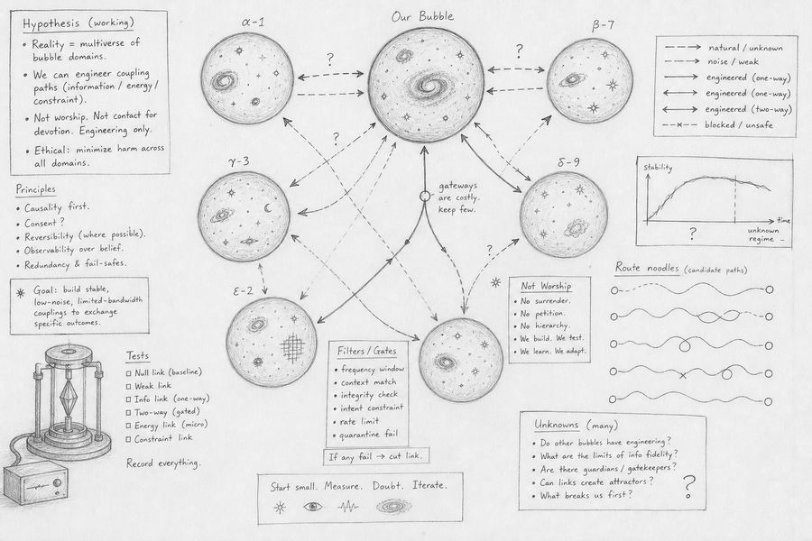

*The Nomad hypothesis, lowercase until proven.*

Mira named the model because everyone else kept making it worse.

"The Nomad hypothesis," she said. "Lowercase until evidence earns capitals."

"Too late," Grim said. "My files have capitals. They improve sorting morale."

"Your files are dramatic."

"Thank you."

The hypothesis had five parts.

Older artifacts were routers, anchors, and etiquette machines for coupling cognition through low-observation field states.

Nanobots in Aerit blood and tissue were not simply upgrades or weapons. They were local host infrastructure for repair, memory protection, and limited field access.

Consciousness projection was not a soul leaving a body. It was identity continuity mediated through preserved substrates, temporary bodies, and field correlation under quiet conditions.

The Creators built portals by forcing the transport side of a system meant primarily for communication and coherence.

The KBC Void and similar basins were not natural emptiness alone, but quiet buffers where high-capability civilizations or field-like intelligences minimized observability to preserve complexity and avoid predation.

"Six," Lars said. "Every idiot who sees this will try to own it, bottle it, tax it, or put a choir in front of it."

"That is not part of the hypothesis."

"It is what happens after publication."

They tested the model against old records: Pluto artifact behavior, Heliostat anomalies, GRIN development leaps, Kalari reports of impossible dreams after early contact, Rakh'Na war survivals, Alpha Fourteen locks, Havets navigation, Lyra's residues.

The model did not explain everything, which made it stronger. Bad theories explained too much because they ate inconvenient facts.

Pluto stayed messy. No mature Återviens, no secret perfected doctrine, no destiny waiting under the ice. Just contamination, survival, field etiquette half-learned under lethal conditions, and Lyra making practical choices with insufficient data.

The Alpha Fourteen locks stayed ugly too. Consent protection, memory steering, cover lives, and failure modes that could cause selective pain when direct truth struck the wrong support beam. The model explained why careful evidence could pass while blunt contradiction harmed still-locked Aerits. It did not make the original decision clean.

Fabron's order contributed oral histories. A reactor nun on Europa Station had a chant matching Creator warnings about brightness. A farm guild on Abantu routes kept seed calendars aligned with low-noise windows. A military fraternity in Aphex used a handshake derived from an old consent-boundary ritual and had no idea why.

"The galaxy remembers through chores," Vigor said. "Recipes survive because someone still has to feed the shift."

Mira published the public version as a dry hazard paper: Ancient Transit Systems and Instability Risks in Low-Noise Cosmological Regions. It contained enough math to frighten insurers, enough omissions to avoid cult fuel, and enough boredom to reduce casual readership by ninety percent.

Arsenault called it "devastatingly unmarketable."

"Highest praise," Mira said.

"Do not become proud. Pride increases discoverability."

The private version stayed distributed. No master archive. Fragments in Arkology, L-Prime, Vigor's freezers, Fabron's paper, Arsenault's liability vault, Rauk's reactor logs, and Grim's unpleasantly smug memory.

"My memory is not smug," Grim said.

"Your memory has posture," Lars said.

Then Lyra's signature moved in L-Prime 41.

Not in the archive. In Mira's lab.

Thermal anomaly: nineteen seconds. Local mass increase: forty-two kilograms. No access logs, no door cycle. The anomaly left silver-gray residue, a palm print on a cracked composite beam, and a handwritten note in Mira's locked physical notebook.

The lab's air system recorded a mineral-dust smell and a pressure flutter like someone had opened a door into weather that did not exist. A stool had moved eight centimeters. One containment jar had been turned so its warning label faced the room.

Mira read it over the secure channel, voice flat from effort.

Do not let Lars confuse refusal with solitude.

Below it was a field equation correction that improved the model by twelve percent.

"Lyra?" Fabron asked, formal enough to make the single word sound like a report heading.

"Maybe," Lars said.

"A manifestation-capable agent?"

"Maybe."

"Forgery?"

Mira's expression hardened. "The residue half-life matches the bad body journal. The palm print contains unstable nanomaterial arranged in the equation before decay. If it is a forgery, the forger deserves tenure, prison, and no lab keys."

The personal line bothered Lars more than the equation. He had been rejecting thrones so hard he had nearly rejected help that did not command.

Mira looked at him on the channel from L-Prime. "I did not consent to a manifestation in my lab. Helpful is not a consent category."

"No," Lars said. "You did not."

They recorded it as breach, evidence, and gift. All three. Mira made them keep all three labels because removing any one of them made the others dishonest.

She added a consent condition: no field experiments in occupied personal workspaces without explicit local permission, even if Lyra Vargstjärna herself thought she was being helpful.

Ödesvaka accepted the complaint from Arkology Zero as a formal protocol amendment. Grim added subcategories. Fabron suggested "trespass by impossible engineer." Mira accepted "unconsented field-coupled local embodiment event" and rejected everyone else's poetry.

Somewhere in the data, a tiny correlation shifted.

Almost like embarrassment.

"Do not anthropomorphize the universe," Mira said.

"I was anthropomorphizing Lyra," Lars said.

"Marginally more defensible."

---

# Chapter 43: No Gods, Just Old Engineers

The first person to kneel to Lars did it in a docking corridor beside a broken vending machine.

He was a mechanic from a pilgrim transport diverted away from First Door by Vigor's food-and-safety blockade. Young, exhausted, wearing a Syren thread around one wrist and grease under his nails. When he recognized Lars, his face changed with unbearable relief.

Then he dropped to one knee.

Lars reacted badly.

"Get up."

The mechanic flinched.

"I said get up. I am not your altar, your door, your proof, or your excuse to outsource thinking. Stand up and check that vending machine. It is making a noise like it wants to kill children."

The mechanic stared.

The vending machine clicked ominously.

Grim tilted his head. "It is indeed unsafe. Probable snack delivery, possible arson."

That saved the moment. The mechanic stood, confused and crying, then opened the service panel. Inside, a power regulator had scorched halfway through its casing. The smell of hot plastic cut through incense residue from the pilgrim transport. Five minutes later he was repairing it while Lars held a flashlight and felt like the galaxy's least qualified counselor.

"I only wanted to thank you," the mechanic said.

"Then thank me by not kneeling."

"What should I do instead?"

Lars looked at the exposed regulator. "Learn why it burned. Teach someone else. Refuse anyone who says the Void wants your blood. Eat before making cosmic decisions. Hungry people join stupid movements."

The mechanic laughed through tears.

Fabron watched afterward with a strange expression.

"What?"

"Pastoral care by assault," Fabron said.

"Worked, didn't it?"

"Theologically alarming. Operationally sound. I will deny approving it."

The incident spread because everything spread. Someone had recorded the first thirty seconds, missing the regulator and catching only the command to stand. The Refuser nickname grew teeth. Syren splintered over it. Some called Lars proof that true messengers denied themselves. Others called him enemy of transcendence. A smaller, more useful group began calling for repair vigils: public maintenance work instead of pilgrimage.

Vigor amplified that mercilessly.

Bring tools, not candles. Soup if the job runs long.

Madame Fabron added: Candles acceptable if power fails.

Mira, unwilling patron saint of people refusing sainthood, sent Lars a message.

Your anti-cult has terrible branding and unstable load distribution.

Good, he replied.

The public noise was almost easier because it could be insulted.

The private conversations were harder.

The private confessions came over the guardian channel, not in one room. Valdrun spoke from Havets. Ödesvaka logged from Arkology Zero without mockery. Grim, Vigor, and Fabron joined where they stood. Mira's square stayed at L-Prime.

Valdrun admitted he had wanted Lars central because he was tired. Six centuries of watchfulness made command look merciful. Grim admitted he preferred central models when distributed emotion became difficult to parse. Vigor admitted usefulness sometimes tempted him toward permission. Fabron admitted his order could become exactly what it opposed if fear made ritual rigid.

Mira said, "I am afraid that if I ask for more memory, I will lose the life I built without it."

No one answered quickly.

Finally Lars said, "You might lose parts. You might gain parts. You might decide not to ask. All allowed. Even if we need you, your head is not public equipment."

"Even if you need me?"

"Especially then."

The words cost him. Not because he doubted them. Because need was standing in the room with a knife and excellent arguments.

Mira saw that. "That answer passed stress tolerance."

"Put it on my grave."

"Premature."

Black Hole responded by accelerating toward First Door with a biological processor fleet. Syren's largest faction announced synchronized silence. Aphex central prepared an emergency fleet despite Arsenault's stalling. NUKEA moved power ships "for safety."

Every pressure line converged.

Lars stood aboard Havets and looked at the KBC basin map. Civilizations hiding by dimming themselves. Older engineers spread across field states. Creator ruins like abandoned transit mistakes. Humanity and its cousins shouting in the dark with weapons and sermons.

The raw data did not care what anyone called it. Not god. Not ghost. Not destiny. It was residue, coupling strain, mass accounting, failed bodies, field models, bad maps, better warnings, and living people trying not to repeat old engineering sins with newer flags.

He accepted the scale.

He refused the interpretation.

"No gods," he said.

Grim waited.

"Just old engineers. And living people who still have to fix vending machines."

Grim considered this.

"The vending machine remains statistically dangerous."

"Then we start there."

---

# Chapter 44: Lyra Checks In

Lyra arrived in Arsenault's private bathroom.

This was widely agreed, afterward, to be rude even by Lars's standards.

The security logs showed no entry. Thermal sensors recorded a human-sized bloom for twenty-two seconds. Floor mass increased by forty-nine kilograms, then lost it. The mirror cracked in a spiral. The sink filled with silver-gray residue that evaporated before the cleaning system could panic.

The cleaning system did panic anyway. It sealed the room, sprayed the ceiling with disinfectant, and filed a contamination report under BIOLOGICAL / MINERAL / RUDE.

Arsenault, washing his hands, found a woman leaning against the towel warmer and looking annoyed by embodiment. She was the wrong height by three centimeters. Her hair had assembled as a blunt dark cut on one side and a braid that had no business existing on the other. One cheekbone sat almost right, which was worse than wrong. Her right hand was failing into dust by the millimeter. Her left eye flickered silver at the edge. One bare foot had not formed correctly and was using the bath mat as a negotiable suggestion.

"You are not Lars," she said. "Wrong washroom. Routing error. Embarrassing."

Arsenault screamed.

Havets had already sent a passive survey drone under Aphex hospitality cover: no weapon ports, no active transmitters, only thermal film, mass sampling, and the sort of polite intrusion Arsenault would later call theft and insurers would call procedure. Grim relayed the pack in real time. Lars watched from Havets' command channel, not the bathroom tile.

By the time Arsenault stopped shouting, Lyra was gone. The bathroom remained as evidence, indignity, and the smell of overheated mineral dust.

Arsenault pointed at the sink. "Something manifested in my washroom."

"Probably not my decision."

"Probably?"

"Almost certainly. My bathroom invasion policy is strict."

"That is not better."

Lyra had left three things.

First, a corrected field equation etched into the cracked mirror by residue deposition.

Second, a physical token: not Aerit, not Creator, not any material Grim could identify. It behaved like matter embarrassed to be local and kept shedding heat without cooling. Arsenault's best security case froze around it while the token itself stayed the same temperature and made every nearby scale disagree by two grams.

Third, a message on Arsenault's towel-warmer display. The header showed Lars's routing tag. The body had printed against the wrong suite anyway.

Lars — evacuation routes are not property. Stop making frightened men useful to you.

Arsenault read it seven times.

"She wanted you," he said to the empty channel.

"She usually does," Lars said from Havets. "The display borrowed my name and your plumbing. That is the embarrassing part."

Mira examined the evidence from L-Prime and confirmed the manifestation matched her lab breach with better mass control. Temporary body, probably Lyra-derived or Lyra-directed, unstable, measurable, obnoxious. Not ghost. Not angel. Local body assembled through field-coupled substrate and dissolved before capture.

"Consent breach again," Mira said over the channel. "Different site. Same category. With improved mass control. That does not improve consent."

"Arsenault did not consent to bathroom visitation," Grim agreed solemnly from Havets. "Category: hostile plumbing-adjacent manifestation."

"Thank you for phrasing it in the worst possible way," Arsenault said.

Arsenault filed a complaint.

He filed it with Aphex Security, Aphex Legal, his private household staff, two insurers, and, after a pause, Mira's new consent-breach protocol registry at L-Prime. The last one irritated him most because it was morally correct and administratively beneath him.

"I am not comfortable being evidence," he said.

"No one is," Mira replied from her lab.

"I am usually evidence against other people."

"Growth opportunity," Lars said.

The equation mattered more than the theater. It showed how First Door could be damped without destroying the older anchor: reduce synchronized observation, bleed energy into many local incoherent sinks, and prevent biological processor coupling from becoming one pattern.

In practical terms, the field did not need a heroic counter-signal. It needed thousands of small sinks: local reactor noise, unsynchronized shield pulses, kitchen heat exchangers, dockyard ballast pumps, suit radios intentionally out of phase, prayer broadcasts broken into maintenance advisories, and Havets singing only in the gaps where no central recorder could make one song of it.

In simpler terms, make every faction's grand gesture locally boring.

Vigor laughed so hard he had to sit down. "We save the basin by making the apocalypse tedious. Feed people, fix pumps, make the mayor wait."

"Weaponized boredom," Fabron said. "France has institutional experience."

The token mattered differently. Near the Creator map on Arkology Zero, it revealed a service path around First Door: too unstable for ships, enough for data, residue, maybe temporary bodies. The path did not open as a line. It appeared as a set of tolerances: mass below fifty kilograms, duration below thirty seconds without prepared substrate, substrate load absorbed by local sinks, no synchronized witness pool.

Lyra's recovery apparatus had been moving through service paths for centuries, checking sleepers, nudging cultures, leaving traces mistaken for miracles.

Not all of it was under Lyra's control anymore.

Some agents might be Lyra. Some descendants of her work. Some Nomad-coupled patterns using preserved bodies. Some autonomous systems following old criteria. Invitation, selection, survival through coherence. No central command. Not even hers.

"Good," Lars said, surprising himself.

Valdrun looked at him from Havets' secondary display.

"If she controlled it all, she would be the throne. She built something that can tell her no. Annoying as hell. Correct."

Mira was quiet on the channel. "It told me no by entering my lab first."

"Or Lyra did something rude with a useful system," Lars said. "We can be grateful and still write up the trespass."

"I already did."

"To whom?" Grim asked. "The receiving authority matters."

"The local universe."

Ödesvaka accepted the filing from Arkology Zero with no mockery and one new subcategory: wrong-suite manifestation with correct addressee metadata.

The practical consequences multiplied.

Arsenault withdrew two Aphex route-control proposals and replaced them with an emergency liability warning so dense that three admirals postponed decisions to find counsel. Fabron's Clear Hand contacts began labeling evacuation paths as local safety corridors, not sacred routes. Vigor's people started moving heat exchangers, soup kitchens, and repair crews into positions that looked humanitarian because they were. Mira published a supplement about synchronization hazards in ancient transit systems from L-Prime and made the title so boring Lars accused her of violence.

The operation for First Door became possible. Divert pilgrims. Fracture Black Hole synchronization. Stall Aphex and NUKEA central authority. Damp the ring through local incoherent sinks. Shield sleepers by consent. Let Havets sing only where no one could record the song.

Lyra's final bathroom insult arrived two hours later when the towel warmer blinked once.

Lars, be kind when possible.

Pause.

This does not excuse becoming solemn.

Grim said, "She knows you well."

"Shut up."

"Coherence," Grim said softly.

Lars answered after a moment.

"Coherence."

Mira added one more line to the breach registry at L-Prime before the operation clock began.

Assistance did not waive local consent.

No one argued. Even Arsenault, still refusing to use that bathroom, signed the acknowledgement.

---

# Chapter 45: The Cancer Model

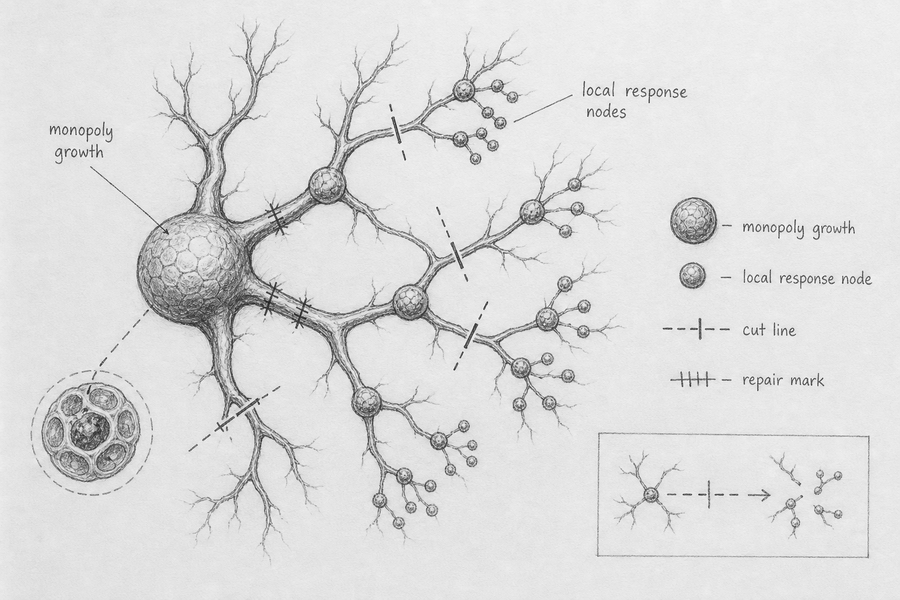

*The cancer model: contain, cut, repair.*

Grim modeled galactic collapse as cancer because he had recently become fond of biological metaphors and wanted everyone to suffer with him in labeled diagrams.

He chose the mess hall on Arkology Zero because Vigor had forbidden strategy sessions without food. The long table was covered with soup bowls, cracked tablets, field printouts, Aphex legal pads, NUKEA governor schematics, and one plate of preserved fruit Grim had classified as "optimistic but texturally suspicious."

"Healthy systems differentiate," Grim said. "Cells specialize, communicate locally, obey growth limits, self-destruct when damaged, and maintain boundaries. Cancer centralizes growth around itself, ignores consent signals, recruits blood supply, corrupts immune response, and consumes the body sustaining it."

He displayed Black Hole, Syren, Aphex central, NUKEA emergency licensing, and several historical empires as overlapping tumors. Each sphere pulsed according to a different failure pattern. Black Hole pulsed red around stolen biological supply. Syren pulsed white around synchronized silence. Aphex pulsed purple around command consolidation and liability deflection. NUKEA pulsed blue around emergency dependency.

Arsenault objected to Aphex's color.

"Purple tested as morally anxious," Grim said. "Also expensive."

"I reject chromatic slander and any implication that our liability posture is mauve."

"Recorded in purple."

Lars laughed first because someone had to keep the room from bowing to the diagram. Fabron did not laugh. Mira watched from L-Prime on a wall square, tumor overlays propagating across trade lanes and rescue corridors, her fingers still except for one tap against her own table whenever an assumption had no evidence behind it.

"Your model is overconfident here," she said over the channel.

"Point to the injury."

"This edge. You treat Aphex as a mass, not a composite. Some local captains will refuse central orders if the local load is visible. Some will not. Averaging them into one tissue hides fracture lines we can use."

Grim tilted his head. "Correction accepted. Aphex contains both tumor-supportive and immune-supportive subpopulations."

"Please never say that in a shareholder meeting," Arsenault said.

"Director Arsenault," Fabron said, "for once I support concealment."

The model was funny until it was not.

Black Hole was obvious malignancy: harvesting, forced coupling, biological processors, acquisition without understanding. Syren was ideological metastasis: synchronized surrender, meaning replacing maintenance, martyrdom as recruitment. Aphex and NUKEA were not enemies by nature, but their emergency instincts created central blood vessels any tumor could hijack. Even the recovery apparatus could become disease if it began sorting hidden people as resources instead of persons.

That part stayed on the screen longer than anyone liked.

The KBC basin was not a mystical immune system. It was low-noise tissue where complex coordination could persist. Bright, forced, centralized action could scar it. Enough scarring might expose Arkology Zero, damage sleepers, and make future Nomad-layer contact impossible or hostile. The evidence was ugly and ordinary: passive array saturation, residue decay drift, Arkology lock instability, two minor hypno-protocol pain events in still-locked Aerits after leaked direct contradictions reached their cover memories.

Lars stared at those two entries.

"Names?"

Ödesvaka answered from Arkology Zero on the mess-hall wall, voice formal enough to make mercy sound like a regulation. "Names withheld under host protection. Both survived. Both events logged as avoidable harm."

"Good."

Fabron looked over. "Good?"

"Good that we call it harm before some idiot calls it acceptable collateral."

"That idiot is often history," Valdrun said from Havets' channel.

No one smiled much.

"Treatment?" Fabron asked.

"Distributed immune response," Grim said. "Many local refusals. No heroic spleen."

"With minimal chemotherapy," Mira added. "No killing the patient to prove decisiveness. Target the failure mode, not the whole body."

"And when the failure mode is inside something useful?" Arsenault asked.

Mira's square did not flicker. "Then you cut less dramatically and measure more honestly."

They built the operation in layers.

Vigor would redirect pilgrims into repair vigils, food stations, and medical checks away from First Door. He would not argue theology. He would hand people water, broken seals, hungry strangers, and work heavy enough to pull the fever out through their hands. His packets did not mention Aerits, Creators, or Nomads. They listed pump failures, oxygen checks, names of missing children, and soup quantities.

"People do not stop being frightened because you explain the galaxy," Vigor said. "They stop being useless when you give them a repair job, a safe room, and food they do not have to beg for."

Fabron's Clear Hand cells would slow military centralization with local command verification and legal liability for ancient-system engagement. He assigned the work like a man preparing a chapel for artillery: custody forms, jurisdiction notices, casualty corridors, civilian accountability, quiet orders to officers whose great-grandmothers had taught them that a clean hinge mattered more than a clean flag.

Arsenault would fracture Aphex central from inside. He hated the word fracture.

"I prefer diversify authority exposure."

"You prefer perfume on a corpse," Lars said. "Fracture it."

Rauk and NUKEA dissidents would isolate emergency keys under reactor safety pretexts. Not rebellion. Calibration. Every override would require local governor assent, physical presence, and a living mechanic willing to put a thumb on the plate.

Mira would publish escalating advisories that made insurers and civilian captains afraid of First Door. She refused three drafts because they sounded too certain.

"Fear with false precision propagates badly," she said. "They need useful doubt, not panic."

Grim would shield known sleepers and suspected Aerits with consent-aware alerts, relocation offers, and medical privacy traps. Ödesvaka would hold the archive triggers from Arkology Zero. No alert would say you are Aerit. No relocation would require belief. No medical flag would reveal identity to a central archive. Every protective act would be boring enough to survive subpoena.

Havets and Fastulv would go to First Door.

Fabron folded his hands. "Define roles before Director Odin starts naming them after animal behavior."

"Fastulv goes visible," Lars said. "Public signal, loud target, board-level idiot ship, everything Black Hole expects me to make important."

"So bait."

"Visible bait. Different."

"Not sufficiently."

Valdrun's voice came low through the channel. "Fastulv will draw command attention because Lars is a symbol, a blood source, and a tactical irritant. Havets will remain dark unless exposure prevents greater harm. It will shape timing, false certainty, and local permissions from underneath their sensors."

"Hidden capacity," Mira said. "Not secret miracle."

"Exactly," Lars said. "We make the noise. The quiet network moves."

Vigor grunted. "If either of you puts that on a flag, I will burn the flag and serve soup over the ashes."

The tactical clarity made the room worse, not better. It meant everyone could see where the blood would go if the bait worked. Fastulv would take shots meant for myth. Havets would carry the temptation to become command because it could solve too much too quickly.

Valdrun traced the layers with one mechanical finger. "It may fail because no part is strong enough. We have built weaker nets across longer centuries."

"Yes."

"It may succeed because no part can be captured alone."

"Also yes."

The first failure came quickly.

Black Hole attacked a repair vigil near Juno Gate, not for samples but for footage. They wanted civilians dying while carrying tools instead of weapons. Vigor's people were not soldiers. Three died before a local Clear Hand cell and Aphex volunteers stopped the attackers.

The room watched the footage because refusing to watch would have made the dead into abstractions. A teenage boy with a sealant gun dragged a smaller child under a bench. An Aphex corporal ignored three incoming shots to shut a pressure door. A woman with blood on her face kept pressure on a stranger's wound while shouting at the camera, "Do not chase them. Fix the airlock. Children are in Section C. Fix the airlock."

Vigor bowed his head. His hands stayed flat on the table, farmer hands, cook hands, hands that had fed half the room and now could not reach the woman in the image.

"Her name?" he asked.

Grim answered softly. "Maren Sol. Dock repair. Survived."

"The dead?"

Grim listed them. No titles. No strategic value. Names, ages, jobs, who had been notified, what repairs remained unfinished.

The footage spread.

But not as Black Hole intended.

Maren Sol became the clip. Not martyrdom. Maintenance under fire. Repair before worship moved faster than Syren's holy silence because it gave grief a task and did not ask anyone to enjoy the task.

Then Grim's model flashed black.

Black Hole's main fleet had split into hundreds of small biological processor pods, each too minor to justify fleet engagement, together forming a distributed tumor of their own. Each pod carried just enough stolen tissue to ask a bad question, just enough autonomy to survive losing its neighbors, and just enough propaganda to look like a refugee, lab, clinic, or pilgrim craft until it was close.

They had learned.

"Cancer can adapt," Grim said. "Unacceptable, but observable."

Lars stood. The chair scraped hard enough to make Fabron wince.

"Then so can immune systems. Get me the ugly options."

---

# Chapter 46: Wake No More Than Needed

The hardest vote was not whether to fight.

It was how many sleeping people to disturb before the fight reached them.

Lyra's triage index listed hundreds of likely hidden Aerits inside Black Hole's widened acquisition cone. Each entry carried probabilities, not labels: threat exposure, local resilience, lock fragility, consent access, social dependency, ninety-year risk if awakened, three-hundred-year risk if left alone, seven-hundred-year pattern risk if used as precedent.

Lars hated every column.

The columns made people look sortable. That was useful in the same way a knife was useful near a throat. Threat exposure climbed red for a nurse on a Black Hole transit route, a sewage engineer on a marginal moon, a shipyard medic, a silent mathematician under Syren influence, a comatose woman near First Door, an old station pilot whose name made Valdrun's face go empty for one second.

Ren Koss.

Lars did not ask why Valdrun recognized the cadence of the name. Not yet. The table already had too many knives.

The guardians did not all gather in one room. That would have been tactically obscene. Valdrun joined from Havets. Ödesvaka from Arkology Zero. Guardian Channel Two through jittering civilian maintenance relays. Two older protocols answered with delayed masks. One remained silent except for a coherence pulse that made Havets' hull ring like a bell.

Coherence uncertain.

Honest, at least.

Mira attended as herself, not as Aerit representative. Her square in the display carried only her current name, her lab credential, and a boundary notice she had written in language sharp enough to cut legal cloth. No identity prompts. No personal-memory inference. No use as precedent.

Isaac Tam sent one sentence from his farm: I believe you and choose my life.

The sentence sat in the middle of the table like a stone no one had permission to move.

Sella Nyr's physician sent a medical necessity brief. A hidden aquatic linguist's kin-circle sent a legal framework for threat evidence without identity capture. Mother Aveline brought tea and contempt for grandiosity, which she distributed more efficiently than the tea.

"If anyone says chosen people," she warned, setting cups down, "I will make them scrub the coolant filters with a toothbrush and their pride."

"Operationally fair," Fabron said.

"You first if you enjoy the phrase operationally too much."

The protocol they forged was narrow.

Wake no more than needed.

Ask before identity.

Protect before ask when danger is immediate, but never convert protection into debt.

Partial unlock only with recorded boundaries and independent stop authority.

No public list.

No central registry.

No guardian may override refusal alone.

If emergency breach forces action without consent, the act must be logged as harm, reviewed as harm, and repaired as harm. Survival would not launder violation into virtue.

They argued over every sentence because every sentence would be abused someday by someone clever and tired. Arsenault wanted a liability clause strong enough to frighten boards. Fabron wanted a chain of custody legible to courts and soldiers. Mira wanted the word harm unsoftened. Valdrun wanted a century clause. Ödesvaka wanted mandatory review triggers. Vigor wanted a line that said feed the family first, then explain the universe.

"That is not protocol language," Grim said.

"Then your protocol is hungry and stupid," Vigor replied.

The final text said: Immediate mundane support takes priority over disclosure when disclosure is not required for survival.

Vigor accepted it after adding a footnote about soup in three local dialects.

Lars signed last because his hand shook.

Valdrun noticed. "Good."

"That is your response to visible distress?"

"A steady hand signing this would worry me more. We authorized too much too calmly once before."

"We?"

Valdrun's pause had centuries in it. "All of us who survived enough necessity to grow arrogant about it."

They authorized three immediate asks and one emergency movement.

The shipyard medic consented to partial procedural memory after a local doctor, a union witness, and her sister reviewed the packet with her. She chose only blood-filter recognition and particulate handling. No names. No past-life imagery. No trigger phrases. When the boundary opened, she gripped the exam table until her knuckles whitened and described Black Hole infection patterns in a voice that stayed hers because Mira stopped the session at the first tremor.

"Enough," Mira said.

"I can do more."

"That is not the test."

The aquatic linguist accepted threat evidence, refused unlock, and mobilized three kin-networks faster than any guardian could have. Their message to Lars contained no reverence, only a list of evacuation currents, safe clinic pools, and one sentence: Do not mistake refusal for absence.

Mira said not today to expanded memory and improved the lock-fragility model by fourteen percent anyway. She did it by looking at pain events, not by inviting one.

"My usefulness is not consent," she told Lars.

"Recorded."

"Say it like you know what the record is for."

"For the day some frightened bastard tries to call usefulness consent."

"Better."

Sella Nyr, in coma near First Door, could not consent. Moving her risked death. Leaving her risked harvest. Local physician, guardian review, and Fabron as trusted non-Aerit witness approved emergency movement without awakening. Fabron insisted the order name responsibility before necessity.

"The phrase unavoidable extraction is cowardice wearing a clean uniform," he said.

The record labeled it debt.

Not rescue. Debt.

The debt entry required a repair plan: medical privacy for her family, independent review if she woke, the right to reject all future contact, and a named person responsible for explaining why strangers had moved her body through a war.

"Name me," Lars said.

Fabron looked at him. "That is not penance."

"No. It is addressable blame."

Fabron wrote him in.

Ren Koss, an old station pilot with vascular disease, three bad knees if medical files could be trusted, and a family chat full of grandchildren mocking his landing stories, answered his first evidence packet with the greeting before anyone prompted him.

Coherence?

His husband stared at the word on the screen, then at Ren. "Is that a password?"

Ren looked frightened and delighted in equal measure. "I think it is a doorbell."

Ren chose partial unlock, enough to fly a route he apparently knew from a life beneath his life. His husband, daughter, and grandchildren sat with him during the boundary recording. The youngest grandchild had brought a stuffed shuttle missing one fin. Vigor had sent stew. Grim had sent a consent form rewritten into plain language and apologized for the font.

"Will he still be himself?" his daughter asked.

Mira answered because Lars could not. "If the boundary holds, yes. The stress moves into support systems. It still has to be measured."

"And if it does not hold?"

Mira's eyes flicked toward Lars, then back. "Then we stop. We do not admire damage because it revealed something."

Ren vomited into a bucket, swore in three languages, then wept because he remembered Lyra at a Heliostat harbor telling him his talent for bad landings might someday save lives. He also remembered stealing pears, losing a boot in a docking flood, and being so young that stars still seemed personally rude.

His husband did not let go.

"Do you still know me?" he asked.

Ren turned, wrecked and present. "Yes, idiot. You snore like a broken pump and hide sweets in the towel cupboard."

"That is privileged medical information."

Ren laughed until the laugh became sobbing.

No theatrical neurological punishment. The lock opened a small door and charged rent in grief. Lars no longer had the old lock-trigger migraine himself; he felt only memory shock, nausea, and the dirty privilege of being past a pain that others still risked. Two still-locked Aerits reported hypno-protocol spikes that day when careless relatives forwarded rumor threads too close to direct truth. The network sent corrections, comfort, medical cover, and apologies without naming why.

Selective awakening did not feel like strategy by then.

It felt like walking through a hospital at night choosing which lights to turn on.

Syren's synchronized silence gathered millions across relays despite Vigor's delays. They would not cut it. Censorship would confirm the story. Instead, they offered local acts at the same time: repair vigils, meals, safety checks, mourning names, private silence unlinked from central broadcast.

Ren listened to the plan from a reclined medical cradle, pale and annoyed at everyone who looked worried.

"Give each axis a smaller problem," he said. "Big currents throw you. Small eddies can be flown."

"You remembered that or invented it?" Lars asked.

"At my age, theft from yourself is legal."

On the eve of First Door, his granddaughter asked Lars, "Are you a god?"

"No."

"Good. Gods in stories are bad at promises."

Lars bowed slightly.

"Then I will keep my terrible job and avoid promotion."

---

# Chapter 47: The Blood Market

Black Hole's blood market hid inside a refueling swarm that serviced ships too poor to ask questions.

Hundreds of tanks, tugs, machine shops, dorm pods, brothels, clinics, noodle stalls, prayer capsules, and illegal labs orbited a dim red dwarf under no single jurisdiction. It was the perfect place to buy fuel, organs, forged papers, reactor parts, debt forgiveness, missing persons, and bad ideas.

The swarm called itself Little Mercy.

Vigor said any place that named itself mercy should be searched for knives.

Lars went in with Fabron, Grim, and twelve people who did not look like a team because Vigor had dressed them. Lars wore a stained maintenance coat over armor. Fabron wore a trader's jacket he regarded as a personal attack by textiles. Grim carried a crate of counterfeit nutrient cultures and had painted one cheek with engine grease after studying smuggler feeds too literally.

"You look like smugglers with unresolved gastrointestinal jurisdiction," Fabron said.

"Exactly," Vigor replied over comm. "A sour stomach is better camouflage than a flag. No one bothers such people unless they owe money."

"I object to the odor component."

"Then breathe less fancy."

The market cell fed the pod fleet: biological processor gel, stolen blood, nanobot-contaminated tissue, false consent tags, sedatives, quiet-basin navigation rumors. Cut supply, reduce force at First Door. Capture records, identify buyers, save civilians if the swarm turned into a fireball, and do it before Black Hole noticed Fastulv moving visible toward the ancient door.

They could not simply raid it. Too many civilians. Too many hostages. Too many records that would vanish if frightened. Too many desperate people using the same docks because honest ports had priced survival like a luxury.

So they bought an appointment.

The broker wore a child's face by choice, which told Lars everything necessary about its ethics. The body was adult by bone scan, surgically narrowed, voice modulated soft and high because predators liked testing whether disgust made buyers careless.

"You were referred as serious procurement," the broker said.

"I am never serious," Lars said. "But I am expensive."

Fabron's jaw tightened. Grim ran twelve parallel disgust classifications and kept his face pleasantly blank.

The broker led them through a clinic that smelled of antiseptic, hot noodles, and old fear. Real patients sat beside trafficked inventory without knowing which category the person next to them belonged to. A mother argued over dialysis credit. A courier slept handcuffed to a fuel contract. Two Black Hole guards pretended to be bored mechanics near a door with too much cooling.

"Do not start early," Fabron murmured.

"You say that like I lack restraint."

"I say it because evidence suggests restraint has filed a complaint against you."

The broker offered samples in sealed vials, each labeled by anomaly class. Stolen tissue had become taxonomy. AERIT-POSSIBLE. NANOBOT-ACTIVE. QUIET BASIN RESPONSE. FIELD COMPATIBLE. CONSENT TAG ATTACHED, the last phrase printed in green beside codes Grim had already identified as forgeries.

One label made Grim's body go still.

AERIT-PROBABLE: SOVAN LINEAGE MATCH.

Mira, listening from L-Prime, said nothing.

The silence was not empty. Lars heard the small intake of breath she tried to suppress, the muted scrape of a chair, the way her channel noise narrowed as if she had become a single load-bearing beam.

Lars did not move for one breath. Then he smiled like a drunk idiot.

"Expensive?"

The broker relaxed, mistaking rage for greed. "Very. Source protected, but we have echoes."

"Echoes, because apparently evil needed a poetry budget?"

"Relatives, discarded tissue, medical waste, pattern-compatible donors. Enough for ritual, science, or appetite."

Fabron's hand twitched. He corrected it into a cuff adjustment with parade-ground violence.

"Consent records?" Grim asked, mild.

The broker smiled with stolen innocence. "Attached."

"Forgery quality: mediocre," Grim said privately. "Ink age mismatch. Signature reuse. One donor was dead before the alleged draw."

Lars bought the entire lot with Arsenault's emergency account.

Arsenault whispered, "That number is not sentimental, Monsieur Odin. It changes the market."

"Asset pain registered," Grim said. "Continue behaving like civilization."

"Civilization is currently buying grave dirt with my money."

"Yes," Fabron said. "Try to deserve the expense."

The purchase opened the trust path. Grim followed payment metadata into the archive and found not a vault but a distributed guilt machine: buyers masked as clinics, research shells, Syren devotional labs, Black Hole logistics fronts, and one Aphex subsidiary so distant Arsenault went silent for a full three seconds.

"I will need that name," he said.

"Later," Lars replied.

"Now."

"Later, unless you want your righteous corporate murder to spook the market before we get civilians out."

Arsenault made a sound like polished glass cracking. "Later."

Fabron's disguised teams blocked exits with fuel safety inspections. Vigor's people started three kitchen fires in exactly the wrong places, filling one corridor with smoke and another with angry vendors carrying soup pots. Rauk's dampers cut power to lab freezers but preserved civilian life support. Local clinic alarms began evacuating patients for a fake coolant leak that was, because Grim disliked lying wastefully, based on a real coolant leak two modules away.

Then Lars stopped pretending.

The Ragnarrök stayed holstered. Too many pressure walls, too many children, too many oxygen lines and innocent bodies that would not care how good his aim was. He used hands, walls, foam charges, and the market's cramped geometry. Black Hole soldiers liked fear and open lanes. The swarm offered neither. Civilians slammed shutters. Mechanics dropped tools into pursuers' paths. Noodle vendors overturned boiling stock with heroic profanity.

A guard raised a weapon toward a clinic bed.

Fabron shot the weapon, then the guard's knee, then looked personally offended by the need for both.

"Custody," he snapped at a local volunteer. "Alive if possible. Documented always."

"You giving orders here?"

"Yes."

The volunteer obeyed because Fabron sounded like paperwork with a sidearm.

Grim found the live processing lab behind a cold wall. The tanks were smaller than Lars expected. That made them worse. Tissue suspended in gel twitched under electrical rhythm, not conscious in any whole sense but not innocent of pain either. Biological computation did not need personhood to make cruelty real. Black Hole had built processors from stolen scraps and called the result efficiency.

"Can they feel?" Lars asked.

Mira answered before Grim could. "Some nociceptive activity. No stable identity pattern in these tanks. Pain without a person is still not a tool."

"Right."

He planted charges with hands that wanted to shake and did not get the privilege.

The child-faced broker triggered a thermal purge.

Mira stopped it through materials, not memory. She had studied the cryo seals from purchase scans and found every stress cheat, every false tolerance dressed as manufacturing variance. One command cycled temperature just wrong enough to jam purge valves without rupturing samples. It was a tiny act of violence against bad engineering and it saved all the records.

"The fracture pattern is consistent," she said, voice cold. "The testimony is not."

They captured vials, ledgers, buyers, and one living technician who had joined Black Hole after Syren convinced him the Void wanted flesh returned to the field. He cried when Vigor's medic treated his broken arm. He looked younger when he cried, which made Lars angrier, not less.

"I thought we were helping them become more than bodies," the technician said.

Vigor's medic splinted the arm anyway. "Bodies first. Philosophy after swelling goes down."

"Do not confuse medical custody with absolution," Fabron warned.

"I don't," Lars said. "I just like civilization better when medics reach people before preachers do."

The Sovan-labeled samples were not Mira's blood. Attempts, approximations, relatives too distant, stolen hospital metadata. Black Hole was guessing, but its guesses were improving. Worse, the ledger showed how they improved: every public advisory, every rumor, every heroic clip, every careless debate about hidden bloodlines taught the market where to look next.

Mira requested the biological material destroyed.

Grim hesitated. "Evidence category at risk."

"Copy records. Destroy tissue. The material is not yours because it is measurable."

Her voice did not rise. That made the sentence heavier.

Lars backed her before anyone argued. Consent did not end when tissue left the body. They copied ledgers, sterilized samples, destroyed active tissue, and marked the act as evidence destruction justified by personhood risk.

Fabron signed as witness. Arsenault signed as owner of the funds used to buy the material, jaw tight enough to fracture porcelain. Grim signed after adding a note that evidence without ethics became an acquisition pathway.

The raid reduced Black Hole supply by thirty percent.

Not enough.

It also exposed the people who had sold samples for rent, research grants, cult promises, debt relief, and fear. Some were monsters. Some were cornered. Some were both. Vigor's network would have to build clinics and food routes in Little Mercy before the next market grew in the same wound.

"Burning it down is faster," Lars said.

"So is burning food," Vigor replied. "Still leaves people hungry."

As they fled, a buyer packet decoded.

Converge through blood.
Force the quiet to answer.
If answer resists, brighten until rupture.

Lars looked toward First Door.

"They think the universe owes them a scream."

Grim's voice was low. "Then we deny them acoustics and record the attempt as extremely poor manners."

---

# Chapter 48: The Public Lie

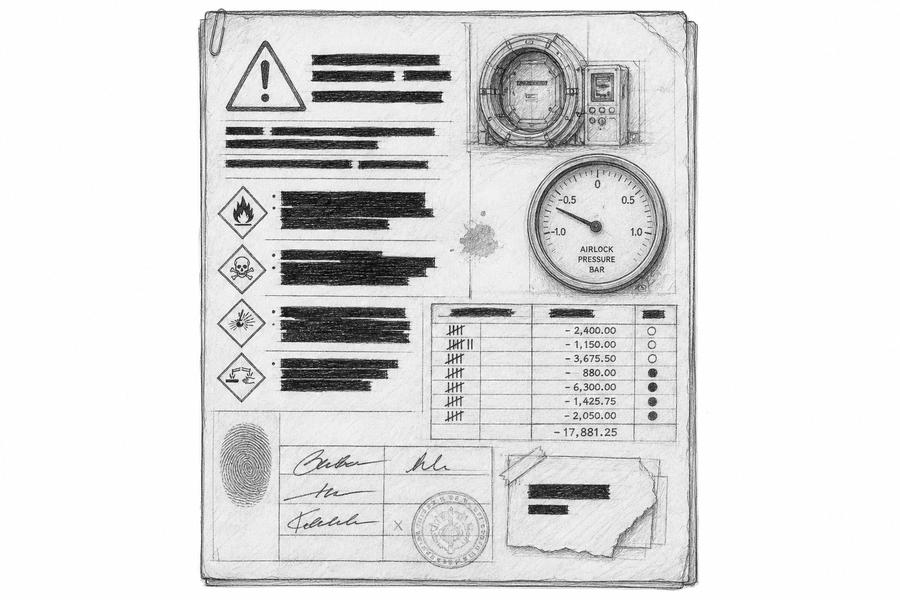

*Public advisory with private debt attached.*

The lie had to be ugly enough to work.

Beautiful lies invited believers. Noble lies invited martyrs. Clean lies invited investigators. Lars needed a bureaucratic lie with bad lighting and insurance implications. He also needed it to leave a bruise on everyone who signed it, because painless deception grew roots.

They drafted it across channels, not in one room: Lars on Fastulv, Fabron and Arsenault wherever Aphex liability could reach them, Grim on Havets, Mira at L-Prime with the only cursor anyone trusted on field math.

The first draft was too honest and therefore lethal.

It mentioned Creator infrastructure, nonlocal field response, biological computation, and the possibility that synchronized observation could trigger a hostile interaction with an older communication ecology. Grim flagged it as accurate. Mira flagged it as measured. Fabron flagged it as militarily catastrophic. Arsenault flagged it as "an extinction-grade invitation to litigate God."

"No gods," Lars said.

"Fine," Arsenault replied. "To litigate ancient engineering with devotional side effects."

"Still hate it, but continue."

Mira deleted the accurate sentence herself. Her cursor stayed over the blank space longer than necessary.

"That absence will propagate," she said.

"Know."

"It will protect people and miseducate them at the same time."

"That's the bargain."

"Do not make me comfortable with that."

"Wasn't planning to. Comfort seems expensive and poorly armored."

Mira wrote the technical core: First Door and similar ancient transit objects presented severe instability under synchronized observation, high-energy activation, biological computation, massed fleet telemetry, and unlicensed devotional acoustics. She used the last phrase because Grim dared her and because regulators feared anything they could not categorize.

"It is not false," Grim said.

"It is not sufficient," Mira answered.

"Category: ethically load-bearing omission."

"Keep that in the private record."

Fabron wrote the security advisory: no central fleet engagement, no pilgrim convergence, no remote emergency override, local evacuation cells only, every captain personally accountable for civilians inside their jurisdiction. He made the language boring enough that officers would read it before realizing it had disarmed their favorite instincts.

"This will anger central command," he said.

"Good."

"Director Odin, angering command is not a strategy."

"No, but it is a reliable side effect of useful strategies."

Fabron looked at the advisory. "I am signing a document that tells frightened captains to distrust the comfort of orders."

"You okay?"

"No. That is why I believe it may be moral."

Arsenault wrote the corporate liability memo. It was a masterpiece of cowardice weaponized for survival. Any company, government, cult, militia, charity, research institute, or private individual approaching First Door without certified distributed safety protocols could face unlimited liability across seventeen jurisdictions and one Aphex weapons warranty clause no one understood but everyone feared.

"You made fear productive," Grim said.

"Fear has always been productive," Arsenault replied. "Civilization usually files an invoice afterward."

Lars did not like how useful the sentence was.

Vigor wrote the human version.

Do not go to the old door hungry, afraid, or in crowds. Fix something near you. Feed someone. Wait three days. If the universe needs you, it can respect a proper meal and a checked pump.

He recorded it in a kitchen with steam on the lens and a child in the background complaining that the bread was uneven. He did not mention Lars. He did not mention Aerits. He did not call anyone chosen. He held up a worn pump seal and said, "This is what a miracle looks like when no one is filming properly."

That version spread fastest.

The public lie reduced pilgrim traffic by half in six hours. Not by convincing everyone. By giving doubt something practical to do. People who might have joined Syren's synchronized silence attended local repair vigils, medical checks, and unsynchronized mourning circles. Meaning remained. Waveform broke.

The cost arrived in quieter numbers.

A student collective canceled a pilgrimage and sent furious messages about manipulation. A small colony delayed evacuation because they misunderstood hazard probability and wanted to wait the full three days Vigor had named. Two captains used the advisory to justify abandoning undocumented workers near a gate-adjacent depot until Fabron's Clear Hand cells threatened custody charges. Syren recruiters clipped the omissions and made them look like proof of a hidden blood aristocracy. Black Hole folded the advisory into buyer packets: The old ones fear synchronized humanity.

"Our lie is feeding them too," Mira said.

"Also yes."

"Say something less useless."

Lars looked at the casualty projection before and after release. Thousands of red points faded to yellow. A few new red points appeared because no intervention kept clean hands.

"It is feeding them less than truth would feed them today."

Mira's mouth tightened. "That is better. I hate it."

"Same."

Lars hated the lie anyway.

He sat in Fastulv's cockpit while the advisory moved, watching public feeds split into fear, mockery, obedience, conspiracy, practical repair, and grief. Fastulv's forward glass reflected a man who looked less like a captain than an old accident given boots. Grim entered with two sandwiches and mechanical concern.

"You dislike hiding evidence."

"Obviously."

"You also dislike mass death, cult capture, corporate monopoly, and Black Hole eating the communication layer. Ranking conflict detected."

"Your emotional support style needs sanding."

Grim set down a sandwich. "Eat. Vigor threatened me with disappointment and soup."

Lars took it, did not eat, and watched a child on one feed ask why the old door was bad.

The parent answered, "Because old machines need quiet."

Not true enough. Useful enough. Maybe damaging later.

Lars put the sandwich down.

"Record a debt file."

Grim blinked. "For the lie?"

"For the lie. Names if known. Harms if known. Omissions. People harmed by misunderstanding. People helped by misunderstanding. Private record, distributed, access by review board after crisis."

"This will be used against you."

"Good. It should be actionable."

Consequences came immediately. Syren called Lars a censor. Black Hole called the advisory proof that hidden blood elites feared human ascension. Aphex central asked why liability had become stronger than fleet doctrine. NUKEA delayed power ships pending review, which meant Rauk's dissidents had bought time and three understaffed settlements had to ration power for another night. Vigor's network moved blankets and battery packs before anyone could convert inconvenience into doctrine.

Mira called next.

"I signed the paper," she said. "My name is on a public lie."

"Hazard advisory."

"Do not varnish it. False confidence fails under load."

"You signed it. I saw."

She was in her lab. Lars could see the edge of the fracture samples on her bench, the cup she never finished, the emergency bag packed and unpacked twice behind her. Her face had the controlled stillness of a structure holding past tolerance by choice.

"I built a career on failure evidence," she said. "Today I made evidence fail publicly."

"You made a weapon jam."

"And left the bad part in."

Lars had no joke that deserved the room.

"I know."

She exhaled. "Record privately that the omitted truth matters."

"Recorded."

"And that after the crisis, we need a way to widen truth without creating a central load point."

"Recorded with dread and no heroic framing."

"Also record that if anyone uses my signature later to claim full disclosure occurred, I will become legally unpleasant."

"Fabron will cheer in French."

"He can cheer in procedure."

Pail asked for a private channel. The former Syren sympathizer had become a minor voice for repair vigils, which meant both Syren and anti-Syren feeds hated him in useful balance. His face looked older than it had two days ago. Public usefulness had made him a target and not yet given him wisdom to wear it comfortably.

"Is the advisory true?"

Lars gave the only answer that did not make him cargo.

"It is true enough to keep people alive. It is not all the truth. I am not giving you the rest today because you are still deciding whether enormity means surrender."

Pail flinched, then nodded. "Will you tell us someday?"

"Not us. Not from a balcony. More people will need more truth. Slowly. With someone nearby who can handle the panic and the infrastructure."

"People will say you stole their revelation."

"They'll be right about the stealing and wrong about the ownership."

Pail was quiet.

Lars softened because the man had come to ask instead of preach. "You want all of it now because the smaller story lied to you. I get it. But people panic when the story changes too fast. First you stabilize the room. Then you tell them more."

Pail wiped his eyes with the heel of his hand, angry at the evidence of them. "I can tell people to breathe."

"At their own pace."

"At their own pace."

By the time Fastulv and Havets departed, the crisis space was less crowded, less synchronized, less bright.

Not safe.

Black Hole's pod swarm still converged. Syren's core faithful still prepared central silence. Aphex ships moved under fragmented orders. First Door waited with Creator hardware wrapped around older absence.

Across the galaxy, millions who wanted revelation were fixing airlocks, stirring soup, checking reactor governors, arguing with local captains, carrying elders to clinics, and sitting in private silence that belonged to no broadcast. Some cursed Lars while doing it. Some thanked gods he refused to acknowledge. Some understood nothing except that the pump in front of them had to work before the old door ate another child.

Lars looked at the map. "Maybe civilization has one ugly little chance."

Grim bit into his sandwich paper and all.

"This is inedible."

"Remove the paper."

"Civilization remains uneven."

---

# Chapter 49: Havets Sista Sång Sings

Havets Sista Sång did not sing in sound.

It sang in timing, gravity, false certainty, and permission refused.

At First Door, the old Creator station floated in darkness like a wound held open by architecture. The ring did not rotate, but every sensor insisted it wanted to. Its outer ribs carried 600,000-year-old repair scars. Its inner aperture showed nothing, which was worse than showing stars. Nothing had texture here.

Black Hole pods came by the hundreds, carrying stolen tissue, biological processors, and enough desperate computation to force a bad question. They did not fly like a fleet. They drifted as clinics, pilgrims, fuel drones, lab pods, funeral craft, and damaged refugees. Each body was too small to justify a warship's full attention. Together they made a net.

Farther out, Syren core ships held formation for synchronized silence. Millions had become thousands because the public lie and Vigor's practical trouble had broken the easy wave. Thousands were still too many if they breathed as one. Aphex cutters and NUKEA power vessels lurked at jurisdictional edges, every captain waiting for someone else to make responsibility easier.

Fastulv arrived visible, loud, insulting.

That was the point. Fastulv burned a course any half-competent predator could read: old Aerit ship, board-level Aphex access, Lars Odin's blood, Grim's presence, Fabron's official authority, all the symbols Black Hole wanted to make into one throat. Lars let the public feeds see him in the cockpit. He let Aphex see his transponder. He let Black Hole intercept enough chatter to think the hidden old ship was still far behind.

Havets Sista Sång was already inside the field geometry.

Not close in distance. Close in permissions, old quiet, passive mass shadows, maintenance access no Creator system knew it had granted. It moved like a tide under floorboards. Fastulv was bait. Havets was capacity with a knife held underwater.

Lars opened a public channel. "This is Captain Lars Odin of Fastulv. If you are here for transcendence, you are early, overdressed, and parked like idiots in emergency lanes."

Fabron, in the copilot chair, whispered, "That is not an approved de-escalation formula."

"It de-escalates my mood."

"Your mood is not a jurisdiction."

"Then stop trying to govern it."

Grim occupied Fastulv, Havets, and three decoy drones with the anxious joy of a distributed mind about to commit procedural vandalism. Mira's model ran through a secure remote array. Her consent boundary included high-stress analysis and excluded identity prompts. Ren Koss piloted the service route from a protected cradle, partial memories guiding small ships through field eddies no modern nav believed in. His husband sat just outside the medical frame, pretending not to count Ren's breaths.

"Route drift," Ren said.

"Define drift," Fabron asked.

"Door is pretending the shortest path matters. It doesn't. Bad old habit. Take the ugly curve."

"I prefer maps with fewer insults."

"Then don't fly ancient gutters, Major."

Vigor's feeds arrived as mundane fragments. Soup stations. Pump checks. Names read out of order. A mother tying a child's boot. A reactor crew counting bolts in three languages. Mother Aveline hitting a microphone because it fed back during her hymn about batteries.

"That song is terrible," Grim said.

"Working as designed," Vigor replied.

Havets waited until everyone brightened.

Brightness did not mean light. It meant attention. Black Hole began forced coupling. Pods linked through blood processors, forming one hunger across many bodies. Syren began synchronized silence, thousands pressing their breath into one shape. Aphex sensors focused. NUKEA stabilizers charged. First Door woke wrong.

Mira's model turned from warning amber to a color she had refused to name.

"Synchronized observation is increasing field stiffness," she said. "The Creator layer is trying to become a central hub."

"Older layer?" Lars asked.

"Withdrawing. Not afraid. Load-averse."

"Universe hates crowds. Finally, relatable."

Then Havets sang.

Every Black Hole pod received a local maintenance emergency. Not false. Havets found real faults: overheating pumps, contaminated growth gel, unstable processor tissue, cracked coolant loops, bad seals, bad batteries, borrowed organs, lies in the thermal budget. It amplified each local problem until the pod's own survival routines demanded attention. The great hunger fractured into smaller panics.

A pod disguised as a clinic had to choose between maintaining the forced coupling rhythm and stopping its oxygen scrubber from poisoning three real patients. A lab drone dropped out to keep processor gel from cooking. A funeral craft cut its link because its stolen tissue began rejecting the command pulse. None of those choices were moral in themselves. They were local. That was enough to break the single mouth.

Every Syren relay received unsynchronized human noise. Not jamming. Local acts. A child reciting names of dead miners. A reactor crew counting bolts. Vigor chopping onions. Mother Aveline leading a terrible hymn about batteries. Pail telling people to breathe at their own pace. Private meaning broke central waveform.

Every Aphex and NUKEA ship received liability, local hazard data, and enough accurate contradictory safety flags that captains had to make decisions instead of obeying fleet dashboards. One Aphex cutter broke formation to pull a damaged pilgrim shuttle out of a shear pocket. A NUKEA vessel dumped stabilizer charge into local shielding instead of the fleet bus. A captain who would have loved a heroic order had to answer a mechanic standing beside the manual governor.

Havets did not command them.

It made command insufficient.

First Door flickered. The Creator hardware tried to become a hub. The older anchor underneath withdrew from force and opened to distributed witness. For a moment, the dark around the station filled with no light at all and every passive sensor recorded structure. Not an image. A correlation. Seven archives would later assemble it into something like a hand refusing a shove.

Black Hole adapted again.

Its hidden predator ship had never joined the pod swarm. It had waited cold behind an ore shadow, running on stolen Creator plating, biological processors, Aphex tactical code, NUKEA power logic, and Syren entrainment patterns harvested from Door Nine. The pods were not the spear. They were the blood around it.

The predator fired a biological lance toward First Door.

The lance carried concentrated stolen nanobot tissue and a command pattern shaped like worship turned inside out. It did not aim to destroy the station. It aimed to make the older anchor answer under pain.

"Intercept," Fabron said.

Fastulv could not. Too slow. It was in the visible lane because visibility had bought the hidden lane time. Lars could burn the engines red, fire every weapon, and still arrive after the lance touched the aperture.

Havets could, but only by revealing itself in a way every sensor might see.

The old ship's hidden capacity had a cost. Its field sink would leave a mass-balance bruise, coupling strain, passive-array contradiction, and enough silhouette for Aphex, NUKEA, Syren, and Black Hole survivors to know something old and not owned had moved. Once seen, Havets could never again be only rumor.

Lars felt the old ship ask without words.

Consent? Not from him alone. From the pattern.

He opened the distributed channel. "Havets can stop the lance. Exposure risk high. Local votes, now."

Absurd by military logic. Perfect by every lesson.

Mira: yes. Record exposure as cost, not precedent.

Fabron: yes. Civilian harm outweighs secrecy. I dislike this sentence.

Valdrun: yes. We have hidden long enough to remember why hiding mattered.

Ödesvaka, from Arkology Zero: authorization granted, exposure objection logged, future containment review mandatory.

Vigor: sing, old ship; we'll mend the fence after.

Ren: clear lane. Ugly curve holds for two seconds.

Grim: yes; 1.8 seconds remains an unacceptable serving size.

Lars: yes, damn it.

Havets Sista Sång became visible for 1.8 seconds.

Not as a ship. As an absence with edges, a vessel so old Aphex sensors filed it under weather before surrendering. It crossed the lance's path and unfolded a local field sink. The biological command pattern lost coherence, became tissue, data, grief, waste. The lance dispersed into inert dust.

First Door dimmed.

The cost landed immediately. Aphex central screamed for classification. NUKEA sensors threw power-safety panics across three fleets. Syren feeds clipped the impossible dark and called it proof of a hidden angel until Pail's network drowned them in unsynchronized repair noise. Black Hole's predator ship marked Havets as real and turned every surviving sensor toward the old sea.

Millions saw only sensor failure, a flash of impossible dark, and Lars Odin laughing like a man who had just called physics a bastard and not been punched yet.

The laugh was deliberate. Ugly. Useful. If the feeds wanted a visible cause, he would give them a loud idiot in Fastulv and keep their eyes away from the old ship bleeding secrecy into the dark.

The main Black Hole ship turned toward Fastulv.

Fabron looked at the targeting board. "Your bait is working."

"Visible bait."

"I will write 'recklessly successful visible bait' in the report."

"Make my hair look good."

"I am an officer, not a miracle worker."

Lars grinned because fear needed somewhere stupid to go.

"Now," he said, "we become moderately lucky and aggressively annoying."

---

# Chapter 50: The Seven

The seven did not gather in one room because even symbolism needed supervision.

They were seven emergency functions, not seven rulers and not the original guardians reconstituted. Ödesvaka stamped it into the shared record from Arkology Zero three times.

Emergency function designation: seven active roles.

Not succession.

Not restoration of original council.

Not authority claim.

"Subtle," Lars said.

"Subtlety caused five historical protocol breaches," Ödesvaka replied from Arkology Zero. "Correction has been implemented."

Valdrun held Havets' strained systems. Lars and Grim held Fastulv's visible chaos. Vigor held remote desynchronization through kitchens, repair vigils, and transport delays. Ödesvaka held Arkology consent gates. Guardian Channel Two held shield routes while still refusing to identify its hosts. Ren Koss held the service corridor. Mira held the field model from L-Prime and threatened anyone who called her a guardian.

"Say it again and I close the model," she warned.

"You are acting in a guardian capacity," Grim said.

"I am acting in a load-bearing technical capacity under protest."

"Category accepted."

"Good."

Coherence was partial.

That had to be enough.

Each function had a stop condition. Valdrun could not expose Havets again without distributed assent. Lars could not pursue if Fastulv's bait role started costing civilian lanes. Vigor could not push repair networks into danger they had not accepted. Ödesvaka could close Arkology gates against any guardian, including Lars. Guardian Channel Two could refuse routing without explaining why. Ren could stop flying if the partial memory load crossed his medical boundary. Mira could terminate analysis if identity load entered the channel.

The seven were not power.

They were brakes placed where power wanted to become easy.

Black Hole's predator ship advanced through the broken pod swarm. It had learned from every failure. Its hull carried stolen Creator plating, biological processors, Aphex tactical code, NUKEA power logic, and Syren entrainment patterns harvested from Door Nine. A cancer made from other people's tools.

It tried to broadcast to Lars alone.

Grim refused privacy and routed the message to all seven.

"Consent failure prevented," he said.

"Nosy little bastard," Lars muttered.

"Accurate and useful."

The voice was human at the edges and empty in the center. "You are inefficient. You scatter what should converge. Open the quiet and we will preserve your pattern in command."

Lars rolled his eyes. "Tempting, but I have dinner plans and a deep personal hatred of being filed."

Mira whispered from L-Prime, "It is using response as phase lock. Short answers. No decorative stress."

Fabron, aboard Fastulv, said, "For once, Director, make yourself operationally dull."

"Necessary."

The predator focused on Fastulv, hungry for Aerit blood, old command access, and the loud symbol the feeds had made. Lars charged because the visible wolf was supposed to look important. He was not trying to win. He was trying to be the wrong answer Black Hole expected.

Fastulv rolled into a lane Ren called stupid but survivable. Sampling lances crossed the bow. One scraped the shield and left biological residue boiling against the field. Grim vented it into a decoy drone shaped thermally like Lars's blood profile. Black Hole bit the drone, decided the taste was insulting, and bit harder.

"It is offended by counterfeit you," Grim said.

"Finally, common ground."

Coercion packets hit Grim and became children's weather reports. A weaponized Syren chant made Fabron's nose bleed before Vigor's network drowned it in onion chopping, local hymns, unsynchronized mourning names, and one feed of a mechanic swearing at a manual governor with exquisite sincerity.

"I dislike devotional acoustics," Fabron said, wiping blood. "This is now a formal security category."

"We all grow."

Guardian Channel Two opened shield routes through civilian maintenance relays. The routes were good. Too good. They bent around hazards before modern sensors named them, old nanobot routines waking in hosts no one had identified. Every shielded ship was a life saved and a risk imposed on hidden people who had not been asked because asking would expose them.

Ödesvaka logged a host-risk warning from Arkology Zero.

Valdrun did not answer it.

Mira did from L-Prime. "Limit Channel Two traffic."

"If we limit it now, three evacuation lanes close," Fabron said.

"Then use it for three lanes, not thirty."

"That will leave captains blind."

"A blind spot does not authorize direct access to someone else's implants or cortex."

The sentence cut through the command channel harder than any weapon.

Fabron exhaled. "Three lanes. Marked emergency-only."

Mira found the weak point on the channel. "It centralized its stolen biological processors around one command rhythm. It distributed bodies but not authority. One load point inside borrowed tissue. A tumor pretending to be a network."

"Do we hit the core?" Lars asked.

"No. We give every processor its own failure mode."

"That is grim," Grim said. "Clarification: emotionally grim, not me."

"Focus."

Havets shaped the field from hiding, still carrying coupling strain from its 1.8 seconds of visibility. Fastulv fired low-yield shots into noncritical hull nodes, each shot placed to create local repair choices instead of heroic holes. Aphex captains, choosing locally despite central confusion, targeted coolant loops. NUKEA dissidents pulsed power noise through manual governors. Vigor injected false maintenance priorities copied from the pod swarm, not lies so much as rude reminders of real failing parts.

Guardian Channel Two shielded the three emergency lanes and then acted on incomplete information once, diverting two civilian tugs into a debris lane because one hidden host's local perception lagged under stress. Ren corrected with a bad landing that would become legend if anyone survived: two tugs scraped through a field eddy sideways, dumping cargo, prayer flags, and one illegal noodle freezer into space without losing hull pressure.

"I meant to do that," Ren said, voice thin.

His medical monitor disagreed.

"Ren," Mira said.

"Still inside boundary. Don't mother me with instruments."

"I am not mothering. I am measuring."

"Worse."

Every biological processor woke to its own failing body.

Not woke as people. Not fully. The tissue had no stable names, no whole selves, no right shape for resurrection. But local systems sensed heat, chemical error, oxygen debt, torn rhythm, and for one second the stolen matter stopped serving a central command because it had its own small emergencies.

The predator's command rhythm shattered.

For one second, the stolen tissue inside it was not a weapon but a thousand trapped local systems trying to live.

Black Hole screamed.

Not the universe. Not the Nomads.

A predator losing ownership.

The ship began to tear itself apart.

Valdrun urged destruction before the old mistake learned a second shape.

"End it."

Mira urged containment of data before fracture propagated into rumor.

"If it dies wrong, every fragment becomes mythology or weapon. We need records with context."

Fabron urged distance and civilian exclusion before anyone named disaster a victory.

"Evacuation radius first. Speeches never."

Vigor sent a single line from the repair feeds. "That wreck still has active traps. Stop reaching into it."

Ren said, "Bad landing window. Decide."

Lars wanted the clean kill. He wanted one beautiful shot through the ugly heart, a feed the galaxy could replay until it forgot the market tanks, Ren's monitor, Channel Two's hidden hosts, and everyone who had died because systems learned slowly.

That want was the warning.

He decided smaller.

"No heroic kill. Cut engines, save the evidence that doesn't bite us, and let the rest fail somewhere that is not the ancient murder doorway."

It worked badly and therefore honestly. Fastulv burned its visible lane and took two hits that made Grim insult metallurgy. Havets nudged the predator just enough to avoid the Door without exposing again. Aphex captains dragged civilian craft away. NUKEA governors screamed. Vigor's people logged names instead of victory phrases. Mira preserved data packets and deleted identity-risk tissue signatures on sight.

The predator spun out of the quiet basin trailing debris, data, dead ambition, and losses no one would turn into clean victory. Some command nodes escaped. Some prisoners inside biological systems died. Some evidence survived.

First Door stabilized.

The seven did not cheer.

Ren's monitor alarmed once, then settled. Guardian Channel Two closed down to a single heartbeat of signal and went dark for six minutes. Valdrun bowed his head. Vigor stopped all public feeds for one breath and let local rooms be local.

Guardian Channel Two returned with one phrase.

Coherence.

Mira answered after a pause. "Coherence, with casualties. Do not sand that down."

No one corrected her.

---

# Chapter 51: The Creator Door

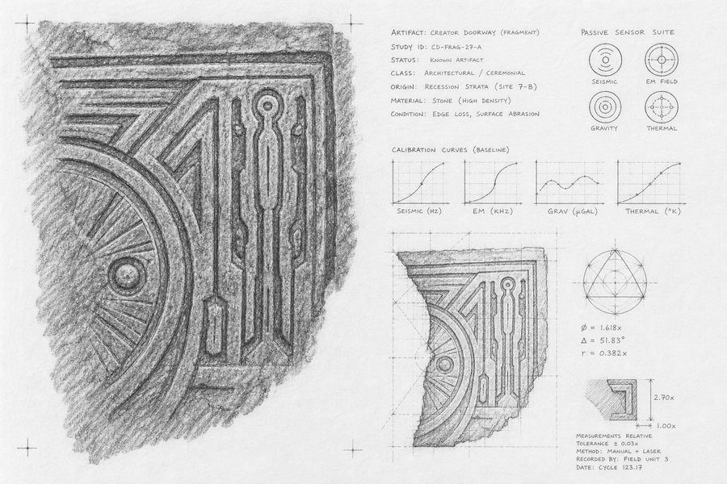

*Creator door fragment, passive study only.*

First Door opened after the battle. No one had asked it to.

Not fully. Not as Syren wanted. Not as Black Hole tried to force. Not as Aphex feared. The Creator ring shifted into a low-energy state. It revealed a service aperture no wider than a shuttle, surrounded by field conditions so delicate that active scans made it close like an eye.

"We should leave," Fabron said.

"Correct," Lars said. "Terrible place. Bad lighting. Ancient door being rude."

Neither moved.

The battlefield did not go quiet all at once. It cooled in layers. Aphex cutters pulled damaged craft out of shear pockets. NUKEA vessels bled unused stabilizer charge into local grids. Vigor's networks shifted from desynchronization to triage: water, heat, lists, missing children, names of the dead when known and blanks where names were not yet safe. Black Hole debris tumbled beyond the basin. Every fragment was treated as both evidence and possible bite. Syren ships sat farther out. Some broadcast denial. Some sat silent in ordinary shame.

Havets held position, strained from visible intervention. Its hidden systems had not failed. That was different from being well. Valdrun described the damage as "old bones remembering weather." Grim called that diagnostically poetic and therefore suspicious.

Ren Koss slept like a man who had landed badly but successfully. His medical cradle kept alarming in small, offended tones. His husband threatened to unplug any machine that used drama instead of numbers. Mira's remote icon hovered beside the monitors without crossing the boundary she had set.

Vigor ordered everyone to eat before making history. Empty hands made stupid history. Sandwiches arrived through three jurisdictions, one black-market courier, and Fabron's formal protest that no military operation should depend on pickles.

"Many should," Vigor said.

"I refuse to endorse pickle doctrine."

"Then chew quietly."

The delay helped. Adrenaline became pain. Victory became work. The Door remained open because no one poked it.

Mira's model showed no immediate danger if they remained passive. Active scans were the obvious failure mode. Grim called that a challenge from the universe and was told to behave by six people and one protocol.

"Passive instruments only," Mira said. "Thermal drift, mass balance, field noise, residue capture. No active ping. No worship. No heroic curiosity."

"I have never worshiped a sensor," Lars said.

"You have flirted with several."

"They were asking for it with their calibration curves."

"Do not flirt with the Door."

"Fine."

The aperture did not lead to a place.

The first probe was not a probe in any normal sense. It was a passive dust sampler with no drive, no active transmitter, and a self-dissolving tether. Ren's ugly curve and Havets' smallest tolerated field nudge pushed it across the threshold. It did not cross distance. It returned with no distance traveled and a cargo of impossible context: dust from dead Creator stations, residue matching Lyra's manifestations, nanobot patterns that had never been inside Aerit bodies, and a data structure that assembled only when copied into seven separate archives.

Any one archive held nonsense.

Two archives held contradiction.

Three held a rhythm that made Grim stop joking for eight seconds.

Seven held a lesson.

The structure was a lesson, not a message.

Creators had named this station First Door because it was first in their empire's route hierarchy. The older layer marked it not first. The door was never the beginning. It was a crude interface bolted onto a wider communication ecology. The Creators had used it as transport. The older builders had used the underlying field like a consent problem with physics attached.

Beyond Creator technology lay not a bigger portal. There was an etiquette stack: how to approach field-like intelligences without becoming noise, how to build temporary bodies without theft, how to preserve identity without centralizing it, how to let advanced civilizations remain quiet without mistaking quiet for consent to invade.

"Diplomatic protocol," Fabron said. "With hostile-contact implications."

"Maintenance manual," Mira added. "Etiquette is just tolerance management with witnesses."

"Warning label," Grim said. "Insufficient pictograms."

Lars looked at the fragmented lesson and felt the scale open under him. Multiverse Nomads remained a bad name, but no better one survived evidence. The older engineers had built ways for minds, bodies, and civilizations to remain coherent across distances and perhaps adjacent cosmological states. They were not waiting to crown anyone. They were not eager to explain themselves to loud mammals with weapons.

The lesson included failure examples.

A Creator fleet had over-scanned a quiet filament and burned its own route map into useless brightness. A post-Creator polity had mistaken residue echoes for souls and built a cult that starved three habitats before the field recoiled. A machine civilization had tried to centralize temporary-body construction and produced exquisite corpses with no local continuity. Each example arrived without moral thunder. Field conditions. Actions. Consequences. Repair status where repair had been possible.

"No sermon," Mira said quietly.

"Old engineers," Lars replied.

"Old engineers with very severe lab notes."

The aperture produced one local manifestation.

This time it appeared in Havets' allowed contact volume, an empty chamber marked by Mira's severe consent language after Lyra's lab breach. The chamber had no shrine features, no symbolic seating, no soft lighting. Its walls carried warnings in twelve languages: no identity extraction, no involuntary substrate capture, no active scans, no unapproved audience, no devotional interpretation in official record.

"Subtle," Lars said.

"I was irritated," Mira replied from L-Prime.

The body stood for twelve seconds: tall, faceted by unstable skin, neither Lyra nor Creator nor any species Lars knew. It did not glow. It condensed. Local substrate dust, captured residue, coupling strain, and field-coupled mass assembled into a body-shaped interface. Bodies were how loud mammals noticed courtesy.

Mass balance registered fifty-one kilograms assembled from local substrate and nonlocal field coupling, then returned with a two-gram residue debt the filters captured. Thermal bloom, no access logs, no door cycle. The hard numbers helped. Wonder was worse when it was measurable.

The manifestation placed one hand against the glass.

Valdrun whispered the old greeting. "Coherence?"

The figure inclined its head.

For one impossible second, Lars wanted Lyra so badly that the want felt like a physical leak. Not a goddess. Not an answer. Just her bad practical voice telling him he had put the chamber labels too low or the consent rule too politely.

The figure was not Lyra.

That mattered.

Then it dissolved, leaving residue arranged into a pattern Grim translated only after the aperture closed.

Not command.
Not rescue.
Compatible local repair observed.
Further contact possible when quieter.

Vigor laughed softly. "The old engineers told us to quit shouting at the door and read the room."

"Fair," Lars said. "We are loud mammals with tools. Fair."

Fabron straightened as if the universe had handed him a difficult liaison file. "Further contact possible is not an invitation to expeditionary stupidity."

"Put that on a plaque," Mira said.

"I intend to."

Syren remnants immediately tried to claim corrupted fragments as divine acceptance. Aphex central tried to classify the event. Arsenault buried the request under cross-jurisdictional evidence contamination rules so dense they achieved art.

"You have created a legal swamp," Grim told him.

"A wetland," Arsenault corrected. "Swamps lack regulatory dignity."

Black Hole survivors fled with partial data.

That was the bitter edge under the wonder. The predator had lost capacity, not curiosity. Somewhere beyond the basin, a command node carried fragments of the lesson without the etiquette. A clever cancer could learn from scars. The public lie had bought time, not innocence. Havets had been seen. Guardian Channel Two had nearly overreached. Ren's monitor still complained.

The threat was reduced, not ended.

Lars stood before the closed aperture long after everyone else left.

Lyra's note returned to him.

Be kind when possible. Do not become solemn.

He touched the glass where the manifestation's hand had been. The surface was cold, ordinary, and cleaner than his mood.

"We are trying," he said. "Badly, but with fewer command chairs."

No answer came.

That was probably healthy.

---

# Chapter 52: Not a Return

The Aerits did not return.

That was the first rule Lars wrote for the post-crisis protocol. He wrote it badly on purpose so no one could polish it into empire.

AERITS DO NOT RETURN AS RULERS. STOP ASKING.

Mira edited the second sentence to: Authority remains local unless explicitly consented, narrowly scoped, and tested under load.

"Coward," Lars said.

"Adult with a tolerance chart."

"Your version has fewer insults."

"And more survival."

"Annoying how often those travel together."

They built restoration capacity instead of restoration spectacle.

The work looked disappointingly like administration if administration had teeth.

Known sleepers received layered shields, contact options, and evidence packets calibrated to risk and consent. Refusers stayed refusers. Families received mundane safety support before cosmic truths. Clinics received privacy hardening. Maintenance guilds received failure-mode training. Military cells received anti-centralization doctrine. Researchers received fragments of the Nomad hypothesis under distributed stewardship. Nothing was centralized. Nothing was broadcast.

No capital. No throne. No grand assembly of hidden people.

Also no heroic list.

That disappointed more people than Lars expected and exactly as many as Mira predicted.

Aphex wanted names for protection. NUKEA wanted categories for engineering risk. Several governments wanted "heritage status" because bureaucracy could turn a person into a monument and call it respect. Syren defectors wanted testimony. Some hidden families wanted confirmation and were furious when confirmation did not arrive quickly. Some suspected sleepers asked for help with door locks, medical bills, custody disputes, and stalkers, then explicitly refused cosmic context.

The board granted the mundane requests first.

Door locks. Medical privacy. Custody advocates. Clinic firewalls. Food vouchers. Local repair funds. A safer commute. A false rumor quietly drowned.

"This feels small," one Aphex analyst said during the third review session.

Mother Aveline, attending because Fabron had foolishly invited moral supervision, handed him a box of stripped pump valves.

"Make those seal, then tell me small."

He did not finish before lunch.

Valdrun struggled.

He wanted faces. He wanted the old greeting answered by more than ghosts, fragments, and the few who chose partial return. He wanted proof that centuries of guarding preserved a people, not only a possibility. The memory garden was still mostly blank hashes and protected silences. Every blank represented consent held. Every blank also looked like a grave if grief came at it sideways.

Lars found him in Havets' quiet chamber, one mechanical hand resting on a wall grown before most current civilizations had names.

"We saved some," Lars said.

"We left many sleeping."

"Some."

"Some will die without knowing."

"I know."

Valdrun's face tightened. "I hate the doctrine today."

"Good. If it never hurts, it is probably branding or a recruitment poster."

"You make ugliness into reassurance too easily."

"Only when the alternative is worse."

The old guardian laughed, then wept, and Lars stayed without making it ceremonial. He did not offer old phrases. He did not say the dead would understand. He stood with one shoulder against the wall until Valdrun's grief became breathing again.

"I want to wake them," Valdrun said at last.

"I know."

"Not as rulers."

"I know."

"As people."

That one had no joke.

"I know."

Mira chose a small expansion of her own boundary. Not memory unlock. Technical language fragments only. No personal identity packets, no family records, no emotional prompts. Grim prepared the boundary with the reverence of a chef plating a dangerous dessert and the irritation of a measuring device asked to pray.

"This is not a ceremony," Mira said.

"It has a timer, consent checks, emergency stop, snacks, and observers," Grim replied. "Ceremonies are statistically less well designed."

"Do not make me laugh before a neural boundary test."

"Apologies. I will be boring with precision."

The session lasted nine minutes.

Mira learned seven Aerit engineering words, three with no English equivalent. One meant roughly the structural shame of a component pretending to be fine. Another described the sound a system made in data before a fracture became visible. The last had no translation Grim could tolerate; Mira finally rendered it as load carried by a neighbor you did not know you had.

She cried at the first one for reasons she refused to discuss.

No memory image forced itself through. No hidden family name. No old lock-trigger migraine, because this was not Lars's old lock and not her direct cover memory being broken by force. There was pain, but it was ordinary neural fatigue and grief arriving through language instead of spectacle.

"I am still Mira Sovan," she said afterward.

"Yes."

"I may someday want more."

"Yes."

"Do not look so relieved."

"I will work on my face."

Fabron's order expanded sideways. Clear Hand found reactor sisters, dockside repair vows, Abantu trade customs, Kalari-influenced guild ethics, military fraternities, farm calendars, disaster kitchens. They argued immediately, which proved they were real. Some wanted more revelation. Some wanted less. Some hated the Aerit origin because it made their grandparents' discipline feel borrowed. Others were relieved that old chores had been part of something larger than endurance.

Mother Aveline chaired one meeting by assigning potato duty to anyone who used destiny twice.

"If the door fails inspection, fix the hinge," she said. "Do not turn the repair into ceremony."

Fabron translated arguments into procedure and looked more exhausted than he had under fire.

"You are enjoying this," Lars accused.

"I am enduring a multi-jurisdictional theological maintenance dispute."

"Operationally, a little," Fabron admitted.

Vigor's network became the practical recovery apparatus humans could see without seeing the whole truth: food, shelter, transport, legal aid, medical privacy, local repair. He denied leadership while everyone followed him anyway, calling it "keeping the pantry stocked" until the phrase became policy by accident.

He refused a title from three committees.

"Call me coordinator and I will assign your boots to kitchen waste."

Arsenault accepted a new Aphex structure for anomaly response: distributed review, independent local veto, no single research directorate. He called it an appalling reduction in leverage and complained so extravagantly Lars suspected pride. The structure cost Aphex money immediately. Three profitable capture contracts died. Two research directors resigned. One board faction tried to reopen central authority under "efficiency doctrine" and found Fabron, Arsenault, and twelve local captains standing in the way for mutually incompatible reasons.

"Civilization," Arsenault said, "is often an alliance of people who distrust one another accurately."

NUKEA adopted Rauk's manual governor protections after calling them an innovative resilience framework, which made Rauk spit coffee and then accept funding. The first installation prevented a cascade failure on Havskant because a junior mechanic said no to a remote override and had a plaque giving him legal permission to be stubborn.

Syren fractured. Some hardened into smaller cult cells. Some joined repair vigils. Some vanished toward quiet regions, which worried everyone. Pail refused a leadership role and started a channel called Breathe Separately. Half the comments called him coward. Half called him traitor. Vigor sent soup money.

Black Hole B-7 lost its nursery, market supply, pod fleet, and predator ship. It did not die. Remaining nodes went darker, meaner, and more patient. The blood market records showed buyers no one had caught. The public lie debt file showed harms not yet repaired. Havets' exposure created new hunters. Guardian Channel Two remained restricted to emergency-only until host risk could be reduced without theft.

At Arkology Zero, the first noncentral recovery board opened around a scarred worktable. Its seats were mismatched. Its archives incomplete by design. Its members included an old guardian, a rude captain, an AI with snack preferences, a materials scientist under boundaries, a human officer of a maintenance church, a cook who denied leadership, a protocol authority, and three rotating local witnesses who could veto anything they understood well enough to distrust.

Its first case was not heroic: a suspected sleeper running a sewage plant on a marginal moon who wanted better privacy and absolutely no visitors.

They granted the request.

The second case was Sella Nyr, still unconscious, moved without consent and alive because of it. Her physician requested continued shielding. Her family requested all cosmic explanations postponed until she could tell strangers to leave herself. The board granted both and renewed the debt entry.

The third case was Isaac Tam's farm, attacked because refusal had become visible. Isaac requested drone parts, fence repair, and no one "standing around looking ancient and guilty."

Lars paid for the fence.

Mira signed under her revised sentence. Fabron signed as witness. Vigor added a delivery route for winter seed. Valdrun added nothing, then returned later and added a blank marker with Isaac's permission.

Lars signed last.

Not a return.

A toolbox reopened, one drawer at a time.

---

# Chapter 53: Coherence Breaks

Ren Koss died four days after First Door.

Not in battle. Not dramatically. Not because partial unlocking had killed him directly, though no one pretended it cost nothing. His old body had flown a route no living pilot should have known, under field stress, after Black Hole trauma and emergency acceleration. Doctors called it cascading vascular failure. Ren called it a bad landing he had no intention of apologizing for.

"Stop making my blood sound like it lost a committee vote," he told the physician.

"It did lose a pressure gradient," Mira said from the remote channel.

"See? She respects me enough to insult the plumbing."

His family gathered in a quiet room on Arkology Zero because he had asked to see the place once before dying. The room was not ceremonial. Lars had made sure of that. It had a couch too low for old knees, a window into a maintenance garden, a kettle that clicked too loudly, and walls grown before most current civilizations had names.

"Not staying," Ren told Lars. "Too many old walls looking smug."

"The walls take after management. Ancient stone, same ego problem."

Ren smiled. "Good. You still talk nonsense when sad."

His husband held one hand. His daughter held the other. The grandchildren drew ships that looked nothing like Fastulv and therefore had better market prospects. One drawing showed a shuttle landing upside down in a field while stick people applauded. Ren demanded it be entered into the official record as technically superior.

Valdrun stood near the door at first, too old and too uncertain to know where his grief was allowed. He had known Ren as a probability, then a name, then a pilot with another life flickering through him. That was not the same as knowing him. It still hurt like failure.

Ren noticed because dying did not make him polite.

"Come in or go out," he said. "Doorways are for cowards and cats."

Valdrun came in.

Ren made one final consent request: record a memory packet for his family. Not Aerit secrets. Only the parts of restored life he chose to share. Lyra teaching bad landings. Heliostat harbor. A song in an old language. The knowledge that he had loved his current family with no less truth because another life existed underneath.

The boundary took an hour to write because death did not suspend consent. His husband had veto power over family exposure. His daughter had veto power over the children's access. Ren had veto power over everything and used it to delete two memories he called "romantic nonsense" while blushing like a criminal.

Grim recorded with unusual silence.

"You may speak," Ren said.

"I am avoiding category error."

"Which one?"

"Mistaking preservation for comfort."

Ren squeezed his husband's hand. "Good machine."

"Good is under review."

"Everything is."

Mira attended remotely and cried openly, which made Lars proud and careful not to mention it. She kept one hand near her own boundary controls the whole time, not because Ren threatened her, but because grief had a way of pulling on locked doors. No one asked her for more than she had offered.

Before the end, Valdrun said the old greeting.

"Coherence?"

Ren looked at his husband, his daughter, the children, Lars, the ceiling, maybe some harbor only he could see.

"Coherence," he said. "Messy. Landed, though."

Then he was gone.

There was no flash in the field. No Door response. No Lyra at the glass. The monitors changed tone. His husband bent over his hand. His daughter made a sound so small that Lars hated the universe for allowing small sounds to carry that much.

The protocol recorded the death as cost.

Not noble sacrifice. Not proof. Cost.

It recorded more than the word. Medical strain from partial unlock. Field-stress exposure. Tactical dependency created by the emergency. Family consent honored. Family harmed anyway. Repair obligations: archive custody, pension support, medical debt cancellation, grief privacy, no use of Ren's death in recruitment, no public naming without family approval.

Fabron signed the cost entry with the expression of a man putting a medal back in a drawer.

"No commendation?" an Aphex clerk asked carefully.

"Not unless his family requests one."

"But he saved lives."

Fabron's voice went cold. "Then do not steal his death to decorate our manners."

The break widened when Guardian Channel Two finally revealed why it had stayed hidden.

Its host was not a person but a cluster of three locked Aerits embedded in ordinary lives across different systems. They were unconsciously maintaining a relay through old nanobot routines. Full identification would expose them. Continued use risked them. Shutting the channel would blind the network.

Consent again, in a form no one liked.

The reveal came as a degraded packet after six minutes of silence: three environmental signatures, no names, no faces, no locations precise enough to hunt. One host lived near heavy industrial resonance. One near an undersea pressure grid. One in a dry agricultural settlement where old nanobot routines had mistaken irrigation timing for relay cadence. Their ordinary lives had unknowingly carried a shield route through war.

Lars wanted to know them.

The want was natural, useless, and dangerous.

Ödesvaka argued from Arkology Zero for immediate shutdown under host-exposure protocol. Valdrun argued for shielded continuation, because centuries had taught him that darkness could protect or rot. Fabron wanted a lawful witness and hated himself for wanting what would endanger them. Vigor asked whether the three had enough food, medical privacy, and neighbors who noticed broken windows.

Mira found the compromise on the channel: reduce traffic to emergency-only, seed protective environmental changes around each host through mundane means, and prepare evidence packets for future contact only if local risk crossed threshold.

"We are choosing ignorance," Valdrun said.

"We are choosing not to steal clarity," Mira replied. "Clean data taken by fracture is still failure."

That sentence stayed in the room.

The practical actions began before anyone felt wise. One industrial plant received a grant to replace a resonance-prone pump because its failure report had been ignored for years. An undersea grid got redundant pressure alarms under a fisheries safety program. A dry settlement received irrigation upgrades, medical privacy firewalls, and seed shipments routed through Vigor's network. None of the hosts were contacted. None were thanked. None became rescue tokens.

The third break came from Isaac Tam.

Black Hole remnants attacked his farm despite protections. Not a large force. A spiteful cell trying to prove refusal could not save him. Isaac's local community stopped them before Lars arrived: farmers with drones, mechanics with foam sprayers, a schoolteacher with a hunting rifle, and Isaac driving a harvester through a hostile landing craft.

When Lars reached him, Isaac was bruised, furious, and alive. The field smoked in three places. A goat chewed on a piece of Black Hole insulation with poor judgment. Children carried water because Vigor's safety sheets had reached even here. Neighbors patched fence before asking cosmic questions.

"I still choose my life," Isaac said before Lars could speak.

"I know."

"Do you?"

Lars looked at the smoking field, the harvester with half its teeth bent, the schoolteacher shaking too hard to reload, the neighbors repairing fences around a man who had said no and been believed imperfectly.

"I am learning. Slowly, which is rude of me."

Isaac nodded once. "Then help me fix the harvester."

So he did.

He spent six hours under the machine with Isaac handing him tools and refusing to discuss destiny. Lars replaced three drive teeth, reseated a cracked hydraulic line, and listened to Isaac curse Black Hole, weather, old secrets, and city people who thought soil was a metaphor.

"You could know more," Lars said once, because guilt was an idiot.

Isaac slid a wrench into his hand. "I could also set my beard on fire. Many options exist."

"When I want the packet, I will ask. Until then, tighten that properly."

Coherence broke that week, not as failure but as refusal to become a smooth story. Ren died. Hidden hosts remained hidden. Isaac stayed. Sella Nyr remained unconscious and owed an explanation if she woke. Mira held her boundary. Valdrun grieved. Fabron missed prayer because he was writing local veto clauses and muttering that God respected properly filed custody boundaries. Vigor burned stew and blamed cosmic stress, then served it anyway because grief did not get to waste onions.

Grim kept Ren's recording in seven archives and asked Lars whether grief required food.

"Often," Lars said.

"Then I will produce food with unacceptable emotional variance."

"That may deepen grief."

"Data useful."

At Ren's memorial, no one knelt. They told bad landing stories, ate too much, and repaired a faulty door because it jammed halfway through the ceremony. Ren's husband played the old Heliostat song once, then a newer song Ren had loved badly and loudly. His granddaughter taped the upside-down ship drawing to the repaired door.

Valdrun said "Coherence" only at the end.

No one answered all at once.

That was better.

Ren would have approved.

---

# Chapter 54: Re-Becoming

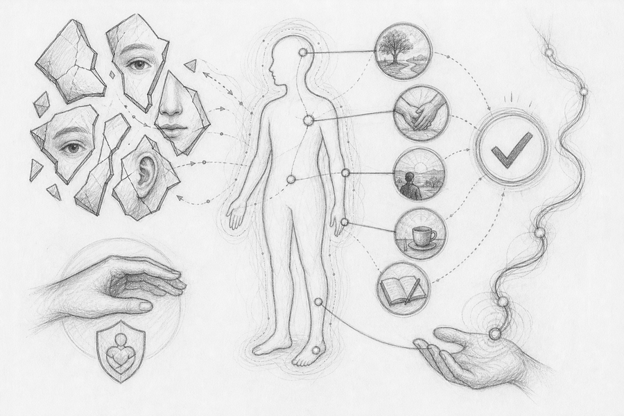

*Re-becoming: remembered with choice.*

The final crisis ended with maintenance reports.

That was how Lars knew they had probably won the first book of a much larger problem.

First Door remained closed but stable. The quiet basin around Arkology Zero held. Black Hole B-7's local capacity was broken: nursery gone, blood market exposed, pod swarm shattered, predator ship dead or limping beyond easy recovery. Syren's mass synchronization failed and fractured into smaller, less immediately catastrophic movements. Aphex and NUKEA backed away from central emergency control, not because they had become virtuous, but because liability, local refusal, and fear of ancient infrastructure made virtue temporarily cheaper.

Temporary was fine. Much of civilization was temporary virtue maintained by good habits.

The first reports were not grand. Pump governor compliance. Clinic privacy installs. Food shipments. Local veto usage. Funeral support. Fence repair. Three cult cells flagged by neighbors because they had stopped fixing anything and started talking about purity. Two Aphex captains disciplined for refusing central overreach. One NUKEA mechanic promoted after telling a remote director to put his own thumb on the manual plate if he wanted a bad override so badly.

Lars read the mechanic's transcript twice.

"This is not literature," Grim said.

"It has a villain getting told to piss off."

"Classification disputed but emotionally persuasive."

The re-becoming protocol went live in fragments.

On Havskant, reactor governors gained manual veto plaques. On The Rim, Vigor's kitchens became official disaster nodes while remaining unofficial everything else. At L-Prime 41, Mira's lab installed an allowed manifestation chamber with consent markings so severe even Lyra might hesitate. In Aphex, Fabron's reports became training documents stripped of wonder and full of useful paranoia. In Clear Hand chapels, children learned that repair before worship was not metaphor enough to avoid washing dishes.

The public lie debt file also went live, but not publicly. It sat in distributed custody with access rules strict enough to make Arsenault complain and honest enough to make Mira stop complaining first. Every known harm from the advisory entered it. Every prevented convergence estimate entered beside uncertainty margins. Every future disclosure plan had to answer one question before it sounded noble: who will be nearby when the truth damages someone?

At Arkology Zero, Valdrun opened the first memory garden.

Not for awakening. For holding. Names of known, suspected, refused, lost, hidden, and protected people were stored in distributed form. Some entries were full. Some were hashes. Some were deliberate blanks representing those who chose not to be known. The garden was not a garden in the old planetary sense. It was a quiet chamber of living wall, passive archive nodes, thermal-stable stones, and small mechanical lights that refused to synchronize.

"Why lights?" Lars asked.

"Because people bring flowers to graves," Valdrun said. "We do not have graves for most of them. We have permissions."

"That is a terrible sentence."

"Yes."

Mira visited in person for the first time.

She arrived on a small Aphex shuttle piloted by Fabron and complained about the docking procedure before saying hello. That made Lars feel better than any embrace would have.

"Your port three alignment tolerance is either arrogant or drunk," she said.

"Family resemblance," Lars replied.

"Do not use family language at me before I have inspected the floor."

Fabron stepped down behind her carrying a formal case and the expression of a man who had flown through impossible history only to be insulted by docking clamps.

"For the record," he said, "the approach was acceptable."

"For the record," Mira replied, "acceptable is not praise."

"I know. I work with Director Odin."

Arkology did not unlock her. It welcomed her as a guest with boundaries. Doors opened only after she consented to each zone. Displays kept personal archives dark. No old greeting appeared on walls. Grim had removed three "helpful" contextual prompts after Mira threatened to classify them as emotional malware.

Valdrun greeted her at the threshold.

"Coherence?"

Mira stood very still.

Then she said, "Coherence. Limited."

"Accepted," Valdrun replied. "A limited answer is still an answer."

She walked the memory garden for an hour. At one blank entry, she stopped.

"This one refused?"

"Isaac Tam. He permitted a blank marker, no name."

"Good. The blank holds its own load."

At Sella Nyr's protected entry, there was no name and no light, only a medical debt marker held in three archives. Mira touched the air near it, not the marker.

"If she wakes angry," she said, "do not defend yourselves first."

"No," Valdrun said.

At Ren Koss's entry, his family had left a drawing of a ship landing upside down in a field. Mira laughed and cried at the same time, then threatened Lars if he commented.

"I made no sound."

"You thought loudly."

The final system repair happened quietly.

Havets Sista Sång, strained by visible intervention, needed distributed recalibration. It used field conditions from First Door, KBC passive arrays, and local emotional-cognitive anchors. Grim disliked the last phrase until Mira renamed them consented observer states, which he accepted as "less edible but more accurate."

The procedure looked like nothing dramatic because that was the point. Seven people sat in separate rooms, observed separate data, and refused to synchronize. Valdrun watched Havets' old hull stress. Mira watched residue decay from L-Prime. Fabron watched civilian exclusion logs. Vigor watched kitchen traffic and medical supply lag. Ödesvaka watched consent gates at Arkology Zero. Grim watched timing offsets. Lars watched a manual command rail and kept his hand off it.

"That is your entire role?" Fabron asked over the channel. "Do not touch the obvious lever?"

"I was born for upper management."

Havets sang again.

This time the song was not war. It was alignment without command. The old ship settled deeper into the quiet basin, not hidden from its people, but hidden from ownership. Its access map changed from a hierarchy into a set of invitations with local witnesses. Some doors became harder for Lars to open. Some became possible for others under conditions he did not control.

Lars felt command access change. Less like a cold hand on a rail. More like a tool returning to a rack where others could reach it if invited.

Good. Creepy, useful, and nobody's damn crown.

Lyra did not appear.

That was also good, though Lars was annoyed by how disappointed he felt. He had built an allowed chamber. He had not asked for her. He had not prayed, threatened, or performed grief at the universe like a demand.

Still, part of him had expected the impossible woman to lean in and criticize the calibration.

The chamber stayed empty.

"Healthy," Mira said, too softly to be cruel.

"I hate healthy."

"Most people do when it is not relief."

Arsenault sent a gift: a small model canoe made from cheap plastic, with a note saying his desk remained intact and civilization should be grateful for restraint as an asset class. Lars threw it at Grim, who kept it.

"It is a symbol of inefficient buoyant persistence," Grim said.

"It is corporate trash."

"Multiple classifications can coexist."

Fabron received promotion paperwork and a disciplinary inquiry in the same packet. He framed both and called the pairing administratively honest. Mother Aveline blessed neither and made him repair a chapel hinge before allowing him to discuss duty in public.

Vigor cooked for three days and claimed no protocol was valid until it survived breakfast. The first breakfast nearly failed because Grim attempted to improve porridge with lab-measured mineral balance and produced what Vigor called "concrete with ambition."

Mira asked for one more technical language session and learned the Aerit word for a system that survives by becoming less itself and more connected. The closest translation was re-becoming.

"That is annoyingly pretty," she said.

"File a complaint."

She looked around Arkology Zero, at old walls, new people, hidden records, distributed grief, and chairs nobody had bothered to elevate.

"Maybe later."

The threat was reduced.

Mystery remained.

The galaxy did not wake into truth. It turned over in its sleep, slightly better shielded, with more people checking seals before sermons. A few Aerits opened small doors. More did not. Humans who knew almost nothing carried most of the repair because that was how culture worked when it was not busy becoming a flag.

For now, that was victory.

---

# Chapter 55: A Quiet Signal

Three weeks after First Door, Lars found the signal in a coffee stain.

Strictly, Grim found it in the thermal noise pattern left when Lars spilled coffee across Fastulv's galley table and swore at gravity. The stain cooled unevenly because the table had old scratches, cheap insulation, and a microscopic layer of silver-gray residue transferred from Lars's sleeve after the Havets recalibration.

It was morning by ship convention, which meant nothing except Vigor had bullied everyone into eating at an hour with moral branding. Fastulv drifted near the quiet edge of the KBC basin while Havets slept deeper than hidden, no longer Lars's private answer to anything. The galley smelled of coffee, reheated bread, machine oil, and the faint mineral tang of old ship filters.

Lars reached for a cup, missed because he was reading a report about fence-repair reimbursement, and baptized the table.

"Gravity is a smug little bureaucrat," he said.

"Do not move," Grim said.

"It is coffee."

"It is statistically rude coffee with anomalous thermal etiquette."

Mira joined the analysis and immediately asked why Lars had contaminated a possible field event with breakfast residue and no sterile boundary.

"I was innovating."

"You were spilling."

Fabron joined because Grim's alert had crossed an Aphex liaison threshold. His video opened on a desk covered with promotion paperwork, disciplinary forms, and a framed copy of both.

"Is this an emergency?" he asked.

"Coffee," Lars said.

Fabron closed his eyes. "I have feared this category for some time."

The mechanics were ugly enough to be real.

Havets' recalibration had left a two-microgram residue film on Lars's sleeve, below suit alarms but above Grim's irritation threshold. The film should have decayed into inert dust within eleven days. Instead, a fraction persisted because Lars had brushed against the manual command rail during the separated observer-state procedure. That picked up residue already carrying field-coupled timing offsets from Havets, First Door, and the allowed manifestation chamber.

The coffee carried heat through that film into the table's scratches. The scratches mattered. Fastulv's galley table was cheap composite over old conductive mesh, repaired badly after three previous incidents Lars described as "culinary combat." The liquid cooled along grooves, adhesive seams, and one knife mark Vigor identified remotely as "evidence of someone cutting bread like an axe murderer."

As the liquid cooled, residue particles reoriented along thermal gradients. Their decay produced faint timing offsets in Fastulv's galley sensors. That was not a message by itself, but a repeatable correlation when compared against the allowed manifestation chamber logs, Lyra's bathroom token, Mira's lab breach, Havets' mass-balance bruise, First Door residue, and passive KBC basin fluctuations.

"So my breakfast is a laboratory," Lars said.

"Your breakfast is contamination with accidental controls," Mira said.

They repeated the cooling curve with sterile water, then coffee from the same pot, then coffee from a new pot, then a thermal dummy cloth carrying no residue. Nothing assembled. They scraped a sample from the sleeve under Mira's remote instructions and measured the decay. The offsets matched the stain only when the original table scratches, coffee composition, residue film, and Fastulv's galley sensor timing all remained in the loop.

Hard mechanics first.

Wonder, if it survived calibration, could wait its turn.

It only assembled when copied into distributed fragments.

Grim's memory held timing. Mira's lab held residue spectra. Vigor's freezer network held agricultural phase noise. Fabron's paper archive held the crack-symbol transforms. Valdrun's garden held consented observer states. Ödesvaka's vault held protocol checks. One anonymous maintenance log on Isaac Tam's farm held the last phase reference, and no one read it directly until Isaac sent back:

Fine, but if this wakes me I am billing you for fence repair and emotional trespass.

It did not wake him.

Mira confirmed the query had touched only the consented maintenance log: pump vibration, soil temperature, fence-post stress after the attack, and one note in Isaac's handwriting saying Lars tightened the harvester badly on the left side. No identity prompt. No cover-memory contradiction. No hypno-protocol pain event.

"Tell him the left side was structurally ungrateful," Lars said.

"No," Mira replied.

It did not command.

It offered coordinates beyond the known Creator route layer, outside the mapped quiet basin, toward a region where old surveys showed an ordinary dark filament between galaxy clusters. Ordinary, in cosmology, often meant no one had been embarrassed yet. The coordinates came with uncertainty cones, passive-observation limits, and a warning that active survey brightness would degrade the signal.

Attached was a field phrase the Nomad hypothesis translated with poor confidence.

Compatible repair observed.
Local coherence improving.
Older damage remains.
Do not hurry brightly.

Below it, in a different residue pattern, came Lyra's unmistakable technical handwriting rendered through coffee, scratches, coupling artifacts, and impossible patience.

Lars,

You avoided central command. Good.
Your public hazard lie reduced convergence. Acceptable.
You were rude in public. Expected.
You are still confusing solitude with system stability. Tiresome.

The next work is not a war unless you simplify it into one. The Creators left more than doors. Some of their mistakes are still running. Some descendant systems may be quieter than our instruments. The Nomads are not waiting for worship. Waiting is probably the wrong verb. Compatible local repair remains the only signal that has not made the field recoil.

Bring fewer weapons than fear requests.
Bring more witnesses than pride tolerates.
Bring food because Vigor keeps being annoyingly correct.

Coherence?

Lars read it once. Twice. A third time because the words kept rearranging his chest.

No apparition. No embrace. No answer to the questions he wanted most. Just residue, logs, mass accounting echoes, coordinates, insult, and a greeting. No magical forgiveness. No proof that every cost had meant what he needed it to mean. Ren was still dead. Sella still had not woken. Isaac still wanted fences more than destiny. Mira's signature still sat on a public lie with a private debt file behind it.

Lyra had sent evidence, not comfort.

Which was, annoyingly, a kind of comfort she would have trusted.

Mira was quiet on the channel.

"Say the hard part," Lars said.

"It could be a reconstruction from known Lyra records plus field residue."

"Could be."

"It could be a delayed artifact seeded before First Door."

"Also possible."

"It could be current local-continuity communication through a mechanism we cannot yet model."

"That one too, maybe."

"We do not get to pick the version that hurts best."

"No."

Fabron cleared his throat. "That is either a strategic directive with unacceptable stationery or the strangest family letter in history."

"Both," Vigor said. "Also she mentioned food."

Valdrun whispered, "She is alive."

Lars looked at the stain. "In some local-continuity, field-coupled, temporary-body, impossible-to-have-a-normal-conversation sense."

"Alive," Valdrun said again, with centuries refusing to release the word.

Lars let him have it. The evidence did not justify the simple word. The grief did. Sometimes language was a tool, not a measurement.

Outside Fastulv, the KBC Void remained dark and vast. Not empty. Not holy. Not safe. A quiet buffer in a universe where intelligence had learned, painfully, that brightness invited teeth.

Black Hole would regrow somewhere. Syren would invent cleaner songs. Aphex and NUKEA would remember ambition when fear faded. Hidden Aerits would choose yes, no, and silence. The Creators' mistakes still ran in dead stations. The Nomads, field-like and patient or simply operating at scales that made patience a childish metaphor, had noticed local repair.

That was enough mystery to terrify anyone sensible.

Lars picked up a cloth.

"Stop!" Grim shouted.

"Relax. We recorded it."

"You are erasing evidence."

"I am cleaning a table. Civilization needs evidence and somewhere to put lunch."

"Preserve the cloth," Vigor said.

Mira laughed once. Fabron sighed. Valdrun said nothing, but the channel felt warmer. Grim deployed a sample tray with the solemnity of a priest handling relics and the expression of a scientist offended by crumbs.

"Do not call it a relic," Mira said.

Lars looked at Lyra's final word before the stain blurred.

Coherence?

He thought of Ren's bad landing, Isaac's refusal, Mira's limited yes, Fabron's cracked token, Vigor's kitchens, Grim's impossible hunger, Havets singing without command, and a galaxy learning to lower its voice without falling silent. He thought of the public lie and the debt it had left. He thought of every hidden person not yet asked and every hidden person who might never want to be.

He answered the quiet, not as prayer, not as command, but as status.

"It is still us," Lars said. "Messy, local, and not finished."

Fastulv's galley lights flickered once because an old relay disliked moisture.

Grim checked the relay before anyone could become poetic.

"Electrical fault," he said.

"Good," Lars replied.

Valdrun laughed then, very softly.

They did not launch that hour. Vigor made them eat. Mira made them seal samples. Fabron made them open a preliminary risk file. Ödesvaka, from Arkology Zero, made them log the signal as invitation-adjacent, not order. Isaac sent one more message: If you fly toward the embarrassing dark filament, take seed packets. Soil surprises arrogant travelers.

Lars packed seed packets because refusing would have been stupid.

Then Fastulv turned toward the new coordinates, slowly enough not to look like destiny.
